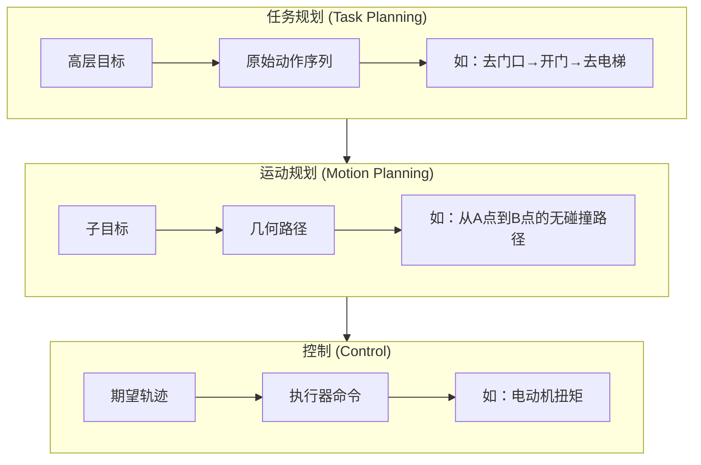
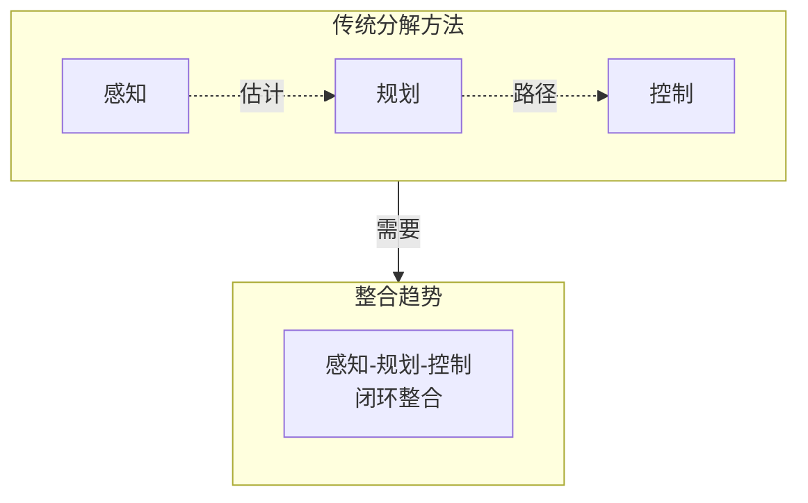

# 26.3 机器人学解决哪些问题

## 背景与动机

机器人需要在复杂、不确定、动态的环境中做出决策。理解问题的计算框架是设计算法的第一步。本节介绍如何将机器人问题形式化为：
- MDP（完全可观测）
- POMDP（部分可观测）
- 博弈（多智能体）

## 核心概念

### 问题层次结构

机器人决策通常需要三个层次：

### 形式化框架对比

| 框架 | 状态 | 观测 | 动作 | 奖励 | 适用场景 |
|------|------|------|------|------|----------|
| **MDP** | 完全可观测 | =状态 | 离散/连续 | 已知 | 已知环境、单独行动 |
| **POMDP** | 部分可观测 | 概率相关 | 离散/连续 | 已知 | 传感器噪声、状态不确定 |
| **博弈** | 多智能体 | 各智能体观测 | 各智能体动作 | 依赖其他智能体 | 人机/多机协调 |

### 机器人奖励函数的特点

与标准RL不同，机器人的奖励通常：
1. **来自人类用户**：机器人服务人类，奖励应反映人类满意度
2. **需要估计**：设计者只能提供代理奖励，真实奖励隐藏在用户偏好中
3. **多目标权衡**：效率vs安全、任务完成vs能量消耗

### 问题分解与整合

**分解的优势**：
- 降低问题复杂度
- 各层可独立优化
- 易于调试和验证

**分解的代价**：
- 放弃层间协同优化
- 感知不改善（不考虑信息价值）
- 运动决策忽略任务层约束

### 关键问题类型

| 问题类型 | 描述 | 方法 |
|----------|------|------|
| **偏好学习** | 从人类行为推断用户目标 | 逆强化学习 |
| **人类预测** | 预测环境中人类的动作 | 概率模型、博弈论 |
| **在线重规划** | 根据新信息调整计划 | MPC、实时搜索 |

## 与其他章节的联系

| 概念 | 来源章节 | 在机器人中的应用 |
|------|----------|------------------|
| MDP | 第17章 | 完全可观测机器人决策 |
| POMDP | 第17章 | 传感器噪声下的决策 |
| 博弈论 | 第18章 | 人机/多机协调 |
| 分层规划 | 第11章 | 任务-运动层次分解 |

## 常见陷阱

1. **过度简化假设**
   - ❌ 假设世界完全可观测
   - ✅ 实际中总有传感器噪声和遮挡

2. **忽视计算约束**
   - ❌ 使用复杂算法而不考虑实时性
   - ✅ 机器人需要在毫秒级响应

3. **代理奖励失配**
   - 设计者的代理奖励可能与用户真实偏好不一致
   - 需要偏好学习来校准

4. **层间不一致**
   - 任务规划假设的路径可能在运动层无法实现
   - 需要层间一致性检查

## 深入思考

**Q**: 为什么POMDP在机器人中难以直接应用？

**A**: 
1. **计算复杂度**：精确解在计算上不可行
2. **连续空间**：机器人状态和动作是连续的
3. **信念空间**：需要维护连续信念分布
4. **实时性**：需要在有限时间内决策

实际中常采用**近似方法**：
- 分离估计和控制（CE假设）
- 使用最可能状态
- 在线重规划（MPC）

**Q**: 人机协调中的博弈模型有什么特殊挑战？

**A**:
1. **不完全信息**：不知道人类的目标
2. **连续空间**：状态和动作是连续的
3. **人类次优性**：人类不是完全理性的博弈参与者
4. **实时计算**：博弈求解通常计算昂贵
