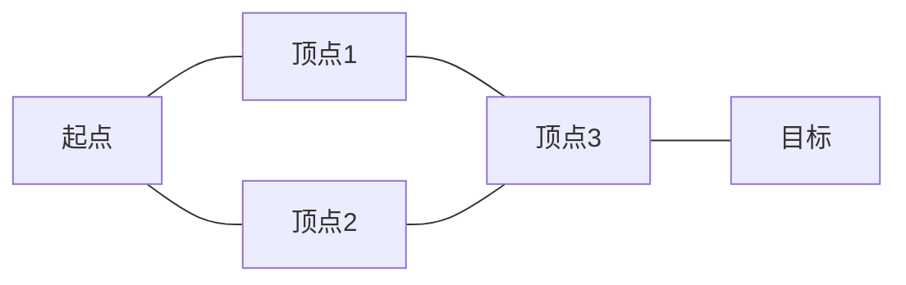

# 26.5 规划与控制

## 背景与动机

运动规划是从抽象任务到物理执行的桥梁。核心问题：**如何在复杂环境中找到从起点到目标的无碰撞路径，并精确跟踪该路径？**

## 核心概念

### 构形空间（Configuration Space）

#### 定义

- **工作空间（Workspace）W**：机器人运动的物理3D空间
- **构形空间（C-space）C**：描述机器人所有可能构形的抽象空间
- **构形q ∈ C**：唯一确定机器人上所有点位置的参数集合

#### C空间维度示例

| 机器人类型 | C空间表示 | 维度 |
|-----------|----------|------|
| 平移机器人（无旋转） | $(x, y)$ | 2 |
| 平面移动机器人 | $(x, y, \theta)$ | 3 |
| 可缩放机器人 | $(x, y, \theta, s)$ | 4 |
| 二连杆机械臂 | $(\theta_{shou}, \theta_{elb})$ | 2 |
| n关节机械臂 | $(\theta_1, ..., \theta_n)$ | n |

#### C空间障碍物

$$C_{obs} = \{q \in C : \mathcal{A}(q) \cap O \neq \emptyset\}$$

**自由空间**：$C_{free} = C - C_{obs}$

**关键洞见**：即使工作空间中的障碍物是简单多边形，C空间中的障碍物形状可能非常复杂（非线性、凹形）。

#### 正向与逆向运动学

**正向运动学**：$\phi_b: C \to W$，给定构形求某点位置
$$\mathcal{A}(q) = \bigcup_b \{\phi_b(q)\}$$

**逆向运动学**：$IK_b: W \to \{q \in C : \phi_b(q) = x\}$
- 输入：目标位置和朝向
- 输出：实现该目标的构形集合

### 运动规划算法

#### 1. 能见度图（Visibility Graph）

**原理**：连接所有C空间障碍物顶点和起点/目标点，边为无碰撞直线段

**性质**：
- **完备性**：能找到解则必找到
- **最优性**：路径最短
- **局限**：贴近障碍物，不安全



#### 2. 沃罗诺伊图（Voronoi Diagram）

**原理**：路径沿与多个障碍物等距的点集

**性质**：
- 最大化与障碍物的距离
- 更安全但路径可能更长
- 适用于室内走廊导航

#### 3. 单元分解（Cell Decomposition）

**网格分解**：
- 将C空间划分为均匀网格
- 每个单元标记为：自由、占用、混合
- 在自由单元上运行A*等搜索算法

**优点**：
- 易于实现
- 适用于低维空间

**局限**：
- 维度灾难
- 路径锯齿状（不光滑）
- 混合单元处理困难

**混合A\***：在连续状态上传播信息，确保轨迹满足运动学约束。

#### 4. 概率路线图（PRM）

**算法流程**：
1. 采样M个无碰撞里程碑
2. 连接每个里程碑到k个最近邻
3. 在图上搜索从起点到目标的路径

**性质**：
- **概率完备**：解存在则渐近找到
- 适合**多查询**规划
- 在高维空间表现好

```
┌─────────────┐    ┌─────────────┐    ┌─────────────┐
│ 起点/目标   │───→│ 采样里程碑  │───→│ 连接邻域点  │
└─────────────┘    └─────────────┘    └──────┬──────┘
                                              ↓
┌─────────────┐    ┌─────────────┐    ┌─────────────┐
│   输出路径   │←───│   图搜索    │←───│   构建图    │
└─────────────┘    └─────────────┘    └─────────────┘
```

#### 5. 快速探索随机树（RRT）

**算法流程**：
1. 初始化两棵树：$T_s$（起点）、$T_g$（目标）
2. 采样随机点$q_{rand}$
3. 扩展到树上最近点
4. 若新点连接两棵树，则找到解

**RRT***：通过重连和到达代价选择，渐近收敛到最优解。

**优点**：
- 单查询高效
- 快速探索空间
- 易于实现

**局限**：
- 解非最优
- 路径不光滑

#### 运动规划算法对比

| 算法 | 完备性 | 最优性 | 维度 | 查询类型 | 特点 |
|------|--------|--------|------|----------|------|
| 能见度图 | 完备 | 最优 | 2D | 单/多 | 最短路径，贴近障碍 |
| 沃罗诺伊图 | 完备 | 非最优 | 2D | 单/多 | 安全路径，可能绕远 |
| 单元分解 | 分辨率完备 | 分辨率最优 | 低 | 单/多 | 易实现，锯齿路径 |
| PRM | 概率完备 | 非最优 | 高 | 多 | 预处理，多查询高效 |
| RRT | 概率完备 | 非最优 | 高 | 单 | 快速，单查询 |
| RRT* | 概率完备 | 渐近最优 | 高 | 单 | 渐进最优 |

### 轨迹优化

#### 问题定义

最小化代价泛函：
$$J = J_{obs} + \lambda J_{eff}$$

其中：
- $J_{eff} = \int_0^1 \frac{1}{2}\|\dot{\tau}(s)\|^2 ds$：效率（路径长度/平滑性）
- $J_{obs}$：障碍物代价（有符号距离场）

#### 欧拉-拉格朗日方程

泛函 $J[\tau] = \int_0^1 F(s, \tau(s), \dot{\tau}(s))ds$ 的梯度：
$$\nabla_\tau J(s) = \frac{\partial F}{\partial \tau(s)} - \frac{d}{dt}\frac{\partial F}{\partial \dot{\tau}(s)}$$

对于$J_{eff}$：$F = \frac{1}{2}\|\dot{\tau}\|^2$
$$\nabla_\tau J_{eff}(s) = -\ddot{\tau}(s)$$

**解释**：无约束时最优路径是直线（加速度为0）。

### 轨迹跟踪控制

#### 控制问题

给定轨迹$\xi(t)$，计算执行器命令$u(t)$使机器人跟踪该轨迹。

#### 动力学模型

$$\ddot{q} = f(q, \dot{q}, u)$$

**逆动力学**：给定期望加速度，计算所需扭矩
$$u = f^{-1}(q, \dot{q}, \ddot{q})$$

#### 控制器类型

**1. P控制器（比例控制）**
$$u(t) = K_P(\xi(t) - q_t)$$

**问题**：可能导致震荡（欠阻尼系统）

**2. PD控制器（比例-微分）**
$$u(t) = K_P(\xi(t) - q_t) + K_D(\dot{\xi}(t) - \dot{q}_t)$$

**微分项作用**：抑制响应，减少震荡

**3. PID控制器（比例-积分-微分）**
$$u(t) = K_P e(t) + K_I \int_0^t e(s)ds + K_D \dot{e}(t)$$

**积分项作用**：消除稳态误差

**4. 计算扭矩控制**
$$u(t) = \underbrace{f^{-1}(\xi, \dot{\xi}, \ddot{\xi})}_{前馈} + \underbrace{m(\xi)(K_P e + K_D \dot{e})}_{反馈}$$

结合了模型预测和误差反馈。

#### PID调参指南

| 参数 | 作用 | 增大效果 | 副作用 |
|------|------|----------|--------|
| $K_P$ | 纠正当前误差 | 响应快 | 震荡 |
| $K_I$ | 纠正累积误差 | 消除偏差 | 超调、积分饱和 |
| $K_D$ | 预测未来误差 | 抑制震荡 | 噪声放大 |

## 关键公式汇总

| 公式 | 名称 | 应用 |
|------|------|------|
| $C_{obs} = \{q: \mathcal{A}(q) \cap O \neq \emptyset\}$ | C空间障碍物 | 碰撞检测 |
| $J = J_{obs} + \lambda J_{eff}$ | 轨迹优化代价 | 路径优化 |
| $\nabla_\tau J = -\ddot{\tau}$ | 效率梯度 | 轨迹优化 |
| $u = K_P e + K_I \int e + K_D \dot{e}$ | PID控制律 | 轨迹跟踪 |
| $u = f^{-1}(\xi, \dot{\xi}, \ddot{\xi}) + m(K_P e + K_D \dot{e})$ | 计算扭矩 | 精确控制 |

## 常见陷阱

1. **忽视C空间复杂性**
   - 工作空间中的简单障碍在C空间可能非常复杂
   - 需要高效的碰撞检测而非显式构建

2. **开环控制依赖**
   - 模型不精确导致误差累积
   - 必须使用反馈控制

3. **PID参数不当**
   - $K_P$过大→震荡
   - $K_D$过大→噪声敏感
   - $K_I$过大→积分饱和

4. **轨迹不连续**
   - 规划的路径可能不满足动力学约束
   - 需要平滑或重计时

## 可视化：规划-控制流程

```
任务目标
    ↓
┌─────────────┐
│  运动规划    │←── 构形空间
│ (PRM/RRT等)  │    搜索算法
└──────┬──────┘
       ↓ 几何路径
┌─────────────┐
│  轨迹生成    │←── 重计时：路径→轨迹
│  (重计时)    │    添加时间参数
└──────┬──────┘
       ↓ 参考轨迹
┌─────────────┐
│  轨迹优化    │←── 变分法/梯度下降
│             │    平滑路径
└──────┬──────┘
       ↓ 优化轨迹
┌─────────────┐
│  轨迹跟踪    │←── PID/计算扭矩
│   控制器     │    生成扭矩命令
└──────┬──────┘
       ↓ 扭矩
┌─────────────┐
│   执行器     │←── 电动机/液压
│             │    物理运动
└─────────────┘
```

## 与其他章节的联系

- **第3章**：搜索算法基础
- **第17章**：MDP和决策
- **第21章**：神经网络用于运动生成
- **第26.6节**：不确定运动规划
