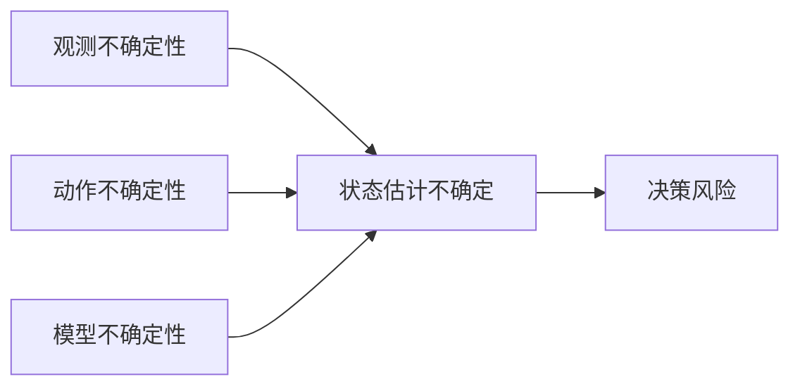

# 26.6 规划不确定的运动

## 背景与动机

真实机器人面临多种不确定性：
- **观测不确定性**：传感器噪声、遮挡
- **动作不确定性**：执行器误差、未建模动力学
- **估计不确定性**：近似算法引入的误差

## 核心概念

### 不确定性的来源



### 处理不确定性的方法

#### 1. 在线重规划（Online Replanning）

**模型预测控制（MPC）**：
```
1. 在当前状态进行短视规划
2. 执行规划的第一个动作
3. 获取新观测
4. 重新规划
```

**优点**：
- 实时响应新信息
- 不需要长期预测
- 天然形成闭环策略

**类比**：类似于实时搜索和博弈算法。

#### 2. 保护移动（Guarded Movement）

**定义**：包含运动指令和终止条件的动作

**示例**：插入钥匙
```
运动指令：向下移动
终止条件：接触到表面
```

**保护移动序列**：
1. **横向移动到孔的一侧**：确保知道在哪一侧
2. **沿表面滑入孔中**：利用几何约束
3. **沿孔下滑到底部**：到达目标

**关键性质**：即使存在控制不确定性，所有可能轨迹都终止于目标。

#### 3. 信息收集动作

**问题**：标准规划只考虑当前信念，不考虑未来信息

**解决方案**：
- **海岸导航**：启发式函数使机器人靠近已知地标
- **预期信息增益**：将信念熵减少纳入代价函数

**示例**：导航机器人主动接近地标以改善定位

### 不确定性锥

```
        预期方向 v
            ↑
           /|\
          / | \
         /  |  \  C_v：速度不确定性锥
        /   |   \
       ─────┼─────
        可能运动包络
```

**关键洞察**：通过设计运动指令使所有可能结果都收敛到目标。

## 关键公式

**信息价值**：
$$VPI(a) = E_{z|a}[V^*(b^{a,z})] - V^*(b)$$

在POMDP框架下，考虑动作的信息获取价值。

## 常见陷阱

1. **忽视信息价值**
   - 仅基于当前信念规划
   - 错过改进估计的机会

2. **过度保守**
   - 为保护而牺牲效率
   - 需要平衡安全与性能

3. **计算复杂度**
   - POMDP求解计算昂贵
   - 需要近似方法

## 深入思考

**Q**: 为什么MPC在实际机器人中如此流行？

**A**:
1. **简单性**：每次只规划短 horizon
2. **鲁棒性**：通过重规划处理不确定性
3. **实时性**：可在有限时间内完成
4. **模块化**：可与各种规划器结合

**Q**: 保护移动与闭环控制有何不同？

**A**:
- **闭环控制**：基于连续反馈调整
- **保护移动**：开环指令+离散终止条件
- 保护移动更简单，适合不确定性建模困难的情况
