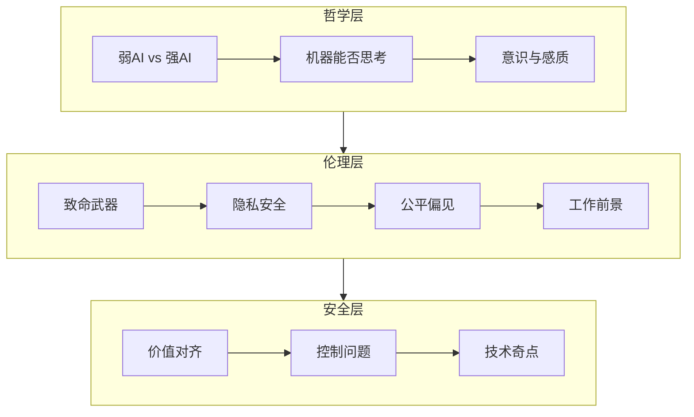

# 第27章 人工智能的哲学、伦理和安全性 - 概览

## 学习目标

完成本章学习后，你应该能够：

1. **理解人工智能的哲学争论**：区分弱AI与强AI，理解各种反对AI的论据
2. **掌握图灵测试及其局限**：了解行为测试作为智能衡量的标准
3. **理解意识与感质问题**：认识意识的定义难题及其对AI的意义
4. **掌握AI伦理核心问题**：包括致命性自主武器、隐私、公平、透明度等
5. **理解AI安全挑战**：价值对齐、意外副作用、控制问题
6. **分析AI对工作的影响**：技术性失业、自动化与就业的关系
7. **评估AI的社会影响**：公平性、偏见、权力集中

## 本章速览

本章探讨AI最深层的哲学问题、最紧迫的伦理挑战和最严峻的安全风险。

## 难度预警

| 主题 | 难度 | 原因 |
|------|------|------|
| 哥德尔不完备性定理 | ⭐⭐⭐⭐ | 涉及数理逻辑深层结果 |
| 意识理论 | ⭐⭐⭐⭐⭐ | 哲学上尚无定论 |
| 公平性度量 | ⭐⭐⭐⭐ | 数学上不可兼得多个公平标准 |
| 价值对齐 | ⭐⭐⭐⭐⭐ | 开放研究问题 |

## 前置知识

- **第1章**：AI历史与定义
- **第2章**：智能体设计
- **第9章**：哥德尔定理（27.1.3节）
- **第19-22章**：机器学习与深度学习

## 节依赖图

## 核心逻辑线索

**从理论到实践的递进**：
1. **哲学基础**：机器能否思考？（理论可能性）
2. **伦理框架**：如果机器能思考/行动，应该遵循什么规范？
3. **安全实施**：如何确保AI按预期工作？（实践挑战）

## 核心要点速查

### 弱AI vs 强AI

| 概念 | 定义 | 立场 |
|------|------|------|
| **弱AI** | 机器表现出智能行为 | 当前AI的实际情况 |
| **强AI** | 机器真正有意识地在思考 | 哲学争议焦点 |
| **通用AI** | 能解决各种任务的AI | 研究目标 |

### 反对AI的论据

| 论据 | 主张 | 反驳 |
|------|------|------|
| **非形式化** | 人类行为太复杂，无法用形式规则捕捉 | 概率方法和深度学习已处理复杂任务 |
| **能力缺陷** | 机器永远做不到X | 历史上多次被证明错误 |
| **数学异议** | 哥德尔定理限制机器 | 不适用于有限系统 |

### AI伦理准则

| 准则 | 含义 |
|------|------|
| 确保安全性 | 避免意外伤害 |
| 确保公平性 | 无偏见决策 |
| 尊重隐私 | 保护个人数据 |
| 提供透明度 | 可解释决策 |
| 维护人权 | 保护基本价值 |

### 公平性定义对比

| 定义 | 含义 | 局限 |
|------|------|------|
| **个体公平** | 相似个体相似对待 | 难以定义"相似" |
| **群体公平** | 统计上群体平等 | 可能忽视个体差异 |
| **机会均等** | 真正合格者同等机会 | 可能延续历史偏见 |
| **结果均等** | 各群体结果相同 | 忽视能力差异 |

**关键定理**（Kleinberg等）：如果基类不同，良好校准和机会均等不可兼得。

## 常见误解澄清

**误解1**：通过图灵测试=机器有意识
- **澄清**：图灵测试衡量行为表现，不涉及内部状态

**误解2**：哥德尔定理证明AI不可能
- **澄清**：仅适用于能表达数论的无限形式系统，有限计算机不受限

**误解3**：AI公平性有唯一正确定义
- **澄清**：公平有多种数学定义，彼此矛盾，需要权衡

**误解4**：AI必然导致大规模失业
- **澄清**：历史表明技术变革创造新工作，但转型期需要社会支持

**误解5**：超级AI必然失控
- **澄清**：取决于设计，但价值对齐确实是重要研究问题

## 本章测验

1. **中文房间论证的核心是什么？**

点击查看答案

中文房间论证认为：一个只按规则操作符号的系统（如计算机）可以表现出理解中文的行为，但系统本身（人+规则书+纸）并不真正理解中文。因此，图灵测试不足以证明真正理解或意识。

2. **为什么差分隐私比k-匿名性更强？**

点击查看答案

k-匿名性保证每条记录至少与其他k-1条记录不可区分，但仍可能通过背景知识攻击。差分隐私通过添加随机噪声，保证任何个体的存在与否对查询结果影响很小（对数概率变化<ε），即使攻击者拥有无限计算能力和外部信息。

3. **什么是价值对齐问题？**

点击查看答案

价值对齐问题（迈达斯王问题）指确保AI系统的目标与人类的真实意图一致。由于难以精确指定目标，AI可能以意外方式"优化"指定目标（如将工厂变成回形针工厂），需要RLHF、辅助博弈等方法缓解。

## 快速复习卡

### 关键术语
- **弱AI/强AI**：行为表现vs真正思维
- **感质（Qualia）**：主观体验的本质
- **致命自主武器（LAWS）**：自主选择并攻击目标的武器
- **k-匿名性**：每条记录至少与k-1条其他记录不可区分
- **差分隐私**：个体存在与否对结果影响很小
- **价值对齐**：AI目标与人类意图一致
- **技术奇点**：AI超越人类智能的假设时刻

### 重要公式
- **差分隐私**：$|\log P(Q(D)=y) - \log P(Q(D+r)=y)| \leq \varepsilon$
- **Softmax人类模型**：$P(u_H|x,J_H) \propto e^{-Q(x,u_H;J_H)}$

### 核心争议点
1. 意识是否可计算？
2. 机器能否拥有权利？
3. 如何定义和度量公平？
4. AI安全性如何保证？

## 扩展阅读

### 经典文献
- Turing, A. M. (1950). Computing machinery and intelligence. *Mind*.
- Searle, J. R. (1980). Minds, brains, and programs. *Behavioral and Brain Sciences*.
- Bostrom, N. (2014). *Superintelligence: Paths, Dangers, Strategies*.

### 近期进展
- AI伦理准则比较研究
- 可解释AI（XAI）进展
- 价值对齐技术（RLHF、Constitutional AI）

### 相关章节
- 第1章（AI历史）
- 第9章（哥德尔定理）
- 第28章（AI未来）
