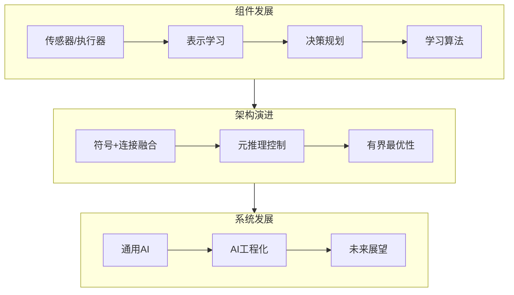
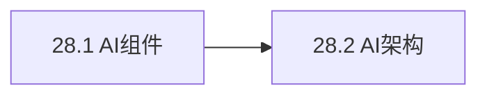

# 第28章 人工智能的未来 - 概览

## 学习目标

完成本章学习后，你应该能够：

1. **理解AI各组件的发展现状**：传感器、表示、决策、学习等
2. **掌握AI架构的演进方向**：符号与连接融合、元推理、实时AI
3. **理解通用AI的挑战**：组件整合、行为多样性
4. **评估AI工程化需求**：从研究到产业的转变
5. **认识AI的长期前景**：机遇与风险平衡

## 本章速览

本章展望AI的未来，从组件、架构到整体发展方向。

## 难度预警

| 主题 | 难度 | 原因 |
|------|------|------|
| 符号-连接融合 | ⭐⭐⭐⭐ | 深层技术挑战 |
| 元推理 | ⭐⭐⭐⭐ | 涉及自我参照 |
| 有界最优性 | ⭐⭐⭐⭐⭐ | 理论框架复杂 |
| 通用AI | ⭐⭐⭐⭐⭐ | 开放研究问题 |

## 前置知识

- **第2章**：智能体架构
- **第21章**：深度学习
- **第22章**：强化学习
- **第26章**：机器人学

## 节依赖图

## 核心逻辑线索

**从现状到未来的演进**：
1. **组件分析**：各组成部分的发展状况
2. **架构整合**：如何组合各组件
3. **系统愿景**：通用AI和AI工程化

## 核心要点速查

### AI组件发展

| 组件 | 现状 | 挑战 | 方向 |
|------|------|------|------|
| 传感器 | 成本下降、性能提升 | 高带宽处理 | 边缘传感器、MEMS |
| 表示 | 因子化表示成熟 | 结构化表示 | 对象-关系、抽象概念 |
| 决策 | 短程规划可行 | 长程分层规划 | 分层POMDP |
| 学习 | 大数据上表现好 | 小样本、迁移 | 可微编程、弱监督 |

### 架构趋势

| 趋势 | 描述 | 代表技术 |
|------|------|----------|
| 符号-连接融合 | 结合逻辑推理和神经网络 | 概率编程+深度学习 |
| 元推理 | 控制思考过程 | 任意时间算法、决策论元推理 |
| 实时AI | 有限时间内决策 | MCTS、近似算法 |
| 可微编程 | 端到端可学习系统 | Julia、Swift for TensorFlow |

### 关键技术

- **Dyna架构**：模型学习与规划结合
- **辅助博弈**：不确定人类偏好时的决策
- **域随机化**：模拟到真实迁移
- **联邦学习**：分布式隐私保护学习

### AI工程化

**现状**：AI产业尚未达到软件工程的成熟度

**差距**：
- 调试困难（黑盒模型）
- 复现困难（随机性、超参数敏感）
- 规模化困难（需要专家调参）

**未来方向**：
- 预训练模型共享
- 自动机器学习（AutoML）
- 可复现工作流程

## 常见误解澄清

**误解1**：深度学习将取代所有其他AI方法
- **澄清**：深度学习重要，但符号推理、概率推理仍不可或缺

**误解2**：通用AI即将实现
- **澄清**：组件研究重要，但整合仍是巨大挑战

**误解3**：AI将必然导致奇点
- **澄清**：技术进步呈S曲线，存在限制因素

**误解4**：AI工程化只是工程问题
- **澄清**：涉及根本性的表示和推理问题

## 本章测验

1. **为什么AI系统需要元推理能力？**

点击查看答案

因为AI系统永远不会有足够时间精确解决复杂问题。元推理允许智能体：
- 在需要决策前结束思考
- 分配计算资源到最重要的问题
- 在任意时刻提供合理决策
- 实现有界最优性而非不可达到的完美理性

2. **可微编程与传统深度学习有何不同？**

点击查看答案

传统深度学习只训练模型参数，其他部分手工编写。可微编程使整个系统（包括数据预处理、后处理、控制流）都可微，可以进行端到端优化，当环境变化时自动适应，无需人工重写代码。

3. **为什么说AI工程化与软件工程有本质区别？**

点击查看答案

AI系统涉及：
- 概率行为而非确定性
- 数据驱动而非规则驱动
- 黑盒模型难以解释和调试
- 对数据分布敏感，泛化需要验证
这些特点需要新的开发方法、调试工具和质量保证流程。

## 快速复习卡

### 关键术语
- **可微编程**：整个软件系统可端到端优化
- **元推理**：关于推理的推理，控制思考过程
- **有界最优性**：在计算约束下最优
- **通用AI (AGI)**：能解决多种任务的AI
- **思维主义**：过度强调纯智力的倾向
- **技术奇点**：AI超越人类智能的假设点

### 重要公式
- **LQR最优策略**：$u = -Kx$
- **有界最优性**：给定架构下的最优程序

### 未来方向
1. 传感器-执行器融合
2. 符号-连接融合
3. 弱监督学习
4. 可解释AI
5. AI工程化

## 扩展阅读

### 经典文献
- Russell & Norvig：持续更新版
- LeCun, Y. (2019). 深度学习反思
- Hinton, G. (2017). "推翻一切，重新来过"

### 近期进展
- 基础模型（Foundation Models）
- 大语言模型能力涌现
- 多模态学习
- 神经符号AI

### 相关章节
- 第2章（智能体架构）
- 第21章（深度学习）
- 第27章（伦理与安全）
