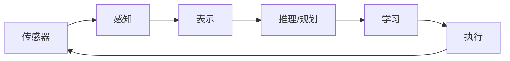

# 28.1 人工智能组件

## 背景与动机

AI系统由多个组件构成。理解各组件的现状和趋势，有助于把握AI的整体发展方向。

## 核心概念

### 1. 传感器与执行器

**发展趋势**：

| 指标 | 变化 | 影响 |
|------|------|------|
| 激光雷达成本 | $75,000 → $1,000 → $10 | 自动驾驶普及 |
| 雷达灵敏度 | 粗粒度 → 数纸张 | 精细感知 |
| MEMS技术 | 微处理器可植入昆虫 | 微型机器人 |
| 3D打印 | 原型快速迭代 | 加速研发 |

**现状评估**：
- 机器人发展≈1980年代个人计算机
- 工业应用领先，民用待普及

### 2. 世界状态的表示

**当前能力**：
- 对象识别（"那是猫"）
- 低阶谓词（"杯子在桌上"）

**挑战**：
- 高层次行为识别（"罗素博士和诺维格博士讨论计划"）
- 抽象概念（"有起必有落"）
- 对象-关系表示
- 时间抽象

**发展方向**：
- 概率+一阶逻辑（第15章）
- 结构化表示
- 可复用表示方案

### 3. 动作选择

**当前能力**：
- 短程规划（数十到数百步）

**挑战**：
- 长程规划（"4年内毕业"，数亿基元步骤）
- 部分可观测性（POMDP）
- 分层表示

**解决方案**：
- 分层强化学习
- 分层表示（第11.4节）
- 任务-运动规划整合

### 4. 决定想要什么

**核心问题**：效用/奖励函数设计

**挑战**：
- 复杂偏好建模（办公室助理场景）
- 个体差异
- 偏好不确定性
- 社会公平

**解决方向**：
- 逆强化学习（第22.6节）
- 线性时态逻辑（LTL）
- 更好的偏好表达语言
- 辅助博弈（第18章）

**当前问题**：
- 系统优化"用户关注度"而非"用户福祉"
- 需要私人智能体维护长期利益

### 5. 学习

**深度学习成功因素**：
1. 更多数据（互联网）
2. 专用硬件（GPU/TPU）
3. 算法改进（GAN、批归一化、ReLU、Dropout）

**当前局限**：
- 依赖大量标注数据
- 因子化表示为主
- 复杂表示学习困难

**未来方向**：

| 方向 | 描述 | 代表工作 |
|------|------|----------|
| **可微编程** | 整个系统端到端可学习 | LeCun提议 |
| **弱监督学习** | 减少标注依赖 | 自监督、半监督 |
| **迁移学习** | 跨任务知识复用 | 预训练模型 |
| **神经符号** | 结合神经网络和符号推理 | 概率编程+深度学习 |

**可微编程 vs 深度学习**：

| 特性 | 深度学习 | 可微编程 |
|------|----------|----------|
| 可微部分 | 模型参数 | 整个系统 |
| 手工代码 | 数据流、控制流 | 最小化 |
| 适应性 | 环境变化需重训练 | 自动适应 |
| 实现 | TensorFlow/PyTorch | Julia/Swift |

### 6. 资源

**计算资源增长**：
- CPU速度：10万倍（1970s-现在）
- ML专用硬件：额外1000倍
- ImageNet训练时间：1天（2014）→2分钟（2018）

**数据资源**：
- 每日新增数据：>10^18字节
- 预训练模型共享
- 云服务：AWS/阿里云/腾讯云等

**量子计算**：
- 理论上可加速线性代数
- 当前量子计算机：数十位
- ML需要：数百万位
- 实用化还需突破

## 组件整合视角

**关键挑战**：各组件之间的接口和整合

## 与其他章节的联系

- **第21章**：深度学习
- **第22章**：强化学习
- **第26章**：机器人学中的组件整合
