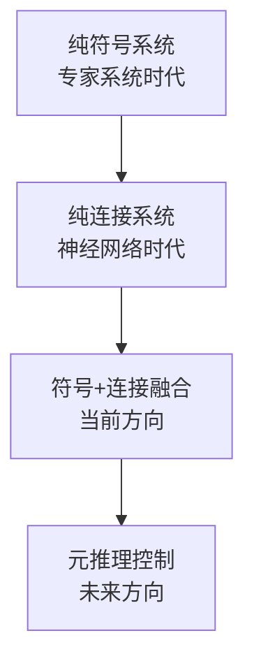

# 28.2 人工智能架构

## 背景与动机

如何将各种组件组合成完整的AI系统？架构选择影响系统的：
- 效率
- 鲁棒性
- 可扩展性
- 可解释性

## 核心概念

### 架构演进

### 符号与连接融合

**历史分裂**：
- **符号派**：逻辑推理、知识表示
- **连接派**：神经网络、模式识别

**各自优势**：

| 特性 | 符号系统 | 连接系统 |
|------|----------|----------|
| 推理链 | 长、可解释 | 短、端到端 |
| 表示 | 结构化 | 分布式 |
| 噪声处理 | 弱 | 强 |
| 学习 | 困难 | 强大 |

**融合方向**：
- 概率编程 + 深度学习
- 神经符号推理
- 可微分逻辑

### 实时AI与元推理

**核心问题**：AI系统永远不会有时间精确解决问题

**任意时间算法**（Anytime Algorithm）：
- 输出质量随时间提升
- 随时中断可获得合理结果
- 例子：迭代深化搜索、MCMC

**决策论元推理**：
- 计算的价值 = 决策质量提升 - 延迟成本
- 信息价值理论应用于计算选择
- 蒙特卡罗树搜索的选择策略

**元级强化学习**：
- 强化学习控制思考过程
- 奖励好的计算，惩罚无效计算
- 避免简单信息价值的短视

### 有界最优性（Bounded Optimality）

**问题**：完美理性不可达

**重新定义**：
$$\text{智能体} = \text{架构} + \text{程序}$$

**有界最优程序**：
- 给定架构下最优
- 优于该架构支持的其他程序
- 可能远离完美理性，但相对最优

**意义**：
- 将AI目标从"完美"转向"最优利用资源"
- 可指导架构设计
- 可组合不同有界最优组件

### 通用人工智能（AGI）

**图灵列表**：善良、机智、幽默、从经验学习、使用语言、从事新事物...

**海因莱因列表**：
> "换尿布、策划入侵、杀猪、驾船、设计建筑、写十四行诗、算账、砌墙、接骨、抚慰临终之人、接受命令、下达命令、合作、独行、解方程、分析新问题..."

**当前状态**：
- 无人能完成任一列表
- 特定任务竞赛驱动研究

**组件研究 vs 整体设计**：
- 组件研究：GAN、Transformer等突破
- 行为多样性：单一系统处理多任务
- 合理平衡：组件改进 + 整合尝试

**类比**：
> 1903年让莱特兄弟设计"通用飞行器"（垂直起降、超音速、登月）不可行
> 但云杉木双翼飞机竞赛促进进步

### AI工程化

**现状**：未达到软件工程成熟度

**挑战**：

| 问题 | 描述 | 表现 |
|------|------|------|
| **难以使用** | GAN、深度RL需大量调试 | 专家才能成功应用 |
| **难以复现** | 随机性、超参数敏感 | 论文结果难复现 |
| **难以扩展** | 每个项目从零开始 | 重复造轮子 |

**未来愿景**（Jeff Dean）：
- 数百万任务的ML处理
- 大型系统中提取任务相关部分
- 类似现代Web开发（使用各种库）

**发展方向**：
- 预训练模型（BERT、GPT系列）
- 大参数系统（680亿参数实验）
- AutoML
- 可复现工作流程

### 未来展望

**历史类比**：

| 技术 | 积极影响 | 负面效应 |
|------|----------|----------|
| 印刷术 | 知识传播 | 虚假信息 |
| 管道工程 | 卫生改善 | 环境污染 |
| 航空旅行 | 全球连接 | 空难、排放 |
| AI | 效率提升 | 失业、隐私、安全 |

**AI的不同**：
- 可能威胁人类的世界霸权（与其他技术不同）
- 需要主动管理风险

**图灵的结语**（1950）：
> "我们只能看到前方的一小段距离，但我们知道依然有很长一段路要走。"

## 关键对比

| 概念 | 传统AI | 未来方向 |
|------|--------|----------|
| 架构 | 分离符号/连接 | 融合统一 |
| 推理 | 固定预算 | 任意时间、元控制 |
| 目标 | 完美理性 | 有界最优 |
| 开发 | 手工设计 | 可微编程、AutoML |
| 任务 | 单一专用 | 通用多样 |

## 常见陷阱

1. **忽视整合难度**
   - 组件强大≠系统强大
   - 接口设计是关键

2. **过度承诺AGI时间表**
   - 技术预测常不准确
   - S曲线而非永远指数

3. **忽视工程化挑战**
   - 研究突破≠实用产品
   - 需要大量工程工作

4. **单纯悲观或乐观**
   - 既不忽视风险
   - 也不过度恐惧

## 深入思考

**Q**: 元推理的计算成本是否值得？

**A**:
- 元推理本身有开销
- 但可通过编译优化
- 在复杂决策中收益巨大
- 避免无效计算更有价值

**Q**: 可微编程是否会改变软件工程？

**A**:
- 可能根本性改变
- 从"编写程序"到"定义目标"
- 需要新的调试和验证方法
- 但手工设计不会完全消失

**Q**: 通用AI的实现路径？

**A**:
- 渐进积累：组件改进+整合
- 重大突破：尚不明确
- 目前平衡合理：继续组件研究+探索新方向
