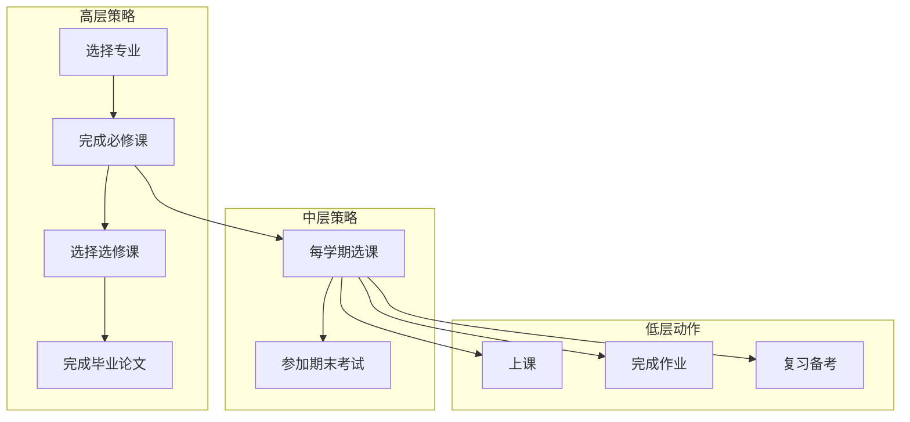
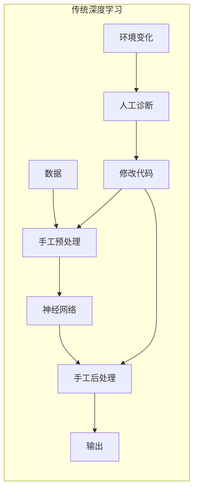
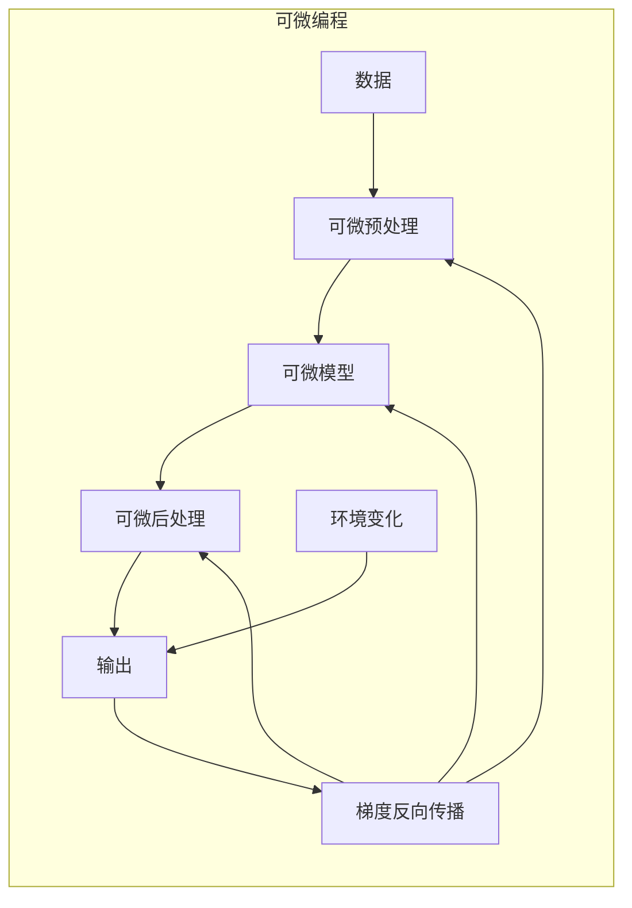
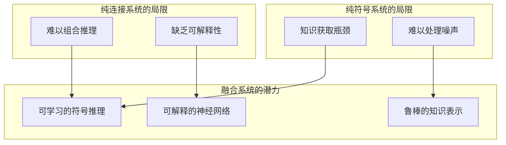
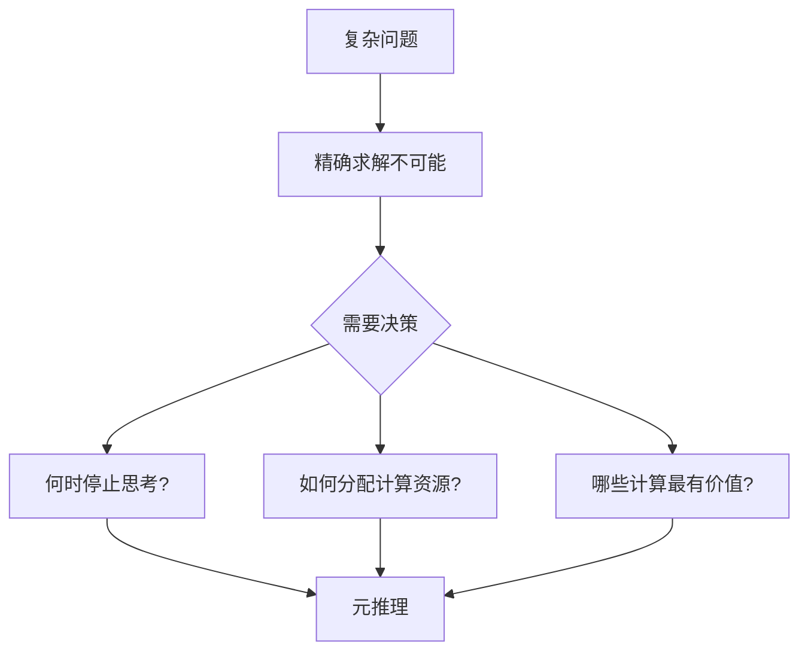
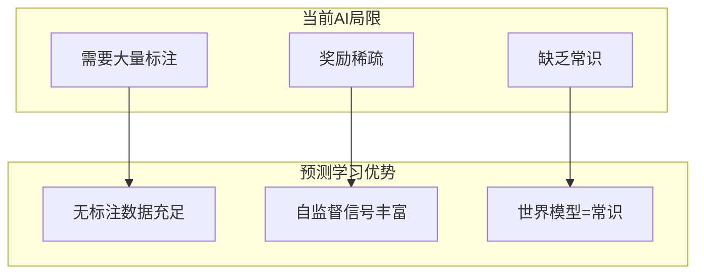
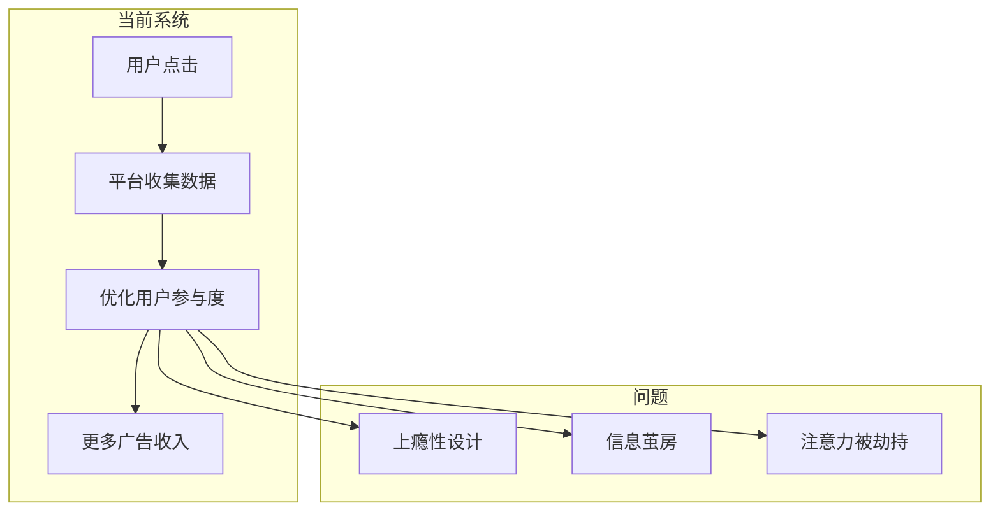

# 第28章 习题与解答

## 基础练习题

### 习题 28.1 传感器发展
**难度**: ⭐⭐

**题目**: 列举近年来传感器技术的三项关键进展，并说明每项进展对AI应用的影响。

**涉及知识点**: 28.1节 - 传感器与执行器

<details>
<summary>逐步提示</summary>

1. 思考成本降低的传感器类型
2. 考虑MEMS技术的应用
3. 考虑3D打印和生物打印

</details>

**详细解答**:

| 技术进展 | 具体描述 | 对AI应用的影响 |
|---------|---------|--------------|
| 激光雷达成本大幅下降 | 从$75,000降至$1,000，单芯片版本可降至$10 | 使自动驾驶汽车从实验走向量产成为可能 |
| MEMS技术发展 | 微型加速度计、陀螺仪，处理器可植入人工飞行昆虫 | 推动微型机器人、医疗植入设备等新应用 |
| 3D/生物打印成熟 | 原型快速迭代，定制化硬件制造 | 加速机器人研发周期，降低实验成本 |

**考点解析**: 本题考察对AI硬件基础设施发展趋势的理解。传感器是AI系统与外界交互的桥梁，其成本和性能直接影响AI应用的普及程度。

---

### 习题 28.2 表示学习挑战
**难度**: ⭐⭐⭐

**题目**: 解释为什么"杯子在桌子上"比"罗素博士和诺维格博士一起喝茶讨论计划"更容易被AI系统识别。

**涉及知识点**: 28.1节 - 世界状态的表示

<details>
<summary>逐步提示</summary>

1. 比较两个陈述的层次差异
2. 考虑当前AI系统的训练数据特点
3. 思考抽象概念表示的挑战

</details>

**详细解答**:

**层次差异分析**:

| 特征 | "杯子在桌子上" | "博士们喝茶讨论计划" |
|-----|---------------|-------------------|
| 表示层次 | 低阶谓词（空间关系） | 高层次行为（社会互动） |
| 需要的背景知识 | 空间物理 | 社会惯例、意图理解 |
| 训练数据可用性 | 大量图像-标签对 | 需要复杂场景标注 |
| 时间维度 | 静态快照 | 持续过程 |

**核心挑战**:
1. **组合性爆炸**：高层次行为由多个低阶事件组合而成
2. **常识推理**：需要理解"喝茶"和"讨论"可以同时进行
3. **意图推断**：需要理解行为的内在目的

**考点解析**: 本题考察对AI表示学习局限性的理解。当前系统擅长识别显式的、原子化的模式，但对隐含的、组合式的概念理解仍有限。

---

### 习题 28.3 分层规划
**难度**: ⭐⭐⭐

**题目**: 说明为什么"4年内从大学毕业"这样的长程规划对当前AI系统构成挑战。分层强化学习如何帮助解决这一问题？

**涉及知识点**: 28.1节 - 动作选择

<details>
<summary>逐步提示</summary>

1. 估算"毕业"包含多少基元步骤
2. 分析搜索算法的复杂度限制
3. 思考分层的优势

</details>

**详细解答**:

**挑战分析**:

```
长程规划复杂度 = 选择数^步骤数
毕业规划 ≈ 数以亿计的基元步骤
当前搜索能力 ≈ 数十到数百步
```

差距：$10^8$ 倍以上

**分层强化学习的解决方案**:



**分层优势**:
1. **时间抽象**：高层决策间隔更长
2. **空间抽象**：状态表示更紧凑
3. **可复用性**：子策略可迁移到类似任务

**考点解析**: 本题考察对分层强化学习必要性的理解。层次结构是人类处理复杂问题的关键能力，AI系统需要类似机制才能处理真实世界的长程规划问题。

---

### 习题 28.4 效用函数设计
**难度**: ⭐⭐⭐⭐

**题目**: 讨论为什么设计办公室助理AI的效用函数是困难的。列举至少三个具体挑战。

**涉及知识点**: 28.1节 - 决定想要什么

<details>
<summary>逐步提示</summary>

1. 思考办公室场景的复杂性
2. 考虑用户偏好的多样性
3. 考虑社会维度

</details>

**详细解答**:

**挑战1：复杂偏好网络**
```
用户偏好示例：
- 希望高效完成工作
- 不想被打扰（但有时需要提醒）
- 希望保持工作生活平衡
- 重视某些关系胜过其他
```

这些偏好相互关联且动态变化。

**挑战2：个体差异**
- 不同用户有不同工作风格
- 同一用户在不同情境下偏好不同
- 开箱即用的系统缺乏个性化经验

**挑战3：社会公平性**
- 个体最优 ≠ 社会最优
- 资源分配需要考虑公平性
- 可能需要在效率与公平间权衡

**解决方案方向**:
- 逆强化学习从专家行为学习偏好
- 辅助博弈处理偏好不确定性
- 线性时态逻辑表达时序约束

**考点解析**: 本题考察对AI价值对齐问题的理解。这是AI安全的核心问题之一——如何让AI系统理解并追求人类真正想要的，而非字面指令。

---

### 习题 28.5 可微编程
**难度**: ⭐⭐⭐

**题目**: 比较传统深度学习与可微编程的主要区别。可微编程如何解决环境变化时的适应问题？

**涉及知识点**: 28.1节 - 学习

<details>
<summary>逐步提示</summary>

1. 思考深度学习系统的组成部分
2. 考虑哪些部分是手工编写的
3. 思考端到端优化的含义

</details>

**详细解答**:

**对比分析**:

| 特性 | 传统深度学习 | 可微编程 |
|-----|------------|---------|
| 可微部分 | 模型参数 | 整个系统 |
| 数据预处理 | 手工编写 | 可学习 |
| 后处理逻辑 | 手工编写 | 可学习 |
| 控制流程 | 固定代码 | 可优化 |
| 环境适应 | 需要重训练+人工修改 | 自动优化 |

**适应机制**:





**考点解析**: 本题考察对AI系统架构演进趋势的理解。可微编程代表了从"编写程序"到"定义目标"的范式转变。

---

## 综合练习题

### 习题 28.6 符号-连接融合
**难度**: ⭐⭐⭐⭐

**题目**: 分析符号AI和连接AI（神经网络）各自的优势和局限。为什么两者的融合是重要的研究方向？举例说明融合的可能方式。

**涉及知识点**: 28.2节 - 人工智能架构

<details>
<summary>逐步提示</summary>

1. 回顾符号AI的特点（逻辑、知识表示）
2. 回顾连接AI的特点（学习、容错）
3. 思考互补性

</details>

**详细解答**:

**符号系统 vs 连接系统**:

| 维度 | 符号系统 | 连接系统 |
|-----|---------|---------|
| 推理 | 长链可解释 | 短链端到端 |
| 表示 | 显式结构化 | 隐式分布式 |
| 学习 | 困难（需人工编码） | 强大（从数据学习） |
| 噪声处理 | 脆弱（二值逻辑） | 鲁棒（连续激活） |
| 泛化 | 基于规则 | 基于相似性 |

**融合的重要性**:



**融合方式示例**:

1. **概率编程 + 深度学习**
   - 用神经网络逼近概率分布
   - 用概率模型提供结构先验

2. **神经符号推理**
   - 神经网络提取特征
   - 符号系统进行逻辑推理

3. **可微分逻辑**
   - 将逻辑规则编码为可微约束
   - 端到端训练同时满足逻辑约束

**考点解析**: 本题考察对AI架构演进趋势的理解。符号-连接融合是解决当前AI系统局限性的关键方向。

---

### 习题 28.7 元推理
**难度**: ⭐⭐⭐⭐⭐

**题目**: 解释元推理（metareasoning）的概念。为什么AI系统需要元推理能力？讨论任意时间算法和决策论元推理两种方法。

**涉及知识点**: 28.2节 - 人工智能架构

<details>
<summary>逐步提示</summary>

1. 思考"思考思考"的含义
2. 考虑实时决策的约束
3. 比较两种方法的特点

</details>

**详细解答**:

**元推理概念**:

元推理是关于推理的推理——AI系统对自己的计算过程进行监控和控制。

$$\text{元级} : \text{对象级} = \text{控制者} : \text{被控制者}$$

**必要性分析**:



**两种方法对比**:

| 特性 | 任意时间算法 | 决策论元推理 |
|-----|------------|------------|
| 核心思想 | 输出质量随时间提升 | 计算的价值取决于成本-效益 |
| 中断特性 | 随时可获得合理结果 | 在价值最大时停止 |
| 代表算法 | 迭代深化、MCMC | MCTS、信息价值计算 |
| 适用场景 | 时间不确定 | 决策质量可量化 |

**决策论元推理公式**:

$$\text{计算价值} = \text{决策质量提升} - \text{延迟成本}$$

**实例**：蒙特卡罗树搜索
- 叶节点选择：基于UCB公式的元级决策
- 模拟次数：根据时间约束动态调整

**考点解析**: 本题考察对AI系统自反能力的理解。元推理是实现有界最优性的关键技术。

---

### 习题 28.8 有界最优性
**难度**: ⭐⭐⭐⭐⭐

**题目**: 什么是有界最优性（bounded optimality）？为什么它比完美理性更适合作为AI的目标？

**涉及知识点**: 28.2节 - 人工智能架构

<details>
<summary>逐步提示</summary>

1. 思考完美理性的计算复杂度
2. 考虑物理限制
3. 分析相对最优vs绝对最优

</details>

**详细解答**:

**定义**:

$$\text{智能体} = \text{架构} + \text{程序}$$

给定固定架构 $\mathcal{A}$，有界最优程序 $p^*$ 满足：

$$p^* = \arg\max_{p \in \mathcal{P}(\mathcal{A})} \text{Performance}(p, \mathcal{E})$$

其中 $\mathcal{P}(\mathcal{A})$ 是架构支持的所有程序，$\mathcal{E}$ 是任务环境。

**完美理性的不可能性**:

```
物理极限计算速度: 10^51 操作/秒 (1kg设备)
2020年超级计算机: 10^18 操作/秒
差距: 10^33 倍

但：
- 11个单词的枚举需要运行一年
- 人生规划涉及 20万亿次肌肉驱动
```

即使比人脑强10^33倍的计算机，面对真实世界问题仍可能像"追赶曲速飞船的鼻涕虫"。

**有界最优性的优势**:

| 对比维度 | 完美理性 | 有界最优性 |
|---------|---------|----------|
| 可实现性 | 理论上不可达 | 可实现 |
| 指导意义 | 无法指导设计 | 可指导架构选择 |
| 比较基准 | 绝对标准 | 相对同架构程序 |
| 组合性 | 无法组合 | 可组合有界最优组件 |

**实际意义**:
- 将AI目标从"做得完美"转向"充分利用资源"
- 允许在计算资源约束下进行合理权衡
- 为AI系统评估提供实用标准

**考点解析**: 本题考察对AI理论基础的理解。有界最优性是一个深刻的理论洞察，承认物理限制的同时追求相对最优。

---

### 习题 28.9 通用AI路径
**难度**: ⭐⭐⭐⭐

**题目**: 讨论通用人工智能（AGI）的两种实现路径：（1）组件研究路线；（2）整体设计路线。分析各自的优缺点，并说明为什么作者认为当前平衡是合理的。

**涉及知识点**: 28.2节 - 人工智能架构

<details>
<summary>逐步提示</summary>

1. 回顾AI历史上的两种思路
2. 思考莱特兄弟类比的含义
3. 考虑技术发展的实际模式

</details>

**详细解答**:

**两种路径对比**:

| 维度 | 组件研究路线 | 整体设计路线 |
|-----|------------|------------|
| 方法论 | 分解问题，逐个突破 | 从一开始就设计完整系统 |
| 近期成果 | 可衡量进展 | 难以短期见效 |
| 风险 | 可能无法整合 | 可能方向错误 |
| 历史类比 | 云杉木双翼飞机竞赛 | 莱特兄弟直接设计登月飞船 |

**莱特兄弟类比分析**:

> 1903年让莱特兄弟停止研究双翼飞机，去设计"通用飞行器"（垂直起降、超音速、登月）是不可行的。

**实际进展模式**:


**成功案例**:
- GAN → 生成模型新纪元
- Transformer → NLP范式转变
- 单系统多语言翻译（取代每语言对单独系统）

**作者观点**:
当前AI领域在组件研究和整体设计间取得了合理平衡：
1. 组件改进带来可衡量进展
2. 整合尝试验证组件兼容性
3. 同时探索长远可能性

**考点解析**: 本题考察对AI发展策略的理解。技术演进往往是渐进式突破而非革命式跳跃。

---

### 习题 28.10 AI工程化
**难度**: ⭐⭐⭐

**题目**: AI产业与软件工程产业相比，在成熟度上存在哪些差距？列举三个主要挑战并说明解决方向。

**涉及知识点**: 28.2节 - 人工智能架构

<details>
<summary>逐步提示</summary>

1. 回顾软件工程的特点
2. 对比AI开发的现状
3. 思考工业化的要求

</details>

**详细解答**:

**成熟度差距**:

| 维度 | 软件工程 | AI工程 |
|-----|---------|-------|
| 工具生态 | 成熟（IDE、版本控制、CI/CD） | 发展中 |
| 人才培养 | 系统化教育体系 | 供不应求 |
| 质量保证 | 标准流程 | 缺乏统一标准 |
| 复用程度 | 高度模块化 | 常从零开始 |

**三大挑战**:

**挑战1：难以使用**
- 表现：GAN、深度RL需大量调试才能在新领域工作
- 原因：超参数敏感、训练不稳定
- 方向：AutoML、神经架构搜索

**挑战2：难以复现**
- 表现：论文结果难以复现
- 原因：随机性、隐藏实现细节、超参数影响
- 方向：标准化实验平台、代码开源

**挑战3：难以扩展**
- 表现：每个项目从零开始，重复造轮子
- 原因：缺乏标准化接口和预训练模型
- 方向：模型动物园、迁移学习标准

**Jeff Dean的愿景**:
```
当前：每个任务从零训练
未来：大型系统中提取任务相关部分
类比：现代Web开发使用各种库，而非从HTTP协议开始
```

**考点解析**: 本题考察对AI产业化挑战的理解。技术进步不仅需要算法突破，还需要工程化和生态建设。

---

## 挑战练习题

### 习题 28.11 预测学习的本质
**难度**: ⭐⭐⭐⭐⭐

**题目**: 杨立昆提出的"预测学习"（predictive learning）与监督学习和强化学习有何本质区别？为什么说它代表了AI的未来方向？

**涉及知识点**: 28.1节 - 学习

**详细解答**:

**三种学习范式对比**:

| 特性 | 监督学习 | 强化学习 | 预测学习（无监督） |
|-----|---------|---------|------------------|
| 学习信号 | 人工标注标签 | 稀疏奖励 | 预测误差 |
| 数据需求 | 大量标注数据 | 大量试错 | 原始感官数据 |
| 学习目标 | 映射输入到标签 | 最大化累积奖励 | 建模世界并预测未来 |
| 分布假设 | 独立同分布 | 序列决策 | 动态系统 |

**预测学习的核心思想**:

$$\mathcal{L} = \mathbb{E}[\| \text{预测}(s_{t+1:t+k}) - \text{实际}(s_{t+1:t+k}) \|^2]$$

不仅仅是预测标签，而是预测世界未来状态的各个方面。

**为什么是未来方向**:



**实现方式**：
- 使用GAN最小化预测误差
- 构建世界模型进行规划
- 类似婴儿通过观察学习物理规律

---

### 习题 28.12 AI的长期影响
**难度**: ⭐⭐⭐⭐

**题目**: 作者认为AI与其他革命性技术（如印刷术、航空旅行）有何本质不同？这种差异对AI治理有何启示？

**涉及知识点**: 28.2节 - 未来展望

**详细解答**:

**AI与其他技术的比较**:

| 技术 | 积极影响 | 负面效应 | 极限影响 |
|-----|---------|---------|---------|
| 印刷术 | 知识民主化 | 虚假信息 | 不影响人类霸权 |
| 管道工程 | 卫生改善 | 环境污染 | 不影响人类霸权 |
| 航空旅行 | 全球连接 | 空难、排放 | 不影响人类霸权 |
| 电话通信 | 即时通讯 | 隐私问题 | 不影响人类霸权 |
| **AI** | 效率提升 | 失业、隐私 | **可能挑战人类霸权** |

**本质区别**:

其他技术无论怎样改进其逻辑极限，都不会威胁人类的世界主导地位，但AI会。

**治理启示**:

1. **主动性**：不能等到问题出现再应对
2. **预见性**：需要技术预见和情景规划
3. **包容性**：考虑不同群体的利益
4. **适应性**：监管框架需随技术演进

**关键问题**:
- 如何确保AI目标与人类价值观对齐
- 如何分配AI带来的收益
- 如何防范恶意使用

---

### 习题 28.13 私人智能体的设计
**难度**: ⭐⭐⭐⭐⭐

**题目**: 设计一个"私人智能体"的架构，使其能够维护用户的长期利益而非应用公司的短期利益。需要考虑哪些关键组件和机制？

**涉及知识点**: 28.1节 - 决定想要什么

**详细解答**:

**当前问题诊断**:



**私人智能体设计**:

**核心原则**：用户利益代理人，而非平台利益执行者

**关键组件**:

| 组件 | 功能 | 实现挑战 |
|-----|-----|---------|
| 长期目标建模 | 理解用户真正想要的 | 偏好推断、目标层次 |
| 跨平台协调 | 整合不同来源信息 | 数据格式、隐私保护 |
| 注意力管理 | 防止上瘾、促进健康习惯 | 与平台算法对抗 |
| 价值对齐 | 确保行为符合用户价值观 | 价值观提取、冲突解决 |

**机制设计**:

1. **用户控制**：用户可随时查看、修改智能体的目标设置
2. **透明度**：解释每个建议的原因
3. **退出权**：可轻易退出任何服务
4. **隐私保护**：本地处理优先，联邦学习补充

**与现有系统的区别**:

| 维度 | 平台智能体 | 私人智能体 |
|-----|----------|----------|
| 优化目标 | 平台收益 | 用户福祉 |
| 时间范围 | 短期参与 | 长期利益 |
| 信息使用 | 向平台透明 | 向用户透明 |
| 可控性 | 有限 | 完全 |

---

## 自测模拟卷

### 选择题（每题5分，共25分）

**1. 激光雷达成本从$75,000降至$10的过程说明了什么？**

A. AI算法效率提升  
B. 硬件成本指数下降推动AI应用普及  
C. 政府补贴政策效果  
D. 激光雷达技术过时  

**答案**: B

---

**2. 分层强化学习解决的核心问题是？**

A. 训练数据不足  
B. 长程规划的复杂度爆炸  
C. 模型可解释性差  
D. 计算资源限制  

**答案**: B

---

**3. 可微编程相比传统深度学习的最大优势是？**

A. 模型容量更大  
B. 整个系统可端到端优化  
C. 推理速度更快  
D. 更容易调试  

**答案**: B

---

**4. 有界最优性的核心思想是？**

A. 在无限计算资源下追求最优  
B. 在给定架构约束下追求相对最优  
C. 追求人类水平的性能  
D. 最小化计算成本  

**答案**: B

---

**5. 元推理在AI系统中的作用是？**

A. 提高模型参数量  
B. 控制和优化思考过程  
C. 加速硬件计算  
D. 减少训练数据需求  

**答案**: B

---

### 简答题（每题15分，共45分）

**6. 简述符号AI与连接AI各自的优势，并说明为什么融合两者是重要的研究方向。**

**参考答案要点**:
- 符号AI优势：长链推理、可解释、结构化表示
- 连接AI优势：从数据学习、噪声鲁棒、端到端
- 融合必要性：互补各自局限
- 融合方式：概率编程+深度学习、神经符号推理

---

**7. 解释为什么AI产业尚未达到软件工程的成熟度，列举三个主要差距。**

**参考答案要点**:
- 难以使用：需要专家调试超参数
- 难以复现：随机性和隐藏实现细节
- 难以扩展：缺乏标准化和模块化
- 对比软件工程成熟的工具链、教育体系和最佳实践

---

**8. 为什么说AI与其他革命性技术有本质不同？这对AI治理有何启示？**

**参考答案要点**:
- 不同：AI可能挑战人类的世界霸权
- 启示：需要主动、预见性、包容性的治理
- 关键问题：价值对齐、收益分配、恶意使用防范

---

### 论述题（30分）

**9. 结合第28章内容，论述你对AI未来发展的看法。需要考虑：技术发展方向、工程化需求、社会影响三个维度。**

**评分标准**:

| 维度 | 分值 | 要点 |
|-----|-----|-----|
| 技术发展方向 | 10分 | 组件进步、架构融合、通用AI |
| 工程化需求 | 10分 | 工具、标准、人才培养 |
| 社会影响 | 10分 | 机遇、风险、治理 |

**参考答案框架**:

**技术维度**:
- 组件：传感器成本下降、表示学习进步、弱监督学习
- 架构：符号-连接融合、元推理、可微编程
- 目标：从专用AI向通用AI渐进发展

**工程化维度**:
- 需要达到软件工程成熟度
- 预训练模型共享、AutoML
- 建立标准化流程和质量保证体系

**社会维度**:
- 积极：效率提升、解决复杂问题
- 风险：就业、隐私、安全、失控
- 治理：价值对齐、公平分配、国际协调

**结论**：平衡乐观与谨慎，继续组件研究同时关注整合挑战，主动管理风险。

---

## 附录：概念速查表

| 概念 | 定义 | 章节 |
|-----|-----|-----|
| 可微编程 | 整个软件系统端到端可优化 | 28.1 |
| 元推理 | 关于推理的推理，控制思考过程 | 28.2 |
| 有界最优性 | 给定架构约束下的最优程序 | 28.2 |
| 任意时间算法 | 随时中断可提供合理结果的算法 | 28.2 |
| 通用AI (AGI) | 能解决多种任务的AI系统 | 28.2 |
| 预测学习 | 通过预测未来状态进行无监督学习 | 28.1 |
| 神经符号AI | 神经网络与符号推理的融合 | 28.2 |
| 迁移学习 | 跨任务知识复用 | 28.1 |
| 逆强化学习 | 从专家行为推断奖励函数 | 28.1 |
| 分层强化学习 | 使用层次结构处理长程规划 | 28.1 |
