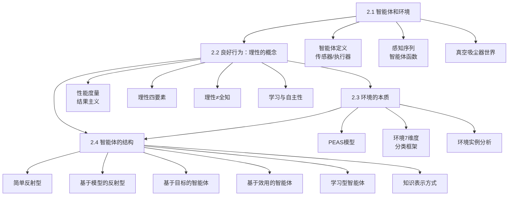

# 第2章 智能体 - 概览

## 🎯 学习目标

完成本章学习后，你应该能够：

1. **理解智能体的核心概念**：能够定义什么是智能体，解释传感器、执行器、感知序列等基本概念，区分智能体函数与智能体程序
2. **掌握理性智能体的定义**：能够说明理性决策的四个要素，区分理性与全知，理解信息收集和学习在理性行为中的作用
3. **熟练运用PEAS模型**：能够使用性能度量(Performance)、环境(Environment)、执行器(Actuator)、传感器(Sensor)框架描述任务环境
4. **分析环境特性**：能够根据7个维度（可观测性、智能体数量、确定性、回合/序贯、静态/动态、离散/连续、已知/未知）对环境进行分类
5. **比较智能体类型**：能够区分简单反射型、基于模型的反射型、基于目标的、基于效用的和学习型智能体，理解它们的适用场景

---

## 📚 本章速览

本章是人工智能的入门章节，建立了**智能体(Agent)**这一核心概念框架。智能体是在环境中感知并行动的实体，通过传感器获取信息，通过执行器作用于环境。本章首先定义了**理性智能体**——即在给定感知序列和先验知识下，能够最大化期望性能度量的智能体。然后引入了**PEAS模型**，作为描述任务环境的系统方法。接着详细分析了环境的7个重要维度，这些维度直接决定了智能体的设计策略。最后介绍了4种基本智能体结构：简单反射型、基于模型的反射型、基于目标的、基于效用的智能体，以及学习型智能体的通用架构。这些概念贯穿全书，是理解后续章节的基础。

---

## ⚠️ 难度预警

| 难点概念 | 难度等级 | 说明 |
|---------|---------|------|
| **PEAS模型的完整应用** | ⭐⭐⭐ | 初学者容易遗漏某些维度，特别是性能度量的准确定义和传感器的完整列表 |
| **理性与全知的区别** | ⭐⭐⭐ | 容易混淆"期望性能最大化"与"实际性能最大化"，需理解香榭丽舍大街的例子 |
| **环境特性分类** | ⭐⭐⭐⭐ | 7个维度的组合分析较为复杂，尤其是部分可观测性与非确定性的关系 |
| **回合式 vs 序贯** | ⭐⭐⭐ | 判断标准是"当前决策是否影响未来"，而非简单的时间顺序 |
| **已知 vs 完全可观测** | ⭐⭐⭐⭐ | 这是两个独立维度：已知关乎"规则是否了解"，可观测关乎"状态能否看到" |
| **基于效用 vs 基于目标** | ⭐⭐⭐ | 理解何时需要效用函数（冲突目标、不确定性）而非简单目标 |
| **三种知识表示** | ⭐⭐⭐ | 原子、因子化、结构化表示的区分和适用场景 |

---

## 🔧 前置知识

### 必备基础
- **基本逻辑概念**：条件语句、概率基础
- **计算机科学基础**：算法、状态、函数的基本概念
- **数学基础**：期望值的基本理解（附录A有详细说明）

### 相关章节
- **第1章**：了解AI的历史背景和理性概念的起源
- **第16-18章**：决策理论基础（学完本章后可深入）
- **第19-22章**：机器学习方法（与学习元素相关）

---

## 🗺️ 节依赖图



---

## 📋 核心概念清单

| 概念 | 定义 | 章节 | 重要性 |
|-----|------|------|-------|
| **智能体(Agent)** | 通过传感器感知环境并通过执行器作用于环境的实体 | 2.1 | ⭐⭐⭐⭐⭐ |
| **感知(Percept)** | 智能体传感器正在感知的内容 | 2.1 | ⭐⭐⭐⭐⭐ |
| **感知序列(Percept Sequence)** | 智能体所感知的一切的完整历史 | 2.1 | ⭐⭐⭐⭐⭐ |
| **智能体函数(Agent Function)** | 将任意给定感知序列映射到动作的数学描述 | 2.1 | ⭐⭐⭐⭐ |
| **智能体程序(Agent Program)** | 智能体函数的具体实现，运行在物理架构上 | 2.1 | ⭐⭐⭐⭐⭐ |
| **理性智能体(Rational Agent)** | 对每个可能的感知序列，选择能最大化期望性能度量的动作 | 2.2 | ⭐⭐⭐⭐⭐ |
| **性能度量(Performance Measure)** | 评估环境状态序列可取性的标准 | 2.2.1 | ⭐⭐⭐⭐⭐ |
| **全知(Omniscience)** | 能预知行动实际结果的能力（现实中不可能） | 2.2.3 | ⭐⭐⭐⭐ |
| **自主性(Autonomy)** | 依赖自身感知和学习而非仅靠设计者的先验知识 | 2.2.3 | ⭐⭐⭐⭐ |
| **PEAS** | Performance, Environment, Actuator, Sensor的描述框架 | 2.3.1 | ⭐⭐⭐⭐⭐ |
| **完全可观测(Fully Observable)** | 传感器能访问环境完整状态 | 2.3.2 | ⭐⭐⭐⭐⭐ |
| **确定性(Deterministic)** | 下一状态完全由当前状态和动作决定 | 2.3.2 | ⭐⭐⭐⭐⭐ |
| **回合式(Episodic)** | 经验被划分为原子式回合，回合间无依赖 | 2.3.2 | ⭐⭐⭐⭐⭐ |
| **静态(Static)** | 环境在智能体思考时不发生变化 | 2.3.2 | ⭐⭐⭐⭐ |
| **离散(Discrete)** | 状态、时间、感知和动作都是离散的 | 2.3.2 | ⭐⭐⭐⭐ |
| **简单反射型智能体** | 基于当前感知选择动作，使用条件-动作规则 | 2.4.2 | ⭐⭐⭐⭐ |
| **基于模型的反射型智能体** | 维护内部状态，使用转移模型和传感器模型 | 2.4.3 | ⭐⭐⭐⭐⭐ |
| **基于目标的智能体** | 结合世界模型和目标信息选择动作 | 2.4.4 | ⭐⭐⭐⭐⭐ |
| **基于效用的智能体** | 选择最大化期望效用的动作 | 2.4.5 | ⭐⭐⭐⭐⭐ |
| **学习型智能体** | 包含学习元素，能从经验中改进性能 | 2.4.6 | ⭐⭐⭐⭐ |

---

## 📝 核心要点速查表

### 理性决策的四个要素
```
1. 定义成功标准的性能度量
2. 智能体对环境的先验知识
3. 智能体可以执行的动作
4. 智能体到目前为止的感知序列
```

### PEAS 描述框架
```
P - Performance (性能度量): 评估成功的标准
E - Environment (环境): 智能体运行的外部世界
A - Actuator (执行器): 智能体用于行动的工具
S - Sensor (传感器): 智能体用于感知的工具
```

### 环境分类七维度

| 维度 | 选项A | 选项B | 关键判别问题 |
|-----|-------|-------|-------------|
| 可观测性 | 完全可观测 | 部分可观测 | 传感器能否获取完整状态？|
| 智能体数 | 单智能体 | 多智能体 | 其他实体是否有目标？|
| 确定性 | 确定性 | 非确定性/随机 | 状态转移是否唯一确定？|
| 时间结构 | 回合式 | 序贯 | 当前决策是否影响未来？|
| 动态性 | 静态 | 动态/半动态 | 思考时环境是否变化？|
| 连续性 | 离散 | 连续 | 状态/动作是否连续？|
| 知识 | 已知 | 未知 | 是否了解环境物理规律？|

### 四种智能体类型对比

| 类型 | 内部状态 | 使用模型 | 需要目标 | 需要效用 | 适用场景 |
|-----|---------|---------|---------|---------|---------|
| 简单反射型 | 无 | 否 | 否 | 否 | 完全可观测环境 |
| 基于模型的反射型 | 有 | 是 | 否 | 否 | 部分可观测环境 |
| 基于目标的 | 有 | 是 | 是 | 否 | 需要目标导向行为 |
| 基于效用的 | 有 | 是 | 可选 | 是 | 多目标权衡、不确定性 |

---

## 🔍 概念对比表

### 理性 vs 全知

| 特性 | 理性(Rational) | 全知(Omniscient) |
|-----|---------------|-----------------|
| **定义** | 最大化期望性能 | 最大化实际性能 |
| **预知能力** | 无 | 能预知行动的实际结果 |
| **可实现性** | 可以实现 | 现实中不可能 |
| **决策依据** | 迄今为止的感知序列 | 未来的实际结果 |
| **例子** | 过马路时观察路况 | 知道10km高空会有货舱门掉落 |

### 回合式 vs 序贯环境

| 特性 | 回合式(Episodic) | 序贯(Sequential) |
|-----|-----------------|-----------------|
| **决策依赖** | 仅当前感知 | 当前决策影响未来 |
| **经验结构** | 原子式回合 | 动作序列 |
| **规划需求** | 无需前瞻 | 需要长期规划 |
| **典型例子** | 零件缺陷检测 | 国际象棋、驾驶 |
| **智能体复杂度** | 相对简单 | 更为复杂 |

### 已知 vs 完全可观测

| 维度 | 完全可观测 | 部分可观测 | 不可观测 |
|-----|-----------|-----------|---------|
| **定义** | 传感器能获取完整状态 | 部分状态无法直接感知 | 无任何传感器 |
| **已知环境** | 纸牌游戏(知道规则但看不到牌) | - | - |
| **未知环境** | 新游戏(能看到全部但不懂规则) | 自动驾驶(看不到其他司机想法) | 随机行动 |

### 三种知识表示对比

| 表示方式 | 结构 | 表达能力 | 典型应用 | 例子 |
|---------|------|---------|---------|------|
| **原子表示** | 状态是黑盒，无内部结构 | 最低 | 搜索、博弈、HMM | 城市名作为状态 |
| **因子化表示** | 状态=属性值向量 | 中等 | 约束满足、贝叶斯网络 | GPS坐标、油量等 |
| **结构化表示** | 状态包含对象及关系 | 最高 | 一阶逻辑、NLP | "奶牛挡住卡车" |

---

## ❓ 常见误解澄清

### 误解1：理性就是永不犯错
**澄清**：理性≠完美。理性是最大化期望性能，而非实际性能。香榭丽舍大街的例子说明：过马路时被高空坠物砸中，并非不理性，而是不可预见的坏运气。

### 误解2：全知比理性更好
**澄清**：全知在现实中不可能实现。如果我们要求智能体事后看来总是做出最优选择，就等于要求它拥有预知能力或时间机器。

### 误解3：回合式=一次决策
**澄清**：回合式环境允许智能体进行多轮感知-动作，但关键特征是**当前决策不影响未来回合**。例如，检测流水线上的缺陷零件：每个零件是独立的回合。

### 误解4：已知环境=完全可观测
**澄清**：这是两个独立维度。纸牌游戏是**已知但部分可观测**（知道规则但看不到未翻开的牌）；新电子游戏可能是**未知但完全可观测**（能看到整个屏幕但不知道按钮作用）。

### 误解5：基于目标的智能体不需要模型
**澄清**：基于目标的智能体仍然需要世界模型来预测"如果我这样做会发生什么"，否则无法规划如何到达目标。

### 误解6：随机行为总是不理性
**澄清**：在某些多智能体竞争环境中，随机行为是理性的，因为它避免了可预测性带来的陷阱。在单智能体环境中，随机化有时是跳出无限循环的实用技巧。

### 误解7：性能度量越详细越好
**澄清**：过度详细的性能度量可能导致意外行为（如吸尘器反复倾倒灰尘再清理）。应根据"真正想要实现的目标"而非"认为智能体应该如何表现"来设计性能度量。

---

## 🧪 本章测验

### 题目1
**一个智能体的理性程度取决于什么？**

A. 它的实际表现有多好  
B. 它的设计复杂度  
C. 它的期望性能最大化程度  
D. 它是否拥有完美的传感器  

<details>
<summary>答案</summary>
<b>C</b>。理性智能体被定义为最大化期望性能，而非实际性能。理性≠完美（全知）。
</details>

### 题目2
**以下哪项不是PEAS描述的一部分？**

A. 性能度量  
B. 环境  
C. 学习算法  
D. 传感器  

<details>
<summary>答案</summary>
<b>C</b>。PEAS = Performance（性能度量）、Environment（环境）、Actuator（执行器）、Sensor（传感器）。学习算法是智能体内部实现，不属于任务环境描述。
</details>

### 题目3
**国际象棋（带时钟）属于哪种环境？**

A. 完全可观测、静态、离散  
B. 完全可观测、半动态、离散  
C. 部分可观测、动态、连续  
D. 完全可观测、动态、离散  

<details>
<summary>答案</summary>
<b>B</b>。国际象棋：完全可观测（看到所有棋子）、半动态（环境本身不变但时钟在走）、离散（有限状态和动作）。
</details>

### 题目4
**简单反射型智能体无法处理什么情况？**

A. 完全可观测环境  
B. 部分可观测环境  
C. 确定性环境  
D. 静态环境  

<details>
<summary>答案</summary>
<b>B</b>。简单反射型智能体仅根据当前感知做决策，在部分可观测环境中可能因信息不足而陷入无限循环或做出错误决策。
</details>

### 题目5
**基于效用的智能体与基于目标的智能体的主要区别是？**

A. 基于效用的智能体不使用世界模型  
B. 基于效用的智能体可以在目标冲突或不确定时做出理性决策  
C. 基于效用的智能体不能学习  
D. 基于效用的智能体不需要传感器  

<details>
<summary>答案</summary>
<b>B</b>。基于效用的智能体使用效用函数来权衡冲突目标或不确定结果，而基于目标的智能体只能做二元判断（目标达到/未达到）。
</details>

---

## 🎴 快速复习卡

### 卡1：智能体基本定义
```
┌─────────────────────────────────────────┐
│  智能体 = 架构 + 程序                    │
│                                         │
│  感知 → [智能体程序] → 动作            │
│    ↑                    ↓              │
│  传感器 ← 环境 ← 执行器                │
└─────────────────────────────────────────┘
```

### 卡2：理性决策公式
```
理性动作 = argmax(期望性能度量)
          
依赖：1)性能度量  2)先验知识  
      3)可选动作  4)感知序列
```

### 卡3：PEAS快速记忆
```
P - 做得有多好？（性能度量）
E - 在哪里做？（环境）
A - 用什么做？（执行器）
S - 怎么知道？（传感器）
```

### 卡4：环境分类口诀
```
观测完全还是部分？  （可观测性）
独自工作还是合作？  （智能体数）
结果确定还是随机？  （确定性）
每步独立还是关联？  （回合/序贯）
思考时会变吗？      （动态性）
状态连续还是离散？  （连续性）
知道规则吗？        （已知/未知）
```

### 卡5：智能体演进路径
```
简单反射型 → 基于模型的反射型
     ↓              ↓
基于目标的 ← 基于效用的 ← 学习型
```

---

## 📖 扩展阅读建议

### 基础阅读
- **教材第1章**：了解理性概念的历史和哲学根源
- **教材第16-17章**：决策理论基础，深入理解效用最大化
- **教材第19-22章**：机器学习方法，深入了解学习元素

### 经典论文
- **Turing (1950)**: "Computing Machinery and Intelligence" - 学习机器的开创性讨论
- **McCarthy (1958)**: "Programs with Common Sense" - 早期关于智能体的逻辑方法
- **Newell & Simon (1972)**: "Human Problem Solving" - 基于目标的问题求解心理学基础

### 进阶教材
- **《人工智能：一种现代方法》**第3版第1-2章：英文原版对应章节
- **Shoham & Leyton-Brown (2009)**: "Multiagent Systems" - 多智能体系统深入
- **Sutton & Barto (2018)**: "Reinforcement Learning" - 第2版，学习型智能体的标准参考

### 实践资源
- **AIMA代码库**：包含本章所述各类智能体的实现
- **OpenAI Gym**：提供各种环境来测试不同类型智能体
- **NetLogo**：多智能体建模的可视化工具

---

## 🔗 与其他章节的联系

| 本章概念 | 后续章节 | 联系说明 |
|---------|---------|---------|
| 简单反射型智能体 | 第7章（逻辑智能体）、第21章（神经网络） | 实现条件-动作规则的不同方法 |
| 基于模型的反射型 | 第4章（搜索）、第14章（HMM） | 状态跟踪和预测模型 |
| 基于目标的智能体 | 第3-5章（搜索与博弈）、第11章（规划） | 寻找动作序列的算法 |
| 基于效用的智能体 | 第16-18章（决策） | 不确定性和多智能体决策 |
| 学习型智能体 | 第19-22章（学习） | 各种学习算法的详细讨论 |
| 知识表示 | 第7-10章（逻辑）、第12-15章（概率） | 不同表示形式的深入 |
| 环境特性 | 贯穿全书 | 每种算法都有适用的环境假设 |
