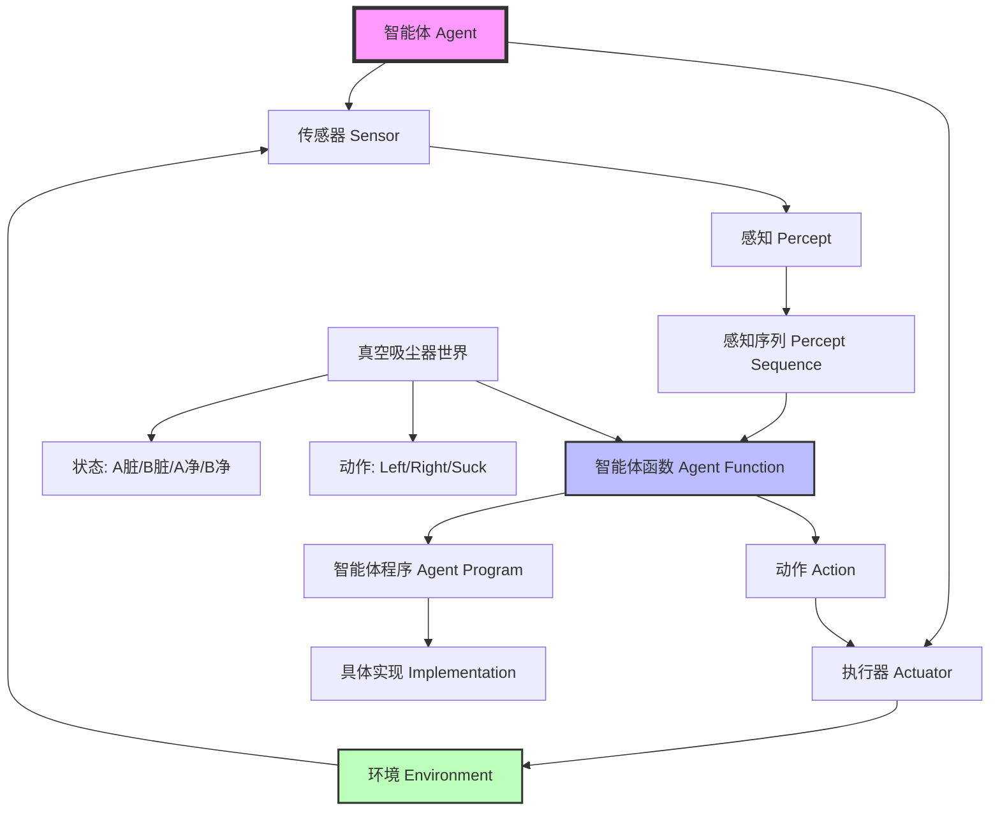

# 2.1 智能体和环境 - Deep Dive 分析

## 1. 背景与动机

### 历史背景

智能体（Agent）概念的形成可以追溯到20世纪中叶控制论和人工智能的萌芽时期。1948年，诺伯特·维纳（Norbert Wiener）在其开创性著作《控制论：或关于在动物和机器中控制和通信的科学》中，首次系统性地探讨了机器与环境之间的交互反馈机制。维纳提出的"控制论"框架为后来智能体理论的发展奠定了理论基础。

1950年，阿兰·图灵（Alan Turing）在其著名论文《计算机器与智能》中提出了"模仿游戏"（即图灵测试），这实际上定义了智能体的行为标准：一个能够通过文本交互让人类无法区分其是否为机器的系统。图灵的贡献在于将智能从神秘的哲学概念转化为可操作的、基于行为的标准。

1958年，约翰·麦卡锡（John McCarthy）发表了极具影响力的论文《具有常识的程序》（Programs with Common Sense），首次提出了智能体应具备的理性行为特征。麦卡锡的观点强调了智能体不仅需要对当前感知做出反应，还需要具备推理能力和常识知识。

20世纪80年代，随着分布式人工智能研究的兴起，智能体概念逐渐从抽象的理论框架演变为实用的系统设计范式。1987年，吉内塞雷斯（Genesereth）和尼尔森（Nilsson）的教科书对智能体进行了系统的逻辑分析，标志着智能体理论在人工智能领域的正式确立。

### 研究动机

智能体概念的提出源于人工智能研究范式的根本性转变。早期的人工智能研究主要集中在孤立的组件上，如定理证明器、视觉系统、自然语言处理模块等。然而，研究者逐渐认识到，真正的智能不能脱离与环境的持续交互。智能体概念的引入为人工智能提供了一个统一的框架：

1. **统一性框架**：智能体概念为各种人工智能系统提供了一个共同的描述语言，无论是物理机器人、软件程序还是人类本身，都可以用统一的智能体框架来分析。

2. **行为导向**：传统的符号主义AI关注内部知识表示，而智能体框架强调外部可观察的行为，这使得智能的定义更加客观和可验证。

3. **环境耦合**：智能体理论强调智能体与环境的紧密耦合，智能不仅存在于智能体内部，而是涌现于智能体-环境系统的动态交互中。

4. **工程实用性**：智能体框架为设计复杂系统提供了模块化思路，将系统分解为感知、决策、执行等组件，便于分阶段开发和测试。

### 应用场景

智能体概念的应用场景极其广泛：

- **物理机器人**：从工业机器人到服务机器人，从自动驾驶汽车到无人机，所有物理智能体都遵循感知-决策-执行的循环。
- **软件智能体**：搜索引擎、推荐系统、交易算法、个人助理（如Siri、Alexa）都是软件智能体的实例。
- **虚拟角色**：电子游戏中的NPC（非玩家角色）、虚拟现实中的化身、模拟仿真中的自主实体。
- **人类行为分析**：经济学中的理性经济人、心理学中的认知模型、社会科学中的行为主体。

### 先决条件

理解本节内容需要以下基础知识：
- 基本的集合论和函数概念
- 对计算机程序输入/输出机制的理解
- 对传感器和执行器的基本认识
- 简单的状态机概念

---

## 2. 知识逻辑图谱

### Mermaid 概念关系图



### 知识发展依赖链

```
控制论反馈循环 (1948, 维纳)
    ↓
图灵测试与行为智能 (1950, 图灵)
    ↓
常识推理程序 (1958, 麦卡锡)
    ↓
智能体的逻辑分析 (1987, Genesereth & Nilsson)
    ↓
现代智能体理论框架
    ↓
[本节内容] 智能体与环境的数学定义
    ↓
理性智能体设计 (2.2节)
    ↓
任务环境分类 (2.3节)
    ↓
智能体程序结构 (2.4节)
```

---

## 3. 核心概念与数学分析

### 术语定义（中英文）

| 中文术语 | 英文术语 | 定义 |
|---------|---------|------|
| 智能体 | Agent | 任何通过传感器感知环境并通过执行器作用于该环境的实体 |
| 环境 | Environment | 智能体所处的外部世界，智能体通过感知了解它，通过动作改变它 |
| 传感器 | Sensor | 智能体用于感知环境的装置或机制 |
| 执行器 | Actuator | 智能体用于对环境施加影响的装置或机制 |
| 感知 | Percept | 智能体在某一时刻通过传感器获得的信息 |
| 感知序列 | Percept Sequence | 智能体从开始运行到当前时刻所接收的所有感知的完整历史 |
| 智能体函数 | Agent Function | 从感知序列到动作的数学映射函数 |
| 智能体程序 | Agent Program | 智能体函数在具体计算架构上的实现 |

### 符号参考表

| 符号 | 含义 | 类型 |
|-----|------|------|
| $\mathcal{P}$ | 可能的感知集合 | 集合 |
| $\mathcal{A}$ | 可能的动作集合 | 集合 |
| $P^*$ | 所有有限感知序列的集合 | 序列集合 |
| $f: P^* \rightarrow \mathcal{A}$ | 智能体函数 | 函数 |
| $[p_1, p_2, ..., p_t]$ | 长度为t的感知序列 | 序列 |
| $T$ | 智能体的生存期（总感知数） | 正整数 |

### 关键公式与解释

#### 公式1：智能体函数的数学定义

$$f: \mathcal{P}^* \rightarrow \mathcal{A}$$

**解释**：智能体函数 $f$ 将任意感知序列映射到一个动作。这是一个从感知历史到动作的完整规范。

**几何意义**：可以将智能体函数想象为一个超维查找表，表的每一行对应一个可能的感知序列，每一列对应智能体应该采取的动作。

**领域背景**：这个概念源于数学中的函数定义，但在AI中具有特殊意义——它代表了智能体的"外部行为特征"，即无论内部如何实现，只要输入输出关系符合这个函数，就是同一个智能体。

#### 公式2：感知序列集合的基数

$$|\text{感知序列集合}| = \sum_{t=1}^{T} |\mathcal{P}|^t$$

**解释**：如果感知集合 $\mathcal{P}$ 有 $n$ 个元素，智能体生存期为 $T$ 个时间步，则可能的感知序列总数为几何级数之和。

**计算示例**：假设真空吸尘器世界中有4种可能感知（[A,Dirty], [A,Clean], [B,Dirty], [B,Clean]），智能体运行10个时间步：

$$\sum_{t=1}^{10} 4^t = 4 + 16 + 64 + 256 + 1024 + 4096 + 16384 + 65536 + 262144 + 1048576 = 1,398,100$$

**几何意义**：这表示智能体函数表的行数，每增加一个时间步，表的规模呈指数增长。

#### 公式3：智能体函数的表大小（最坏情况）

$$\text{表大小} = |\mathcal{A}|^{\sum_{t=1}^{T} |\mathcal{P}|^t}$$

**解释**：如果要显式存储智能体函数作为查找表，需要为每个感知序列指定一个动作，因此表的大小是动作数的"感知序列数次方"。

**领域背景**：这正是基于表格的方法（如Q-learning的原始形式）面临"维度灾难"的数学根源。

---

## 4. 具体示例

### 示例1：真空吸尘器世界的智能体函数

**问题设定**：
- 环境：两个方格 A 和 B
- 每个方格可以是 Clean（干净）或 Dirty（脏）
- 智能体位置：A 或 B
- 感知：[位置, 状态]，如 [A, Dirty]

**智能体函数表（部分）**：

| 感知序列 | 动作 |
|---------|------|
| [A, Dirty] | Suck |
| [A, Clean] | Right |
| [B, Dirty] | Suck |
| [B, Clean] | Left |
| [A, Dirty], [A, Clean] | Right |
| [A, Clean], [B, Dirty] | Suck |
| [A, Clean], [B, Clean] | Left |
| ... | ... |

**分析**：
- 这是一个简单反射型智能体，仅依赖当前感知
- 如果当前方格脏，就吸尘；否则移动到另一个方格

### 示例2：人类智能体 vs 机器人智能体 vs 软件智能体

**人类智能体**：
- 传感器：眼睛（视觉）、耳朵（听觉）、皮肤（触觉）、鼻子（嗅觉）、舌头（味觉）
- 执行器：手（抓握）、腿（移动）、声道（语言）、面部表情
- 感知示例：[看到红灯, 听到喇叭声, 感到震动]
- 动作示例：踩刹车、转动方向盘

**机器人智能体（自动驾驶汽车）**：
- 传感器：摄像头（图像）、激光雷达（距离）、GPS（位置）、速度计
- 执行器：方向盘（转向）、油门（加速）、刹车（减速）、转向灯
- 感知示例：[前方车辆距离: 10m, 当前速度: 60km/h, 车道线位置]
- 动作示例：减速 5m/s²，向左转 5°

**软件智能体（垃圾邮件过滤器）**：
- 传感器：邮件内容读取、发件人信息、邮件头分析
- 执行器：标记邮件、移动到文件夹、删除、通知用户
- 感知示例：[包含"免费"关键词, 发件人不在通讯录, 包含可疑链接]
- 动作示例：移动到"垃圾邮件"文件夹

### 示例3：智能体函数 vs 智能体程序

**智能体函数（抽象数学描述）**：
```
f([p1, p2, ..., pt]) = {
    if pt contains "危险" then "躲避"
    else if pt contains "食物" then "获取"
    else "探索"
}
```

**智能体程序（具体实现）**：
```python
class Agent:
    def __init__(self):
        self.percept_history = []
    
    def agent_function(self, current_percept):
        self.percept_history.append(current_percept)
        
        if "危险" in current_percept:
            return "躲避"
        elif "食物" in current_percept:
            return "获取"
        else:
            return "探索"
    
    def run(self, sensor_input):
        action = self.agent_function(sensor_input)
        self.execute(action)
        return action
```

**关键区别**：
- 智能体函数是数学抽象，不关心实现细节
- 智能体程序是具体代码，需要考虑数据结构、算法效率、硬件限制

---

## 5. 一句话本质

**智能体是通过传感器感知环境并通过执行器作用于环境的任何实体，其本质是一个将感知历史映射到动作的函数。**

---

## 6. 总结与反思

### 关键要点

1. **智能体的普适定义**：智能体概念足够抽象，可以涵盖人类、动物、机器人、软件程序等各种实体，为人工智能提供了统一的分析框架。

2. **感知与动作的闭环**：智能体与环境的交互形成一个闭环系统：感知 → 决策 → 动作 → 环境变化 → 新的感知。这个循环是智能行为的物质基础。

3. **智能体函数 vs 智能体程序**：这是理论与实践的分界线。智能体函数是理想化的数学描述，而智能体程序必须面对计算资源限制、时间约束、实现复杂性等现实问题。

4. **维度灾难**：显式存储智能体函数需要指数级的存储空间，这是人工智能面临的核心挑战之一，也是推动更紧凑、更智能的智能体程序设计的动力。

### 常见误解对照表

| 误解 | 正确理解 |
|-----|---------|
| 智能体必须是物理机器人 | 智能体可以是纯软件，如搜索引擎、推荐系统 |
| 智能体必须具有复杂的内部状态 | 简单反射型智能体仅依赖当前感知，没有内部状态 |
| 智能体函数和智能体程序是同一回事 | 智能体函数是数学抽象，智能体程序是具体实现 |
| 所有智能体都必须是"智能"的 | 智能体是分析工具，手持计算器也可被视为智能体（尽管没什么启发性） |
| 智能体必须学习 | 智能体可以是硬编码的，学习是可选的增强功能 |

### 反思问题

1. **哲学问题**：如果两个智能体具有完全相同的智能体函数，但内部实现完全不同（一个是神经网络，一个是符号系统），它们是"同一个"智能体吗？

2. **工程问题**：在实际系统中，如何平衡智能体函数的完备性与智能体程序的可实现性？当感知空间巨大时，有哪些近似策略？

3. **边界问题**：智能体与环境的边界在哪里？对于软件智能体，其环境是否包括计算机硬件？对于人类，皮肤是边界还是传感器的一部分？

4. **伦理问题**：当我们将人类建模为智能体时，性能度量应该是什么？谁有权定义这个度量？

### 公式速查表

| 公式 | 含义 |
|-----|------|
| $f: \mathcal{P}^* \rightarrow \mathcal{A}$ | 智能体函数定义 |
| $\sum_{t=1}^{T} |\mathcal{P}|^t$ | 感知序列总数 |
| 智能体 = 架构 + 程序 | 智能体的实现结构 |

---

**延伸阅读**：本章后续内容将探讨什么样的智能体函数是"理性"的（2.2节），环境有哪些类型（2.3节），以及如何用程序实现智能体函数（2.4节）。
