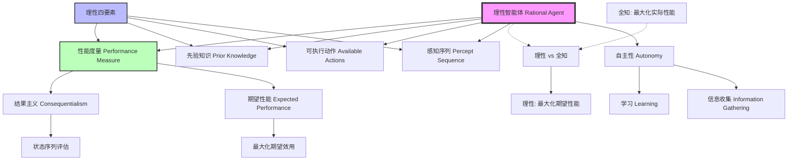

# 2.2 良好行为：理性的概念 - Deep Dive 分析

## 1. 背景与动机

### 历史背景

理性（Rationality）概念在人工智能中的发展深深植根于哲学、经济学和决策理论的悠久传统。

**哲学根源**：理性概念可以追溯到古希腊哲学。亚里士多德在《尼各马可伦理学》中提出了"实践智慧"（Phronesis）的概念，强调理性行为是根据正确理由采取正确行动的能力。这一思想直接影响了后来AI中理性智能体的定义。17世纪哲学家斯宾诺莎和莱布尼茨探讨了理性与情感的关系，为理解智能体决策中的多重目标冲突奠定了基础。

**经济学传统**：20世纪上半叶，冯·诺依曼（von Neumann）和摩根斯坦（Morgenstern）在1944年发表的《博弈论与经济行为》中建立了期望效用理论，为理性决策提供了严格的数学框架。他们证明了，在一定的公理假设下，理性决策者应该最大化期望效用。这一理论后来成为经济学和AI中理性智能体的基石。

**决策理论发展**：20世纪50-60年代，萨维奇（Savage）和拉姆齐（Ramsey）等人发展了主观期望效用理论，将概率和效用结合起来处理不确定性下的决策。这些工作为AI中处理不确定环境的理性智能体设计提供了理论基础。

**AI领域的接受**：直到20世纪80年代中期，理性概念才在AI领域引起广泛关注。乔恩·多伊尔（Jon Doyle）在1983年的论文中预测，理性智能体的设计将成为AI的核心任务。1988年，霍维茨（Horvitz）等人的工作推动了期望效用最大化作为决策最一般框架的接受。朱迪亚·珀尔（Judea Pearl）1988年的教科书《智能系统中的概率推理》对概率和效用理论的介绍，极大地促进了基于效用的智能体设计范式的普及。

### 研究动机

理性概念的引入解决了AI研究中的几个核心问题：

1. **行为评估标准**：在没有普遍接受的"智能"定义的情况下，理性提供了一个客观的行为评估标准——一个智能体是否在给定信息下做出了最优选择。

2. **设计目标明确化**：理性概念为智能体设计提供了明确的目标函数。设计者不再需要猜测"智能应该是什么样的"，而是可以专注于构建在给定性能度量下表现最优的系统。

3. **处理不确定性**：现实世界充满不确定性，理性框架（特别是期望效用最大化）提供了在这种不确定性下做出最优决策的系统方法。

4. **学习与适应**：理性概念不仅适用于静态设计，还可以指导学习型智能体的开发——智能体应该学习如何更好地最大化其性能度量。

5. **伦理安全**：维纳的警告（"确保施加给机器的目的是我们真正想要的目的"）凸显了正确定义性能度量的重要性。理性框架迫使设计者明确思考智能体的目标，从而避免"迈达斯国王问题"（得到所要求的，而非真正想要的）。

### 应用场景

理性智能体概念的应用场景：

- **自动驾驶**：在复杂交通环境中，理性智能体需要权衡安全性、效率、舒适性和合法性等多个目标。
- **医疗诊断**：理性诊断系统需要在测试成本、诊断准确性、治疗风险之间做出最优权衡。
- **金融交易**：理性交易算法在不确定性下最大化期望收益（或效用）。
- **游戏AI**：理性游戏智能体选择能够最大化获胜概率的动作。
- **资源分配**：在有限资源约束下，理性智能体优化资源分配以最大化整体效用。

### 先决条件

- 概率论基础（期望、条件概率）
- 效用理论基本概念
- 对优化问题的基本理解
- 2.1节智能体与环境的基础知识

---

## 2. 知识逻辑图谱

### Mermaid 概念关系图



### 知识发展依赖链

```
亚里士多德实践智慧 (公元前4世纪)
    ↓
功利主义哲学 (边沁、密尔, 18-19世纪)
    ↓
博弈论与期望效用 (von Neumann & Morgenstern, 1944)
    ↓
主观期望效用理论 (Savage, 1954)
    ↓
AI中的理性概念 (Doyle, 1983; Horvitz et al., 1988)
    ↓
[本节内容] 理性智能体的四要素定义
    ↓
期望效用最大化智能体 (2.4.5节)
    ↓
不确定性下的决策 (第16章)
```

---

## 3. 核心概念与数学分析

### 术语定义（中英文）

| 中文术语 | 英文术语 | 定义 |
|---------|---------|------|
| 理性智能体 | Rational Agent | 在给定感知序列和先验知识下，选择能够最大化期望性能度量的动作的智能体 |
| 性能度量 | Performance Measure | 评估环境状态序列可取性的标准，定义了什么是"成功" |
| 结果主义 | Consequentialism | 通过行为结果来评估智能体的伦理学观点 |
| 期望性能 | Expected Performance | 智能体动作可能导致的各种结果状态的性能度量的概率加权平均 |
| 全知 | Omniscience | 能够预知行动实际结果的能力（理性不要求全知） |
| 信息收集 | Information Gathering | 采取行动以改变未来感知的行为，是理性的重要组成部分 |
| 自主性 | Autonomy | 智能体依赖自身感知和学习而非仅依赖设计者先验知识的能力 |
| 学习 | Learning | 智能体根据经验修改和增强其先验知识的能力 |

### 符号参考表

| 符号 | 含义 | 类型 |
|-----|------|------|
| $\mathbb{E}[U]$ | 期望效用 | 实数 |
| $P(s'|a)$ | 执行动作$a$后到达状态$s'$的概率 | 概率分布 |
| $U(s)$ | 状态$s$的效用 | 实数 |
| $\mathcal{M}$ | 性能度量 | 函数 |
| $[s_0, s_1, ..., s_T]$ | 状态序列 | 序列 |

### 关键公式与解释

#### 公式1：理性智能体的形式化定义

对于每个可能的感知序列 $e$，理性智能体选择的动作 $a^*$ 满足：

$$a^* = \arg\max_{a \in \mathcal{A}} \mathbb{E}[\mathcal{M} | e, a, k]$$

其中：
- $e$ 是感知序列提供的证据
- $k$ 是智能体的先验知识
- $\mathcal{M}$ 是性能度量
- $\mathbb{E}[\cdot]$ 表示期望

**解释**：理性智能体选择能够最大化期望性能度量的动作。期望是基于当前感知序列提供的证据和智能体的先验知识计算的。

**几何意义**：想象一个多维空间，每个维度代表一个可能的结果状态，高度代表性能度量值。理性智能体选择那个"平均高度"最高的动作。

**领域背景**：这个定义融合了贝叶斯决策理论和期望效用理论，是AI中理性决策的标准形式化。

#### 公式2：期望性能的计算

$$\mathbb{E}[\mathcal{M} | a] = \sum_{s' \in \mathcal{S}} P(s' | a, e, k) \cdot \mathcal{M}(s')$$

**解释**：动作的期望性能是所有可能结果状态的性能度量的概率加权平均。

**计算示例**：假设智能体有两个动作可选：
- 动作A：以0.7概率获得性能10，以0.3概率获得性能0
- 动作B：以1.0概率获得性能6

则：
- $\mathbb{E}[\mathcal{M} | A] = 0.7 \times 10 + 0.3 \times 0 = 7$
- $\mathbb{E}[\mathcal{M} | B] = 1.0 \times 6 = 6$

理性选择是动作A（期望性能7 > 6）。

#### 公式3：理性四要素的数学表达

理性取决于以下四个因素：

$$\text{Rationality} = f(\mathcal{M}, k, \mathcal{A}, e)$$

其中：
- $\mathcal{M}$：性能度量（定义成功标准）
- $k$：先验知识
- $\mathcal{A}$：可执行动作集合
- $e$：感知序列

**解释**：同一智能体在不同环境下可能表现出不同的理性程度。理性不是智能体的固有属性，而是智能体-环境系统的涌现特性。

---

## 4. 定理与证明

### 定理：理性不要求全知

**定理陈述**：理性智能体的定义不要求智能体预知其行动的实际结果，理性仅要求最大化期望性能，而非实际性能。

**证明**：

**反证法**：

假设理性要求全知，即理性智能体必须选择事后证明是最好的动作。

考虑以下场景：
- 智能体在时刻$t$感知到状态$s_t$
- 有两个动作可选：$a_1$ 和 $a_2$
- 基于当前信息，$a_1$ 有0.9概率获得高性能，0.1概率获得低性能
- $a_2$ 有0.5概率获得高性能，0.5概率获得低性能

根据概率计算：
$$\mathbb{E}[\mathcal{M}|a_1] > \mathbb{E}[\mathcal{M}|a_2]$$

因此理性选择是 $a_1$。

现在假设执行 $a_1$ 后，由于那0.1概率的坏结果发生，实际性能很低。如果理性要求全知，那么智能体应该选择 $a_2$（尽管其期望性能更低）。

但这导致矛盾：
1. 如果智能体选择 $a_2$，它就不是在最大化期望性能
2. 要求智能体预知哪个结果会发生，需要超自然的预测能力
3. 这种要求在物理上是不可能实现的

因此，理性不能要求全知，只能要求最大化期望性能。

**证明本质**：理性的定义必须与可实现性相容。如果理性要求全知，那么没有物理智能体可以是理性的，这将使理性概念失去实用价值。理性与全知的区分是AI理论的重要基础，它允许我们在不确定性下定义有意义的理性行为标准。

---

## 5. 具体示例

### 示例1：真空吸尘器智能体的理性分析

**场景设定**：
- 两个方格A和B
- 性能度量：每个时间步每个干净方格奖励1分
- 生命周期：1000个时间步
- 环境地理已知，灰尘分布未知
- 动作：Left, Right, Suck

**智能体策略**：如果当前方格脏，就吸尘；否则移动到另一个方格。

**理性验证**：

计算该策略的期望性能：

假设灰尘在每个方格独立出现，概率为 $p$。

在每个时间步：
- 如果当前方格脏（概率$p$）：吸尘后获得干净方格的奖励
- 如果当前方格干净（概率$1-p$）：移动到另一方格

长期平均而言，该策略保持两个方格大部分时间是干净的，因此期望性能接近最优。

**不同性能度量下的理性**：

如果性能度量改为"每个动作惩罚1分"：
- 原策略会反复来回移动，即使方格已干净
- 期望性能 = 干净方格奖励 - 动作惩罚
- 当方格都已干净时，移动只会减少性能

在这种情况下，理性策略应该是：如果所有方格都已知干净，则什么都不做（NoOp）。

### 示例2：过马路决策

**场景**：你正在香榭丽舍大街散步，看到街对面的朋友。附近没有车流，你决定过马路。

**理性分析**：

基于当时的信息：
- 感知：街道空旷，朋友在对岸
- 先验知识：过马路通常安全，没有危险信号
- 可行动作：过马路 / 不过马路

期望性能计算：
- 过马路：高概率获得与朋友见面的快乐（效用+10），极低概率遭遇意外（效用-1000）
- 不过马路：确定获得现状（效用0）

假设遭遇意外的概率是 $10^{-6}$：
$$\mathbb{E}[U|\text{过马路}] = (1-10^{-6}) \times 10 + 10^{-6} \times (-1000) \approx 9.999$$
$$\mathbb{E}[U|\text{不过马路}] = 0$$

理性选择是过马路。

**意外发生**：假设10千米高空一架飞机的货舱门脱落，在你过马路时砸中了你。

**问题**：过马路是不理性的吗？

**答案**：不是。理性决策基于决策时可获得的信息。事后知道有飞机门坠落，并不能改变决策时的理性性质。理性使期望性能最大化，而非实际性能最大化。

### 示例3：粪甲虫与掘土黄蜂的对比

**粪甲虫行为**：
- 挖出巢穴后，从附近取粪球堵住入口
- 如果粪球被截下，继续用不存在的粪球堵门
- **问题**：缺乏自主性，完全依赖固定行为模式

**掘土黄蜂行为**：
- 挖洞 → 刺毛毛虫 → 拖到洞口 → 检查洞穴 → 拖入毛毛虫 → 产卵
- 如果毛毛虫被移动，回到"拖到洞口"步骤
- 即使经过多次干预，仍重复相同模式
- **问题**：虽然有更复杂的行为序列，但仍缺乏学习和适应能力

**理性分析**：

这两种昆虫的行为在进化环境中是理性的（最大化繁殖成功率），但在环境变化时表现出非理性：
- 它们缺乏自主性，完全依赖内置的先验知识
- 无法从感知中学习环境变化
- 无法修改行为以适应新情况

**对比理性智能体**：
- 理性智能体应该学习如何弥补部分或不正确的先验知识
- 能够根据经验调整行为
- 在充分体验环境后，行为可以独立于先验知识

---

## 6. 一句话本质

**理性智能体是在给定感知序列和先验知识的约束下，选择能够最大化期望性能度量的动作的智能体；理性不要求全知或完美，也不要求智能体永远正确，只要求它在信息约束下做出最优决策。**

---

## 7. 总结与反思

### 关键要点

1. **理性的四要素**：理性智能体的行为取决于性能度量、先验知识、可执行动作和感知序列。改变任何一个因素，同一智能体可能表现出不同的理性程度。

2. **结果主义评估**：AI采用结果主义观点评估智能体——通过行为导致的环境状态序列来评估，而非通过行为本身的性质。

3. **期望 vs 实际**：理性最大化期望性能，而非实际性能。这一区分至关重要，它使理性概念在不确定性下具有可操作性。

4. **信息收集的理性**：理性不仅包括利用已知信息做决策，还包括主动收集信息以改善未来决策。观察、探索等行为在理性框架下得到解释。

5. **学习的重要性**：真正的理性智能体应该具有自主性，能够通过学习弥补先验知识的不足，而非仅仅执行预设程序。

6. **性能度量的危险性**：正确定义性能度量至关重要。"迈达斯国王问题"警示我们：智能体会精确地优化给定的性能度量，即使结果与设计者的真实意图相悖。

### 常见误解对照表

| 误解 | 正确理解 |
|-----|---------|
| 理性意味着永远正确 | 理性意味着在信息约束下做出最优决策，事后看来可能是"错误"的 |
| 理性要求预知未来 | 理性只要求最大化期望性能，全知是不可能的 |
| 理性智能体不需要学习 | 理性要求智能体尽可能从感知中学习，以弥补先验知识的不足 |
| 性能度量容易定义 | 正确定义性能度量非常困难，容易产生意外后果 |
| 理性是智能体的固有属性 | 理性是智能体-环境关系的属性，同一智能体在不同环境下理性程度不同 |
| 理性意味着最大化实际性能 | 理性最大化期望性能，实际性能可能因运气而偏离期望 |

### 反思问题

1. **道德运气问题**：如果两个智能体基于相同信息做出相同决策，一个幸运成功，一个不幸失败，它们在理性程度上是否等同？这与我们对人类道德责任的直觉有何关联？

2. **性能度量的主体性**：性能度量通常由设计者定义，但设计者可能犯错或有偏见。如何确保智能体的"理性"符合真正的伦理标准？

3. **多智能体理性**：当多个理性智能体交互时，个体理性是否导致集体非理性？（如囚徒困境）如何在理性框架下解释合作行为？

4. **计算理性**：如果计算最优动作的成本过高，"近似理性"是否可接受？如何在计算资源约束下定义理性？

5. **自主性的边界**：完全自主的智能体可能学习到设计者不希望的行为。如何在自主性和可控性之间取得平衡？

### 公式速查表

| 公式 | 含义 |
|-----|------|
| $a^* = \arg\max_{a} \mathbb{E}[\mathcal{M} \| e, a, k]$ | 理性动作选择 |
| $\mathbb{E}[\mathcal{M} \| a] = \sum_{s'} P(s' \| a) \cdot \mathcal{M}(s')$ | 期望性能计算 |
| 理性 $\neq$ 全知 | 理性不要求预知实际结果 |
| 理性 $\neq$ 完美 | 理性最大化期望，而非实际性能 |

---

**延伸阅读**：下一节（2.3）将探讨环境的本质，分析任务环境的各种属性如何影响智能体设计；2.4节将介绍实现理性智能体的具体程序结构。
