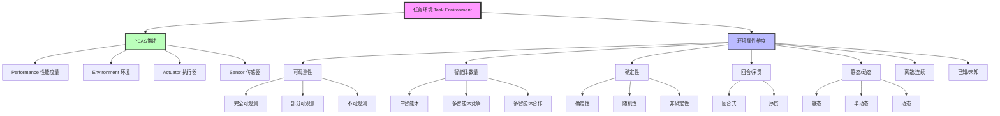

# 2.3 环境的本质 - Deep Dive 分析

## 1. 背景与动机

### 历史背景

任务环境（Task Environment）的分类研究源于人工智能早期对问题求解本质的探索。这一领域的发展经历了从具体应用到抽象理论的演进过程。

**控制论传统**：20世纪40-50年代，控制论先驱们就开始区分不同类型的控制系统。经典控制理论主要处理完全可观测的确定性环境，而随机最优控制理论（20世纪60年代发展）则处理部分可观测的随机环境。这种区分直接影响了后来AI中环境分类的维度。

**运筹学与动态规划**：20世纪50-60年代，贝尔曼（Bellman）和霍华德（Howard）在动态规划领域的开创性工作，明确区分了完全可观测马尔可夫决策过程（MDP）和部分可观测马尔可夫决策过程（POMDP）。这一理论框架成为AI中环境分类的数学基础。

**AI领域的系统分类**：20世纪70-80年代，随着AI应用领域的扩展，研究者们开始系统性地分类不同类型的任务环境。1987年，吉内塞雷斯和尼尔森的教科书首次在AI教材中系统讨论了环境属性。20世纪90年代，多智能体系统研究的兴起引入了竞争性/合作性环境的区分。

**PEAS框架的形成**：PEAS（Performance, Environment, Actuator, Sensor）描述框架的确立标志着任务环境分析的系统化。这一框架要求设计者在构建智能体之前，首先完整规范任务环境的各个方面。

### 研究动机

环境分类的研究动机源于AI系统设计的实际需求：

1. **算法选择的指导**：不同环境类型需要不同的算法方法。例如，确定性环境可以使用经典搜索算法，而随机环境需要概率推理；完全可观测环境不需要状态估计，而部分可观测环境需要信念状态跟踪。

2. **复杂性分析**：环境属性直接影响问题的计算复杂性。理解环境类型有助于预测问题的难度，选择合适的近似方法。

3. **智能体设计的约束**：环境属性决定了智能体必须具备的能力。例如，动态环境要求智能体能够实时决策，多智能体环境要求具备对手建模或协作能力。

4. **理论研究的组织**：环境分类为AI理论研究提供了组织框架。不同章节的技术（搜索、规划、学习、博弈论等）适用于不同类型的环境。

5. **实际应用的指导**：PEAS描述帮助设计者系统地思考应用需求，避免遗漏关键因素。

### 应用场景

环境分类的应用场景：

- **游戏AI设计**：国际象棋（完全可观测、确定性、静态、离散）与扑克（部分可观测、非确定性、静态、离散）需要完全不同的算法。
- **机器人导航**：室内导航（已知、离散）与野外探索（未知、连续）面临不同挑战。
- **自动驾驶**：高速公路驾驶（相对确定、结构化）与城市驾驶（高度不确定、多智能体）需要不同的系统架构。
- **医疗诊断**：诊断（部分可观测、单智能体、序贯）与治疗建议（需要考虑患者依从性，多智能体方面）。

### 先决条件

- 概率论基础（随机性概念）
- 博弈论基础（多智能体交互）
- 对计算复杂性的基本理解
- 2.1节和2.2节的基础知识

---

## 2. 知识逻辑图谱

### Mermaid 概念关系图



### 知识发展依赖链

```
控制论环境分类 (1940s-50s)
    ↓
动态规划与MDP/POMDP (Bellman, 1950s-60s)
    ↓
博弈论环境分析 (von Neumann, Nash, 1940s-50s)
    ↓
AI问题求解框架 (Newell & Simon, 1970s)
    ↓
PEAS框架确立 (1990s)
    ↓
[本节内容] 环境属性的系统分类
    ↓
算法选择策略 (搜索、规划、学习)
    ↓
多智能体系统理论
```

---

## 3. 核心概念与数学分析

### 术语定义（中英文）

| 中文术语 | 英文术语 | 定义 |
|---------|---------|------|
| 任务环境 | Task Environment | 智能体面临的问题情境，包括性能度量、外部环境、执行器和传感器 |
| PEAS描述 | PEAS Description | 对任务环境的四要素描述：Performance, Environment, Actuator, Sensor |
| 完全可观测 | Fully Observable | 智能体传感器能够访问环境完整状态的环境 |
| 部分可观测 | Partially Observable | 智能体传感器只能访问环境部分状态的环境 |
| 单智能体 | Single-agent | 只有一个智能体在环境中运行的环境 |
| 多智能体 | Multiagent | 多个智能体在同一环境中运行的环境 |
| 确定性 | Deterministic | 环境的下一个状态完全由当前状态和智能体动作决定的环境 |
| 随机性 | Stochastic | 环境模型显式处理概率的环境 |
| 回合式 | Episodic | 智能体经验被划分为独立回合的环境 |
| 序贯 | Sequential | 当前决策可能影响未来所有决策的环境 |
| 静态 | Static | 智能体思考时环境不发生变化的环境 |
| 动态 | Dynamic | 智能体思考时环境持续变化的环境 |
| 离散 | Discrete | 状态、时间和感知/动作都是离散的环境 |
| 连续 | Continuous | 状态、时间和感知/动作都是连续的环境 |
| 已知 | Known | 智能体知道环境物理定律（转移概率）的环境 |
| 未知 | Unknown | 智能体不知道环境物理定律的环境 |

### 符号参考表

| 符号 | 含义 | 类型 |
|-----|------|------|
| $S$ | 环境状态集合 | 集合 |
| $O$ | 观测集合 | 集合 |
| $A$ | 动作集合 | 集合 |
| $T(s' \| s, a)$ | 转移函数/模型 | 概率分布 |
| $O(o \| s)$ | 观测模型 | 概率分布 |
| $b(s)$ | 信念状态（对当前状态的概率分布） | 概率分布 |

### 关键公式与解释

#### 公式1：完全可观测环境的条件

$$\forall t, \exists f: o_t = f(s_t) \text{ 且 } f \text{ 是双射}$$

**解释**：在完全可观测环境中，每个观测 $o_t$ 与状态 $s_t$ 之间存在一一对应关系，智能体可以从观测唯一确定环境状态。

**几何意义**：观测空间与状态空间同构，观测提供了状态的完整信息。

**领域背景**：这是经典搜索和规划算法（如A*、STRIPS）的前提假设。

#### 公式2：部分可观测环境的信念状态更新

$$b'(s') = \alpha \cdot O(o \| s') \sum_{s} T(s' \| s, a) \cdot b(s)$$

其中 $\alpha$ 是归一化常数。

**解释**：这是贝叶斯滤波公式，用于在部分可观测环境中更新对当前状态的信念（概率分布）。

**计算步骤**：
1. 预测：基于转移模型计算 $P(s' \| a) = \sum_{s} T(s' \| s, a) \cdot b(s)$
2. 更新：基于观测模型计算 $b'(s') \propto O(o \| s') \cdot P(s' \| a)$
3. 归一化：确保 $b'(s')$ 是有效的概率分布

**几何意义**：信念状态在状态空间上定义了一个概率分布，每次感知-动作循环都会根据贝叶斯规则更新这个分布。

#### 公式3：确定性环境的转移函数

$$s_{t+1} = \delta(s_t, a_t)$$

**解释**：在确定性环境中，给定当前状态和动作，下一个状态是唯一确定的。

**对比随机环境**：
$$s_{t+1} \sim P(\cdot \| s_t, a_t)$$

在随机环境中，下一个状态服从条件概率分布。

#### 公式4：回合式 vs 序贯环境的性能度量

**回合式**：
$$\mathcal{M} = \sum_{i=1}^{N} R_i$$
其中 $R_i$ 是第 $i$ 回合的奖励，各回合独立。

**序贯**：
$$\mathcal{M} = \sum_{t=1}^{T} \gamma^t R_t$$
其中 $\gamma$ 是折扣因子，当前决策影响未来所有时间步。

**解释**：回合式环境的性能是各回合奖励的简单求和，序贯环境需要考虑长期累积奖励。

---

## 4. 具体示例

### 示例1：自动驾驶出租车的PEAS分析

**性能度量（Performance）**：
- 到达正确目的地
- 最小化油耗和磨损
- 最小化行程时间/成本
- 最小化交通违规
- 最大化安全性和乘客舒适度
- 最大化利润

**环境（Environment）**：
- 道路类型：乡村车道、城市小巷、高速公路
- 其他参与者：车辆、行人、动物
- 道路状况：工程、坑洼、天气
- 乘客交互

**执行器（Actuator）**：
- 发动机控制（油门）
- 转向系统
- 制动系统
- 乘客交互界面（显示屏、语音）

**传感器（Sensor）**：
- 摄像头（视觉）
- 激光雷达（距离）
- 超声波传感器
- GPS（位置）
- 速度表、加速度表
- 发动机状态传感器

**环境属性分类**：
- 可观测性：部分可观测（无法感知其他司机意图）
- 智能体数量：多智能体（竞争与合作并存）
- 确定性：非确定性/随机性（交通行为不确定）
- 回合/序贯：序贯（当前决策影响未来）
- 静态/动态：动态（环境持续变化）
- 离散/连续：连续（位置、速度连续变化）
- 已知/未知：大部分已知（交通规则），部分未知（新路况）

### 示例2：不同游戏的环境对比

| 环境 | 可观测 | 智能体 | 确定性 | 回合/序贯 | 静态 | 离散 |
|-----|-------|-------|-------|----------|-----|-----|
| 填字游戏 | 完全 | 单 | 确定性 | 序贯 | 静态 | 离散 |
| 国际象棋 | 完全 | 多 | 确定性 | 序贯 | 半动态 | 离散 |
| 扑克 | 部分 | 多 | 随机性 | 序贯 | 静态 | 离散 |
| 西洋双陆棋 | 完全 | 多 | 随机性 | 序贯 | 静态 | 离散 |

**分析**：

**国际象棋 vs 扑克**：
- 国际象棋完全可观测，扑克部分可观测（隐藏牌）
- 两者都是确定性规则，但扑克引入随机性（发牌）
- 国际象棋需要搜索和博弈论，扑克需要概率推理和对手建模

**填字游戏 vs 国际象棋**：
- 填字游戏是单智能体，国际象棋是多智能体
- 填字游戏可以独立求解每个格子（序贯但可分解），国际象棋必须考虑对手反应

### 示例3：真空吸尘器世界的变体

**基础版本（2.1节描述）**：
- 可观测性：完全可观测（知道位置和灰尘状态）
- 确定性：确定性（动作结果确定）
- 离散：离散（两个位置，两种状态）

**变体1：部分可观测版本**：
- 智能体只有灰尘传感器，没有位置传感器
- 信念状态：$P(\text{在A})$ 和 $P(\text{在B})$
- 需要基于动作效果更新位置信念

**变体2：随机版本**：
- 灰尘随机出现（概率 $p$）
- 吸尘动作可能失败（概率 $q$）
- 需要概率规划，考虑期望性能

**变体3：动态版本**：
- 环境中有移动的障碍物
- 智能体思考时世界变化
- 需要实时决策，不能无限期规划

---

## 5. 一句话本质

**任务环境是智能体面临的"问题"，其属性（可观测性、确定性、静态/动态等）决定了智能体设计的复杂度和适用的算法技术；PEAS描述提供了系统规范任务环境的框架。**

---

## 6. 总结与反思

### 关键要点

1. **PEAS描述的重要性**：在设计智能体之前，完整规范任务环境是至关重要的第一步。遗漏关键要素会导致设计缺陷。

2. **维度独立性**：环境属性维度（可观测性、确定性等）在很大程度上是独立的，不同组合产生不同类型的任务环境。

3. **最难环境**：部分可观测、多智能体、非确定性、序贯、动态、连续、未知的环境是最具挑战性的，真实世界通常具有这些特征。

4. **算法-环境匹配**：不同环境类型需要不同的算法方法。理解环境属性有助于选择合适的AI技术。

5. **属性不是绝对的**：环境属性可能因任务定义而异。例如，医疗诊断可以是回合式（单次诊断）或序贯（治疗过程监控）。

6. **已知 vs 完全可观测的区别**：这是常见的混淆点。已知环境指智能体知道规则，但可能看不到所有状态（如扑克知道规则但看不到对手牌）；完全可观测指能看到所有状态，但可能不知道规则（如新游戏）。

### 常见误解对照表

| 误解 | 正确理解 |
|-----|---------|
| 完全可观测意味着已知 | 完全可观测指能看到所有状态，已知指知道规则；两者不同 |
| 随机性和非确定性是同义词 | 随机性显式处理概率，非确定性不量化概率 |
| 多智能体环境一定是竞争性的 | 多智能体可以是竞争、合作或混合的 |
| 静态环境不会改变 | 静态指智能体思考时环境不变，环境本身可能随时间变化（如填字游戏有时间限制） |
| 离散/连续仅指状态空间 | 离散/连续适用于状态、时间、感知和动作多个方面 |
| 回合式意味着简单 | 回合式可以很复杂（如图像识别），只是决策之间没有依赖 |

### 反思问题

1. **属性边界的模糊性**：某些环境属性可能存在灰色地带。例如，"几乎完全可观测"（99%状态可见）与"部分可观测"的界限在哪里？这种模糊性对算法设计有何影响？

2. **多智能体的界定**：何时应该将环境中的对象视为智能体而非被动对象？例如，交通流中的车辆，是将其建模为智能体还是物理现象？

3. **性能度量的多重性**：实际应用通常有多个性能指标（如出租车需要同时考虑安全、效率、成本）。如何在PEAS框架中处理多目标优化？

4. **环境建模的层次**：同一环境可以在不同抽象层次上建模（如围棋可以看作离散状态序列或连续手指运动）。如何选择合适的建模层次？

5. **未知环境的探索**：在未知环境中，智能体如何平衡探索（学习规则）和利用（应用已知）？这与强化学习中的探索-利用权衡有何联系？

### 公式速查表

| 公式 | 含义 |
|-----|------|
| $o_t = f(s_t)$，$f$ 双射 | 完全可观测条件 |
| $b'(s') = \alpha \cdot O(o \| s') \sum_{s} T(s' \| s, a) \cdot b(s)$ | 信念状态更新（贝叶斯滤波） |
| $s_{t+1} = \delta(s_t, a_t)$ | 确定性环境转移 |
| $s_{t+1} \sim P(\cdot \| s_t, a_t)$ | 随机环境转移 |

---

**延伸阅读**：下一节（2.4）将探讨智能体的结构，介绍四种基本智能体类型（简单反射型、基于模型的反射型、基于目标的、基于效用的）以及学习型智能体的设计。
