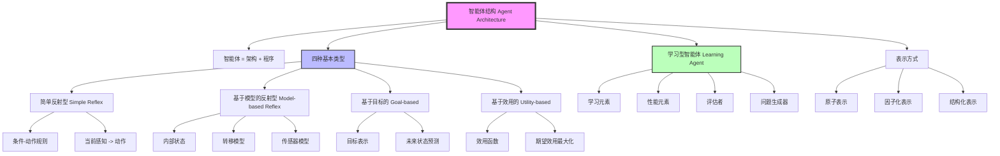

# 2.4 智能体的结构 - Deep Dive 分析

## 1. 背景与动机

### 历史背景

智能体结构（Agent Architecture）的研究是人工智能从理论走向实践的关键一步，其发展历程反映了AI范式从符号主义到行为主义再到混合方法的演变。

**符号主义传统（1956-1980s）**：早期AI研究集中在符号推理系统，如逻辑定理证明器和专家系统。1971年，费根鲍姆（Feigenbaum）开发的DENDRAL系统和后来的MYCIN系统展示了基于规则的推理能力。这一时期的智能体结构以符号操作和逻辑推理为核心。

**Shakey项目（1966-1972）**：斯坦福研究所的Shakey机器人是第一个基于目标的逻辑智能体，它整合了感知、推理和动作。Shakey使用STRIPS规划器，在简单环境中执行导航任务。虽然能力有限，但Shakey确立了智能体结构的基本框架：感知→建模→规划→执行。

**行为主义反叛（1986-1990s）**：罗德尼·布鲁克斯（Rodney Brooks）在1986年发表的论文《Elephants Don't Play Chess》中质疑了符号方法的复杂性，提出了基于行为的机器人学（Behavior-based Robotics）。布鲁克斯的包容架构（Subsumption Architecture）展示了简单反射型智能体也能产生复杂行为。

**罗森舍因的贡献（1985）**：罗森舍因（Rosenschein）开发了从形式规范自动编译生成简单反射型智能体的方法，证明了即使简单的条件-动作规则也可以在适当设计下保证理性行为。

**理性智能体设计的成熟（1990s-2000s）**：随着概率推理和决策理论在AI中的普及，基于效用的智能体结构成为标准框架。珀尔（Pearl）的教科书和后续研究确立了期望效用最大化作为理性智能体设计的理论基础。

**学习型智能体的发展（1990s至今）**：机器学习与智能体设计的结合产生了现代学习型智能体。塞缪尔（Samuel）的跳棋程序（1959）是早期典范，而现代深度强化学习系统（如AlphaGo、OpenAI Five）展示了学习型智能体的强大能力。

### 研究动机

智能体结构研究的核心动机是解决"如何实现理性行为"的问题：

1. **理论到实践的桥梁**：智能体函数是数学抽象，智能体程序是具体实现。智能体结构研究如何将抽象的理性要求转化为可执行的计算过程。

2. **计算复杂性管理**：显式存储智能体函数需要指数级空间，智能体结构研究如何用紧凑的程序替代巨大的查找表。

3. **模块化设计**：将智能体分解为感知、建模、决策、学习等组件，便于分阶段开发和测试。

4. **适应性需求**：真实环境通常是未知的或变化的，智能体结构需要支持学习和适应。

5. **表示能力权衡**：不同表示方式（原子、因子化、结构化）在表达能力和计算效率之间存在权衡，智能体结构需要选择合适的表示。

### 应用场景

智能体结构的应用场景：

- **简单反射型**：自动门传感器、恒温器、工业控制中的紧急停机系统
- **基于模型的反射型**：自动驾驶中的紧急避障、机器人导航中的障碍物回避
- **基于目标的**：路径规划系统、任务规划器、游戏AI的目标追求行为
- **基于效用的**：推荐系统、自动驾驶的路线选择、金融交易系统
- **学习型**：AlphaGo、自动驾驶的持续学习、个性化助手

### 先决条件

- 编程基础（伪代码阅读）
- 状态空间表示的概念
- 概率论基础（用于基于效用的智能体）
- 机器学习基础（用于学习型智能体）
- 前三节的基础知识

---

## 2. 知识逻辑图谱

### Mermaid 概念关系图



### 知识发展依赖链

```
符号主义AI与逻辑推理 (1950s-60s)
    ↓
Shakey机器人与STRIPS规划 (1970s)
    ↓
行为主义与包容架构 (Brooks, 1986)
    ↓
决策理论与期望效用 (1980s-90s)
    ↓
机器学习与智能体结合 (1990s-2000s)
    ↓
[本节内容] 智能体结构的系统分类
    ↓
深度强化学习智能体 (2010s)
    ↓
多模态大模型智能体 (2020s)
```

---

## 3. 核心概念与数学分析

### 术语定义（中英文）

| 中文术语 | 英文术语 | 定义 |
|---------|---------|------|
| 智能体架构 | Agent Architecture | 智能体程序运行的计算设备，提供传感器、执行器和计算资源 |
| 智能体程序 | Agent Program | 实现智能体函数的具体程序，将感知映射到动作 |
| 简单反射型智能体 | Simple Reflex Agent | 仅根据当前感知选择动作，不维护内部状态的智能体 |
| 条件-动作规则 | Condition-Action Rule | 如果条件成立则执行动作的简单规则（产生式规则） |
| 基于模型的反射型智能体 | Model-based Reflex Agent | 维护内部状态以跟踪不可观测世界状态的智能体 |
| 转移模型 | Transition Model | 描述世界如何随时间变化和智能体动作如何影响世界的知识 |
| 传感器模型 | Sensor Model | 描述世界状态如何反映在智能体感知中的知识 |
| 基于目标的智能体 | Goal-based Agent | 使用目标信息指导动作选择的智能体 |
| 基于效用的智能体 | Utility-based Agent | 使用效用函数评估状态并最大化期望效用的智能体 |
| 学习型智能体 | Learning Agent | 能够通过经验改进性能的智能体，包含学习元素和性能元素 |
| 原子表示 | Atomic Representation | 将状态视为不可分割黑盒的表示方式 |
| 因子化表示 | Factored Representation | 将状态表示为变量/属性值向量的表示方式 |
| 结构化表示 | Structured Representation | 将状态表示为对象及其关系的表示方式 |

### 符号参考表

| 符号 | 含义 | 类型 |
|-----|------|------|
| $\text{agent} = \langle \text{arch}, \text{program} \rangle$ | 智能体的组成 | 元组 |
| $s$ | 内部状态 | 状态空间 |
| $T(s, a, s')$ | 转移模型 | 函数/概率 |
| $O(s, o)$ | 传感器模型 | 函数/概率 |
| $G$ | 目标集合 | 状态集合 |
| $U(s)$ | 效用函数 | 实值函数 |
| $\mathbb{E}[U]$ | 期望效用 | 实数 |

### 关键公式与解释

#### 公式1：智能体组成的数学表达

$$\text{Agent} = \text{Architecture} + \text{Program}$$

**解释**：智能体由两部分组成——架构（物理计算设备）和程序（控制逻辑）。架构提供计算资源和传感器/执行器接口，程序实现从感知到动作的映射。

**领域背景**：这一分解允许我们独立地讨论智能体的硬件（架构）和软件（程序）。同一程序可以在不同架构上运行（如模拟器vs真实机器人），同一架构可以运行不同程序。

#### 公式2：表驱动智能体的空间复杂度

$$\text{Space} = \sum_{t=1}^{T} |\mathcal{P}|^t \times \log |\mathcal{A}|$$

**解释**：显式存储智能体函数需要的空间与感知序列数成正比。

**计算示例**：
- 自动驾驶出租车：摄像头输入 $70\text{MB/s}$
- 1小时驾驶：$70 \times 3600 \approx 2.5 \times 10^5 \text{MB}$
- 可能的感知序列数：$> 10^{600000000000}$（远超宇宙原子数 $10^{80}$）

**几何意义**：这表明显式存储智能体函数在物理上是不可能的，必须使用紧凑的程序表示。

#### 公式3：基于模型的状态更新

$$s_{t+1} = \text{UPDATE-STATE}(s_t, a_t, o_{t+1}, T, O)$$

其中：
- $s_t$：当前内部状态
- $a_t$：执行的动作
- $o_{t+1}$：新的观测
- $T$：转移模型
- $O$：传感器模型

**解释**：基于模型的智能体使用转移模型和传感器模型来更新对世界状态的估计。

**贝叶斯版本**：
$$b_{t+1}(s') \propto O(o_{t+1}|s') \sum_s T(s'|s, a_t) b_t(s)$$

#### 公式4：期望效用最大化

$$a^* = \arg\max_{a \in \mathcal{A}} \sum_{s'} T(s'|s, a) \cdot U(s')$$

**解释**：基于效用的智能体选择能够最大化期望效用的动作，期望是对转移模型定义的可能结果状态的加权平均。

**几何意义**：想象每个动作展开为一棵概率树，叶节点是可能的结果状态，效用是叶节点的"高度"。理性智能体选择那棵"平均高度"最高的树。

#### 公式5：学习型智能体的性能改进

$$\text{Performance}_{t+1} = \text{Performance}_t + \alpha \cdot \text{Feedback}_t$$

**解释**：学习型智能体根据评估者提供的反馈来改进性能元素，学习率 $\alpha$ 控制改进速度。

---

## 4. 定理与证明

### 定理：表驱动智能体的不可行性

**定理陈述**：对于任何具有非平凡感知空间的智能体，显式存储完整的智能体函数表在物理上是不可能的。

**证明**：

**步骤1：计算表的大小**

设：
- $|\mathcal{P}|$ = 可能感知的数量
- $T$ = 智能体生存期（感知数）

感知序列总数：
$$N = \sum_{t=1}^{T} |\mathcal{P}|^t = \frac{|\mathcal{P}|(|\mathcal{P}|^T - 1)}{|\mathcal{P}| - 1} \approx |\mathcal{P}|^T \text{ (当 } |\mathcal{P}| > 1 \text{)}$$

**步骤2：应用到具体例子**

考虑国际象棋：
- 棋盘状态数：约 $10^{43}$（合法状态约 $10^{44}$）
- 平均一局步数：约 $100$
- 可能的感知序列数：$> 10^{150}$

存储需求：
- 每行存储一个动作：约1字节
- 总存储：$> 10^{150}$ 字节

**步骤3：与物理极限比较**

已知：
- 可观测宇宙原子数：$< 10^{80}$
- 每个原子存储1比特的理论极限
- 宇宙总存储容量：$< 10^{80}$ 比特

**步骤4：得出结论**

$$10^{150} \text{ (需求)} \gg 10^{80} \text{ (可用)}$$

因此，显式存储智能体函数表是不可能的。

**证明本质**：这一证明揭示了AI的核心挑战——如何用有限的资源（空间、时间）实现智能行为。解决方案是使用紧凑的程序表示，利用问题结构（如状态转移的规律性）来压缩信息。

**推论**：任何实用的智能体必须使用某种形式的泛化，从有限的程序代码产生无限的行为可能性。

---

## 5. 具体示例

### 示例1：真空吸尘器智能体的四种类型

**场景**：两个方格A和B，每个可以是干净或脏。

**简单反射型**：
```
function REFLEX-VACUUM-AGENT([location, status]):
    if status = Dirty then return Suck
    else if location = A then return Right
    else return Left
```

特点：
- 仅依赖当前感知
- 无内部状态
- 在完全可观测环境下工作良好
- 在部分可观测环境下可能陷入无限循环

**基于模型的反射型**：
```
function MODEL-BASED-AGENT(percept):
    persistent: state, transition_model, sensor_model
    state = UPDATE-STATE(state, action, percept, transition_model, sensor_model)
    if state.status = Dirty then return Suck
    else if state.location = A then return Right
    else return Left
```

特点：
- 维护内部状态
- 使用模型更新状态
- 可处理部分可观测性
- 仍使用固定的条件-动作规则

**基于目标的**：
```
function GOAL-BASED-AGENT(percept):
    persistent: state, transition_model, goal
    state = UPDATE-STATE(state, action, percept, transition_model)
    if goal_reached(state, goal) then return NoOp
    else return SEARCH(state, goal, transition_model)
```

特点：
- 显式表示目标
- 使用搜索/规划找到达目标的动作序列
- 更灵活（可改变目标）
- 需要考虑未来

**基于效用的**：
```
function UTILITY-BASED-AGENT(percept):
    persistent: state, transition_model, utility_function
    state = UPDATE-STATE(state, action, percept, transition_model)
    return argmax_a EXPECTED-UTILITY(a, state, utility_function)
```

特点：
- 使用效用函数评估状态
- 最大化期望效用
- 可处理目标冲突和不确定性
- 最一般化的理性智能体

### 示例2：刹车决策的四种实现

**场景**：自动驾驶汽车需要决定是否刹车。

**简单反射型**：
```
if front_car_brake_light_on then brake
```

问题：如果无法从单帧图像确定前车是否在刹车（如尾灯配置不同），会出错。

**基于模型的反射型**：
```
state = UPDATE-STATE(state, current_image, previous_images)
if state.front_car_decelerating then brake
```

改进：使用多帧信息更新状态，检测刹车灯的亮起模式。

**基于目标的**：
```
goal = [avoid_collision, reach_destination]
if predicted_distance_to_front_car < safety_margin:
    return brake
else:
    return maintain_speed
```

改进：显式考虑安全目标，预测未来状态。

**基于效用的**：
```
utility = safety_utility + efficiency_utility + comfort_utility
action = argmax_a EXPECTED-UTILITY(a, state)
```

改进：在安全、效率、舒适性之间做最优权衡，考虑不确定性。

### 示例3：表示方式的对比

**问题**：描述"卡车在农场车道倒车，奶牛挡路"的场景。

**原子表示**：
```
state = "Situation_42"
```
- 状态是不可分割的原子
- 需要为每种可能情况定义一个原子
- 无法泛化到新情况

**因子化表示**：
```
state = {
    truck_position: (x1, y1),
    truck_velocity: (vx1, vy1),
    cow_position: (x2, y2),
    cow_moving: false,
    farm_driveway_clear: false
}
```
- 状态由变量值组成
- 可以表示新组合
- 但难以表示关系和对象身份

**结构化表示**：
```
state = {
    objects: [truck1, cow1, driveway1],
    relations: [
        (truck1, on, driveway1),
        (truck1, backing, true),
        (cow1, blocking, driveway1),
        (cow1, loose, true)
    ]
}
```
- 显式表示对象和关系
- 支持推理（如"如果奶牛移动，车道就畅通"）
- 自然语言理解的基础

---

## 6. 一句话本质

**智能体结构是智能体函数的具体实现方式，从简单的条件-动作规则到复杂的期望效用最大化，不同结构在表达能力、计算效率和灵活性之间存在权衡；学习型智能体通过反馈循环持续改进，而表示方式的选择决定了智能体能表达和推理的知识类型。**

---

## 7. 总结与反思

### 关键要点

1. **四种基本类型的递进关系**：简单反射型 → 基于模型的反射型 → 基于目标的 → 基于效用的，每种类型增加新的组件和能力，解决前一类型无法处理的问题。

2. **表驱动方法的不可行性**：显式存储智能体函数需要指数级空间，必须使用紧凑的程序表示。这是推动智能体程序设计的根本动力。

3. **模型的重要性**：基于模型的智能体可以处理部分可观测性，通过维护内部状态和更新模型来跟踪世界。

4. **显式表示的优势**：基于目标和基于效用的智能体将目标/效用显式表示出来，这使得智能体更灵活（可改变目标）和更理性（可权衡多个因素）。

5. **学习的必要性**：学习型智能体通过评估者和问题生成器不断改进，能够适应未知环境和纠正先验知识的错误。

6. **表示的层次**：原子、因子化、结构化表示形成表达能力递增的层次，选择合适的表示层次是智能体设计的关键决策。

### 常见误解对照表

| 误解 | 正确理解 |
|-----|---------|
| 简单反射型智能体总是不好的 | 在完全可观测环境中，简单反射型可以是最优的；它们简单、快速、易于验证 |
| 基于效用的智能体总是最好的 | 基于效用的智能体最一般化，但计算成本最高；简单环境不需要复杂结构 |
| 学习型智能体从零开始学习 | 学习型智能体通常有初始知识（如进化提供的本能），学习是逐步改进 |
| 智能体必须选择一种表示方式 | 真实智能系统可能同时使用多种表示方式，针对不同子任务 |
| 基于模型的智能体需要完美模型 | 模型可以是不完美的，甚至简单的模型也比没有模型好 |
| 随机化总是不理性的 | 在多智能体环境中，随机化可以是理性的（避免被预测） |

### 反思问题

1. **架构与程序的边界**：在某些情况下（如神经形态计算），硬件和软件的界限变得模糊。这对智能体=架构+程序的公式有何影响？

2. **模型学习的困境**：基于模型的智能体需要转移模型，但模型本身可能需要从经验中学习。如何协调模型学习和模型使用？

3. **效用函数的来源**：基于效用的智能体假设效用函数已知，但现实中效用函数往往难以指定。如何从人类反馈或其他信号中学习效用？

4. **表示自动选择**：能否设计自动选择或切换表示方式的智能体？例如，在需要快速反应时使用原子表示，在需要推理时切换到结构化表示？

5. **元学习**：学习型智能体学习如何执行任务，元学习（学习如何学习）是否需要一个更高层次的学习元素？这会导致无限回归吗？

### 公式速查表

| 公式 | 含义 |
|-----|------|
| $\text{Agent} = \text{Architecture} + \text{Program}$ | 智能体的组成 |
| $\text{Space} \approx |\mathcal{P}|^T$ | 表驱动智能体的空间复杂度 |
| $s_{t+1} = \text{UPDATE-STATE}(s_t, a_t, o_{t+1})$ | 基于模型的状态更新 |
| $a^* = \arg\max_a \sum_{s'} T(s'\|s,a) \cdot U(s')$ | 期望效用最大化 |
| $b_{t+1}(s') \propto O(o\|s') \sum_s T(s'\|s,a) b_t(s)$ | 贝叶斯信念更新 |

---

**本章总结**：第2章建立了智能体理论的基础框架。我们从智能体的定义（2.1）出发，讨论了理性行为的标准（2.2），分析了任务环境的属性（2.3），最后探讨了实现理性智能体的各种结构（2.4）。这一框架贯穿全书，为后续章节的具体技术（搜索、规划、学习、推理等）提供了统一的视角。
