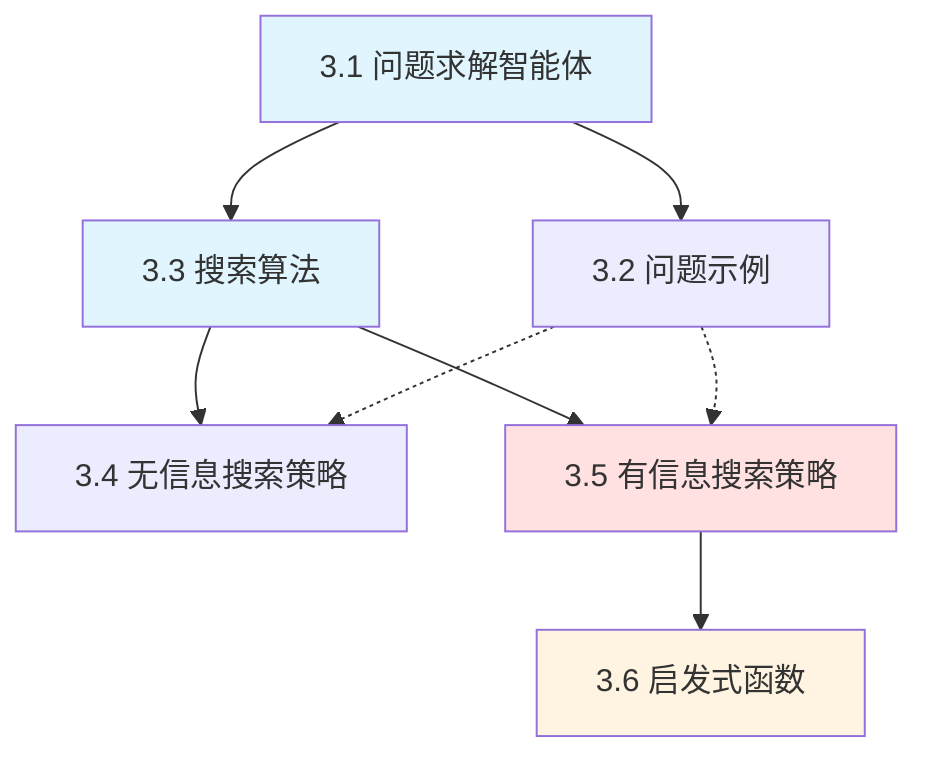

# 第 3 章 通过搜索进行问题求解 - 概览

## 学习目标

完成本章学习后，你将能够：

1. **问题形式化**：将实际问题抽象为形式化的问题描述（状态空间、初始状态、目标状态、动作、转移模型、代价函数）
2. **无信息搜索**：掌握 BFS、一致代价搜索、DFS、迭代加深搜索、双向搜索等算法的原理、特性及适用场景
3. **有信息搜索**：理解启发式函数的作用，掌握 A* 搜索算法的原理，理解可容许性与一致性的概念
4. **启发式设计**：能够设计简单的启发式函数，理解从松弛问题生成启发式的方法
5. **算法分析**：能够比较各种搜索算法的时间/空间复杂度，根据问题特征选择合适的算法

---

## 本章速览

本章介绍**问题求解智能体**如何通过**搜索**找到实现目标的动作序列。核心内容包括：

- **问题形式化**：将真实世界问题抽象为数学模型，包括状态空间、动作、转移模型和代价函数
- **搜索算法框架**：基于最佳优先搜索的通用框架，理解边界、已达状态、扩展等核心概念
- **无信息搜索**：当缺乏目标位置信息时，系统性地探索状态空间的策略（BFS、DFS、一致代价搜索、迭代加深等）
- **有信息搜索**：利用启发式函数指导搜索方向，A* 算法结合路径代价和启发估计实现最优搜索
- **启发式函数**：如何设计有效的启发式函数，理解可容许性、一致性、支配关系等概念

本章是人工智能的基石，搜索技术广泛应用于路径规划、游戏、规划、约束满足等领域。

---

## 难度预警 ⚠️

| 难点概念 | 难度等级 | 说明 |
|---------|---------|------|
| A* 搜索的最优性证明 | ⭐⭐⭐⭐⭐ | 需要理解可容许性与一致性的区别，掌握反证法的应用 |
| 一致性与可容许性的关系 | ⭐⭐⭐⭐ | 一致性蕴含可容许性，但反之不成立，需要透彻理解三角不等式 |
| 迭代加深搜索的时间复杂度分析 | ⭐⭐⭐⭐ | 需要理解为何重复扩展不会导致复杂度显著增加 |
| 启发式函数的支配关系 | ⭐⭐⭐ | 理解占优启发式为何能剪枝更多节点 |
| 双向搜索的复杂度优势 | ⭐⭐⭐ | 理解 $b^{d/2} + b^{d/2}$ 远小于 $b^d$ 的数学直觉 |
| 从松弛问题生成启发式 | ⭐⭐⭐⭐ | 需要理解如何放松约束条件生成可容许启发式 |

**学习建议**：A* 算法及其最优性证明是本章核心，建议反复研读；动手模拟算法执行过程有助于理解各算法的差异。

---

## 前置知识

### 必备知识
- **基本数据结构**：栈、队列、优先队列（堆）
- **图论基础**：图、树、节点、边、路径的概念
- **算法复杂度**：大 O 表示法（$O(n)$、$O(2^n)$ 等）
- **数学基础**：反证法、三角不等式

### 推荐预习
- 第 2 章智能体的基本概念（性能指标、环境特性）
- 附录 A 的渐近复杂性概念

### 后续关联
- 第 4 章：复杂环境中的搜索（局部搜索、非确定性、部分可观测）
- 第 5 章：对抗搜索（博弈）
- 第 6 章：约束满足问题
- 第 7 章、第 11 章：规划智能体

---

## 节依赖图



**学习路径建议**：
- **核心路径**：3.1 → 3.3 → 3.4 → 3.5 → 3.6（必学）
- **实例参考**：3.2 可在学习算法时按需查阅

---

## 核心概念清单

### 问题形式化相关
| 概念 | 定义 | 示例（罗马尼亚问题） |
|-----|------|-------------------|
| **状态空间** | 所有可能环境状态的集合 | 所有城市的集合 |
| **初始状态** | 智能体启动时的状态 | Arad |
| **目标状态** | 智能体希望达到的状态 | Bucharest |
| **动作** | 状态转换的操作 | Actions(Arad) = {ToSibiu, ToTimisoara, ToZerind} |
| **转移模型** | 描述动作效果的函数 | Result(Arad, ToZerind) = Zerind |
| **路径代价** | 动作序列的总代价 | 路径 Arad→Sibiu→Fagaras→Bucharest 的代价 = 140+99+211 = 450 |
| **解** | 从初始状态到目标状态的路径 | Arad → Sibiu → Rimnicu → Pitesti → Bucharest |
| **最优解** | 路径代价最小的解 | 上述路径（代价 418）|

### 搜索算法相关
| 概念 | 定义 | 相关算法 |
|-----|------|---------|
| **搜索树** | 从初始状态生成的树形结构 | 所有算法 |
| **边界 (Frontier)** | 已到达但未扩展的节点集合 | 所有算法 |
| **已达 (Reached)** | 已生成过节点的状态集合 | 图搜索 |
| **扩展 (Expand)** | 生成节点的所有后继节点 | 所有算法 |
| **分支因子 (b)** | 每个节点的平均后继数 | 复杂度分析 |
| **解深度 (d)** | 最优解的动作数 | 复杂度分析 |
| **最大深度 (m)** | 搜索树的最大深度 | 复杂度分析 |

### 有信息搜索相关
| 概念 | 符号 | 定义 |
|-----|------|------|
| **启发式函数** | $h(n)$ | 从节点 $n$ 到目标的最小代价估计 |
| **实际路径代价** | $g(n)$ | 从初始状态到节点 $n$ 的路径代价 |
| **评价函数** | $f(n)$ | 决定扩展顺序的函数 |
| **可容许性** | - | $h(n) \leq h^*(n)$（不高于实际代价）|
| **一致性** | - | $h(n) \leq c(n,a,n') + h(n')$（三角不等式）|

---

## 核心要点速查表

### 搜索算法对比速查

| 算法 | 评价函数 $f(n)$ | 完备性 | 代价最优 | 时间复杂度 | 空间复杂度 |
|-----|----------------|-------|---------|-----------|-----------|
| **BFS** | 深度 | 是* | 是* | $O(b^d)$ | $O(b^d)$ |
| **一致代价** | $g(n)$ | 是* | 是 | $O(b^{1+\lfloor C^*/\varepsilon \rfloor})$ | 同时间 |
| **DFS** | 深度倒数 | 否 | 否 | $O(b^m)$ | $O(bm)$ |
| **深度受限** | 深度倒数 | 否 | 否 | $O(b^\ell)$ | $O(b\ell)$ |
| **迭代加深** | 深度倒数 | 是* | 是* | $O(b^d)$ | $O(bd)$ |
| **双向 BFS** | 深度 | 是* | 是* | $O(b^{d/2})$ | $O(b^{d/2})$ |
| **贪心最佳优先** | $h(n)$ | 否 | 否 | $O(b^m)$ | $O(b^m)$ |
| **A* 搜索** | $g(n)+h(n)$ | 是 | 是** | $O(b^d)$ | $O(b^d)$ |
| **加权 A*** | $g(n)+W \cdot h(n)$ | 是 | 否 | 更快 | $O(b^d)$ |

> *: 对于动作代价相同的问题<br>
> **: 当 $h$ 可容许时

### 关键公式速查

```
A* 评价函数:        f(n) = g(n) + h(n)
可容许性条件:       h(n) ≤ h*(n)  （h*为真实最优代价）
一致性条件:         h(n) ≤ c(n,a,n') + h(n')
加权 A* 评价函数:   f(n) = g(n) + W × h(n)
```

### 算法选择决策树

```
问题特征
├── 有无启发式信息？
│   ├── 无 → 无信息搜索
│   │   ├── 动作代价相同？
│   │   │   ├── 是 → BFS（解深度小）或迭代加深（空间受限）
│   │   │   └── 否 → 一致代价搜索
│   │   └── 空间受限？
│   │       ├── 是 → 迭代加深
│   │       └── 否 → BFS 或双向搜索
│   └── 有 → 有信息搜索
│       ├── 要求最优解？
│       │   ├── 是 → A*（h需可容许）
│       │   └── 否 → 加权 A*（更快）
│       └── 空间受限？
│           ├── 是 → IDA* 或 RBFS
│           └── 否 → A*
```

---

## 概念对比表

### 图搜索 vs 树状搜索

| 特性 | 图搜索 | 树状搜索 |
|-----|-------|---------|
| **已达状态表** | 维护 | 不维护 |
| **冗余路径** | 检测并消除 | 允许重复 |
| **内存使用** | 高（存储所有已达状态）| 低（仅当前路径）|
| **时间效率** | 高（避免重复扩展）| 低（可能重复扩展）|
| **适用场景** | 状态空间小、冗余路径多 | 状态空间大、路径唯一 |
| **典型算法** | BFS、A*、一致代价 | DFS（基础版）、回溯 |

### 可容许性 vs 一致性

| 特性 | 可容许性 (Admissible) | 一致性 (Consistent) |
|-----|----------------------|-------------------|
| **定义** | $h(n) \leq h^*(n)$ | $h(n) \leq c(n,a,n') + h(n')$ |
| **关系** | 较弱条件 | 较强条件（一致必可容许）|
| **保证最优** | 是 | 是 |
| **避免重复扩展** | 否 | 是 |
| **几何解释** | 估计不高于实际 | 满足三角不等式 |
| **实例** | 错位滑块数 | 曼哈顿距离 |

### 无信息搜索算法对比

| 算法 | 核心思想 | 优点 | 缺点 | 最佳应用场景 |
|-----|---------|------|------|------------|
| **BFS** | 逐层扩展 | 完备、最优（动作代价相同时） | 空间需求大 | 浅层解、动作代价相同 |
| **一致代价** | 按路径代价扩展 | 完备、最优（任意代价） | 探索大量低代价路径 | 动作代价差异大 |
| **DFS** | 深入优先 | 空间效率高 | 不完备、非最优 | 空间受限、解深度已知 |
| **迭代加深** | 限制深度的DFS循环 | 空间效率高、完备 | 重复扩展上层节点 | 深度未知、空间受限 |
| **双向搜索** | 从两端同时搜索 | 大幅减少搜索空间 | 实现复杂、需要反向动作 | 目标状态已知、分支因子大 |

---

## 常见误解澄清

### 误解 1：A* 搜索总是最快的
**澄清**：A* 在最优解意义上是效率最优的，即任何其他算法都不能扩展更少的必然扩展节点。但如果不需要最优解，加权 A* 或贪心搜索可能更快。A* 的主要问题是空间需求大。

### 误解 2：所有启发式函数都是可容许的
**澄清**：启发式函数需要特别设计才能保证可容许性。例如，8 数码问题中，使用"欧几里得距离"而不是"曼哈顿距离"作为启发式，可能不可容许（因为滑块不能对角移动）。

### 误解 3：深度优先搜索总是比广度优先搜索差
**澄清**：DFS 在以下场景有优势：
- 内存受限（空间复杂度 $O(bm)$ vs $O(b^d)$）
- 解位于树的深层且路径唯一（无冗余）
- 需要找到任意解而非最优解

### 误解 4：迭代加深搜索因为重复扩展所以很慢
**澄清**：虽然迭代加深确实重复扩展了上层节点，但在分支因子为 $b$、解深度为 $d$ 时，总节点数仅为：
$$N(IDS) = db + (d-1)b^2 + ... + b^d = O(b^d)$$
与 BFS 同阶，且系数 $(d/(b-1) + 1)$ 对于大 $b$ 来说接近 1。

### 误解 5：可容许的启发式一定保证 A* 不扩展目标等值线外的节点
**澄清**：A* 会扩展所有 $f(n) < C^*$ 的节点，**可能**扩展部分 $f(n) = C^*$ 的节点（取决于边界顺序），**不会**扩展 $f(n) > C^*$ 的节点。对于一致性启发式，首次到达某状态时就在最优路径上。

### 误解 6：双向搜索总是优于单向搜索
**澄清**：当启发式函数很强时（如 A*），搜索等值线已经很聚焦于目标，双向搜索的优势不明显。双向搜索在启发式较弱时更有价值。

---

## 本章测验

### 题目 1
在罗马尼亚寻径问题中，从 Arad 到 Bucharest，以下哪个说法是正确的？

A. BFS 一定能找到最短路径（英里数最少）
B. 一致代价搜索一定能找到最短路径
C. DFS 一定能找到最短路径
D. 贪心最佳优先搜索一定能找到最短路径

<details>
<summary>答案</summary>

**B**

一致代价搜索按照路径代价（这里是英里数）递增的顺序搜索，因此找到的第一个解就是代价最优的。BFS 只有在所有动作代价相同时才能保证最优；DFS 和贪心都不保证最优。
</details>

### 题目 2
关于启发式函数的可容许性，以下哪个说法正确？

A. 可容许的启发式一定是一致的
B. 一致的启发式一定是可容许的
C. 曼哈顿距离不是可容许启发式
D. A* 使用不可容许启发式也能保证最优

<details>
<summary>答案</summary>

**B**

一致性蕴含可容许性（可通过归纳法证明），但反之不成立。曼哈顿距离是可容许的，因为每次移动最多将滑块向目标靠近一步。A* 需要可容许启发式才能保证最优。
</details>

### 题目 3
在 8 数码问题中，$h_1$ = 错位滑块数，$h_2$ = 曼哈顿距离，则：

A. $h_1$ 占优 $h_2$（$h_1 \geq h_2$）
B. $h_2$ 占优 $h_1$（$h_2 \geq h_1$）
C. 两者相互占优
D. 无法确定支配关系

<details>
<summary>答案</summary>

**B**

对于任意节点，曼哈顿距离 $\geq$ 错位滑块数（每个错位滑块至少需要移动曼哈顿距离步）。因此 $h_2$ 占优 $h_1$，使用 $h_2$ 的 A* 扩展的节点数 $\leq$ 使用 $h_1$ 的 A*。
</details>

### 题目 4
关于迭代加深搜索（IDS），以下说法错误的是：

A. IDS 的空间复杂度与 DFS 相同，为 $O(bd)$
B. IDS 对于动作代价相同的问题是最优的
C. IDS 的时间复杂度与 BFS 同阶
D. IDS 会重复扩展浅层节点

<details>
<summary>答案</summary>

**A**

IDS 的空间复杂度为 $O(bd)$（确实与 DFS 同阶），但选项 A 描述的是 DFS 的空间复杂度 $O(bm)$ 混淆了。实际上 IDS 空间复杂度确实是 $O(bd)$，但题目问的是"错误"的说法——实际上 A 是正确的描述。重新审题：DFS 空间复杂度是 $O(bm)$，IDS 是 $O(bd)$。当 $d < m$ 时不同。但通常选项 A 的表述是"与 DFS 相同"，这可能不完全准确。

最准确答案是 **A**（表述不严谨，因为 DFS 是 $O(bm)$，IDS 是 $O(bd)$，不完全相同）。
</details>

### 题目 5
在 A* 搜索中，如果启发式函数 $h$ 是一致的，则：

A. 首次到达某状态时，不一定在最优路径上
B. 可能需要多次将同一状态加入边界
C. 首次到达某状态时，一定在最优路径上
D. 搜索效率一定比使用不可容许启发式差

<details>
<summary>答案</summary>

**C**

一致性保证 $f$ 值沿路径单调不减，因此首次到达某状态时，$g$ 值已经最优。这意味着不需要重复将该状态加入边界。一致启发式是可容许的，能保证最优性和效率。
</details>

---

## 快速复习卡

### 问题求解框架
```
目标形式化 → 问题形式化 → 搜索 → 执行
                    ↓
              [状态空间模型]
```

### 搜索算法选择速记
| 场景 | 推荐算法 |
|-----|---------|
| 动作代价相同、求最优解 | BFS |
| 动作代价不同、求最优解 | 一致代价搜索 |
| 空间受限、解深度未知 | 迭代加深 |
| 有强启发式、求最优解 | A* |
| 有启发式、快速求解即可 | 加权 A* |
| 目标状态已知 | 双向搜索 |

### A* 关键性质
```
f(n) = g(n) + h(n)
        ↓         ↓
     已付代价   估计代价

可容许性: h(n) ≤ h*(n)    → 保证最优
一致性: h(n) ≤ c + h(n')  → 避免重复扩展
```

### 启发式设计方法
1. **松弛问题**：减少动作约束，求解简化问题
2. **模式数据库**：预计算子问题的最优解
3. **组合启发式**：$h(n) = \max(h_1(n), h_2(n), ...)$

---

## 扩展阅读建议

### 经典文献
1. **Hart, P. E., Nilsson, N. J., & Raphael, B. (1968)**. "A Formal Basis for the Heuristic Determination of Minimum Cost Paths". *IEEE Transactions on Systems Science and Cybernetics*. —— A* 算法的原始论文

2. **Korf, R. E. (1985)**. "Depth-first iterative-deepening: An optimal admissible tree search". *Artificial Intelligence*. —— 迭代加深 A* 的经典论文

3. **Felner, A., et al. (2011)**. "Inconsistent heuristics". *AAAI*. —— 关于不一致启发式的研究

### 在线资源
- **Russell & Norvig 官网代码**：aima.cs.berkeley.edu 提供各章算法的 Python 实现
- **Visualgo**：搜索算法可视化工具，帮助理解算法执行过程
- **Pathfinding.js**：交互式路径规划演示

### 实践项目
1. 实现 8/15 数码求解器，比较不同启发式的效率
2. 实现罗马尼亚地图寻径，可视化各算法的搜索过程
3. 设计一个推箱子游戏求解器

### 深入方向
- **第 4 章**：局部搜索（爬山法、模拟退火、遗传算法）
- **第 5 章**：对抗搜索（Minimax、Alpha-Beta 剪枝）
- **第 6 章**：约束满足问题（CSP）
- **第 11 章**：经典规划（PDDL）
