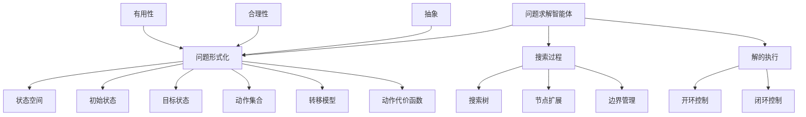
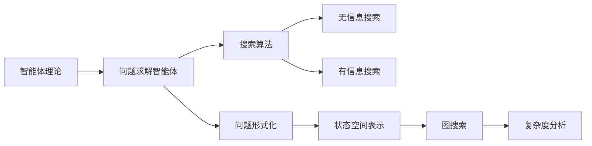

# 3.1 问题求解智能体 - Deep Dive 分析

## 1. 背景与动机

### 1.1 历史背景

问题求解（Problem Solving）作为人工智能的核心领域之一，其历史可以追溯到20世纪50年代AI学科诞生之初。1956年达特茅斯会议确立了AI的研究方向，而问题求解能力被视为智能体（Agent）的核心特征之一。早期的AI系统如Logic Theorist（1956）和General Problem Solver（1957）都致力于构建能够自动求解问题的智能系统。

在AI发展的早期阶段，研究者们关注如何让计算机模拟人类的问题求解过程。Newell和Simon提出了"物理符号系统假设"，认为任何能够操纵符号的系统都具有智能，这为基于搜索的问题求解方法奠定了理论基础。他们将人类的问题求解过程建模为在问题空间中的状态搜索，这一思想深刻影响了后续几十年的AI研究。

### 1.2 研究动机

问题求解智能体的设计动机源于对智能行为的本质探索：

**认知科学视角**：人类在面对复杂问题时，往往会将问题分解为子问题，通过规划和搜索来找到解决方案。AI系统需要模拟这种能力，以实现类似人类的智能行为。

**工程实践需求**：从机器人导航到自动规划，从游戏AI到资源调度，现实世界中的大量应用都需要智能体能够在复杂环境中找到最优或满意的行动序列。

**理论基础构建**：通过研究问题求解，我们可以更好地理解计算复杂性、算法设计和启发式方法，这些理论成果不仅服务于AI，也对计算机科学的其他领域产生深远影响。

### 1.3 应用场景

问题求解智能体的典型应用场景包括：

| 应用领域 | 具体问题 | 关键特征 |
|---------|---------|---------|
| 路径规划 | GPS导航、机器人移动 | 图搜索、代价最小化 |
| 游戏AI | 国际象棋、围棋 | 博弈树搜索、启发式评估 |
| 自动规划 | 任务调度、资源分配 | 约束满足、优化目标 |
| 定理证明 | 数学定理自动证明 | 逻辑推理、搜索策略 |
| 配置设计 | 产品设计、系统配置 | 约束满足、多目标优化 |

### 1.4 先决条件

理解本节内容需要掌握以下基础知识：

- **智能体基本概念**：了解智能体的感知-动作循环、环境类型（完全可观测/部分可观测、确定性/非确定性等）
- **图论基础**：理解图、节点、边、路径等基本概念
- **算法分析基础**：了解时间复杂度、空间复杂度的概念
- **集合论基础**：理解集合、映射、函数等基本数学概念

## 2. 知识逻辑图谱

### 2.1 概念关系图

### 2.2 知识发展依赖链

## 3. 核心概念与数学分析

### 3.1 术语定义

| 术语（中文） | 术语（英文） | 定义 |
|------------|------------|------|
| 问题求解智能体 | Problem-Solving Agent | 一种基于原子表示的智能体，通过搜索动作序列来实现目标 |
| 状态 | State | 世界在某一时刻的配置描述 |
| 状态空间 | State Space | 所有可能状态的集合 |
| 动作 | Action | 智能体在某一状态下可执行的操作 |
| 转移模型 | Transition Model | 描述执行动作后状态如何变化的函数 |
| 动作代价函数 | Action Cost Function | 计算执行动作所需代价的函数 |
| 解 | Solution | 从初始状态到目标状态的动作序列 |
| 最优解 | Optimal Solution | 路径代价最小的解 |
| 抽象 | Abstraction | 从表示中剔除无关细节的过程 |

### 3.2 符号参考表

| 符号 | 含义 | 数学类型 |
|-----|------|---------|
| $s$ | 状态 | 集合元素 |
| $S$ | 状态空间 | 集合 |
| $s_0$ | 初始状态 | 状态空间中的特定元素 |
| $G$ | 目标状态集合 | 状态空间的子集 |
| $Actions(s)$ | 在状态$s$中可用的动作集合 | 动作集合 |
| $Result(s, a)$ | 在状态$s$执行动作$a$后的结果状态 | 状态映射函数 |
| $c(s, a, s')$ | 从$s$经动作$a$到达$s'$的代价 | 实数 |
| $g(n)$ | 从初始状态到节点$n$的路径代价 | 实数 |

### 3.3 关键公式

#### 公式1：搜索问题的形式化定义

$$\text{Problem} = (S, s_0, G, Actions, Result, c)$$

**解释**：一个搜索问题由六个要素组成：
- $S$：状态空间（所有可能状态的集合）
- $s_0 \in S$：初始状态
- $G \subseteq S$：目标状态集合
- $Actions: S \rightarrow 2^A$：动作函数，返回在某一状态下可用的动作集合
- $Result: S \times A \rightarrow S$：转移模型，描述动作的效果
- $c: S \times A \times S \rightarrow \mathbb{R}^+$：动作代价函数

**几何意义**：可以将状态空间想象为一个图，其中节点表示状态，边表示动作，边的权重表示动作代价。问题求解就是在图中寻找从起始节点到目标节点的路径。

**领域背景**：这种形式化方法源自图论和运筹学，是AI中搜索算法的数学基础。

#### 公式2：路径总代价

$$\text{Path-Cost} = \sum_{i=1}^{n} c(s_{i-1}, a_i, s_i)$$

**解释**：一条路径的总代价是路径上所有动作代价的累加，其中$s_0$是初始状态，$a_i$是第$i$个动作，$s_i$是执行$a_i$后的状态。

**几何意义**：在加权图中，这对应于路径上所有边权重的总和。

**应用示例**：在罗马尼亚地图问题中，从Arad到Bucharest经过Sibiu和Fagaras的路径代价为：
$$140 + 99 + 211 = 450 \text{（英里）}$$

#### 公式3：抽象问题的合理性条件

$$\forall s_{detailed} \in S_{detailed}, \exists \text{ path from } s_{detailed} \text{ to } s'_{detailed} \text{ corresponding to abstract action}$$

**解释**：如果抽象问题的任何解都可以细化为详细世界中的解，则该抽象是合理的。充分条件是：对于每个详细状态的抽象状态，都存在一条路径到达下一个抽象状态对应的详细状态集合。

**几何意义**：抽象将详细状态空间划分为若干等价类，如果同一等价类内的任意状态都能到达相邻等价类的某个状态，则抽象是合理的。

### 3.4 问题求解的四阶段过程

**阶段1：目标形式化（Goal Formulation）**
- 确定智能体希望达到的目标状态
- 目标限制了智能体需要考虑的动作范围
- 示例：从Arad到达Bucharest

**阶段2：问题形式化（Problem Formulation）**
- 定义状态空间：哪些信息需要跟踪
- 定义动作：智能体可以执行的操作
- 定义转移模型：动作如何改变状态
- 定义代价函数：评估动作的成本

**阶段3：搜索（Search）**
- 在模型中模拟动作序列
- 寻找从初始状态到目标状态的路径
- 返回解（动作序列）或报告失败

**阶段4：执行（Execution）**
- 在真实世界中执行解中的动作
- 一次执行一个动作
- 监控执行过程（闭环）或"闭上眼睛"（开环）

### 3.5 开环与闭环系统

| 特性 | 开环系统（Open-loop） | 闭环系统（Closed-loop） |
|-----|---------------------|----------------------|
| 感知使用 | 执行时忽略感知 | 持续监控感知 |
| 适用环境 | 完全可观测、确定性、已知环境 | 部分可观测、非确定性环境 |
| 解的形式 | 固定动作序列 | 分支策略（条件动作） |
| 鲁棒性 | 低（模型错误会导致失败） | 高（可应对意外情况） |
| 计算复杂度 | 较低 | 较高 |

## 4. 定理与证明

### 4.1 合理抽象的充分条件定理

**定理陈述**：如果对于抽象状态$A$的每个详细状态$s$，都存在一条路径到达抽象状态$B$的某个详细状态$s'$，则从$A$到$B$的抽象动作是合理的。

**证明**：

设抽象路径为$A_0 \rightarrow A_1 \rightarrow \cdots \rightarrow A_n$，其中$A_0$包含初始状态$s_0$，$A_n$是目标状态。

**归纳基础**：对于$A_0$，$s_0 \in A_0$，条件成立。

**归纳步骤**：假设存在详细状态$s_i \in A_i$可达。由于抽象动作$A_i \rightarrow A_{i+1}$满足条件，存在从$s_i$到某个$s_{i+1} \in A_{i+1}$的路径。

**结论**：通过归纳，存在从$s_0$到某个$s_n \in A_n$（目标状态）的详细路径。因此抽象解可细化为详细解，抽象是合理的。

**证明本质**：合理性要求抽象不丢失可达性——如果在抽象层存在解，则在详细层也存在对应的解。

## 5. 具体示例

### 5.1 罗马尼亚寻径问题

**问题描述**：智能体位于Arad，需要到达Bucharest，已知罗马尼亚部分地区的道路图。

**问题形式化**：

| 要素 | 定义 |
|-----|------|
| 状态 | 当前所在城市 |
| 初始状态 | Arad |
| 目标状态 | Bucharest |
| 动作 | 从当前城市移动到相邻城市 |
| 转移模型 | 沿道路移动到相邻城市 |
| 动作代价 | 道路距离（英里） |

**状态空间大小**：20个城市（根据图3-1）

**可能解示例**：

| 路径 | 动作序列 | 总代价 |
|-----|---------|-------|
| 路径1 | Arad → Sibiu → Fagaras → Bucharest | 140 + 99 + 211 = 450 |
| 路径2 | Arad → Sibiu → Rimnicu Vilcea → Pitesti → Bucharest | 140 + 80 + 97 + 101 = 418 |
| 路径3 | Arad → Timisoara → Lugoj → Mehadia → Drobeta → Craiova → Pitesti → Bucharest | 118 + 111 + 70 + 75 + 120 + 138 + 101 = 733 |

**最优解**：路径2，代价418英里

### 5.2 真空吸尘器世界

**问题描述**：两个相邻的方格A和B，智能体可以移动或吸尘，目标是清理所有灰尘。

**状态空间分析**：

| 要素 | 可能取值 | 数量 |
|-----|---------|------|
| 智能体位置 | A或B | 2 |
| 方格A状态 | 干净或有灰尘 | 2 |
| 方格B状态 | 干净或有灰尘 | 2 |
| **总状态数** | | **$2 \times 2 \times 2 = 8$** |

**状态空间图**：见图3-2（8个状态，每个状态最多3个动作：Left, Right, Suck）

**一般化**：对于$n$个方格的真空吸尘器世界，状态数为$n \times 2^n$。

## 6. 一句话本质

**问题求解智能体的核心本质**：在定义的抽象状态空间中，通过系统性地探索动作序列来寻找从初始状态到目标状态的最优路径。

## 7. 总结与反思

### 7.1 关键要点

1. **问题形式化是问题求解的关键**：一个好的问题形式化需要在抽象程度和可执行性之间取得平衡。

2. **四阶段问题求解过程**：目标形式化 → 问题形式化 → 搜索 → 执行。

3. **抽象的合理性和有用性**：合理的抽象保证解的存在性，有用的抽象保证解的可执行性。

4. **开环vs闭环**：在确定性环境中可以使用开环控制，在不确定环境中需要闭环控制。

5. **状态空间表示**：搜索问题可以用图来表示，其中节点是状态，边是动作。

### 7.2 常见误解对照表

| 误解 | 正确理解 |
|-----|---------|
| 问题求解智能体只适用于简单问题 | 问题求解方法可以应用于非常复杂的问题，关键在于合适的问题形式化和有效的搜索算法 |
| 抽象会丢失重要信息 | 良好的抽象只剔除与问题无关的细节，保留关键信息 |
| 开环系统总是不好的 | 在确定性环境中，开环系统更高效，因为不需要持续感知 |
| 状态空间必须显式存储 | 状态空间通常由初始状态和转移模型隐式定义，不需要显式存储所有状态 |
| 最优解总是必要的 | 在许多实际应用中，满意解（足够好的解）比最优解更实用 |

### 7.3 反思问题

1. 为什么问题形式化是AI中最具挑战性的任务之一？如何确定合适的抽象层次？

2. 在什么情况下开环控制比闭环控制更合适？请给出具体的应用例子。

3. 如何验证一个问题形式化是合理的？如果抽象不合理会导致什么问题？

4. 对于给定的实际问题，如何权衡解的最优性和搜索效率？

### 7.4 公式速查表

| 公式 | 用途 |
|-----|------|
| $\text{Problem} = (S, s_0, G, Actions, Result, c)$ | 搜索问题的形式化定义 |
| $\text{Path-Cost} = \sum_{i=1}^{n} c(s_{i-1}, a_i, s_i)$ | 计算路径总代价 |
| $Actions(s) = \{a | a \text{ is applicable in } s\}$ | 可用动作集合 |
| $Result(s, a) = s'$ | 状态转移函数 |

### 7.5 延伸阅读

- **经典文献**：Newell & Simon (1972) "Human Problem Solving"
- **教材章节**：AIMA第3章剩余部分（搜索算法）
- **相关章节**：第4章（超越经典搜索）、第7章（逻辑Agent）
- **实践资源**：Python的AIMA代码库实现

---

*本节Deep Dive分析完成。建议结合教材中的图3-1（罗马尼亚地图）和图3-2（真空吸尘器世界状态空间）进行可视化学习。*
