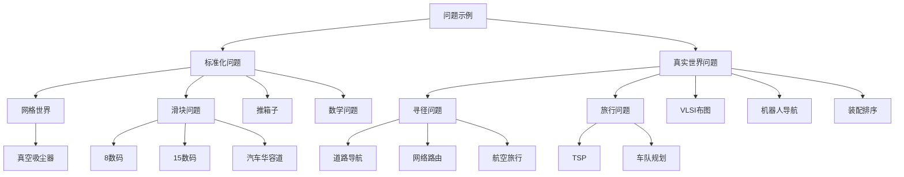
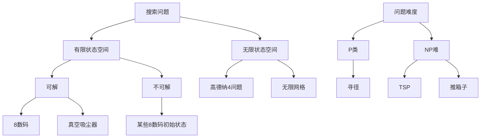
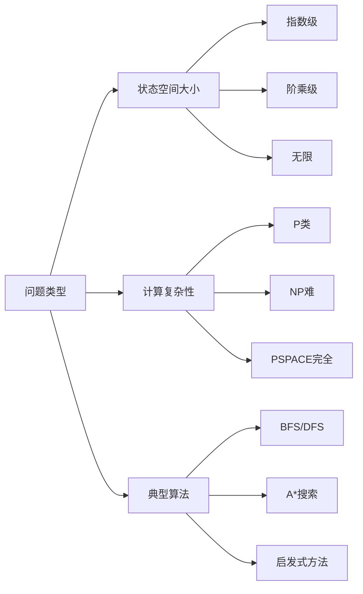

# 3.2 问题示例 - Deep Dive 分析

## 1. 背景与动机

### 1.1 历史背景

问题求解方法的发展与一系列经典问题的研究密不可分。20世纪60-70年代，AI研究者们通过研究标准化问题来开发和测试搜索算法。这些标准化问题具有简洁、准确的描述，便于研究人员比较不同算法的性能。

**8数码问题**的历史可以追溯到19世纪，当时作为一种益智游戏流行。1879年，数学家证明了并非所有初始状态都有解——状态空间可以根据奇偶性划分为两个互不连通的子集。这一数学性质对搜索算法的设计有重要影响。

**旅行商问题（TSP）**的研究历史更为悠久，可以追溯到19世纪初的欧拉和哈密顿。20世纪50年代，Dantzig等人开始用线性规划方法研究TSP，使其成为组合优化领域的经典问题。

**滑块问题**（Sliding-tile puzzles）和**推箱子问题**（Sokoban）作为计算复杂性理论的研究对象，帮助研究者理解问题的内在难度。

### 1.2 研究动机

**标准化问题的价值**：
- 提供算法比较的基准
- 揭示问题的计算复杂性特征
- 帮助理解搜索算法的性能边界

**真实世界问题的复杂性**：
- 展示理论方法在实际应用中的挑战
- 理解问题形式化的艺术
- 认识领域知识的重要性

### 1.3 应用场景

| 问题类型 | 应用领域 | 实际价值 |
|---------|---------|---------|
| 网格世界 | 机器人路径规划、游戏AI | 基础算法测试平台 |
| 8数码/15数码 | 算法教学、启发式函数研究 | 理解状态空间爆炸 |
| 推箱子 | 计算复杂性研究 | 理解NP难问题 |
| 寻径问题 | GPS导航、网络路由 | 日常生活应用 |
| TSP | 物流优化、电路板钻孔 | 节约成本 |
| VLSI布图 | 芯片设计 | 提高制造效率 |
| 机器人导航 | 自动驾驶、服务机器人 | 前沿技术应用 |
| 装配排序 | 制造业、蛋白质设计 | 科学和工业价值 |

### 1.4 先决条件

- 理解搜索问题的形式化定义（3.1节）
- 熟悉状态空间的概念
- 了解计算复杂性的基本概念（P、NP等）
- 具备基本的组合数学知识

## 2. 知识逻辑图谱

### 2.1 概念关系图



### 2.2 问题分类图谱



## 3. 核心概念与数学分析

### 3.1 术语定义

| 术语（中文） | 术语（英文） | 定义 |
|------------|------------|------|
| 标准化问题 | Standardized Problem | 具有简洁、准确描述的问题，用于算法比较和教学 |
| 真实世界问题 | Real-world Problem | 实际应用中需要解决的问题，形式化通常是独特的 |
| 网格世界 | Grid World | 由正方形单元格组成的二维矩形阵列 |
| 滑块问题 | Sliding-tile Puzzle | 滑块在网格中滑动到空白区域的问题 |
| 推箱子 | Sokoban | 智能体将箱子推到指定存储位置的谜题 |
| 寻径问题 | Route-finding Problem | 根据位置和目标寻找路径的问题 |
| 旅行商问题 | Traveling Salesperson Problem (TSP) | 访问所有城市并返回起点的最短路径问题 |
| 状态空间爆炸 | State Space Explosion | 状态数量随问题规模指数增长的现象 |

### 3.2 符号参考表

| 符号 | 含义 | 数学类型 |
|-----|------|---------|
| $n$ | 单元格/城市/零件数量 | 正整数 |
| $b$ | 箱子数量 | 正整数 |
| $S$ | 状态空间大小 | 正整数 |
| $h$ | 启发式函数值 | 实数 |
| $d$ | 解的深度 | 正整数 |

### 3.3 关键公式

#### 公式1：真空吸尘器世界状态数

$$S_{vacuum} = n \times 2^n$$

**解释**：对于$n$个单元格的真空吸尘器世界：
- 智能体可以位于$n$个单元格中的任意一个
- 每个单元格可以是干净或有灰尘（2种状态）
- 总状态数为位置选择乘以所有可能的灰尘配置

**数值示例**：
- $n = 2$：$2 \times 2^2 = 8$个状态
- $n = 3$：$3 \times 2^3 = 24$个状态
- $n = 10$：$10 \times 2^{10} = 10,240$个状态

**几何意义**：状态空间呈指数增长，这是组合爆炸的典型例子。

#### 公式2：推箱子问题状态数

$$S_{sokoban} = n \times \frac{n!}{b!(n-b)!}$$

**解释**：对于$n$个无障碍单元格和$b$个箱子：
- 智能体可以位于$n$个单元格中的任意一个
- 从$n$个单元格中选择$b$个放置箱子
- 使用组合数计算箱子配置

**数值示例**：对于$8 \times 8$网格（$n = 64$）和$b = 12$个箱子：
$$S = 64 \times \frac{64!}{12! \times 52!} = 64 \times \binom{64}{12} > 200 \text{万亿}$$

**领域背景**：推箱子是PSPACE完全问题，计算复杂性很高。

#### 公式3：8数码问题状态数

$$S_{8-puzzle} = \frac{9!}{2} = 181,440$$

**解释**：
- 9个位置排列8个滑块和1个空格：$9! = 362,880$
- 根据奇偶性，只有一半状态可达
- 因此可达状态数为$9!/2$

**推广到15数码**：
$$S_{15-puzzle} = \frac{16!}{2} = 10,461,394,944,000 \approx 10.5 \text{万亿}$$

**几何意义**：状态空间可以看作排列群的一个子群，不可达状态与可达状态之间存在群论上的划分。

#### 公式4：TSP路径数

$$\text{Paths}_{TSP} = (n-1)!$$

**解释**：对于$n$个城市的对称TSP：
- 固定起点城市
- 剩余$(n-1)$个城市可以任意排列
- 由于路径可以反向，实际不同的路径数为$(n-1)!/2$

**数值示例**：
- $n = 10$：$9! = 362,880$条路径
- $n = 20$：$19! \approx 1.2 \times 10^{17}$条路径
- $n = 50$：$49! \approx 6 \times 10^{62}$条路径

**领域背景**：TSP是NP难问题，精确算法只能处理中等规模实例。

### 3.4 问题特性对比



## 4. 定理与证明

### 4.1 8数码问题可达性定理

**定理陈述**：8数码问题的状态空间可以根据奇偶性划分为两个大小相等的子集，同一子集内的状态相互可达，不同子集的状态不可达。

**证明概要**：

**定义逆序数**：对于一个状态，将滑块按行优先顺序排列（忽略空格），计算逆序对数量。

**奇偶性不变性**：
1. 水平移动不改变逆序数奇偶性
2. 垂直移动改变逆序数奇偶性（改变量为±1或±3）

**目标状态分析**：标准目标状态的逆序数为0（偶数）。

**结论**：只有逆序数为偶数的状态才能到达目标状态，因此可达状态数为$9!/2$。

**证明本质**：逆序数奇偶性是状态转移的不变量，划分了状态空间的连通分量。

## 5. 具体示例

### 5.1 8数码问题实例分析

**初始状态**（图3-3）：
```
+---+---+---+
| 1 | 2 | 3 |
+---+---+---+
| 4 | 5 | 6 |
+---+---+---+
| 7 | 8 |   |
+---+---+---+
```

**问题形式化**：

| 要素 | 定义 |
|-----|------|
| 状态 | 8个滑块在3×3网格中的位置配置 |
| 初始状态 | 任意配置（需检查可达性） |
| 目标状态 | 滑块按顺序排列 |
| 动作 | 空格执行Left、Right、Up、Down |
| 转移模型 | 空格与相邻滑块交换位置 |
| 动作代价 | 每个动作代价为1 |

**可达性检验示例**：

状态A（可解）：
```
| 1 | 2 | 3 |
| 4 | 5 | 6 |
| 7 | 8 |   |
```
逆序数：0（偶数）→ 可解

状态B（不可解）：
```
| 1 | 2 | 3 |
| 4 | 5 | 6 |
| 8 | 7 |   |
```
逆序数：1（7和8形成逆序对）→ 不可解

### 5.2 罗马尼亚寻径问题（航空旅行版本）

**问题复杂度对比**：

| 版本 | 状态定义 | 复杂度增加因素 |
|-----|---------|--------------|
| 基础版 | 当前城市 | 仅位置 |
| 现实版 | 位置+时间+历史 | 航班时间、票价规则、中转要求 |

**现实约束**：
- 航班时间限制
- 中转时间要求
- 票价依赖历史（往返vs单程）
- 舱位等级
- 常旅客积分

### 5.3 高德纳"4"问题

**问题定义**：从数字4出发，通过平方根、向下取整、阶乘操作得到任意正整数。

**示例**：从4得到5
$$\left\lfloor \sqrt{\sqrt{\sqrt{\sqrt{(4!)!}}}} \right\rfloor = 5$$

**计算过程**：
1. $4! = 24$
2. $(4!)! = 24! \approx 6.2 \times 10^{23}$
3. $\sqrt{24!} \approx 7.9 \times 10^{11}$
4. $\sqrt{\sqrt{24!}} \approx 8.9 \times 10^{5}$
5. $\sqrt{\sqrt{\sqrt{24!}}} \approx 9.4 \times 10^{2}$
6. $\sqrt{\sqrt{\sqrt{\sqrt{24!}}}} \approx 30.7$
7. $\lfloor 30.7 \rfloor = 30$（等等，这与5不符）

**注意**：实际计算可能需要不同的操作序列。

**状态空间特性**：
- 无限状态空间（阶乘产生巨大数字）
- 探索非常大的数字
- 需要系统性的搜索策略

## 6. 一句话本质

**问题示例的核心本质**：标准化问题和真实世界问题共同展示了搜索问题的多样性、计算复杂性的差异以及问题形式化在连接理论与实际应用中的关键作用。

## 7. 总结与反思

### 7.1 关键要点

1. **标准化问题的价值**：提供算法比较的基准，揭示问题的计算复杂性特征。

2. **状态空间爆炸**：许多问题的状态数随问题规模指数或阶乘增长，使得穷举搜索不可行。

3. **问题形式化的艺术**：同一个现实世界问题可以有多种形式化方式，选择取决于具体需求。

4. **计算复杂性的差异**：从P类问题（寻径）到NP难问题（TSP）再到PSPACE完全问题（推箱子），不同问题需要不同的算法策略。

5. **领域知识的重要性**：真实世界问题需要结合领域知识进行有效的启发式设计和约束处理。

### 7.2 常见误解对照表

| 误解 | 正确理解 |
|-----|---------|
| 所有8数码初始状态都有解 | 只有一半状态可达，需要检查逆序数奇偶性 |
| 状态空间大意味着问题难 | 难度取决于结构，有些大问题可以用启发式高效求解 |
| 标准化问题没有实用价值 | 标准化问题是理解算法行为和测试新方法的重要工具 |
| TSP只能用于旅行规划 | TSP模型可应用于电路板钻孔、DNA测序等多种问题 |
| 无限状态空间问题不可解 | 使用系统性搜索策略，可以在无限空间中找到解 |

### 7.3 反思问题

1. 为什么8数码问题只有一半状态可达？如何通过奇偶性快速判断一个初始状态是否有解？

2. 比较真空吸尘器世界（$n \times 2^n$）和推箱子问题（$n \times \binom{n}{b}$）的状态空间增长模式，哪种问题更适合用搜索算法求解？

3. 在航空旅行问题中，状态定义为什么需要包含"历史"信息？如果不包含会怎样？

4. 为什么TSP是NP难问题？对于大规模TSP实例，应该采用什么策略？

### 7.4 公式速查表

| 公式 | 适用问题 | 用途 |
|-----|---------|------|
| $S = n \times 2^n$ | 真空吸尘器世界 | 计算状态空间大小 |
| $S = n \times \binom{n}{b}$ | 推箱子问题 | 计算状态空间大小 |
| $S = \frac{9!}{2} = 181,440$ | 8数码问题 | 可达状态数 |
| $S = \frac{16!}{2} \approx 10.5$万亿 | 15数码问题 | 可达状态数 |
| $\text{Paths} = (n-1)!$ | TSP | 可能路径数 |

### 7.5 问题特性汇总表

| 问题 | 状态空间 | 计算复杂性 | 典型应用 |
|-----|---------|-----------|---------|
| 真空吸尘器 | $n \times 2^n$ | P类 | 教学、算法测试 |
| 8数码 | 181,440 | P类 | 启发式函数研究 |
| 15数码 | ~10.5万亿 | P类 | 搜索算法测试 |
| 推箱子 | 超大规模 | PSPACE完全 | 复杂性研究 |
| TSP | $(n-1)!$ | NP难 | 物流优化 |
| VLSI布图 | 巨大 | NP难 | 芯片设计 |

---

*本节Deep Dive分析完成。建议结合教材中的图3-2、图3-3进行可视化学习，并尝试用代码实现部分问题的状态空间生成。*
