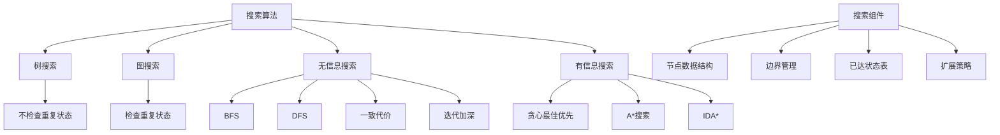
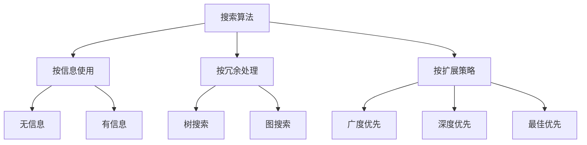

# 3.3 搜索算法 - Deep Dive 分析

## 1. 背景与动机

### 1.1 历史背景

搜索算法是人工智能最古老、最核心的研究领域之一。20世纪50年代末至60年代初，研究者们开始系统地研究如何在问题空间中进行搜索。

**早期发展**：
- 1956年：Newell和Simon的Logic Theorist使用启发式搜索证明数学定理
- 1957年：General Problem Solver (GPS) 提出手段-目的分析
- 1959年：Arthur Samuel的跳棋程序使用 minimax 搜索
- 1960年代：Dijkstra算法、A*算法相继提出

**算法演进**：
- 无信息搜索：广度优先、深度优先、迭代加深
- 有信息搜索：最佳优先、A*、IDA*
- 现代扩展：蒙特卡洛树搜索、神经启发式搜索

### 1.2 研究动机

**理论基础**：
- 理解计算问题的内在复杂性
- 开发通用的 problem-solving 方法
- 建立算法性能的数学分析框架

**实践需求**：
- 解决实际的大规模搜索问题
- 在时间和空间限制内找到满意解
- 处理无限状态空间和不确定性

### 1.3 应用场景

| 应用领域 | 搜索算法应用 | 关键挑战 |
|---------|-------------|---------|
| 游戏AI | 博弈树搜索 | 巨大分支因子 |
| 路径规划 | 图搜索算法 | 实时性要求 |
| 自动推理 | 定理证明搜索 | 无限搜索空间 |
| 机器学习 | 超参数优化 | 非凸搜索空间 |
| 自然语言处理 | 句法分析 | 歧义处理 |
| 机器人学 | 运动规划 | 高维配置空间 |

### 1.4 先决条件

- 掌握搜索问题的形式化定义（3.1节）
- 熟悉基本的数据结构（队列、栈、优先队列、哈希表）
- 了解算法复杂性分析（大O表示法）
- 理解图论基本概念

## 2. 知识逻辑图谱

### 2.1 概念关系图



### 2.2 算法分类图谱



## 3. 核心概念与数学分析

### 3.1 术语定义

| 术语（中文） | 术语（英文） | 定义 |
|------------|------------|------|
| 搜索树 | Search Tree | 从初始状态生成的树状结构，表示已探索的路径 |
| 节点 | Node | 搜索树中的元素，包含状态、父节点、动作、路径代价 |
| 扩展 | Expand | 生成节点的所有后继节点 |
| 边界 | Frontier | 已生成但尚未扩展的节点集合 |
| 已达状态 | Reached States | 已生成过节点的状态集合 |
| 树搜索 | Tree Search | 不检查重复状态的搜索 |
| 图搜索 | Graph Search | 检查并避免重复状态的搜索 |
| 分支因子 | Branching Factor | 每个节点的平均后继数 |
| 解深度 | Solution Depth | 从初始状态到目标的动作数 |

### 3.2 符号参考表

| 符号 | 含义 | 数学类型 |
|-----|------|---------|
| $b$ | 分支因子 | 正整数 |
| $d$ | 最浅解深度 | 正整数 |
| $m$ | 最大深度 | 正整数 |
| $C^*$ | 最优解代价 | 正实数 |
| $\epsilon$ | 最小动作代价 | 正实数 |
| $f(n)$ | 评价函数 | 实值函数 |
| $g(n)$ | 路径代价 | 实值函数 |
| $h(n)$ | 启发式函数 | 实值函数 |

### 3.3 关键公式

#### 公式1：最佳优先搜索框架

$$f(n) = \text{评价函数}$$

**算法流程**：
1. 初始化边界为包含初始节点的优先队列
2. 初始化已达状态表
3. While 边界非空：
   - 弹出$f(n)$最小的节点$n$
   - 如果$n$是目标，返回解
   - 扩展$n$，生成子节点
   - 对每个子节点：如果未到达或找到更优路径，加入边界

**解释**：最佳优先搜索是一个通用框架，通过选择不同的评价函数$f(n)$，可以得到不同的具体算法。

**几何意义**：在状态空间中，评价函数定义了一个"势场"，搜索沿着势场下降的方向进行。

#### 公式2：广度优先搜索复杂度

$$\text{时间} = O(b^d), \quad \text{空间} = O(b^d)$$

**解释**：对于分支因子为$b$、解深度为$d$的问题：
- 生成节点数：$1 + b + b^2 + \cdots + b^d = \frac{b^{d+1}-1}{b-1} = O(b^d)$
- 需要存储所有已生成节点

**数值示例**：$b = 10, d = 10$
- 节点数：约$10^{10}$（100亿）
- 假设每节点1KB内存：需要10TB

**领域背景**：空间复杂性是BFS的主要瓶颈，时间复杂性限制了可处理问题规模。

#### 公式3：一致代价搜索复杂度

$$\text{时间} = O(b^{1+\lfloor C^*/\epsilon \rfloor})$$

**解释**：
- $C^*$：最优解代价
- $\epsilon$：最小动作代价
- 算法可能探索大量低代价路径后才找到解

**与BFS比较**：当所有动作代价相等时，$C^* = d \cdot c$，复杂度退化为$O(b^d)$。

#### 公式4：深度优先搜索空间复杂度

$$\text{空间} = O(bm)$$

**解释**：
- 只需存储当前路径和边界
- $m$是最大深度
- 远小于BFS的空间需求

**代价**：不完备（可能陷入无限路径），不最优（返回第一个找到的解）。

#### 公式5：迭代加深搜索节点数

$$N(IDS) = db + (d-1)b^2 + (d-2)b^3 + \cdots + b^d$$

**渐近复杂度**：$O(b^d)$（与BFS相同）

**空间复杂度**：$O(bd)$（与DFS相同）

**权衡**：以时间换空间，重复生成上层节点，但空间效率显著优于BFS。

**数值示例**（$b=10, d=5$）：
- IDS：$50 + 400 + 3000 + 20000 + 100000 = 123,450$
- BFS：$10 + 100 + 1000 + 10000 + 100000 = 111,110$
- 比率：约1.11（接近1）

### 3.4 搜索数据结构

**节点结构**：
```
Node {
    State: 状态
    Parent: 父节点指针
    Action: 生成该节点的动作
    Path-Cost: 从初始状态到该节点的代价
}
```

**队列类型比较**：

| 队列类型 | 弹出顺序 | 使用算法 |
|---------|---------|---------|
| FIFO队列 | 先进先出 | 广度优先搜索 |
| LIFO队列（栈） | 后进先出 | 深度优先搜索 |
| 优先队列 | 按$f(n)$排序 | 最佳优先搜索、A* |

## 4. 算法性能评估

### 4.1 评估标准

| 标准 | 定义 | 重要性 |
|-----|------|-------|
| 完备性 | 存在解时保证找到，无解时报告失败 | 理论基础 |
| 代价最优性 | 找到最小代价解 | 实际应用 |
| 时间复杂性 | 找到解所需时间 | 效率指标 |
| 空间复杂性 | 执行搜索所需内存 | 可行性指标 |

### 4.2 冗余路径处理

**问题**：在状态空间中，可能存在多条路径到达同一状态（如循环、不同路径）。

**解决方案比较**：

| 方法 | 内存开销 | 检测能力 | 适用场景 |
|-----|---------|---------|---------|
| 记录所有已达状态 | $O(|S|)$ | 完全检测 | 状态空间小、冗余多 |
| 不记录（树搜索） | $O(深度)$ | 不检测 | 状态空间大、冗余少 |
| 仅检测循环 | $O(深度)$ | 仅循环 | 折中方案 |

### 4.3 无限状态空间搜索

**挑战**：
- 无法穷举所有状态
- 需要系统性搜索策略
- 可能不存在解（无法终止）

**系统性策略示例**（无限网格）：
- 螺旋搜索：按距离原点$s$步远的所有单元格，然后$s+1$
- 保证任何可达状态最终都会被访问

## 5. 具体示例

### 5.1 搜索树构建示例

**问题**：罗马尼亚寻径，从Arad到Bucharest

**搜索过程**（图3-4、3-5）：

| 步骤 | 扩展节点 | 边界（绿色节点） | 已达状态 |
|-----|---------|----------------|---------|
| 1 | Arad | Sibiu, Timisoara, Zerind | Arad |
| 2 | Sibiu | Timisoara, Zerind, Fagaras, Oradea, Arad(循环) | Arad, Sibiu |
| 3 | Timisoara | Zerind, Fagaras, Oradea, Lugoj | +Timisoara |

**观察**：
- 搜索树与状态空间图不同
- 同一状态可能在搜索树中多次出现（如Arad）
- 边界分离了已探索和未探索区域

### 5.2 复杂度计算示例

**场景**：二叉树搜索，$b=2$

**BFS**（解在深度$d=10$）：
- 生成节点：$2^{11} - 1 = 2047$
- 存储节点：$2^{10} = 1024$（最后一层）

**DFS**（最大深度$m=15$）：
- 生成节点：取决于路径选择
- 存储节点：$2 \times 15 = 30$（当前路径+边界）

**IDS**（解在深度$d=10$）：
- 第0次迭代：1个节点
- 第1次迭代：$1 + 2 = 3$个节点
- ...
- 第10次迭代：约2000个节点
- 总计：约2200个节点

### 5.3 边界管理示例

**最佳优先搜索**（图3-7伪代码）：

```
边界（优先队列）:
- 按f(n)排序
- 支持操作：Pop, Add, Is-Empty

已达状态表（哈希表）:
- 键：状态
- 值：到达该状态的最优节点
- 支持快速查找和更新
```

## 6. 一句话本质

**搜索算法的核心本质**：在状态空间中系统性地探索路径，通过边界管理和节点扩展策略，在完备性、最优性、时间和空间效率之间取得平衡。

## 7. 总结与反思

### 7.1 关键要点

1. **搜索树与状态空间的区别**：搜索树是探索过程的表示，可能包含重复状态；状态空间是问题的固有结构。

2. **边界的核心作用**：边界分离了已探索和未探索区域，其管理策略决定了搜索算法的特性。

3. **树搜索vs图搜索**：树搜索节省内存但可能重复工作；图搜索避免重复但需要更多内存。

4. **算法选择权衡**：没有 universally best 算法，选择取决于问题特性和资源限制。

5. **系统性搜索**：在无限状态空间中，必须使用系统性策略以保证完备性。

### 7.2 常见误解对照表

| 误解 | 正确理解 |
|-----|---------|
| 搜索树就是状态空间 | 搜索树是探索过程的表示，状态空间是问题固有的 |
| 图搜索总是比树搜索好 | 图搜索需要更多内存，在状态空间大时可能不可行 |
| BFS总是最优的 | BFS只在动作代价相等时代价最优 |
| DFS空间效率总是最好 | 回溯搜索的空间效率比标准DFS更好 |
| 无限状态空间问题不可解 | 使用系统性搜索策略可以找到解（如果存在） |

### 7.3 反思问题

1. 为什么搜索树中可能出现同一状态的多个节点？这对算法设计有什么影响？

2. 比较BFS和IDS的时间和空间复杂性。在什么情况下IDS是更好的选择？

3. 在最佳优先搜索中，为什么需要在生成节点和扩展节点时都检查目标？

4. 如何设计一个搜索算法，使其在有限内存下尽可能找到最优解？

### 7.4 公式速查表

| 公式 | 适用算法 | 含义 |
|-----|---------|------|
| $O(b^d)$ | BFS | 时间和空间复杂性 |
| $O(b^{1+\lfloor C^*/\epsilon \rfloor})$ | 一致代价 | 时间复杂性 |
| $O(bm)$ | DFS | 空间复杂性 |
| $O(b^d)$ / $O(bd)$ | IDS | 时间/空间复杂性 |
| $N(IDS) = \sum_{i=1}^{d} (d+1-i)b^i$ | IDS | 总生成节点数 |

### 7.5 算法选择指南

| 场景 | 推荐算法 | 理由 |
|-----|---------|------|
| 动作代价相等，内存充足 | BFS | 完备且最优，实现简单 |
| 动作代价不等，内存充足 | 一致代价 | 代价最优 |
| 内存受限，解在浅层 | DFS | 空间效率高 |
| 内存受限，解深度未知 | IDS | 空间效率高且完备 |
| 有良好启发式 | A* | 效率最优（见3.5节） |

---

*本节Deep Dive分析完成。建议结合教材中的图3-4、3-5、3-6理解搜索树的构建过程，并实现基本的搜索算法以加深理解。*
