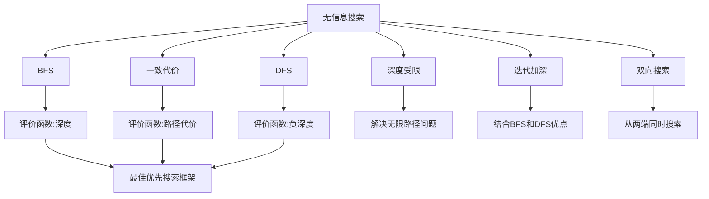
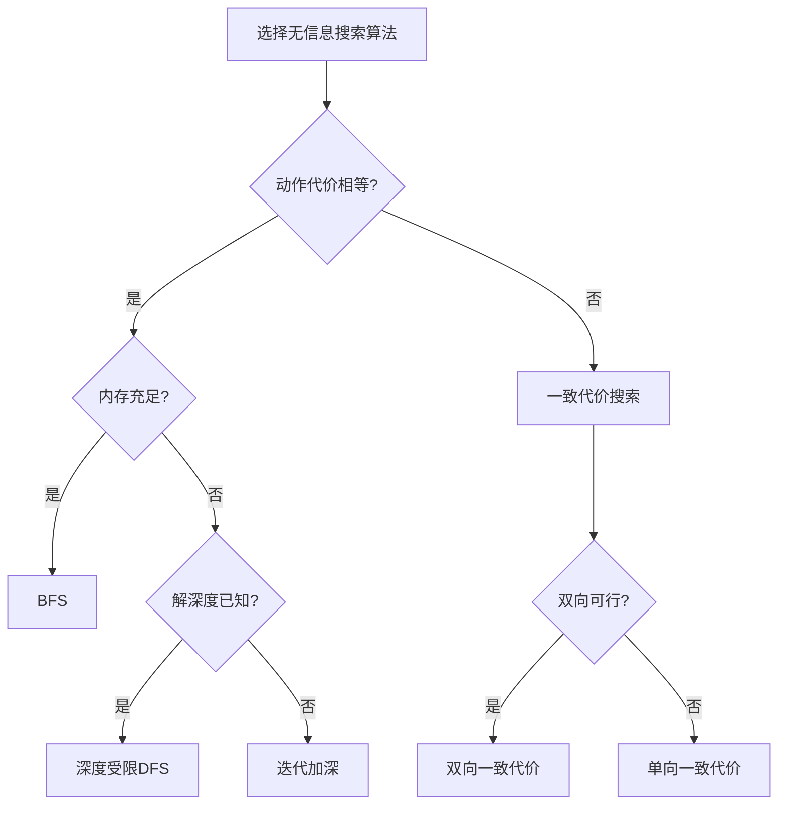

# 3.4 无信息搜索策略 - Deep Dive 分析

## 1. 背景与动机

### 1.1 历史背景

无信息搜索（Uninformed Search），也称为盲目搜索（Blind Search），是搜索算法研究的基础。这些算法不利用任何关于目标位置的领域知识，仅依赖于问题的形式化定义。

**历史发展**：
- 1950s：深度优先和广度优先搜索在图论和运筹学中发展
- 1959年：Dijkstra发表最短路径算法
- 1960s：迭代加深搜索被提出，结合了DFS和BFS的优点
- 1970s：双向搜索的研究

**理论贡献**：
- 建立了搜索算法的复杂性分析框架
- 揭示了状态空间搜索的基本限制
- 为有信息搜索算法提供了基准比较

### 1.2 研究动机

**理论价值**：
- 理解搜索问题的固有复杂性
- 建立算法性能的基准线
- 为分析有信息搜索提供参照

**实践意义**：
- 当缺乏领域知识时的默认选择
- 某些问题中启发式难以设计
- 作为更复杂算法的子组件

### 1.3 应用场景

| 应用领域 | 使用无信息搜索的场景 | 原因 |
|---------|-------------------|------|
| 算法教学 | 基础概念演示 | 简单、易于理解 |
| 复杂性分析 | 最坏情况分析 | 提供上界 |
| 理论验证 | 启发式函数评估 | 与无信息情况比较 |
| 约束满足 | 回溯搜索 | 结构决定搜索顺序 |
| 游戏AI | 某些博弈的终局搜索 | 状态空间小 |

### 1.4 先决条件

- 掌握搜索算法的基本概念（3.3节）
- 理解队列、栈、优先队列等数据结构
- 熟悉算法复杂性分析
- 了解图论基本概念

## 2. 知识逻辑图谱

### 2.1 算法关系图



### 2.2 算法选择决策树



## 3. 核心概念与数学分析

### 3.1 术语定义

| 术语（中文） | 术语（英文） | 定义 |
|------------|------------|------|
| 无信息搜索 | Uninformed Search | 不使用关于目标位置的领域知识的搜索 |
| 广度优先搜索 | Breadth-First Search (BFS) | 按深度逐层扩展节点的搜索 |
| 一致代价搜索 | Uniform-Cost Search | 按路径代价递增顺序扩展的搜索 |
| 深度优先搜索 | Depth-First Search (DFS) | 优先扩展最深节点的搜索 |
| 深度受限搜索 | Depth-Limited Search | 限制最大深度的DFS |
| 迭代加深搜索 | Iterative Deepening Search | 逐渐增加深度界限的深度受限搜索 |
| 双向搜索 | Bidirectional Search | 从初始状态和目标状态同时搜索 |
| 早期目标测试 | Early Goal Test | 生成节点时立即检查是否为目标 |
| 后期目标测试 | Late Goal Test | 扩展节点时才检查是否为目标 |

### 3.2 符号参考表

| 符号 | 含义 | 典型值/范围 |
|-----|------|-----------|
| $b$ | 分支因子 | 2-100+ |
| $d$ | 最浅解深度 | 1-∞ |
| $m$ | 最大深度 | $d$到∞ |
| $C^*$ | 最优解代价 | 取决于问题 |
| $\epsilon$ | 最小动作代价 | > 0 |
| $\ell$ | 深度界限 | 用户指定 |

### 3.3 关键公式

#### 公式1：BFS时间和空间复杂性

$$\text{Time} = \text{Space} = O(b^d)$$

**详细推导**：
- 第0层：1个节点
- 第1层：$b$个节点
- 第2层：$b^2$个节点
- ...
- 第$d$层：$b^d$个节点

总节点数：$\sum_{i=0}^{d} b^i = \frac{b^{d+1}-1}{b-1} = O(b^d)$

**数值示例**（$b=10$）：
| 深度$d$ | 节点数 | 内存需求(1KB/节点) | 时间(1M节点/秒) |
|-------|-------|------------------|----------------|
| 5 | $10^5$ | 100 MB | 0.1秒 |
| 10 | $10^{10}$ | 10 TB | 2.8小时 |
| 14 | $10^{14}$ | 100 PB | 3.5年 |

**关键洞察**：指数爆炸使得BFS只能处理小规模问题。

#### 公式2：一致代价搜索复杂性

$$\text{Time} = \text{Space} = O(b^{1+\lfloor C^*/\epsilon \rfloor})$$

**解释**：
- 算法按代价递增顺序探索
- 在找到代价为$C^*$的解之前，可能探索大量代价<$C^*$的节点
- 最坏情况：所有路径代价接近$\epsilon$，深度约为$C^*/\epsilon$

**与BFS关系**：当所有动作代价相等（$c = \epsilon$）时：
$$C^* = d \cdot c \Rightarrow \lfloor C^*/\epsilon \rfloor = d$$
复杂度退化为$O(b^{d+1}) = O(b^d)$

#### 公式3：DFS空间复杂性

$$\text{Space} = O(bm)$$

**解释**：
- 只需存储当前路径（深度$m$）
- 每个节点需要存储$b$个兄弟节点信息
- 总计$O(bm)$

**对比BFS**：当$m \ll b^{d-1}$时，空间节省巨大。

**数值示例**（$b=10, m=20$）：
- DFS：$10 \times 20 = 200$个节点
- BFS（$d=10$）：$10^{10}$个节点
- 比率：$5 \times 10^{-9}$

#### 公式4：迭代加深搜索总节点数

$$N(IDS) = \sum_{i=1}^{d} (d+1-i)b^i = db + (d-1)b^2 + \cdots + b^d$$

**渐近分析**：
$$N(IDS) = O(b^d)$$

**与BFS比较**：
$$\frac{N(IDS)}{N(BFS)} = \frac{db + (d-1)b^2 + \cdots + b^d}{b^d} \approx \frac{b}{b-1}$$

当$b$较大时，比率接近1，说明重复开销很小。

**数值示例**（$b=10, d=5$）：
- IDS：$50 + 400 + 3000 + 20000 + 100000 = 123,450$
- BFS：$10 + 100 + 1000 + 10000 + 100000 = 111,110$
- 比率：1.11

#### 公式5：双向搜索复杂性

$$\text{Time} = \text{Space} = O(b^{d/2})$$

**解释**：
- 从两端同时搜索，在中间相遇
- 每端只需搜索到深度$d/2$
- 相比单向搜索的$O(b^d)$，指数减半

**数值示例**（$b=10, d=10$）：
- 单向：$10^{10}$个节点
- 双向：$2 \times 10^5$个节点
- 加速比：约50,000倍

### 3.4 算法特性对比

| 算法 | 完备性 | 代价最优 | 时间 | 空间 | 适用场景 |
|-----|-------|---------|------|------|---------|
| BFS | 是 | 是* | $O(b^d)$ | $O(b^d)$ | 动作代价相等，内存充足 |
| 一致代价 | 是 | 是 | $O(b^{1+C^*/\epsilon})$ | $O(b^{1+C^*/\epsilon})$ | 动作代价不等 |
| DFS | 否 | 否 | $O(b^m)$ | $O(bm)$ | 内存受限，解在深层 |
| 深度受限 | 否 | 否 | $O(b^\ell)$ | $O(b\ell)$ | 已知深度界限 |
| 迭代加深 | 是 | 是* | $O(b^d)$ | $O(bd)$ | 内存受限，深度未知 |
| 双向 | 是 | 是* | $O(b^{d/2})$ | $O(b^{d/2})$ | 目标状态已知，双向可行 |

*注：仅在动作代价相等时代价最优。

## 4. 算法详细分析

### 4.1 广度优先搜索

**核心思想**：按深度逐层扩展，保证找到最短路径（动作数最少）。

**关键优化**：
- 使用FIFO队列而非优先队列
- 早期目标测试（生成时检查）
- 可达状态只需记录状态（不需要存储最优路径）

**伪代码**（图3-9）：
```
function BFS(problem):
    node ← NODE(problem.INITIAL)
    if problem.Is-GOAL(node.STATE) then return node
    frontier ← FIFO队列，包含node
    reached ← {problem.INITIAL}
    
    while not Is-EMPTY(frontier):
        node ← POP(frontier)
        for each child in EXPAND(problem, node):
            s ← child.STATE
            if problem.Is-GOAL(s) then return child
            if s not in reached:
                将s加入reached
                将child加入frontier
    return failure
```

### 4.2 Dijkstra算法/一致代价搜索

**核心思想**：按路径代价递增顺序扩展，保证找到最小代价路径。

**关键特性**：
- 后期目标测试（扩展时检查）
- 需要存储状态到最优节点的映射
- 是Dijkstra算法的特例

**为什么需要后期目标测试**：
考虑从Sibiu到Bucharest：
- 路径1：Sibiu → Fagaras → Bucharest，代价$99 + 211 = 310$
- 路径2：Sibiu → Rimnicu Vilcea → Pitesti → Bucharest，代价$80 + 97 + 101 = 278$

如果早期测试，可能返回代价310的路径；后期测试确保找到最优解278。

### 4.3 深度优先搜索与回溯

**标准DFS**：
- 存储所有边界节点
- 空间复杂度$O(bm)$

**回溯搜索优化**：
- 一次只生成一个后继
- 通过修改当前状态而非创建新状态
- 空间复杂度$O(m)$（仅存储当前路径）

**循环检测**：
- 跟踪父指针链
- 检查新状态是否已在路径中
- 时间$O(m)$，空间$O(1)$（使用哈希表可优化到$O(1)$）

### 4.4 迭代加深搜索

**算法流程**：
```
for depth = 0 to ∞:
    result = Depth-Limited-Search(problem, depth)
    if result ≠ cutoff then return result
```

**为什么不是浪费**：
- 大多数节点在底层
- 上层重复开销相对较小
- 空间效率显著提高

**适用场景**：
- 内存受限
- 解深度未知
- 需要完备性和最优性

### 4.5 双向搜索

**算法思想**：
- 维护两个边界和两个已达表
- 每次扩展代价较小的一端
- 当两端相遇时找到解

**挑战**：
- 需要能够反向推理（从结果推导前驱）
- 需要知道目标状态
- 两个搜索前沿可能大小不平衡

**优化**：
- 双向最佳优先搜索
- 双向一致代价搜索

## 5. 具体示例

### 5.1 BFS vs DFS对比

**问题**：二叉树搜索，目标在深度$d=5$

**BFS执行**：
- 扩展顺序：根 → 第1层 → 第2层 → ... → 第5层
- 生成节点：$2^6 - 1 = 63$
- 存储节点：$2^5 = 32$（最后一层）

**DFS执行**（假设幸运地选择正确分支）：
- 扩展顺序：根 → 左子 → 左左子 → ... → 目标
- 生成节点：6（路径上的节点）
- 存储节点：约10（路径+边界）

**DFS执行**（最坏情况，目标在最后访问的分支）：
- 生成节点：63（访问所有节点）
- 存储节点：约10

### 5.2 一致代价搜索示例

**问题**：罗马尼亚寻径，Sibiu到Bucharest

**执行过程**（图3-10）：

| 步骤 | 边界节点（代价） | 扩展节点 |
|-----|----------------|---------|
| 1 | Rimnicu Vilcea(80), Fagaras(99) | Sibiu |
| 2 | Fagaras(99), Pitesti(177) | Rimnicu Vilcea |
| 3 | Pitesti(177), Bucharest(310) | Fagaras |
| 4 | Bucharest(278), Bucharest(310) | Pitesti |
| 5 | - | Bucharest(278) ← 目标！

注意：路径2（经Pitesti）虽然先生成，但代价更低。

### 5.3 迭代加深搜索过程

**问题**：二叉树，目标在深度3

**第0次迭代**（深度界限0）：
- 扩展：根
- 到达界限，返回cutoff

**第1次迭代**（深度界限1）：
- 扩展：根，子1，子2
- 无目标，返回failure

**第2次迭代**（深度界限2）：
- 扩展：根，子1，子1的子，子2，子2的子
- 无目标，返回failure

**第3次迭代**（深度界限3）：
- 扩展：根，子1，...，目标
- 找到解！

**总生成节点**：$1 + 3 + 7 + 15 = 26$（相比BFS的15，开销约1.73倍）

## 6. 一句话本质

**无信息搜索策略的核心本质**：在没有领域知识指导的情况下，通过系统的节点扩展策略和边界管理，在完备性、最优性、时间和空间复杂性之间进行权衡。

## 7. 总结与反思

### 7.1 关键要点

1. **BFS的完备性和最优性**：在动作代价相等时，BFS保证找到最短路径，但空间复杂性是主要瓶颈。

2. **一致代价搜索的推广**：通过后期目标测试，一致代价搜索处理不等代价情况，但复杂度可能显著增加。

3. **DFS的空间优势**：DFS的空间效率使其成为内存受限场景的首选，但牺牲了完备性和最优性。

4. **迭代加深的平衡**：IDS结合了BFS的完备性和DFS的空间效率，是解深度未知时的首选方法。

5. **双向搜索的指数级改进**：当可行时，双向搜索可以将复杂性从$O(b^d)$降低到$O(b^{d/2})$。

### 7.2 常见误解对照表

| 误解 | 正确理解 |
|-----|---------|
| BFS总是最优的 | BFS只在动作代价相等时代价最优 |
| DFS总是比BFS快 | DFS在最坏情况下可能探索更多节点 |
| 迭代加深是浪费的 | 重复开销很小（约$b/(b-1)$倍），空间节省巨大 |
| 一致代价比BFS慢 | 在不等代价情况下，一致代价是必要的 |
| 双向搜索总是可行的 | 需要知道目标状态且能反向推理 |

### 7.3 反思问题

1. 为什么一致代价搜索需要后期目标测试，而BFS可以使用早期目标测试？

2. 在什么情况下DFS可能比BFS更快找到解？什么时候会更慢？

3. 迭代加深搜索的额外开销是多少？证明当$b$较大时，这个开销可以忽略。

4. 双向搜索的挑战是什么？在什么类型的问题中双向搜索不可行？

### 7.4 公式速查表

| 公式 | 算法 | 含义 |
|-----|------|------|
| $O(b^d)$ / $O(b^d)$ | BFS | 时间/空间复杂性 |
| $O(b^{1+\lfloor C^*/\epsilon \rfloor})$ | 一致代价 | 时间/空间复杂性 |
| $O(bm)$ | DFS | 空间复杂性 |
| $O(b^d)$ / $O(bd)$ | IDS | 时间/空间复杂性 |
| $O(b^{d/2})$ | 双向 | 时间/空间复杂性 |

### 7.5 算法选择决策表

| 条件 | 推荐算法 | 理由 |
|-----|---------|------|
| 动作代价相等，内存充足 | BFS | 完备、最优、简单 |
| 动作代价不等，内存充足 | 一致代价 | 代价最优 |
| 内存受限，解在浅层 | DFS | 空间效率高 |
| 内存受限，深度未知 | IDS | 完备、最优、空间效率高 |
| 双向可行 | 双向搜索 | 指数级加速 |
| 已知深度界限 | 深度受限DFS | 避免无限循环 |

---

*本节Deep Dive分析完成。建议结合教材中的图3-8、3-10、3-11、3-13理解各算法的执行过程，并通过编程实现加深理解。*
