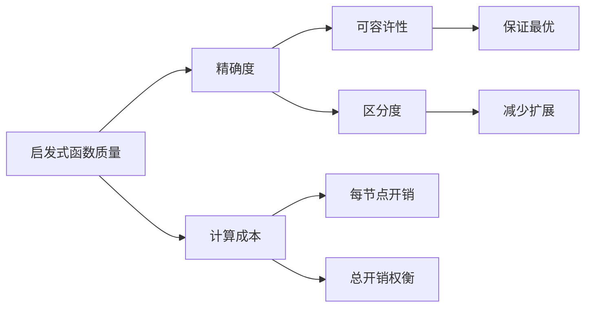

# 3.5 有信息（启发式）搜索策略 - Deep Dive 分析

## 1. 背景与动机

### 1.1 历史背景

有信息搜索（Informed Search）是AI搜索算法的重要分支，通过利用领域知识来指导搜索过程，显著提高搜索效率。

**关键历史节点**：
- 1960s：启发式搜索思想萌芽，Newell和Simon在GPS中使用启发式
- 1968年：A*算法由Hart、Nilsson和Raphael提出，奠定了启发式搜索的理论基础
- 1970s-1980s：IDA*、RBFS等内存受限的启发式搜索算法发展
- 1990s-2000s：模式数据库、启发式函数自动学习等高级技术

**理论突破**：
- 可容许性（Admissibility）概念的提出
- 一致性（Consistency）与效率的关系
- 启发式函数的设计原则

### 1.2 研究动机

**无信息搜索的局限**：
- 指数级复杂性限制了可处理问题规模
- 对大规模问题，即使是最优的无信息算法也难以在合理时间内求解

**领域知识的价值**：
- 实际问题通常包含大量领域知识
- 好的启发式可以将指数级复杂性降低到多项式级
- 在博弈、路径规划等领域取得巨大成功

### 1.3 应用场景

| 应用领域 | 启发式函数示例 | 效果 |
|---------|---------------|------|
| GPS导航 | 直线距离 | 显著减少探索节点 |
| 游戏AI（国际象棋） | 子力价值评估 | 实时决策 |
| 8数码问题 | 曼哈顿距离 | 从不可解到可解 |
| 机器人路径规划 | 欧几里得距离 | 实时避障 |
| 蛋白质折叠 | 能量函数 | 指导构象搜索 |

### 1.4 先决条件

- 掌握无信息搜索算法（3.4节）
- 理解最佳优先搜索框架（3.3节）
- 熟悉启发式函数的基本概念
- 了解可容许性和一致性的数学定义

## 2. 知识逻辑图谱

### 2.1 算法关系图

```mermaid
graph TD
    A[有信息搜索] --> B[贪心最佳优先]
    A --> C[A*搜索]
    A --> D[加权A*]
    A --> E[内存受限搜索]
    
    B --> F[f(n) = h(n)]
    C --> G[f(n) = g(n) + h(n)]
    D --> H[f(n) = g(n) + W*h(n)]
    
    C --> I[可容许性]
    C --> J[一致性]
    C --> K[效率最优]
    
    I --> L[h(n) <= h*(n)]
    J --> M[三角不等式]
    
    E --> N[IDA*]
    E --> O[RBFS]
    E --> P[SMA*]
```

### 2.2 启发式函数质量图谱



## 3. 核心概念与数学分析

### 3.1 术语定义

| 术语（中文） | 术语（英文） | 定义 |
|------------|------------|------|
| 启发式函数 | Heuristic Function | 估计从当前状态到目标状态代价的函数$h(n)$ |
| 可容许性 | Admissibility | 启发式函数永不高估实际代价：$h(n) \leq h^*(n)$ |
| 一致性 | Consistency | 启发式满足三角不等式：$h(n) \leq c(n,a,n') + h(n')$ |
| 评价函数 | Evaluation Function | $f(n) = g(n) + h(n)$，用于A*搜索 |
| 贪心最佳优先 | Greedy Best-First | 仅使用$h(n)$指导搜索 |
| A*搜索 | A* Search | 使用$f(n) = g(n) + h(n)$的最优搜索 |
| 效率最优 | Optimal Efficiency | 任何使用相同启发式的算法必须扩展的节点集合 |
| 加权A* | Weighted A* | 使用$f(n) = g(n) + W \cdot h(n)$的次优搜索 |

### 3.2 符号参考表

| 符号 | 含义 | 数学类型 |
|-----|------|---------|
| $h(n)$ | 启发式函数值 | 实数 |
| $h^*(n)$ | 从$n$到目标的真实最小代价 | 实数 |
| $g(n)$ | 从初始状态到$n$的路径代价 | 实数 |
| $f(n)$ | 评价函数值 | 实数 |
| $f^*(n)$ | $g(n) + h^*(n)$ | 实数 |
| $C^*$ | 最优解的总代价 | 实数 |
| $W$ | 权重系数 | 实数，$W > 1$ |

### 3.3 关键公式

#### 公式1：启发式函数定义

$$h(n) = \text{从节点}n\text{的状态到目标状态的最小代价路径的代价估计值}$$

**关键性质**：
- $h(n) \geq 0$（非负性）
- $h(\text{goal}) = 0$（目标状态启发式为0）

**示例**（罗马尼亚寻径）：
- $h_{SLD}(Arad) = 366$（到Bucharest的直线距离）
- $h_{SLD}(Bucharest) = 0$

#### 公式2：可容许性条件

$$h(n) \leq h^*(n), \quad \forall n$$

**解释**：启发式函数永不高估到达目标的实际代价。

**几何意义**：在状态空间中，启发式函数给出的估计值是实际距离的下界，即"乐观估计"。

**重要性**：可容许的启发式保证A*搜索的代价最优性。

#### 公式3：一致性（单调性）条件

$$h(n) \leq c(n, a, n') + h(n')$$

**等价形式**：
$$f(n') = g(n') + h(n') = g(n) + c(n,a,n') + h(n') \geq g(n) + h(n) = f(n)$$

**解释**：沿任何路径，$f$值非递减。

**几何意义**：启发式函数满足三角不等式，类似于度量空间中的距离函数。

**与可容许性关系**：
- 一致性 $\Rightarrow$ 可容许性
- 可容许性 $\nRightarrow$ 一致性（不一定）

#### 公式4：A*评价函数

$$f(n) = g(n) + h(n)$$

**组成**：
- $g(n)$：已付出的代价（向后看）
- $h(n)$：估计还需付出的代价（向前看）
- $f(n)$：估计的总代价

**直观理解**：A*搜索优先扩展"看起来"最有希望的节点——既考虑已经走过的路，也考虑估计还需走的路。

#### 公式5：加权A*评价函数

$$f(n) = g(n) + W \cdot h(n), \quad W > 1$$

**效果**：
- 增大$W$：更注重启发式，更快找到解，但可能次优
- 减小$W$：更注重实际代价，解更优，但搜索更多

**代价保证**：
$$C^* \leq C_{WA*} \leq W \cdot C^*$$

实际中通常接近$C^*$而非$W \cdot C^*$。

#### 公式6：必然扩展节点

$$\text{必然扩展节点} = \{n : f(n) < C^*\} \cup \{n : f(n) = C^* \text{且是最优解的一部分}\}$$

**解释**：
- 任何$f(n) < C^*$的节点都可能属于最优解，必须扩展
- $f(n) = C^*$的节点中，只有最优解路径上的节点必须扩展

**效率最优性**：使用一致启发式的A*只扩展必然扩展节点，因此是效率最优的。

### 3.4 算法特性对比

| 算法 | 评价函数 | 完备性 | 代价最优 | 适用场景 |
|-----|---------|-------|---------|---------|
| 贪心最佳优先 | $f(n) = h(n)$ | 是* | 否 | 快速找到解，不要求最优 |
| A*（可容许） | $f(n) = g(n) + h(n)$ | 是 | 是 | 需要最优解 |
| A*（一致） | $f(n) = g(n) + h(n)$ | 是 | 是 | 效率最优 |
| 加权A* | $f(n) = g(n) + W \cdot h(n)$ | 是 | 否** | 快速找到满意解 |

*注：在有限状态空间或系统性搜索策略下完备。
**注：解代价在$C^*$和$W \cdot C^*$之间。

## 4. 定理与证明

### 4.1 A*最优性定理

**定理陈述**：如果$h(n)$是可容许的，则A*搜索是代价最优的。

**证明**：

设$C^*$是最优解的代价，$G$是一个次优的目标节点（路径代价$C_G > C^*$）。

我们需要证明A*不会选择$G$进行扩展。

设$n$是最优路径上的一个节点，且$n$尚未被扩展。

**关键不等式链**：
1. $f(n) = g(n) + h(n) \leq g(n) + h^*(n) = C^*$（可容许性）
2. $f(G) = g(G) + h(G) = C_G + 0 = C_G > C^*$

因此，$f(n) \leq C^* < C_G = f(G)$。

**结论**：边界上存在$f$值更小的节点$n$，A*会优先扩展$n$而非$G$。由于最优路径上的所有节点都满足此性质，A*最终会找到最优解。

**证明本质**：可容许性保证A*不会过早地选择次优解，因为最优路径上总有"看起来更好"的节点。

### 4.2 一致性蕴含可容许性

**定理陈述**：如果$h(n)$是一致的，则$h(n)$是可容许的。

**证明**：

对从$n$到目标的路径长度$k$进行归纳。

**基础**：$k=0$，$n$是目标，$h(n) = 0 = h^*(n)$，成立。

**归纳**：假设对距离目标$k$步的所有节点成立。设$n$距离目标$k+1$步，$n'$是$n$的后继且在最优路径上。

由一致性：
$$h(n) \leq c(n, a, n') + h(n')$$

由归纳假设：
$$h(n') \leq h^*(n')$$

因此：
$$h(n) \leq c(n, a, n') + h^*(n') = h^*(n)$$

**结论**：一致性蕴含可容许性。

### 4.3 A*效率最优性

**定理陈述**：使用一致启发式的A*搜索是效率最优的——任何使用相同启发式并保证找到最优解的算法必须扩展A*扩展的所有必然扩展节点。

**证明概要**：

必然扩展节点定义为$\{n : f(n) < C^*\} \cup \{\text{最优路径上}f(n) = C^*\text{的节点}\}$。

任何保证最优性的算法必须考虑所有可能属于最优解的节点。对于$f(n) < C^*$的节点，它们可能属于最优解，因此必须扩展。

A*恰好扩展这些节点，因此是效率最优的。

## 5. 具体示例

### 5.1 罗马尼亚寻径：贪心 vs A*

**启发式**：$h_{SLD}$（直线距离，图3-16）

**贪心最佳优先搜索**（图3-17）：
| 步骤 | 当前节点 | 扩展 | 选择下一个 |
|-----|---------|------|-----------|
| 1 | Arad | Sibiu(253), Zerind(374), Timisoara(329) | Sibiu |
| 2 | Sibiu | Fagaras(176), ... | Fagaras |
| 3 | Fagaras | Bucharest(0)! | 找到解 |

**解**：Arad → Sibiu → Fagaras → Bucharest，代价450英里
**注意**：不是最优解！

**A*搜索**：
| 步骤 | 边界节点($f=g+h$) | 扩展 |
|-----|------------------|------|
| 1 | Arad(0+366=366) | Arad |
| 2 | Sibiu(140+253=393), Zerind(75+374=449), Timisoara(118+329=447) | Sibiu |
| 3 | RV(220+193=413), Fagaras(239+176=415), ... | RV |
| ... | ... | ... |
| 最终 | Bucharest(418+0=418) | 找到最优解 |

**最优解**：Arad → Sibiu → RV → Pitesti → Bucharest，代价418英里

### 5.2 8数码问题启发式比较

**问题实例**（图3-25）：

**启发式1：错位滑块数**($h_1$)
- 计算：统计不在目标位置的滑块数
- 开始状态：所有8个滑块都错位，$h_1 = 8$
- 可容许性：每个错位滑块至少需1次移动

**启发式2：曼哈顿距离**($h_2$)
- 计算：各滑块到目标位置的水平+垂直距离之和
- 开始状态：$h_2 = 3+1+2+2+2+3+3+2 = 18$
- 可容许性：每次移动最多使一个滑块靠近目标1步

**比较**：
- $h_2$通常比$h_1$更精确
- 两者都是可容许的
- $h_2$的计算成本略高，但减少的搜索量通常值得

### 5.3 加权A*搜索示例

**问题**：网格世界路径规划

**标准A***：
- 探索大量节点
- 找到最优解

**加权A*（W=2）**：
- 探索节点数显著减少
- 找到的解代价稍高，但仍在可接受范围

**权衡**：
- $W=1$：A*，最优但慢
- $W=2$：较快，解代价$\leq 2C^*$
- $W=5$：很快，解代价$\leq 5C^*$

## 6. 一句话本质

**有信息搜索策略的核心本质**：通过设计可容许的启发式函数来估计到目标的剩余代价，A*搜索在保证最优性的同时实现效率最优，而加权A*等变体在最优性和效率之间提供可调的权衡。

## 7. 总结与反思

### 7.1 关键要点

1. **启发式函数的设计**：好的启发式应该既可容许（保证最优性）又尽可能接近真实代价（提高效率）。

2. **A*的最优性保证**：可容许性保证A*找到最优解，一致性保证效率最优性。

3. **贪心搜索的风险**：虽然快，但可能陷入局部最优，找不到全局最优解。

4. **加权A*的实用价值**：在许多应用中，稍微次优但快速找到的解比最优但耗时很长的解更有价值。

5. **效率最优性的意义**：A*不会浪费时间去扩展对找到最优解没有帮助的节点。

### 7.2 常见误解对照表

| 误解 | 正确理解 |
|-----|---------|
| 任何启发式都能用于A* | 只有可容许的启发式才能保证A*的最优性 |
| 可容许性意味着一致性 | 一致性蕴含可容许性，但反之不成立 |
| A*总是比无信息搜索快 | 在最坏情况下，A*仍可能是指数级复杂性 |
| 加权A*找到的解总是$W$倍于最优 | 实际中解质量通常远好于理论界限 |
| 贪心搜索总是比A*快 | 虽然通常快，但可能找不到解或找到很差解 |

### 7.3 反思问题

1. 为什么可容许性对A*的最优性至关重要？如果启发式高估会发生什么？

2. 一致性和可容许性有什么区别？在什么情况下使用一致性更有优势？

3. 如何设计一个问题的启发式函数？有哪些通用的设计原则？

4. 在实际应用中，如何决定使用标准A*还是加权A*？权重$W$应该如何选择？

### 7.4 公式速查表

| 公式 | 含义 | 应用场景 |
|-----|------|---------|
| $h(n) \leq h^*(n)$ | 可容许性 | 保证A*最优性 |
| $h(n) \leq c(n,a,n') + h(n')$ | 一致性 | 保证效率最优 |
| $f(n) = g(n) + h(n)$ | A*评价函数 | 节点排序 |
| $f(n) = g(n) + W \cdot h(n)$ | 加权A* | 快速满意解 |
| $C^* \leq C_{WA*} \leq W \cdot C^*$ | 加权A*代价界限 | 质量保证 |

### 7.5 启发式函数设计原则

| 原则 | 说明 | 示例 |
|-----|------|------|
| 可容许性 | 永不高估 | 直线距离用于道路距离 |
| 一致性 | 满足三角不等式 | 曼哈顿距离 |
| 计算效率 | 启发式计算要快 | 避免复杂模拟 |
| 区分度 | 能区分不同状态的质量 | 避免$h(n) \approx 0$ |
| 信息性 | 尽可能接近$h^*(n)$ | 模式数据库 |

---

*本节Deep Dive分析完成。建议结合教材中的图3-16、3-17、3-18理解启发式搜索的执行过程，并尝试为不同问题设计启发式函数。*
