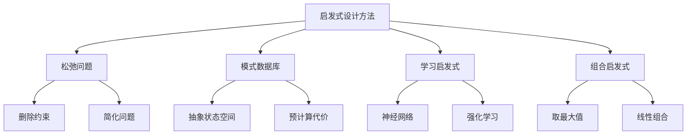
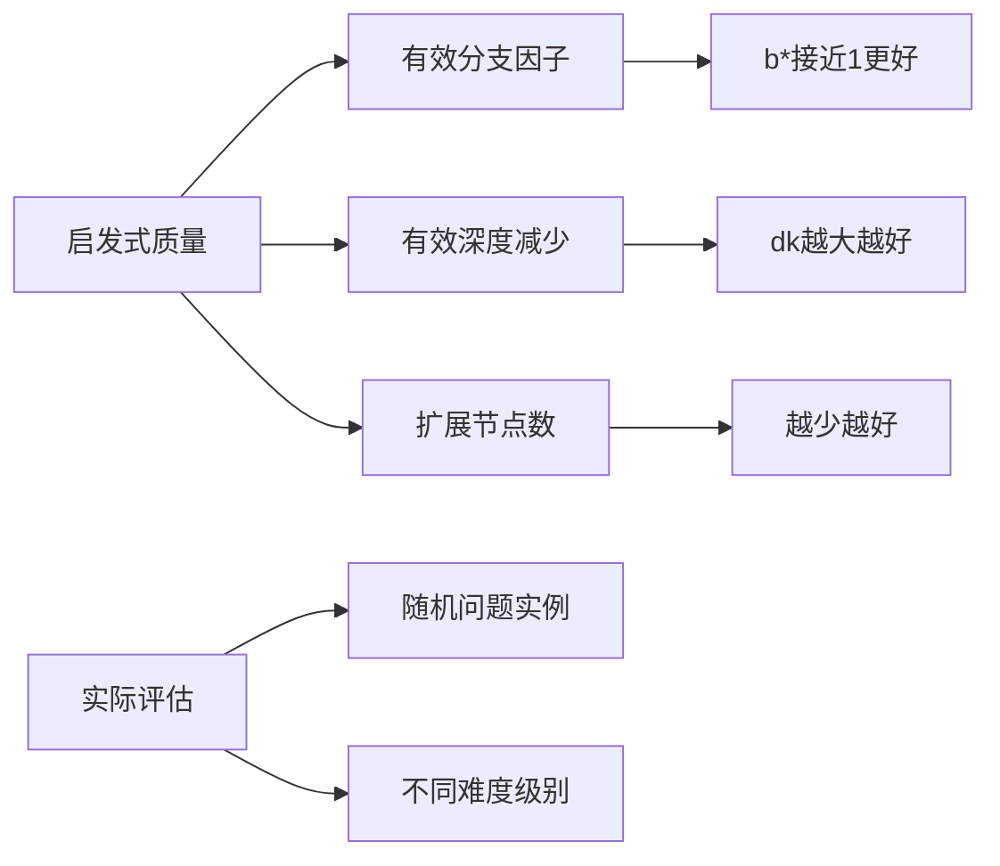

# 3.6 启发式函数 - Deep Dive 分析

## 1. 背景与动机

### 1.1 历史背景

启发式函数的研究是人工智能中最具实践价值的领域之一。从20世纪60年代A*算法提出以来，如何设计和改进启发式函数一直是研究热点。

**发展历程**：
- 1968年：A*算法提出，启发式函数的概念正式确立
- 1970s：松弛问题（Relaxed Problem）方法的发展
- 1980s-1990s：模式数据库（Pattern Database, PDB）技术兴起
- 2000s：启发式函数的自动学习和组合方法
- 2010s：深度学习与启发式函数的结合

**里程碑**：
- 15数码问题的模式数据库（Culberson & Schaeffer, 1998）
- 魔方的Korf启发式（Korf, 1997）
- 组合启发式的理论分析（Korf & Reid, 1998）

### 1.2 研究动机

**核心问题**：
- 如何设计好的启发式函数？
- 如何评估启发式函数的质量？
- 如何组合多个启发式？
- 如何自动学习启发式？

**实际价值**：
- 好的启发式可以将指数级复杂性降低到多项式级
- 使原本不可解的问题变得可解
- 在实时系统中实现快速决策

### 1.3 应用场景

| 应用领域 | 启发式函数 | 效果 |
|---------|-----------|------|
| 路径规划 | 欧几里得距离、曼哈顿距离 | 实时导航 |
| 8/15数码 | 错位滑块数、曼哈顿距离、PDB | 解决大规模实例 |
| 魔方 | 角块PDB、边块PDB | 最优求解 |
| 博弈 | 神经网络评估函数 | 超越人类水平 |
| 规划 | 松弛问题启发式 | 自动规划 |

### 1.4 先决条件

- 掌握A*搜索算法（3.5节）
- 理解可容许性和一致性（3.5节）
- 熟悉状态空间搜索的基本概念
- 了解动态规划和松弛问题的基本思想

## 2. 知识逻辑图谱

### 2.1 启发式设计方法图谱

### 2.2 启发式质量评估图谱

## 3. 核心概念与数学分析

### 3.1 术语定义

| 术语（中文） | 术语（英文） | 定义 |
|------------|------------|------|
| 松弛问题 | Relaxed Problem | 通过删除约束得到的简化问题 |
| 模式数据库 | Pattern Database (PDB) | 预计算的子问题最优解代价表 |
| 有效分支因子 | Effective Branching Factor | 产生相同节点数的均衡树的分支因子 |
| 有效深度 | Effective Depth | 考虑启发式后的等效搜索深度 |
| 子问题 | Subproblem | 原问题的部分组件或抽象 |
| 不相交模式 | Disjoint Pattern | 不共享元素的模式集合 |
| 组合启发式 | Composite Heuristic | 组合多个启发式函数的方法 |
| 可采纳启发式 | Admissible Heuristic | 永不高估真实代价的启发式 |

### 3.2 符号参考表

| 符号 | 含义 | 数学类型 |
|-----|------|---------|
| $h_1, h_2, ...$ | 启发式函数 | 实值函数 |
| $h^*$ | 真实最优代价 | 实值函数 |
| $b^*$ | 有效分支因子 | 实数 |
| $d$ | 解深度 | 正整数 |
| $n$ | 扩展节点数 | 正整数 |
| $k_h$ | 有效深度减少量 | 正整数 |
| $C^*$ | 最优解代价 | 正实数 |

### 3.3 关键公式

#### 公式1：有效分支因子

$$n + 1 = 1 + b^* + (b^*)^2 + \cdots + (b^*)^d = \frac{(b^*)^{d+1} - 1}{b^* - 1}$$

**解释**：
- $n$：A*搜索扩展的总节点数
- $d$：解深度
- $b^*$：使得均衡树包含$n+1$个节点的分支因子

**数值求解**：给定$n$和$d$，通过数值方法求解$b^*$。

**质量指标**：
- $b^* \approx 1$：优秀的启发式
- $b^* \approx b$（实际分支因子）：启发式几乎无帮助

**数值示例**：
- $d=5, n=52$：$b^* \approx 1.92$
- $d=10, n=1000$：$b^* \approx 1.5$

#### 公式2：有效深度减少

$$\text{搜索代价} = O(b^{d - k_h})$$

**解释**：
- 相较于无信息搜索的$O(b^d)$
- $k_h$是启发式带来的有效深度减少
- 对于特定领域，$k_h$近似为常数

**意义**：即使解深度增加，启发式仍能提供指数级的改进。

#### 公式3：组合启发式（取最大值）

$$h(n) = \max\{h_1(n), h_2(n), ..., h_k(n)\}$$

**性质**：
- 如果所有$h_i$可容许，则$h$可容许
- $h$至少与最好的$h_i$一样好
- 计算成本为各启发式之和

**适用场景**：
- 有多个独立设计的启发式
- 不同启发式在不同区域表现优异

#### 公式4：曼哈顿距离（8数码问题）

$$h_2 = \sum_{i=1}^{8} (|x_i - x_i^*| + |y_i - y_i^*|)$$

**解释**：
- $(x_i, y_i)$：滑块$i$的当前位置
- $(x_i^*, y_i^*)$：滑块$i$的目标位置
- 对每个滑块计算水平+垂直距离

**可容许性证明**：
- 每次移动最多使一个滑块向目标靠近1步
- 因此至少需要$h_2$次移动
- $h_2 \leq h^*$

**数值示例**（图3-25）：
$$h_2 = 3 + 1 + 2 + 2 + 2 + 3 + 3 + 2 = 18$$
实际解代价：26

#### 公式5：模式数据库启发式

$$h_{PDB}(n) = \max_{i} \{h_{PDB_i}(n)\}$$

**解释**：
- 对每个模式（子问题）预计算最优解代价
- 查询时取各模式启发式的最大值
- 不相交模式可以相加而非取最大

**不相交模式加法**：
$$h(n) = \sum_{i} h_{PDB_i}(n)$$
（仅当模式不共享元素时保持可容许性）

### 3.4 启发式质量对比

| 启发式 | 8数码$h$值 | 计算成本 | 质量评价 |
|-------|-----------|---------|---------|
| $h_0 = 0$ | 0 | 极低 | 无信息 |
| $h_1$（错位滑块） | 8 | 低 | 一般 |
| $h_2$（曼哈顿距离） | 18 | 低 | 较好 |
| $h_{PDB}$（6-6-6模式） | ~22 | 中 | 很好 |
| $h^*$（真实代价） | 26 | 极高 | 完美 |

## 4. 定理与证明

### 4.1 松弛问题启发式的可容许性

**定理陈述**：松弛问题的最优解代价是原问题的可容许启发式。

**证明**：

设$P$是原问题，$P'$是通过删除某些约束得到的松弛问题。

**关键观察**：
- $P'$的每个解都是$P$的解（因为约束更少）
- 但$P$的某些解可能不是$P'$的解

设$h'(n)$是$P'$中从$n$到目标的最优代价。

对于$P$中的任何解路径，该路径在$P'$中也是可行的（可能不是最优的）。

因此：
$$h'(n) \leq h^*(n)$$

**结论**：松弛问题的最优解代价永不高估原问题的真实代价，因此是可容许的。

### 4.2 组合启发式的可容许性

**定理陈述**：如果$h_1, h_2, ..., h_k$都是可容许的，则$h(n) = \max_i h_i(n)$也是可容许的。

**证明**：

对于任意节点$n$：
$$h(n) = \max_i h_i(n) \leq \max_i h^*(n) = h^*(n)$$

因此$h(n) \leq h^*(n)$，$h$是可容许的。

**不相交模式加法定理**：如果模式不相交（不共享元素），则$h(n) = \sum_i h_{PDB_i}(n)$是可容许的。

**证明概要**：
- 不相交模式可以独立求解
- 各子问题的最优解代价之和不超过原问题最优解
- 因此和是可容许的

## 5. 具体示例

### 5.1 8数码问题启发式比较

**实验设置**：随机生成8数码问题，统计不同启发式的性能。

**结果**（图3-26）：

| 启发式 | 有效分支因子$b^*$ | 相对性能 |
|-------|------------------|---------|
| 无（BFS） | ~2.67 | 基准 |
| $h_1$（错位滑块） | ~1.45 | 显著改善 |
| $h_2$（曼哈顿距离） | ~1.24 | 很好 |

**深度影响**（$d=14$）：
- BFS：约3.6亿节点
- $h_1$：约100万节点
- $h_2$：约10万节点

**结论**：好的启发式可以带来数量级的改进。

### 5.2 15数码问题的模式数据库

**6-6-3模式划分**：
- 模式1：滑块1-6 + 空格
- 模式2：滑块7-12 + 空格
- 模式3：滑块13-15 + 空格

**PDB构建**：
- 对每个模式，预计算所有配置到目标的最优代价
- 存储在查找表中

**查询示例**：
- 给定状态，提取各模式的配置
- 查表得到各模式启发式值
- 取最大值或和（如果不相交）

**效果**：
- 6-6-3 PDB：有效分支因子约1.1
- 可解决随机15数码问题（约10万亿状态）

### 5.3 松弛问题示例

**8数码问题的松弛**：

**原问题约束**：
- 滑块只能移动到相邻的空格

**松弛1（允许任意移动）**：
- 每个错位滑块只需1步归位
- $h_1$ = 错位滑块数

**松弛2（允许滑块"跳跃"到目标位置）**：
- 忽略障碍物，直接计算距离
- $h_2$ = 曼哈顿距离

**更复杂的松弛**：
- 允许滑块移动到任意空位（不仅是相邻）
- 计算更复杂的启发式

## 6. 一句话本质

**启发式函数的核心本质**：通过松弛问题、模式数据库或机器学习方法设计的可容许启发式，能够利用问题结构知识将指数级搜索复杂性降低到可处理范围，而组合多个启发式可以进一步提高搜索效率。

## 7. 总结与反思

### 7.1 关键要点

1. **松弛问题方法**：通过删除约束得到简化问题，其最优解代价提供可容许启发式。

2. **模式数据库**：预计算子问题的最优解，通过查表获得高质量启发式。

3. **启发式质量评估**：有效分支因子$b^*$是衡量启发式质量的关键指标，$b^*$越接近1越好。

4. **组合启发式**：取多个可容许启发式的最大值保持可容许性，不相交模式可以相加。

5. **权衡考虑**：启发式质量vs计算成本，需要在实际应用中仔细平衡。

### 7.2 常见误解对照表

| 误解 | 正确理解 |
|-----|---------|
| 启发式越复杂越好 | 需要考虑计算成本，有时简单启发式更高效 |
| 所有启发式都可以相加 | 只有不相交模式才能相加保持可容许性 |
| 模式数据库只适用于滑块问题 | PDB方法可应用于多种问题类型 |
| 机器学习启发式总是可容许的 | 神经网络启发式通常不可容许，需要特殊处理 |
| $h(n)=0$是无用的 | 作为基准比较，且在某些情况下是必要的 |

### 7.3 反思问题

1. 如何为一个新问题设计启发式函数？描述系统性的设计过程。

2. 模式数据库的大小和查询时间之间存在什么权衡？如何优化？

3. 为什么不相交模式可以相加而非取最大？如果不相交条件不满足会怎样？

4. 在实际应用中，如何决定使用哪种启发式设计方法？

### 7.4 公式速查表

| 公式 | 含义 | 应用场景 |
|-----|------|---------|
| $n + 1 = \sum_{i=0}^{d} (b^*)^i$ | 有效分支因子 | 评估启发式质量 |
| $O(b^{d-k_h})$ | 有效深度减少 | 理论分析 |
| $h = \max(h_1, h_2, ...)$ | 组合启发式（取最大） | 多启发式组合 |
| $h = \sum h_{PDB_i}$ | 不相交模式加法 | PDB组合 |
| $h_2 = \sum |\Delta x| + |\Delta y|$ | 曼哈顿距离 | 网格问题 |

### 7.5 启发式设计方法对比

| 方法 | 优点 | 缺点 | 适用场景 |
|-----|------|------|---------|
| 松弛问题 | 理论保证可容许 | 启发式质量有限 | 通用方法 |
| 模式数据库 | 高质量启发式 | 内存开销大 | 滑块类问题 |
| 机器学习 | 可学习复杂模式 | 通常不可容许 | 有大量数据 |
| 组合启发式 | 利用多个启发式 | 计算成本增加 | 多个可用启发式 |

---

*本节Deep Dive分析完成。建议结合教材中的图3-25、3-26理解启发式函数的效果，并尝试为不同问题设计启发式函数。*
