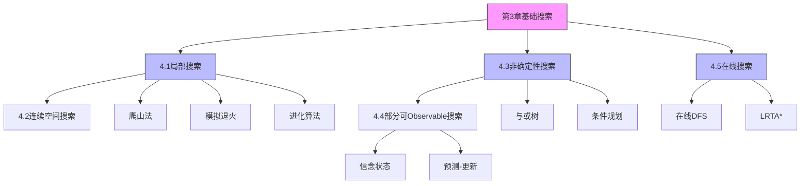

# 第4章 复杂环境中的搜索 - 概览与总结

## 1. 学习目标

完成本章学习后，你应该能够：

1. **理解局部搜索的原理**：掌握爬山法、模拟退火、局部束搜索和进化算法的核心思想
2. **应用连续空间搜索技术**：理解离散化、梯度方法和牛顿法在连续优化中的应用
3. **处理非确定性环境**：掌握与或搜索算法，能够构造条件规划和循环规划
4. **解决部分可观测问题**：理解信念状态的概念，掌握预测-观测-更新循环
5. **设计在线搜索智能体**：理解在线搜索的特点，掌握在线DFS和LRTA*算法

## 2. 本章速览

### 2.1 章节结构

```
第4章 复杂环境中的搜索
├── 4.1 局部搜索和最优化问题
│   ├── 4.1.1 爬山搜索
│   ├── 4.1.2 模拟退火
│   ├── 4.1.3 局部束搜索
│   └── 4.1.4 进化算法
├── 4.2 连续空间中的局部搜索
├── 4.3 使用非确定性动作的搜索
│   ├── 4.3.1 不稳定的真空吸尘器世界
│   ├── 4.3.2 与或搜索树
│   └── 4.3.3 反复尝试
├── 4.4 部分可观测环境中的搜索
│   ├── 4.4.1 无观测信息的搜索
│   ├── 4.4.2 部分可观测环境中的搜索
│   ├── 4.4.3 求解部分可观测问题
│   └── 4.4.4 部分可观测环境中的智能体
└── 4.5 在线搜索智能体和未知环境
    ├── 4.5.1 在线搜索问题
    ├── 4.5.2 在线搜索智能体
    ├── 4.5.3 在线局部搜索
    └── 4.5.4 在线搜索中的学习
```

### 2.2 核心主题

本章讨论四种环境复杂性的放松：

| 环境特性 | 第3章假设 | 本章放松 | 关键算法 |
|---------|----------|---------|---------|
| 状态空间 | 离散 | 连续 | 梯度下降、牛顿法 |
| 动作结果 | 确定性 | 非确定性 | 与或搜索、条件规划 |
| 可观测性 | 完全可观测 | 部分可观测 | 信念状态搜索 |
| 环境知识 | 已知 | 未知 | 在线搜索、LRTA* |

## 3. 难度预警

### 3.1 难度分级

| 小节 | 难度 | 主要挑战 |
|-----|------|---------|
| 4.1 局部搜索 | ⭐⭐ | 理解局部最优陷阱和解决方案 |
| 4.2 连续空间搜索 | ⭐⭐⭐ | 微积分应用、约束优化 |
| 4.3 非确定性搜索 | ⭐⭐⭐ | 与或树概念、条件规划 |
| 4.4 部分可Observable搜索 | ⭐⭐⭐⭐ | 信念状态空间、三阶段转移 |
| 4.5 在线搜索 | ⭐⭐⭐ | 竞争比、实时学习 |

### 3.2 学习建议

1. **循序渐进**：先掌握4.1节的局部搜索基础，再学习后续内容
2. **动手实践**：实现8皇后问题的爬山法和模拟退火
3. **画图辅助**：与或树和信念状态空间用图形表示更清晰
4. **对比学习**：比较不同算法的优缺点和适用场景

## 4. 前置知识

### 4.1 必需知识

- 第2章：智能体和环境的基本概念
- 第3章：基础搜索算法（BFS、DFS、A*）
- 基本概率论
- 集合论基础

### 4.2 有帮助的知识

- 多元微积分（偏导数、梯度）
- 线性代数基础
- 基本的优化理论
- 图论基础

## 5. 节依赖图



## 6. 定理与公式清单

### 6.1 局部搜索

| 公式 | 名称 | 应用 |
|-----|------|------|
|$P(\text{accept}) = e^{\Delta E / T}$ | 模拟退火接受概率 | 逃离局部最优 |
|$E[\text{restarts}] = 1/p$ | 随机重启期望次数 | 成功率分析 |

### 6.2 连续空间搜索

| 公式 | 名称 | 应用 |
|-----|------|------|
|$\boldsymbol{x} \leftarrow \boldsymbol{x} + \alpha \nabla f(\boldsymbol{x})$ | 最陡上升更新 | 梯度方法 |
|$\boldsymbol{x} \leftarrow \boldsymbol{x} - H_f^{-1} \nabla f(\boldsymbol{x})$ | 牛顿法更新 | 快速收敛 |

### 6.3 非确定性搜索

| 公式 | 名称 | 应用 |
|-----|------|------|
|$\text{Results}(s, a) = \{s'_1, ..., s'_k\}$ | 非确定性转移 | 与或树构建 |

### 6.4 部分可Observable搜索

| 公式 | 名称 | 应用 |
|-----|------|------|
|$b_o = \text{UPDATE}(\text{PREDICT}(b, a), o)$ | 递归状态评估 | 信念状态维护 |

### 6.5 在线搜索

| 概念 | 名称 | 应用 |
|-----|------|------|
|$\text{竞争比} = \frac{\text{在线代价}}{\text{最优代价}}$ | 竞争比 | 性能度量 |

## 7. 核心逻辑线索

### 7.1 从简单到复杂

```
完全可Observable + 确定性 + 已知（第3章）
    ↓
局部搜索（不关心路径，只关心最终状态）
    ↓
连续空间（无限分支因子）
    ↓
非确定性（环境选择结果）
    ↓
部分可Observable（不确定当前状态）
    ↓
未知环境（在线学习）
```

### 7.2 问题形式化演进

| 环境类型 | 解的形式 | 搜索空间 |
|---------|---------|---------|
| 确定性、完全可Observable | 动作序列 | 物理状态空间 |
| 局部搜索 | 单个状态 | 状态空间地形图 |
| 非确定性 | 条件规划 | 与或树 |
| 无传感器 | 动作序列 | 信念状态空间 |
| 部分可Observable | 条件规划 | 信念状态与或树 |
| 在线、未知 | 交替计算和动作 | 逐步构建的地图 |

## 8. 核心要点速查

### 8.1 局部搜索要点

- **爬山法**：贪心选择最优邻居，可能陷入局部最优
- **解决方案**：横向移动、随机重启、模拟退火
- **模拟退火**：温度逐渐降低，理论上可找到全局最优
- **进化算法**：种群-based搜索，杂交组合有用区域

### 8.2 连续空间要点

- **离散化**：简单但精度受限
- **梯度方法**：利用导数信息指导搜索
- **牛顿法**：利用二阶信息快速收敛
- **约束优化**：线性规划和凸优化有多项式时间算法

### 8.3 非确定性要点

- **与或树**：或节点（智能体选择）+ 与节点（环境选择）
- **条件规划**：根据感知选择分支
- **循环规划**：处理反复尝试的情况
- **环检测**：确保算法终止

### 8.4 部分可Observable要点

- **信念状态**：可能状态的集合
- **三阶段转移**：预测 → 可能感知 → 更新
- **无传感器**：解是动作序列，可以"强迫"世界到达目标
- **定位**：通常能快速收敛到单个状态

### 8.5 在线搜索要点

- **竞争比**：在线算法与最优离线算法的比值
- **在线DFS**：深度优先探索，需要物理回溯
- **LRTA***：实时学习代价估计，乐观主义鼓励探索
- **增量搜索**：复用之前搜索结果

## 9. 概念对比表

### 9.1 搜索算法对比

| 算法 | 内存需求 | 完备性 | 最优性 | 适用场景 |
|-----|---------|--------|--------|---------|
| 爬山法 | $O(1)$ | 否 | 否 | 大规模优化 |
| 模拟退火 | $O(1)$ | 是（渐近） | 是（渐近） | 逃离局部最优 |
| 局部束搜索 | $O(k)$ | 否 | 否 | 并行搜索 |
| 遗传算法 | $O(n)$ | 否 | 否 | 复杂结构优化 |
| 与或搜索 | $O(bd)$ | 是 | 可选 | 非确定性规划 |
| 在线DFS | $O(n)$ | 是（可安全探索） | 否 | 未知环境探索 |
| LRTA* | $O(n)$ | 是（有限空间） | 否 | 实时搜索 |

### 9.2 规划类型对比

| 环境 | 解的形式 | 感知需求 |
|-----|---------|---------|
| 确定性、完全可Observable | 动作序列 | 不需要（执行时） |
| 非确定性 | 条件规划 | 需要 |
| 无传感器 | 动作序列 | 不需要 |
| 部分可Observable | 条件规划 | 需要 |

## 10. 常见误解澄清

### 10.1 局部搜索

| 误解 | 澄清 |
|-----|------|
| 爬山法总能找到全局最优 | 容易陷入局部最优，需要随机重启或模拟退火 |
| 模拟退火的温度是物理温度 | 是控制接受"坏"移动概率的参数 |
| 遗传算法总是比随机搜索好 | 性能高度依赖于问题表示 |

### 10.2 非确定性与部分可Observable

| 误解 | 澄清 |
|-----|------|
| 无传感器问题无解 | 许多问题有解，可以通过动作获取信息 |
| 部分可Observable问题的解总是条件规划 | 无传感器问题的解是动作序列 |
| 观测总是减少不确定性 | 预测阶段可能扩大信念状态 |

### 10.3 在线搜索

| 误解 | 澄清 |
|-----|------|
| 在线搜索总是比离线搜索差 | 在线搜索适用于未知环境 |
| 在线DFS的物理回溯与队列回溯相同 | 物理回溯需要实际移动，代价更高 |
| LRTA*与A*相同 | LRTA*实时学习，A*需要完整搜索空间 |

## 11. 本章测验

### 11.1 选择题

1. 爬山法的主要问题是什么？
   - A. 内存需求太大
   - B. 可能陷入局部最优
   - C. 计算速度太慢
   - D. 不适用于离散问题

2. 模拟退火中的"温度"参数控制什么？
   - A. 算法的运行速度
   - B. 接受"坏"移动的概率
   - C. 搜索的广度
   - D. 内存使用量

3. 在与或树中，与节点代表什么？
   - A. 智能体的选择
   - B. 环境的选择
   - C. 目标状态
   - D. 初始状态

4. 信念状态空间的大小是物理状态空间的多少倍？
   - A. $N$倍
   - B. $2^N$倍
   - C. $N^2$倍
   - D. $\log N$倍

5. 在线搜索的竞争比定义为：
   - A. 在线算法时间/离线算法时间
   - B. 在线算法路径代价/最优路径代价
   - C. 探索状态数/总状态数
   - D. 成功次数/总尝试次数

### 11.2 简答题

1. 解释爬山法中的"局部极大值"、"岭"和"平台区"问题，以及相应的解决方案。

2. 比较模拟退火和随机重启爬山法：在什么情况下一种方法优于另一种？

3. 解释为什么无传感器问题的解是动作序列而不是条件规划。

4. 描述LRTA*算法中的"乐观主义"策略及其作用。

5. 在线搜索中，为什么死胡同是一个真正的难点？

### 11.3 计算题

1. 对于8皇后问题，如果最陡上升爬山法的成功概率为14%，平均成功步数为4，失败步数为3，计算随机重启爬山法的期望总步数。

2. 在一个有16个状态的迷宫中，使用在线DFS探索，最坏情况下需要遍历多少条边？

3. 设计一个信念状态转移的例子，展示预测阶段信念状态扩大、更新阶段信念状态缩小的过程。

## 12. 快速复习卡

### 12.1 关键术语

- **局部搜索**：不记录路径，只关注最终状态的搜索
- **模拟退火**：允许"下坡"移动的随机爬山法
- **与或树**：包含或节点（智能体选择）和与节点（环境选择）的搜索树
- **信念状态**：智能体可能位于的物理状态集合
- **在线搜索**：交替进行计算和动作的搜索范式

### 12.2 关键公式

- 模拟退火接受概率：$P = e^{\Delta E / T}$
- 梯度更新：$\boldsymbol{x} \leftarrow \boldsymbol{x} + \alpha \nabla f$
- 牛顿法更新：$\boldsymbol{x} \leftarrow \boldsymbol{x} - H^{-1} \nabla f$
- 信念状态更新：$b' = \text{UPDATE}(\text{PREDICT}(b, a), o)$

### 12.3 关键算法

- 爬山法：贪心选择最优邻居
- 模拟退火：以概率接受"坏"移动
- 与或搜索：处理非确定性环境
- 在线DFS：深度优先探索未知环境
- LRTA*：实时学习代价估计

## 13. 扩展阅读

### 13.1 进阶书籍

1. **《Convex Optimization》** - Boyd & Vandenberghe
   - 深入理解凸优化理论

2. **《Numerical Recipes》** - Press et al.
   - 数值优化算法的实用指南

3. **《Evolutionary Computation》** 期刊
   - 进化算法最新研究

### 13.2 相关章节

- 第3章：完全可Observable的、确定性的、静态的、已知的环境中的搜索
- 第5章：对抗搜索
- 第12章：不确定性推理
- 第17章：复杂决策制定
- 第19章：学习

### 13.3 在线资源

- **AIMA官方网站**：aima.cs.berkeley.edu
- **在线代码实现**：Python/Java代码示例
- **习题解答**：课后习题详细解答

---

**本章完**

*生成时间：2026年4月10日*
