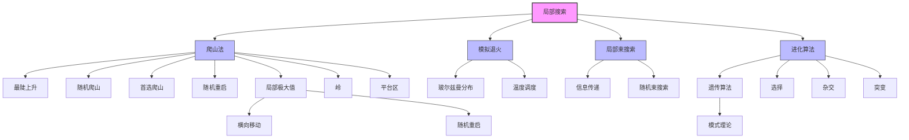

# 4.1 局部搜索和最优化问题

## 1. 背景与动机

### 1.1 历史背景

局部搜索（Local Search）算法的发展可以追溯到20世纪70年代，是运筹学和计算机科学交叉领域的重要成果。早期的局部搜索技术主要应用于组合优化问题，如旅行商问题（TSP）、图着色问题等。随着计算能力的提升和实际应用需求的增加，局部搜索逐渐成为求解大规模复杂优化问题的核心方法之一。

在人工智能领域，局部搜索的重要性在20世纪90年代初期得到重新认识。Minton等人（1992）在解决大规模$n$皇后问题上展示了局部搜索的惊人效果，Selman等人（1992）则将其应用于布尔可满足性问题（SAT）。这些工作证明了局部搜索在处理NP难问题时的实用价值，引发了理论计算机科学家的广泛兴趣，被Christos Papadimitriou称为"新时代"算法的复兴。

### 1.2 研究动机

传统搜索算法（如第3章所述）关注于找到从初始状态到目标状态的路径，但在许多实际问题中，我们并不关心如何到达目标状态，而只关心最终状态的质量。例如：

- **集成电路设计**：寻找最优的芯片布局以最小化连线长度
- **工厂车间布局**：优化设备位置以最小化物料搬运成本
- **作业车间调度**：确定任务执行顺序以最小化完工时间
- **电信网络优化**：配置网络拓扑以优化流量分配
- **投资组合管理**：选择资产配置以最大化收益或最小化风险

这些问题的共同特点是：
1. 状态空间巨大或无限
2. 寻找最优路径不重要，找到好状态更重要
3. 需要优化某个目标函数

### 1.3 应用场景

局部搜索算法广泛应用于以下领域：

| 应用领域 | 具体问题 | 目标函数 |
|---------|---------|---------|
| 组合优化 | $n$皇后问题、图着色、TSP | 冲突数、路径长度 |
| 工程设计 | VLSI布图、结构优化 | 面积、重量、应力 |
| 机器学习 | 神经网络训练、超参数优化 | 损失函数 |
| 运筹学 | 调度问题、资源分配 | 成本、时间 |
| 生物信息学 | 蛋白质折叠、序列比对 | 能量、相似度 |

### 1.4 先决条件

学习本节内容需要掌握：
- 第2章：智能体和环境的基本概念
- 第3章：基础搜索算法（尤其是启发式搜索）
- 基本概率论知识
- 基本的微积分概念（用于理解梯度下降）

---

## 2. 知识逻辑图谱

### 2.1 概念关系图



### 2.2 知识发展依赖链

```
状态空间搜索（第3章）
    ↓
完全状态形式化
    ↓
状态空间地形图概念
    ↓
├─→ 爬山法（贪心局部搜索）
│       ├─→ 变体：最陡上升、随机、首选
│       └─→ 问题：局部极大值、岭、平台区
│               └─→ 解决方案：横向移动、随机重启
│
├─→ 模拟退火（结合爬山+随机游走）
│       └─→ 温度调度 → 全局最优保证
│
├─→ 局部束搜索（并行搜索+信息共享）
│       └─→ 随机束搜索（保持多样性）
│
└─→ 进化算法（生物启发的种群搜索）
        ├─→ 遗传算法（模式理论）
        ├─→ 进化策略
        └─→ 遗传编程
```

---

## 3. 核心概念与数学分析

### 3.1 术语定义

| 术语（中文） | 术语（英文） | 定义 |
|------------|-------------|------|
| 局部搜索 | Local Search | 从起始状态搜索到相邻状态，不记录路径和已达状态集的算法 |
| 最优化问题 | Optimization Problem | 根据目标函数找到最优状态的问题 |
| 目标函数 | Objective Function | 评估状态质量的函数，需要最大化或最小化 |
| 状态空间地形图 | State-Space Landscape | 将状态空间可视化为地形图，每个点有由目标函数定义的"标高" |
| 全局极大值 | Global Maximum | 目标函数值最高的状态 |
| 全局极小值 | Global Minimum | 目标函数值最低的状态 |
| 局部极大值 | Local Maximum | 比所有相邻状态都高但低于全局极大值的峰顶 |
| 岭 | Ridge | 形成一系列局部极大值的狭窄高地 |
| 平台区 | Plateau | 状态空间地形图中的平坦区域 |
| 山肩 | Shoulder | 平台区中可能存在上坡出口的区域 |
| 爬山法 | Hill Climbing | 朝最陡上升方向前进的局部搜索算法 |
| 梯度下降 | Gradient Descent | 朝最陡下降方向前进的局部搜索算法（最小化代价） |
| 模拟退火 | Simulated Annealing | 允许"下坡"移动的随机爬山算法 |
| 局部束搜索 | Local Beam Search | 同时维护$k$个状态的局部搜索算法 |
| 进化算法 | Evolutionary Algorithm | 受自然选择启发的种群-based搜索算法 |
| 遗传算法 | Genetic Algorithm | 使用字符串表示个体的进化算法 |
| 适应度函数 | Fitness Function | 评估个体质量的函数 |
| 杂交 | Crossover/Recombination | 结合两个亲本产生后代的过程 |
| 突变 | Mutation | 后代表示发生随机变化的机制 |
| 模式 | Schema | 某些位未确定的子串模式 |

### 3.2 符号参考表

| 符号 | 含义 | 上下文 |
|-----|------|--------|
|$h$ | 启发式代价函数 | 8皇后问题 |
|$h=0$ | 目标状态 | 8皇后问题 |
|$p$ | 单次爬山成功概率 | 随机重启分析 |
|$1/p$ | 期望重启次数 | 随机重启分析 |
|$k$ | 束搜索中维护的状态数 | 局部束搜索 |
|$T$ | 温度 | 模拟退火 |
|$\Delta E$ | 评估值变化量 | 模拟退火 |
|$\rho$ | 亲本数量 | 进化算法 |
|$\alpha$ | 步长 | 连续空间搜索 |
|$\nabla f$ | 目标函数的梯度 | 连续空间搜索 |
|$H_f$ | 黑塞矩阵 | 牛顿-拉弗森法 |

### 3.3 关键公式

#### 3.3.1 爬山法评估

对于8皇后问题，启发式代价函数定义为：

$$h = \text{相互攻击的皇后对的数量}$$

目标状态的$h$值为0。

#### 3.3.2 随机重启期望代价

设单次爬山成功概率为$p$，则：
- 期望重启次数：$E[\text{restarts}] = \frac{1}{p}$
- 期望总步数：$E[\text{steps}] = \text{成功步数} + \frac{1-p}{p} \times \text{失败步数}$

对于不允许横向移动的8皇后问题：
- $p \approx 0.14$
- 期望重启次数：$1/0.14 \approx 7$
- 期望总步数：约22步

#### 3.3.3 模拟退火接受概率

对于"坏"的移动（评估值变差$\Delta E$），接受概率为：

$$P(\text{accept}) = e^{\Delta E / T}$$

其中：
- $\Delta E = \text{VALUE}(\text{current}) - \text{VALUE}(\text{next})$（对于最大化问题）
- $T$为温度，随时间逐渐降低

当$T \to 0$足够慢时，算法以接近1的概率找到全局最优。

#### 3.3.4 遗传算法适应度概率

选择概率与适应度成正比：

$$P(\text{选择个体}i) = \frac{\text{fitness}(i)}{\sum_j \text{fitness}(j)}$$

对于8皇后问题，适应度函数定义为：

$$\text{fitness} = \frac{8 \times 7}{2} - h = 28 - h$$

其中$h$是相互攻击的皇后对数。

---

## 4. 算法详解

### 4.1 爬山搜索算法

**算法思想**：在每一步中，当前节点被其最优邻居节点替换。

**算法伪代码**：

```
function HILL-CLIMBING(problem) returns 位于局部极大值的状态
    current ← problem.INITIAL
    while true do
        neighbor ← current的值最大的后继状态
        if VALUE(neighbor) ≤ VALUE(current) then
            return current
        current ← neighbor
```

**算法特点**：
- 只保存当前状态，内存需求极小
- 不是系统性的，可能遗漏解空间
- 贪心策略：选择局部最优移动

### 4.2 爬山法的困境与解决方案

#### 4.2.1 局部极大值

**问题**：局部极大值是一个比它每个相邻状态都高但比全局极大值低的峰顶。

**示例**：在8皇后问题中，图4-3a的状态是一个局部极大值（$h=1$），不管移动哪个皇后都会让情况变得更糟。

**解决方案**：
1. **横向移动**：允许移动到值相同的邻居状态
   - 限制连续横向移动次数（如100次）
   - 成功率从14%提高到94%
   - 代价：成功实例约21步，失败实例约64步

2. **随机重启**：从随机初始状态开始多次爬山
   - 算法完备概率为1
   - 8皇后问题约需7次迭代

#### 4.2.2 岭

**问题**：岭形成一系列局部极大值，对贪心算法很难处理。

**特点**：从每个局部极大值出发，所有可选动作都指向下坡。

**注意**：在高维状态空间（成百上千维）中，这种拓扑通常不存在，因为总有一些维度可以绕过障碍。

#### 4.2.3 平台区

**问题**：平台区是状态空间地形图中的平坦区域。

**类型**：
- 平坦的局部极大值：不存在上坡出口
- 山肩（shoulder）：还有可能继续前进

**解决方案**：结合横向移动策略。

### 4.3 爬山法变体

| 变体 | 策略 | 特点 |
|-----|------|------|
| 随机爬山 | 在上坡行动中随机选择，概率随坡度变化 | 收敛较慢，但可能找到更好的解 |
| 首选爬山 | 随机生成后继直到找到更好的 | 适合后继众多的情况 |
| 随机重启爬山 | 多次从随机状态开始爬山 | 完备概率为1 |

### 4.4 模拟退火算法

**核心思想**：结合爬山法和随机游走，允许"下坡"移动以逃离局部最优。

**物理类比**：
- 想象把乒乓球放入崎岖表面的最深裂缝
- 开始时用力晃动（高温），逐渐降低强度（降温）
- 足够大的晃动使球逃离局部极小值，但不能大到从全局极小值弹出

**算法伪代码**：

```
function SIMULATED-ANNEALING(problem, schedule) returns 一个解状态
    current ← problem.INITIAL
    for t = 1 to ∞ do
        T ← schedule(t)
        if T = 0 then return current
        next ← current的一个随机选择的后继状态
        ΔE ← VALUE(current) - VALUE(next)
        if ΔE > 0 then
            current ← next
        else
            current ← next 仅以 e^(ΔE/T) 的概率
```

**理论保证**：如果schedule使$T$降到0的速度足够慢，算法以接近1的概率找到全局极大值。

**应用**：VLSI布图、工厂调度、大规模优化任务。

### 4.5 局部束搜索

**核心思想**：记录$k$个状态而不是只记录一个。

**算法流程**：
1. 从$k$个随机生成的状态开始
2. 生成全部$k$个状态的所有后继
3. 如果任意一个是目标，停止
4. 否则，选择$k$个最佳后继并重复

**与随机重启的区别**：
- 随机重启：每个搜索进程独立运行
- 局部束搜索：有用信息在并行搜索线程间传递

**问题**：$k$个状态可能聚集在状态空间的小区域内。

**解决方案**：随机束搜索——选择概率与目标函数值成正比的后继，增加多样性。

### 4.6 进化算法

**生物隐喻**：自然选择——最适应环境的个体产生后代繁衍下一代。

**关键参数**：

| 参数 | 说明 | 常见取值 |
|-----|------|---------|
| 种群规模 | 同时维护的个体数 | 数十到数千 |
| 表示方法 | 个体编码方式 | 布尔串、实数序列、程序 |
| 混合数$\rho$ | 形成后代的亲本数 | 2（最常见） |
| 突变率 | 随机突变频率 | 0.001-0.1 |

**遗传算法流程**：

```
function GENETIC-ALGORITHM(population, fitness) returns 一个个体
    repeat
        weights ← WEIGHTED-BY(population, fitness)
        population2 ← 空列表
        for i = 1 to SIZE(population) do
            parent1, parent2 ← WEIGHTED-RANDOM-CHOICES(population, weights, 2)
            child ← REPRODUCE(parent1, parent2)
            if (小的随机概率) then child ← MUTATE(child)
            将child添加到population2中
        population ← population2
    until 某个个体足够适应，或者已经经过了足够长的时间
    return 依据fitness选出的population中的最优个体
```

**杂交操作**：
- 随机选择杂交点分割每个父串
- 重新组合形成子串

**模式理论（Schema Theory）**：
- 模式：某些位未确定的子串（如$246*******$）
- 实例：与模式匹配的字符串
- 定理：如果某模式实例的平均适应度高于平均值，该模式的实例数量将随时间增加

---

## 5. 具体示例

### 5.1 8皇后问题详解

**问题描述**：在棋盘上放置8个皇后，使它们不能互相攻击。

**状态表示**：
- 完整状态形式化：每个状态包含8个皇后的位置
- 每列一个皇后，用8位数字表示（第$c$位数字表示第$c$列中皇后的行号）

**状态空间规模**：$8^8 \approx 17$万个状态

**启发式函数**：
$$h = \text{相互攻击的皇后对的数量}$$

**后继生成**：
- 将一个皇后移动到同一列中的另一格
- 每个状态有$8 \times 7 = 56$个后继

**示例状态分析**：

假设当前状态$h = 17$，各后继的$h$值如下：

| 后继编号 | 移动 | $h$值 | 评价 |
|---------|------|-------|------|
| 1 | 第1列皇后移到第3行 | 12 | 最优 |
| 2 | 第2列皇后移到第5行 | 12 | 最优 |
| ... | ... | ... | ... |
| 8 | 第8列皇后移到第2行 | 12 | 最优 |
| 其他 | 其他移动 | >12 | 较差 |

**爬山法执行**：
1. 从$h=17$的状态开始
2. 选择8个$h=12$的移动之一
3. 继续迭代，直到$h=0$或陷入局部最优

**性能统计**：
- 最陡上升爬山法：86%情况下被卡住，解决14%的问题
- 成功时平均步数：4
- 被卡住时平均步数：3

**带横向移动的爬山法**：
- 成功率：94%
- 成功实例平均步数：21
- 失败实例平均步数：64

**随机重启爬山法**：
- 期望迭代次数：约1.06次
- 期望总步数：约25步

### 5.2 遗传算法执行示例

**初始种群**（4个个体）：

| 个体 | 编码 | 适应度计算 | 适应度值 | 选择概率 |
|-----|------|-----------|---------|---------|
| 1 | 32748552 | 28-4=24 | 24 | 24/78≈0.31 |
| 2 | 32543213 | 28-5=23 | 23 | 23/78≈0.29 |
| 3 | 14235562 | 28-8=20 | 20 | 20/78≈0.26 |
| 4 | 53126754 | 28-17=11 | 11 | 11/78≈0.14 |

**选择**：根据概率选择两对亲本（可能重复选择）

**杂交**（假设杂交点为3）：
- 亲本1：327|48552
- 亲本2：325|43213
- 子代1：32743213（前3位来自亲本1，后5位来自亲本2）
- 子代2：32548552（前3位来自亲本2，后5位来自亲本1）

**突变**（以小概率翻转某一位）：
- 子代1：32743213 → 327432**7**3（第7位突变）

---

## 6. 一句话本质

**局部搜索的本质是：在状态空间地形图中，通过贪心地选择局部最优移动来寻找全局最优，并通过随机性和多样性机制来克服局部最优的陷阱。**

---

## 7. 总结与反思

### 7.1 关键要点

1. **局部搜索 vs 系统搜索**：
   - 局部搜索不记录路径，内存需求小
   - 适合大型或无限状态空间
   - 适合最优化问题而非路径寻找问题

2. **爬山法的权衡**：
   - 优点：简单、快速、内存需求小
   - 缺点：容易陷入局部最优
   - 改进：横向移动、随机重启、随机变体

3. **模拟退火的优势**：
   - 理论保证找到全局最优（给定适当冷却方案）
   - 平衡探索和利用

4. **进化算法的特点**：
   - 种群-based搜索
   - 杂交操作可以组合有用区域
   - 成功依赖于精细的表示工程

### 7.2 常见误解对照表

| 误解 | 正确理解 |
|-----|---------|
| 爬山法总能找到全局最优 | 爬山法容易陷入局部最优，随机重启或模拟退火才能提高找到全局最优的概率 |
| 模拟退火中的"温度"是实际物理温度 | 温度是控制接受"坏"移动概率的参数，只是借用了物理退火的隐喻 |
| 遗传算法总是比简单随机搜索好 | 遗传算法的性能高度依赖于问题表示，在某些问题上可能不如简单随机搜索 |
| 局部束搜索就是并行运行$k$次爬山 | 局部束搜索中信息在搜索线程间传递，与独立运行有本质区别 |
| 进化算法保证找到最优解 | 进化算法是启发式方法，不保证找到最优解 |

### 7.3 反思问题

1. 为什么8皇后问题适合用局部搜索求解？什么样的搜索问题不适合局部搜索？

2. 比较随机重启爬山法和模拟退火：在什么情况下一种方法优于另一种？

3. 遗传算法中的杂交操作在什么情况下是有利的？什么情况下可能破坏好的解？

4. 设计一个状态空间地形图，使得：
   - 最陡上升爬山法表现很差
   - 随机爬山法表现较好
   - 模拟退火能找到全局最优

5. 局部束搜索中的$k$值如何选择？$k$值过大或过小有什么问题？

### 7.4 公式速查表

| 公式 | 用途 |
|-----|------|
|$h = \text{相互攻击的皇后对数}$ | 8皇后问题启发式 |
|$E[\text{restarts}] = 1/p$ | 随机重启期望次数 |
|$P(\text{accept}) = e^{\Delta E / T}$ | 模拟退火接受概率 |
|$P(\text{选择}) = \text{fitness}/\sum\text{fitness}$ | 遗传算法选择概率 |
|$\text{fitness} = 28 - h$ | 8皇后适应度函数 |

---

## 8. 扩展阅读

### 8.1 进阶主题

1. **禁忌搜索（Tabu Search）**：维护禁忌列表避免重新访问最近访问过的状态
2. **Stage算法**：利用随机重启发现的局部极大值拟合地形图全貌
3. **粒子群优化（PSO）**：受鸟群行为启发的优化算法
4. **蚁群算法（ACO）**：受蚂蚁觅食行为启发的优化算法

### 8.2 相关章节

- 第3章：完全可观测的、确定性的、静态的、已知的环境中的搜索
- 第4.2节：连续空间中的局部搜索
- 第20章：机器学习中的优化方法
- 附录A：NP困难问题

### 8.3 参考文献

1. Minton, S., et al. (1992). Minimizing conflicts: a heuristic repair method for constraint satisfaction and scheduling problems.
2. Selman, B., et al. (1992). A new method for solving hard satisfiability problems.
3. Kirkpatrick, S., et al. (1983). Optimization by simulated annealing.
4. Holland, J.H. (1975). Adaptation in Natural and Artificial Systems.
