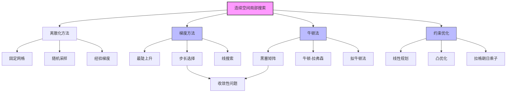

# 4.2 连续空间中的局部搜索

## 1. 背景与动机

### 1.1 历史背景

连续空间中的优化问题有着悠久的数学历史，可以追溯到17世纪牛顿和莱布尼茨发明微积分之后。牛顿-拉弗森法（Newton, 1671; Raphson, 1690）是连续空间上非常有效的局部搜索方法，它利用梯度信息快速收敛到最优解。

线性规划（Linear Programming）是运筹学中最重要的优化方法之一，最早由Leonid Kantorovich（1939）系统研究。单纯形算法（Dantzig, 1949）至今仍在广泛使用，尽管它在最坏情况下的复杂度为指数级。Karmarkar（1984）提出了更有效的内点方法，Nesterov和Nemirovski（1994）证明了对于更一般的凸优化问题类，内点法具有多项式复杂性。

### 1.2 研究动机

大多数真实世界环境都是连续的而非离散的。连续动作空间的分支因子是无限的，因此离散搜索算法（除了首选爬山法和模拟退火）无法直接处理连续空间。

连续空间中的优化问题出现在许多重要领域：
- **机器人学**：路径规划、运动控制
- **计算机视觉**：图像配准、相机标定
- **机器学习**：神经网络训练、超参数优化
- **工程设计**：结构优化、控制系统设计
- **经济学**：资源配置、投资组合优化

### 1.3 应用场景

| 应用领域 | 具体问题 | 变量类型 |
|---------|---------|---------|
| 设施选址 | 机场、仓库的最优位置 | 连续坐标 |
| 机器人运动 | 关节角度轨迹优化 | 连续角度 |
| 机器学习 | 神经网络权重优化 | 连续参数 |
| 控制理论 | 控制器参数调优 | 连续增益 |
| 金融工程 | 资产配置优化 | 连续比例 |

### 1.4 先决条件

学习本节内容需要掌握：
- 多元微积分（偏导数、梯度）
- 线性代数（矩阵运算）
- 第4.1节的局部搜索基础
- 基本的优化理论概念

---

## 2. 知识逻辑图谱

### 2.1 概念关系图



### 2.2 知识发展依赖链

```
微积分基础
    ↓
离散空间局部搜索（4.1节）
    ↓
连续空间特性
    ├─→ 离散化方法
    │       ├─→ 固定网格离散化
    │       ├─→ 随机采样
    │       └─→ 经验梯度
    │
    ├─→ 解析方法
    │       ├─→ 梯度计算
    │       │       ├─→ 最陡上升/下降
    │       │       └─→ 步长选择问题
    │       │               └─→ 线搜索技术
    │       │
    │       └─→ 二阶方法
    │               ├─→ 黑塞矩阵
    │               ├─→ 牛顿-拉弗森法
    │               └─→ 拟牛顿法（近似）
    │
    └─→ 约束优化
            ├─→ 线性规划
            ├─→ 凸优化
            └─→ 一般约束处理
```

---

## 3. 核心概念与数学分析

### 3.1 术语定义

| 术语（中文） | 术语（英文） | 定义 |
|------------|-------------|------|
| 连续状态空间 | Continuous State Space | 状态变量可以取连续值的状态空间 |
| 离散化 | Discretization | 将连续空间转换为离散网格的方法 |
| 变量 | Variable | 定义状态的连续值参数 |
| 目标函数 | Objective Function | 需要最大化或最小化的函数 $f(\boldsymbol{x})$ |
| 梯度 | Gradient | 目标函数的一阶偏导数向量，指向最陡上升方向 |
| 经验梯度 | Empirical Gradient | 通过测量相邻点间函数值差估计的梯度 |
| 步长 | Step Size | 每次迭代中沿梯度方向移动的距离，记为 $\alpha$ |
| 线搜索 | Line Search | 沿当前梯度方向寻找最优步长的技术 |
| 黑塞矩阵 | Hessian Matrix | 目标函数的二阶偏导数矩阵 |
| 牛顿-拉弗森法 | Newton-Raphson Method | 利用梯度和黑塞矩阵求函数根的迭代方法 |
| 约束优化 | Constrained Optimization | 解必须满足某些硬性约束的优化问题 |
| 线性规划 | Linear Programming | 约束为线性不等式、目标函数为线性的优化问题 |
| 凸优化 | Convex Optimization | 约束区域为凸集、目标函数为凸函数的优化问题 |
| 凸集 | Convex Set | 集合中任意两点连线仍在集合内的集合 |
| 凸函数 | Convex Function | 函数图像上任意两点连线在图像上方的函数 |

### 3.2 符号参考表

| 符号 | 含义 | 维度/类型 |
|-----|------|----------|
| $\boldsymbol{x}$ | 状态向量 | $n$维向量 |
| $x_i$ | 第$i$个状态变量 | 标量 |
| $f(\boldsymbol{x})$ | 目标函数 | 标量 |
| $\nabla f$ | 梯度向量 | $n$维向量 |
| $\frac{\partial f}{\partial x_i}$ | 对$x_i$的偏导数 | 标量 |
| $H_f$ | 黑塞矩阵 | $n \times n$矩阵 |
| $H_{ij}$ | 黑塞矩阵元素 | 标量 |
| $\alpha$ | 步长 | 正标量 |
| $\delta$ | 离散化步长 | 正标量 |
| $C_i$ | 最近机场为$i$的城市集合 | 集合 |
| $c$ | 城市索引 | 整数 |

### 3.3 关键公式

#### 3.3.1 机场选址问题目标函数

假设要在罗马尼亚新建3个机场，最小化每个城市到其最近机场的直线距离平方和：

$$f(\boldsymbol{x}) = f(x_1, y_1, x_2, y_2, x_3, y_3) = \sum_{i=1}^{3} \sum_{c \in C_i} (x_i - x_c)^2 + (y_i - y_c)^2$$

其中：
- $(x_i, y_i)$是第$i$个机场的坐标
- $C_i$是最近机场为$i$的城市集合
- $(x_c, y_c)$是城市$c$的坐标

#### 3.3.2 梯度向量

目标函数的梯度给出了最陡斜面的长度和方向：

$$\nabla f = \left(\frac{\partial f}{\partial x_1}, \frac{\partial f}{\partial y_1}, \frac{\partial f}{\partial x_2}, \frac{\partial f}{\partial y_2}, \frac{\partial f}{\partial x_3}, \frac{\partial f}{\partial y_3}\right)$$

对于机场问题，局部梯度为：

$$\frac{\partial f}{\partial x_1} = 2 \sum_{c \in C_1} (x_1 - x_c)$$

#### 3.3.3 最陡上升更新规则

$$\boldsymbol{x} \leftarrow \boldsymbol{x} + \alpha \nabla f(\boldsymbol{x})$$

其中$\alpha$是步长。

#### 3.3.4 牛顿-拉弗森更新规则

求根形式：
$$x \leftarrow x - \frac{g(x)}{g'(x)}$$

优化形式（求$\nabla f = 0$）：
$$\boldsymbol{x} \leftarrow \boldsymbol{x} - H_f^{-1}(\boldsymbol{x}) \nabla f(\boldsymbol{x})$$

其中$H_f^{-1}$是黑塞矩阵的逆。

---

## 4. 算法详解

### 4.1 离散化方法

#### 4.1.1 固定网格离散化

将连续变量限制在间距为$\delta$的固定网格点上。

**后继生成**：
- 6维空间中，每个状态有12个后继
- 对应于将6个变量分别增加$\pm \delta$

**优缺点**：
- 优点：可将任意离散搜索算法直接应用
- 缺点：精度受限于$\delta$，高维时后继数量指数增长

#### 4.1.2 随机采样

在随机方向上移动一个小量$\delta$，使分支因子变为有限值。

**经验梯度**：
通过测量两个邻近点间目标函数值的变化来估计梯度：

$$\frac{\partial f}{\partial x_i} \approx \frac{f(x_i + \delta) - f(x_i)}{\delta}$$

**收敛性**：
- 逐渐减小$\delta$可得到更准确的解
- 但不一定在极限范围内收敛到全局最优值

### 4.2 梯度方法

#### 4.2.1 最陡上升爬山法

利用解析梯度进行迭代优化：

```
1. 计算当前状态的梯度 ∇f(x)
2. 沿梯度方向更新：x ← x + α∇f(x)
3. 重复直到收敛
```

**关键问题**：步长$\alpha$的选择

| 步长 | 问题 |
|-----|------|
| 太小 | 需要太多迭代步 |
| 太大 | 可能越过最大值 |

#### 4.2.2 线搜索技术

通过不断延伸当前梯度方向来克服步长选择困境：

```
1. 从当前点开始，沿梯度方向
2. 反复加倍步长α，直到f开始减小
3. 将f开始减小的点作为新的当前状态
4. 选择新的方向继续
```

### 4.3 牛顿-拉弗森法

#### 4.3.1 算法原理

牛顿-拉弗森法是求函数根的通用方法，也可用于优化（求梯度为零的点）。

**核心思想**：利用二阶信息（黑塞矩阵）进行更精确的更新。

**黑塞矩阵**：

$$H_{ij} = \frac{\partial^2 f}{\partial x_i \partial x_j}$$

#### 4.3.2 机场问题示例

对于3个机场的选址问题：
- 非对角元素为零
- 机场$i$的对角线元素为$2|C_i|$（$C_i$中城市数的两倍）

**更新效果**：每一步将机场$i$直接移动到$C_i$的质心处。

#### 4.3.3 计算复杂度

- 黑塞矩阵有$n^2$个元素
- 每次迭代需要求逆
- 高维问题开销巨大

**解决方案**：拟牛顿法（Quasi-Newton Methods）
- 近似黑塞矩阵或其逆
- BFGS算法是最著名的拟牛顿法之一

### 4.4 约束优化

#### 4.4.1 问题定义

如果优化问题的解必须满足对变量值的一些硬性约束，则称为约束优化问题。

**示例**：机场选址限制在罗马尼亚境内的陆地上（而不是湖中心）。

#### 4.4.2 线性规划

**定义**：
- 约束：线性不等式，构成凸集
- 目标函数：线性

**性质**：
- 时间复杂度是关于变量数目的多项式
- 单纯形算法（最坏情况指数级）在实践中通常很快
- 内点法（Karmarkar, 1984）具有多项式复杂度保证

#### 4.4.3 凸优化

**定义**：
- 约束区域：任意凸区域
- 目标函数：凸函数（最小化）或凹函数（最大化）

**性质**：
- 多项式时间内可解
- 即使有上千个变量，也可能是实际可行的
- 机器学习中的许多重要问题可以形式化为凸优化问题

**凸函数判定**：
函数$f$是凸的，当且仅当：
$$f(\lambda x + (1-\lambda)y) \leq \lambda f(x) + (1-\lambda)f(y), \quad \forall \lambda \in [0,1]$$

---

## 5. 具体示例

### 5.1 单机场选址问题

**问题**：在罗马尼亚选择一个机场位置，最小化所有城市到机场的直线距离平方和。

**数学形式**：
$$f(x, y) = \sum_{c} [(x - x_c)^2 + (y - y_c)^2]$$

**求解**：

令梯度为零：
$$\frac{\partial f}{\partial x} = 2\sum_c (x - x_c) = 0$$
$$\frac{\partial f}{\partial y} = 2\sum_c (y - y_c) = 0$$

解得：
$$x^* = \frac{1}{n}\sum_c x_c, \quad y^* = \frac{1}{n}\sum_c y_c$$

**结论**：最优位置是所有城市坐标的算术平均值（质心）。

### 5.2 三机场选址问题

**问题**：在罗马尼亚新建3个机场，最小化每个城市到其最近机场的距离平方和。

**复杂性**：
- 状态空间是6维的
- 目标函数不是全局可微的（当最近机场集合改变时）
- 梯度表达式只在局部有效

**局部梯度**：
$$\frac{\partial f}{\partial x_1} = 2\sum_{c \in C_1} (x_1 - x_c)$$

**迭代过程**：

假设初始位置：
- 机场1：(100, 100)
- 机场2：(200, 200)
- 机场3：(300, 300)

**第1次迭代**：
1. 确定每个城市的最近机场，得到$C_1, C_2, C_3$
2. 计算梯度
3. 选择步长$\alpha = 0.1$
4. 更新位置

**收敛判断**：
- 当最近机场集合不再改变且梯度接近零时收敛
- 或者使用牛顿法直接跳到质心

### 5.3 离散化 vs 解析方法比较

**场景**：2D优化问题，目标函数为$f(x, y) = x^2 + 2y^2$

**离散化方法**：
- 网格间距$\delta = 0.1$
- 搜索范围：$[-5, 5] \times [-5, 5]$
- 需要评估$101 \times 101 = 10201$个点
- 精度：$\pm 0.1$

**解析梯度方法**：
- 梯度：$\nabla f = (2x, 4y)$
- 从$(3, 2)$开始，$\alpha = 0.2$
- 迭代：
  - 第1步：$(3, 2) \to (1.8, 0.4)$
  - 第2步：$(1.8, 0.4) \to (1.08, 0.08)$
  - 第3步：$(1.08, 0.08) \to (0.648, 0.016)$
- 快速收敛到$(0, 0)$

**牛顿法**：
- 黑塞矩阵：$H = \begin{bmatrix} 2 & 0 \\ 0 & 4 \end{bmatrix}$
- 一步收敛：$\boldsymbol{x} - H^{-1}\nabla f = (0, 0)$

---

## 6. 一句话本质

**连续空间局部搜索的本质是：利用微积分工具（梯度、黑塞矩阵）指导搜索方向，通过离散化或解析方法在无限状态空间中寻找最优解，而约束优化则通过问题结构的特殊性（线性、凸性）获得计算效率的保证。**

---

## 7. 总结与反思

### 7.1 关键要点

1. **连续空间的挑战**：
   - 无限分支因子
   - 需要微积分工具
   - 局部与全局行为的差异

2. **方法选择**：
   - 离散化：简单但精度受限
   - 经验梯度：无需解析表达式
   - 解析梯度：精确但需要可微
   - 牛顿法：快速收敛但计算开销大

3. **约束优化的重要性**：
   - 线性规划：多项式时间可解
   - 凸优化：多项式时间，广泛应用
   - 问题结构决定算法效率

### 7.2 常见误解对照表

| 误解 | 正确理解 |
|-----|---------|
| 连续空间只能用连续算法 | 离散化方法可以将连续问题转化为离散问题求解 |
| 梯度下降总能找到全局最优 | 梯度方法同样受局部最优影响 |
| 牛顿法总是最好的选择 | 牛顿法计算开销大，高维问题可能需要拟牛顿法 |
| 线性规划和凸优化是一回事 | 线性规划是凸优化的特例，凸优化允许非线性目标函数 |
| 经验梯度与解析梯度等价 | 经验梯度是近似，精度取决于步长选择 |

### 7.3 反思问题

1. 为什么3个机场的选址问题比1个机场困难得多？目标函数的什么性质导致了这种困难？

2. 比较离散化方法和梯度方法：在什么情况下一种方法优于另一种？

3. 设计一个连续优化问题，使得：
   - 梯度方法收敛很慢
   - 牛顿法一步收敛
   - 存在多个局部最优

4. 为什么凸优化问题比一般的约束优化问题更容易求解？

5. 在实际应用中，如何选择步长$\alpha$？线搜索的优缺点是什么？

### 7.4 公式速查表

| 公式 | 用途 |
|-----|------|
|$\nabla f = (\frac{\partial f}{\partial x_1}, ..., \frac{\partial f}{\partial x_n})$ | 计算梯度 |
|$\boldsymbol{x} \leftarrow \boldsymbol{x} + \alpha \nabla f(\boldsymbol{x})$ | 最陡上升更新 |
|$\boldsymbol{x} \leftarrow \boldsymbol{x} - H_f^{-1} \nabla f(\boldsymbol{x})$ | 牛顿法更新 |
|$H_{ij} = \frac{\partial^2 f}{\partial x_i \partial x_j}$ | 黑塞矩阵元素 |
|$f(\boldsymbol{x}) = \sum_{i} \sum_{c \in C_i} (x_i - x_c)^2 + (y_i - y_c)^2$ | 机场选址目标函数 |

---

## 8. 扩展阅读

### 8.1 进阶主题

1. **拟牛顿法**：BFGS、DFP算法，近似黑塞矩阵
2. **共轭梯度法**：介于梯度法和牛顿法之间的方法
3. **信赖域方法**：限制每次迭代的步长
4. **随机梯度下降（SGD）**：大规模机器学习中的标准方法
5. **进化策略**：连续空间中的进化算法

### 8.2 相关章节

- 第4.1节：离散空间中的局部搜索
- 第19章：机器学习中的优化
- 第20章：深度学习中的优化
- 附录：数值方法

### 8.3 参考文献

1. Brent, R.P. (1973). Algorithms for Minimization without Derivatives.
2. Bishop, C.M. (1995). Neural Networks for Pattern Recognition.
3. Boyd, S. & Vandenberghe, L. (2004). Convex Optimization.
4. Nesterov, Y. & Nemirovski, A. (1994). Interior-point Polynomial Algorithms in Convex Programming.
5. Press, W.H., et al. (2007). Numerical Recipes: The Art of Scientific Computing.
