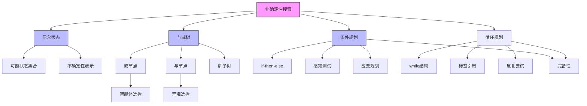

# 4.3 使用非确定性动作的搜索

## 1. 背景与动机

### 1.1 历史背景

非确定性环境中的规划问题是人工智能研究的经典课题。与或树（AND-OR Tree）的概念最早可追溯到20世纪60年代，Amarel（1967）将其应用于命题定理证明，Nilsson（1971）进一步发展了这一思想并提出了AO*算法。

"规划与行动"（Planning and Acting）的区分在20世纪70年代得到更多关注，特别是在机器人学项目中，如Shakey（Fikes et al., 1972）和Freddy（Michie, 1972）。这些项目很早就意识到真实环境的不可预测性。

21世纪初，与或搜索的兴趣重新复兴，出现了用于寻找循环解的新算法（Jimenez and Torras, 2000; Hansen and Zilberstein, 2001）以及受动态规划启发的新技术（Bonet and Geffner, 2005）。

### 1.2 研究动机

在第3章中，我们假设环境是完全可观测的、确定性的、已知的。因此，智能体可以观测到初始状态，计算出可以到达目标的动作序列，然后"闭着眼睛"执行这些动作，而不需要使用自己的感知。

然而，真实世界往往是非确定性的：
- 机器人执行动作可能失败或产生意外结果
- 网络传输可能丢包
- 医疗治疗可能效果不确定
- 投资可能收益不确定

在非确定性环境中，智能体所思考的不再是"我现在位于$s_1$状态，如果我执行$a$动作，我将会进入$s_2$状态"，而是"我现在位于$s_1$或$s_3$状态，如果我执行$a$动作，我将会进入$s_2$、$s_4$或$s_5$状态"。

### 1.3 应用场景

| 应用领域 | 非确定性来源 | 规划策略 |
|---------|-------------|---------|
| 机器人学 | 执行器误差、滑移 | 条件规划、容错设计 |
| 网络系统 | 丢包、延迟 | 重传机制、自适应路由 |
| 医疗决策 | 治疗效果不确定 | 治疗方案调整 |
| 供应链管理 | 需求波动、运输延迟 | 应急计划 |
| 游戏AI | 对手行为不确定 | 策略树搜索 |

### 1.4 先决条件

学习本节内容需要掌握：
- 第2章：智能体和环境的基本概念
- 第3章：基础搜索算法（尤其是树搜索）
- 基本的逻辑和集合论知识
- 递归算法概念

---

## 2. 知识逻辑图谱

### 2.1 概念关系图



### 2.2 知识发展依赖链

```
确定性搜索（第3章）
    ↓
非确定性假设引入
    ├─→ 信念状态概念
    │       └─→ 可能状态集合表示
    │
    ├─→ 转移模型扩展
    │       └─→ Results函数返回状态集合
    │
    ├─→ 与或树搜索
    │       ├─→ 或节点：智能体选择动作
    │       ├─→ 与节点：环境选择结果
    │       ├─→ 解子树定义
    │       └─→ 环处理策略
    │
    ├─→ 条件规划
    │       ├─→ if-then-else结构
    │       ├─→ 感知测试
    │       └─→ 树形解结构
    │
    └─→ 循环规划
            ├─→ while结构
            ├─→ 标签与引用
            └─→ 完备性条件
```

---

## 3. 核心概念与数学分析

### 3.1 术语定义

| 术语（中文） | 术语（英文） | 定义 |
|------------|-------------|------|
| 信念状态 | Belief State | 智能体认为其可能位于的物理状态集合 |
| 非确定性 | Nondeterminism | 执行动作后可能转移到多个不同结果的特性 |
| 条件规划 | Conditional Plan | 根据智能体接收到的感知来指定动作的规划 |
| 应变规划 | Contingency Plan | 考虑各种可能情况的规划 |
| 与或树 | AND-OR Tree | 包含或节点（智能体选择）和与节点（环境选择）的搜索树 |
| 或节点 | OR Node | 智能体在每个状态下选择动作的节点 |
| 与节点 | AND Node | 环境对每个动作的结果进行选择的节点 |
| 解子树 | Solution Subtree | 完整搜索树的子树，满足解的定义条件 |
| 循环规划 | Cyclic Plan | 包含循环结构的规划，用于处理反复尝试的情况 |
| 可解 | Solvable | 存在从初始状态到达目标的规划 |
| 环检测 | Cycle Detection | 识别并处理搜索树中的环路 |

### 3.2 符号参考表

| 符号 | 含义 | 上下文 |
|-----|------|--------|
|$b$ | 信念状态 | 非确定性搜索 |
|$s$ | 物理状态 | 状态空间 |
|$a$ | 动作 | 动作空间 |
|$\text{Results}(s, a)$ | 执行动作$a$后可能的状态集合 | 非确定性转移模型 |
|$\{5, 7\}$ | 信念状态示例 | 不稳定吸尘器世界 |
|$L_1$ | 规划标签 | 循环规划 |

### 3.3 关键公式

#### 3.3.1 非确定性转移模型

$$\text{Results}(s, a) = \{s'_1, s'_2, ..., s'_k\}$$

表示在状态$s$执行动作$a$可能转移到$k$个不同状态。

**示例**（不稳定吸尘器世界）：
$$\text{Results}(1, \text{Suck}) = \{5, 7\}$$

#### 3.3.2 条件规划结构

$$[\text{Suck}, \text{if State}=5 \text{ then [Right, Suck] else []]$$

表示：
1. 执行Suck
2. 如果当前状态是5，执行[Right, Suck]
3. 否则，执行空动作

#### 3.3.3 循环规划结构

$$[\text{Suck}, \text{while State}=5 \text{ do Right}, \text{Suck}]$$

或带标签形式：
$$[\text{Suck}, L_1: \text{Right}, \text{if State}=5 \text{ then } L_1 \text{ else Suck}]$$

---

## 4. 算法详解

### 4.1 与或搜索树

#### 4.1.1 节点类型

**或节点（OR Node）**：
- 对应于智能体需要做出选择的状态
- 智能体选择执行哪个动作
- 示例：在真空吸尘器世界中选择Left、Right或Suck

**与节点（AND Node）**：
- 对应于环境对动作结果的选择
- 每个可能结果都必须处理
- 结果分支间用弧线连接

#### 4.1.2 解的定义

与或搜索问题的解是完整搜索树的一棵子树，满足：
1. 每个叶子都是目标节点
2. 在每个或节点上选择一个动作
3. 每个与节点包括所有结果分支

#### 4.1.3 算法伪代码

```
function AND-OR-SEARCH(problem) returns 条件规划或失败
    return OR-SEARCH(problem, problem.INITIAL, [])

function OR-SEARCH(problem, state, path) returns 条件规划或失败
    if problem.IS-GOAL(state) then return 空规划
    if state 在 path 中 then return 失败
    for each action in problem.ACTIONS(state) do
        plan ← AND-SEARCH(problem, Results(state, action), [state | path])
        if plan ≠ 失败 then return [action | plan]
    return 失败

function AND-SEARCH(problem, states, path) returns 条件规划或失败
    for each state in states do
        plan ← OR-SEARCH(problem, state, path)
        if plan = 失败 then return 失败
    return 合并所有plan
```

#### 4.1.4 环处理

**关键策略**：如果当前状态与从根到它的路径上的某个状态相同，返回失败。

**原因**：
- 这并不意味着从当前状态出发没有解
- 如果存在非循环解，它肯定可以从当前状态的早期镜像到达
- 因此可以丢弃新的镜像

**终止性保证**：有了这一检查，算法在任何有限状态空间中都能终止。

### 4.2 不稳定吸尘器世界

#### 4.2.1 问题描述

**状态空间**：8种状态（见图4-9）
**动作**：Left、Right、Suck
**目标**：清理所有灰尘（状态7和8）

**非确定性Suck动作**：
- 在脏方格中：清理这一方格，有时也会清理相邻方格
- 在干净方格中：有时反而会把灰尘弄到地面上

#### 4.2.2 转移模型示例

$$\text{Results}(1, \text{Suck}) = \{5, 7\}$$

表示从状态1执行Suck可能转移到状态5（只清理当前位置）或状态7（同时清理两个位置）。

#### 4.2.3 条件规划解

从状态1出发的条件规划：

$$[\text{Suck}, \text{if State}=5 \text{ then [Right, Suck] else []]$$

**执行过程**：
1. 执行Suck
2. 观测当前状态：
   - 如果是状态5：执行[Right, Suck]到达状态8
   - 如果是状态7：已经是目标状态，执行空动作

### 4.3 光滑吸尘器世界与循环规划

#### 4.3.1 问题描述

**特点**：移动操作有时会失效，智能体停在原地。

**示例**：
$$\text{Results}(1, \text{Right}) = \{1, 2\}$$

#### 4.3.2 循环解的必要性

从状态1出发不存在非循环解，因为：
- 执行Right可能仍然留在状态1
- 无法保证一次移动就成功

#### 4.3.3 循环规划表示

**While结构**：
$$[\text{Suck}, \text{while State}=5 \text{ do Right}, \text{Suck}]$$

**标签结构**：
$$[\text{Suck}, L_1: \text{Right}, \text{if State}=5 \text{ then } L_1 \text{ else Suck}]$$

#### 4.3.4 循环规划的完备性条件

**最小条件**：
1. 每个叶节点都是目标状态
2. 叶节点可以从规划中的任意点到达

**额外考虑**：
- 如果非确定性是随机的、独立的，重复动作最终总会生效
- 如果非确定性来自不可观测的原因（如传动带断了），重复无用

---

## 5. 具体示例

### 5.1 不稳定吸尘器世界搜索树

**初始状态**：状态1

**第一层（或节点）**：
- 可选动作：Suck、Right
- 选择Suck

**第二层（与节点）**：
- Results(1, Suck) = {5, 7}
- 需要为状态5和状态7都找到规划

**第三层（或节点）**：
- 对于状态5：
  - 可选动作：Suck、Right
  - 选择Right → 到达状态6
  - 从状态6选择Suck → 到达状态8（目标）
- 对于状态7：
  - 已经是目标状态

**解子树**：
```
OR(状态1)
└── 选择: Suck
    AND
    ├── OR(状态5)
    │   └── 选择: Right
    │       AND
    │       └── OR(状态6)
    │           └── 选择: Suck → 目标状态8
    └── OR(状态7)
        └── 已经是目标
```

### 5.2 与或搜索算法执行 trace

**问题**：不稳定吸尘器世界，初始状态1

**OR-SEARCH(状态1, [])**：
1. 不是目标
2. 尝试动作Suck
3. 调用AND-SEARCH({5, 7}, [1])

**AND-SEARCH({5, 7}, [1])**：
1. 对状态5调用OR-SEARCH(5, [1])
2. 对状态7调用OR-SEARCH(7, [1])

**OR-SEARCH(5, [1])**：
1. 不是目标
2. 尝试动作Right
3. 调用AND-SEARCH({6}, [5, 1])

**AND-SEARCH({6}, [5, 1])**：
1. 调用OR-SEARCH(6, [5, 1])

**OR-SEARCH(6, [5, 1])**：
1. 不是目标
2. 尝试动作Suck
3. 调用AND-SEARCH({8}, [6, 5, 1])

**AND-SEARCH({8}, [6, 5, 1])**：
1. 调用OR-SEARCH(8, [6, 5, 1])

**OR-SEARCH(8, [6, 5, 1])**：
1. 是目标！返回空规划

**回溯**：
- AND-SEARCH({8}, ...)返回空规划
- OR-SEARCH(6, ...)返回[Suck]
- AND-SEARCH({6}, ...)返回[Suck]
- OR-SEARCH(5, ...)返回[Right, Suck]

**OR-SEARCH(7, [1])**：
1. 是目标！返回空规划

**最终解**：
$$[\text{Suck}, \text{if State}=5 \text{ then [Right, Suck] else []]$$

### 5.3 光滑吸尘器世界的循环解

**问题**：从状态1到达目标

**尝试非循环解**：
- 执行Right → 可能仍在状态1
- 无法保证到达状态2
- 非循环解不存在

**循环解**：
$$[L_1: \text{Right}, \text{if State}=1 \text{ then } L_1 \text{ else ...}]$$

**执行过程**：
1. 标签$L_1$：执行Right
2. 观测状态：
   - 如果仍在状态1：跳转到$L_1$，重复Right
   - 如果到达状态2：继续后续规划

**概率分析**（假设每次Right成功概率为$p$）：
- 第1次成功概率：$p$
- 第$k$次才成功概率：$(1-p)^{k-1}p$
- 期望尝试次数：$1/p$

---

## 6. 一句话本质

**非确定性搜索的本质是：在与或树中，智能体通过构造条件规划来应对环境的不确定性，确保无论环境选择哪种结果都能到达目标，而循环规划则通过反复尝试来处理执行失败的情况。**

---

## 7. 总结与反思

### 7.1 关键要点

1. **非确定性的表示**：
   - 使用Results函数返回状态集合
   - 信念状态表示可能的状态集合

2. **与或树的特点**：
   - 或节点：智能体选择动作
   - 与节点：环境选择结果，所有结果都必须处理
   - 解是子树而非路径

3. **条件规划**：
   - 包含if-then-else结构
   - 根据感知选择执行分支
   - 是树形结构而非线性序列

4. **循环规划**：
   - 用于处理反复尝试的情况
   - 需要保证最终成功（非无限循环）
   - 完备性取决于非确定性的性质

### 7.2 常见误解对照表

| 误解 | 正确理解 |
|-----|---------|
| 与或树中的"与"表示逻辑与 | "与"表示环境选择的所有结果都必须处理 |
| 环检测失败意味着无解 | 环检测失败只意味着不存在非循环解，循环解可能存在 |
| 条件规划总是比序列规划长 | 条件规划根据实际感知选择分支，执行时只走一条路径 |
| 循环规划就是无限循环 | 循环规划在条件满足时退出，是有效的解 |
| 非确定性规划一定需要感知 | 无传感器问题（4.4节）可以在没有感知的情况下求解 |

### 7.3 反思问题

1. 为什么与或搜索算法需要检测环？如果不检测环会发生什么？

2. 比较条件规划和循环规划：在什么情况下应该使用哪种？

3. 设计一个非确定性问题，使得：
   - 存在条件规划解
   - 不存在非循环解
   - 循环规划是唯一的解形式

4. 与或搜索与博弈树搜索（第5章）有什么相似之处和区别？

5. 如果非确定性来自对手的有意对抗，与或搜索还适用吗？为什么？

### 7.4 公式速查表

| 公式/结构 | 含义 |
|----------|------|
|$\text{Results}(s, a) = \{s'_1, ..., s'_k\}$ | 非确定性转移模型 |
|$[\text{if } c \text{ then } p_1 \text{ else } p_2]$ | 条件规划 |
|$[\text{while } c \text{ do } a]$ | 循环规划（while形式） |
|$L: a; ...; \text{if } c \text{ then } L$ | 循环规划（标签形式） |

---

## 8. 扩展阅读

### 8.1 进阶主题

1. **AO*算法**：寻找最优解的与或图搜索算法
2. **A*LD（A* Lightest Derivation）**：A*的自底向上一般化
3. **循环解算法**：处理非确定性问题中的循环规划
4. **部分可观测性与非确定性的结合**：第4.4节内容

### 8.2 相关章节

- 第4.4节：部分可观测环境中的搜索
- 第5章：对抗搜索（博弈）
- 第12章：不确定性推理
- 第17章：复杂决策制定

### 8.3 参考文献

1. Amarel, S. (1967). An approach to heuristic problem-solving and theorem proving in the propositional calculus.
2. Nilsson, N.J. (1971). Problem-Solving Methods in Artificial Intelligence.
3. Fikes, R.E., et al. (1972). Learning and executing generalized robot plans.
4. Hansen, E.A. & Zilberstein, S. (2001). LAO*: A heuristic search algorithm that finds solutions with loops.
5. Bonet, B. & Geffner, H. (2005). An algorithm better than AO*?
