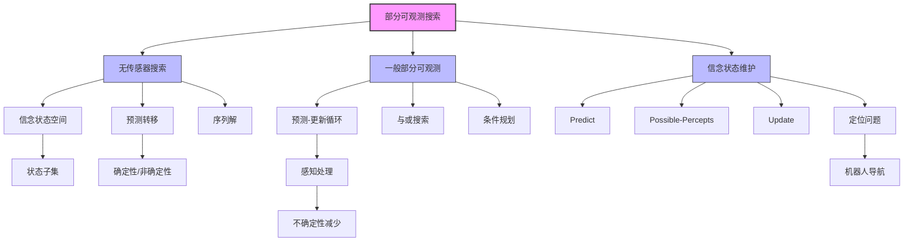

# 4.4 部分可观测环境中的搜索

## 1. 背景与动机

### 1.1 历史背景

部分可观测环境中的规划问题源于20世纪60年代Astrom（1965）处理概率不确定性的工作。Erdmann和Mason（1988）使用连续形式的信念状态搜索研究无传感器机器人操纵问题，展示了通过精心设计的动作序列可以让机器人从任意初始位置定向工作台上的零件。

信念状态方法由Genesereth和Nourbakhsh（1993）在无传感器、部分可观测搜索问题的背景下重新提出。Bonet和Geffner（2000）提出了第一个有效的信念状态搜索启发式方法，Russell和Wolfe（2005）提出了用于非确定性、部分可观测问题的增量算法。

### 1.2 研究动机

在第3章的完全可观测环境中，智能体始终知道当前的确切状态。然而，真实世界通常是部分可观测的：
- 机器人传感器有噪声或范围限制
- 医疗诊断无法直接观测病灶
- 网络监控无法观测所有节点状态
- 金融投资无法观测所有市场信息

在部分可观测环境中，智能体的感知不足以确定准确的状态。这意味着：
1. 智能体不确定它处于什么状态
2. 一些动作致力于减少状态不确定性
3. 问题的解需要考虑感知信息

### 1.3 应用场景

| 应用领域 | 部分可观测性来源 | 解决方案 |
|---------|-----------------|---------|
| 机器人定位 | 传感器噪声、遮挡 | 信念状态更新、定位算法 |
| 医疗诊断 | 无法直接观测病灶 | 检查、检验、逐步排除 |
| 网络监控 | 分布式系统、信息不完整 | 推断、探测 |
| 自动驾驶 | 传感器范围限制 | 多传感器融合 |
| 游戏AI | 战争迷雾、隐藏信息 | 信息收集、推断 |

### 1.4 先决条件

学习本节内容需要掌握：
- 第2章：智能体和环境的基本概念
- 第3章：基础搜索算法
- 第4.3节：非确定性搜索
- 基本的集合论和逻辑知识

---

## 2. 知识逻辑图谱

### 2.1 概念关系图



### 2.2 知识发展依赖链

```
完全可观测搜索（第3章）
    ↓
非确定性搜索（4.3节）
    ↓
部分可观测性引入
    ├─→ 无传感器问题（零感知）
    │       ├─→ 信念状态空间
    │       ├─→ 预测转移模型
    │       ├─→ 解为动作序列
    │       └─→ 增量搜索算法
    │
    ├─→ 一般部分可观测问题
    │       ├─→ 预测-观测-更新循环
    │       ├─→ 与或搜索算法
    │       ├─→ 条件规划解
    │       └─→ 信念状态维护
    │
    └─→ 定位问题
            ├─→ 地图已知
            ├─→ 动作非确定性
            ├─→ 感知确定性
            └─→ 快速收敛
```

---

## 3. 核心概念与数学分析

### 3.1 术语定义

| 术语（中文） | 术语（英文） | 定义 |
|------------|-------------|------|
| 部分可观测性 | Partial Observability | 智能体的感知不足以确定准确状态的情况 |
| 信念状态 | Belief State | 智能体可能位于的物理状态集合 |
| 无传感器问题 | Sensorless Problem | 感知根本不提供任何信息的问题 |
| 一致性规划 | Conformant Planning | 不依赖感知的规划 |
| 预测 | Prediction | 根据动作预测下一个信念状态 |
| 更新 | Update | 根据感知更新信念状态 |
| 可能感知 | Possible Percepts | 在给定信念状态下可以观测到的感知集合 |
| 强迫 | Coerce | 通过动作序列使世界到达特定状态 |
| 信念状态空间 | Belief State Space | 所有可能信念状态构成的空间 |
| 增量信念状态搜索 | Incremental Belief-State Search | 逐状态构造解的算法 |
| 定位 | Localization | 给定地图和感知序列，确定自身位置 |
| 递归状态评估器 | Recursive State Estimator | 根据前一状态计算新信念状态的公式 |
| 监视/过滤 | Monitoring/Filtering | 维护信念状态的过程 |

### 3.2 符号参考表

| 符号 | 含义 | 上下文 |
|-----|------|--------|
|$b$ | 信念状态 | 状态集合 |
|$\hat{b}$ | 预测的信念状态 | 预测阶段 |
|$b_o$ | 更新后的信念状态 | 给定感知$o$ |
|$o$ | 观测到的感知 | 感知值 |
|$\text{Percept}(s)$ | 在状态$s$接收到的感知 | 感知函数 |
|$\text{Results}(b, a)$ | 执行动作$a$后的可能信念状态集合 | 部分可观测转移 |
|$2^N$ | 信念状态空间大小 | $N$个物理状态 |

### 3.3 关键公式

#### 3.3.1 确定性动作的预测

$$b' = \text{Result}(b, a) = \{s' : s' = \text{Result}_P(s, a) \text{且} s \in b\}$$

对于确定性动作，$b'$不会大于$b$。

#### 3.3.2 非确定性动作的预测

$$b' = \text{Result}(b, a) = \bigcup_{s \in b} \text{Results}_P(s, a)$$

对于非确定性动作，$b'$可能大于$b$。

#### 3.3.3 可能感知集合

$$\text{POSSIBLE-PERCEPTS}(\hat{b}) = \{o : o = \text{PERCEPT}(s) \text{且} s \in \hat{b}\}$$

#### 3.3.4 信念状态更新

$$b_o = \text{UPDATE}(\hat{b}, o) = \{s : o = \text{PERCEPT}(s) \text{且} s \in \hat{b}\}$$

#### 3.3.5 部分可观测的完整转移

$$\text{Results}(b, a) = \{b_o : b_o = \text{UPDATE}(\text{Predict}(b, a), o) \text{且} o \in \text{POSSIBLE-PERCEPTS}(\text{Predict}(b, a))\}$$

#### 3.3.6 递归状态评估

$$b' = \text{UPDATE}(\text{PREDICT}(b, a), o)$$

---

## 4. 算法详解

### 4.1 无传感器搜索

#### 4.1.1 问题特点

- 感知根本不提供任何信息
- 问题的解是一个动作序列（不是条件规划）
- 在信念状态空间中搜索

#### 4.1.2 信念状态问题形式化

给定原始问题$P$，信念状态问题定义如下：

**状态**：信念状态空间包含物理状态的每一个可能子集。如果$P$有$N$个状态，信念状态问题有$2^N$个信念状态。

**初始状态**：通常包含$P$中的所有状态。

**动作**：
$$\text{Actions}(b) = \bigcup_{s \in b} \text{Actions}_P(s)$$

或者更安全的版本（交集）：
$$\text{Actions}(b) = \bigcap_{s \in b} \text{Actions}_P(s)$$

**转移模型**：见3.3.1和3.3.2。

**目标测试**：
- 可能到达目标：信念状态中任一状态满足目标测试
- 必定到达目标：信念状态中所有状态都满足目标测试

**路径代价**：假设同一动作在所有状态下具有相同代价。

#### 4.1.3 真空吸尘器世界示例

**初始信念状态**：$\{1, 2, 3, 4, 5, 6, 7, 8\}$（完全未知）

**执行Right后**：
- 可能到达状态：$\{2, 4, 6, 8\}$
- 智能体在没有感知的情况下获得了信息！

**执行[Right, Suck]后**：
- 信念状态：$\{4, 8\}$

**执行[Right, Suck, Left, Suck]后**：
- 必定到达状态7
- 智能体可以"强迫"世界到达目标

#### 4.1.4 可达信念状态空间

在确定性无传感器真空吸尘器世界中：
- 可能的信念状态：$2^8 = 256$个
- 实际可达的信念状态：只有12个

这表明信念状态空间虽然理论上很大，但实际上许多状态不可达。

#### 4.1.5 超集剪枝

**观察**：如果$b_1 \subset b_2$（$b_1$是$b_2$的真子集）：
- 从$b_2$出发的解一定也是$b_1$中每个状态的解
- 因此可以剪枝$b_2$，专注于$b_1$

**反向利用**：
- 如果$b_2$可解，则它的任何子集也可解
- "如果我在非常困惑时有解，那么不那么困惑时仍然有解"

### 4.2 一般部分可观测搜索

#### 4.2.1 三阶段转移模型

**预测阶段**：
$$\hat{b} = \text{PREDICT}(b, a)$$

计算由动作导致的信念状态。

**可能感知阶段**：
$$\text{POSSIBLE-PERCEPTS}(\hat{b})$$

计算在预测的信念状态下可以观测到的感知集合。

**更新阶段**：
$$b_o = \text{UPDATE}(\hat{b}, o)$$

为每个可能感知计算其可能得到的信念状态。

#### 4.2.2 观测的影响

- 预测阶段：非确定性会扩大信念状态
- 更新阶段：观测减少不确定性
- 对于确定性感知，不同感知的信念状态形成划分

#### 4.2.3 与或搜索求解

使用4.3节的与或搜索算法，但：
- 在信念状态空间中搜索
- 解测试的是信念状态而非实际状态
- 返回的条件规划根据信念状态选择分支

### 4.3 信念状态维护

#### 4.3.1 智能体架构

部分可观测环境中的智能体需要：
1. 对问题形式化
2. 调用搜索算法求解
3. 执行条件规划
4. 维护信念状态

#### 4.3.2 实时更新

给定初始信念状态$b$、动作$a$、感知$o$：

$$b' = \text{UPDATE}(\text{PREDICT}(b, a), o)$$

这是递归状态评估器，计算速度必须与感知进入速度一样快。

#### 4.3.3 近似信念状态

复杂环境中，智能体可能只有时间计算近似信念状态：
- 重点关注感兴趣的环境方面
- 使用概率论工具（第14章）

### 4.4 定位问题

#### 4.4.1 问题描述

**任务**：给定世界地图和一系列感知及行动，找到自己的位置。

**假设**：
- 地图已知
- 传感器完全正确
- 动作非确定性

#### 4.4.2 迷宫定位示例

**环境**：图4-18所示迷宫
**传感器**：4个声呐传感器，检测4个方向的障碍物
**感知格式**：4位向量（北、东、南、西），如1011表示北、南、西有障碍物

**执行过程**：

**初始**：信念状态 = 所有位置

**感知1011后**：
- 更新：$b_o = \text{UPDATE}(1011)$
- 可能位置：图4-18a所示4个位置

**执行Right后**：
- 预测：$b_a = \text{PREDICT}(b_o, \text{Right})$
- 包含与$b_o$中位置相邻的所有位置

**感知1010后**：
- 更新：$\text{UPDATE}(b_a, 1010)$
- 信念状态只剩1个位置（图4-18b）

#### 4.4.3 收敛性

对于地理上存在合理差异的环境：
- 定位往往迅速收敛到单个点
- 即使动作是非确定性的

例外：很长的同质走廊（如东西向走廊）
- 可能永远无法确定在走廊的哪个位置

---

## 5. 具体示例

### 5.1 无传感器真空吸尘器世界

**问题**：从完全未知状态到达目标（状态7或8）

**初始信念状态**：$b_0 = \{1, 2, 3, 4, 5, 6, 7, 8\}$

**执行[Right]后**：
- 从奇数状态(1,3,5,7) → 偶数状态(2,4,6,8)
- $b_1 = \{2, 4, 6, 8\}$

**执行[Right, Suck]后**：
- 状态2 → 状态4或6
- 状态4 → 状态4或8
- 状态6 → 状态6或8
- 状态8 → 状态8
- $b_2 = \{4, 6, 8\}$

**执行[Right, Suck, Left]后**：
- 状态4 → 状态3或5
- 状态6 → 状态5或7
- 状态8 → 状态7
- $b_3 = \{3, 5, 7\}$

**执行[Right, Suck, Left, Suck]后**：
- 所有状态都到达状态7
- $b_4 = \{7\}$

**结论**：智能体可以"强迫"世界到达目标状态7，无论初始状态是什么。

### 5.2 部分可Observable吸尘器世界

**传感器**：
- 位置传感器：L（左侧）或R（右侧）
- 灰尘传感器：Dirty或Clean

**初始感知**：[L, Dirty]
- 可能状态：状态1或状态3
- 初始信念状态：$b = \{1, 3\}$

**执行Suck**：
- 预测：
  - 状态1 → 状态5或7
  - 状态3 → 状态7
  - $\hat{b} = \{5, 7\}$
- 可能感知：
  - 状态5：[L, Clean]或[L, Dirty]
  - 状态7：[R, Clean]
- 更新后信念状态：
  - 如果感知[L, Clean]或[L, Dirty]：$\{5\}$
  - 如果感知[R, Clean]：$\{7\}$

**条件规划解**：
$$[\text{Suck}, \text{Right}, \text{if } b=\{6\} \text{ then Suck else } []]$$

### 5.3 机器人定位

**迷宫**：4×4网格，有障碍物
**传感器**：4方向障碍物检测
**动作**：非确定性移动

**Trace**：

| 步骤 | 动作 | 感知 | 信念状态大小 |
|-----|------|------|-------------|
| 0 | - | - | 16（所有位置） |
| 1 | - | 1011 | 4 |
| 2 | Right | - | 扩展 |
| 3 | - | 1010 | 1（唯一确定） |

**分析**：
- 第1次感知将可能位置从16减少到4
- 非确定性动作使信念状态扩展
- 第2次感知将信念状态缩小到1个位置

---

## 6. 一句话本质

**部分可Observable搜索的本质是：在信念状态空间中进行搜索，通过预测-观测-更新的循环维护可能状态集合，将不确定性转化为状态集合的表示，并构造条件规划来处理感知带来的分支。**

---

## 7. 总结与反思

### 7.1 关键要点

1. **信念状态表示**：
   - 用状态集合表示不确定性
   - 信念状态空间大小为$2^N$
   - 实际可达状态通常远少于理论值

2. **无传感器问题**：
   - 解是动作序列而非条件规划
   - 通过动作获取信息
   - 可以"强迫"世界到达目标

3. **一般部分可Observable问题**：
   - 预测-观测-更新三阶段
   - 观测减少不确定性
   - 使用与或搜索求解

4. **定位问题**：
   - 地图已知，位置未知
   - 通常能快速收敛
   - 同质环境可能无法完全定位

### 7.2 常见误解对照表

| 误解 | 正确理解 |
|-----|---------|
| 无传感器问题无解 | 许多无传感器问题有解，智能体可以通过动作获取信息 |
| 信念状态空间太大无法处理 | 虽然理论上有$2^N$个状态，但实际可达状态通常少得多 |
| 部分可Observable问题的解总是条件规划 | 无传感器问题的解是动作序列 |
| 观测总是减少不确定性 | 预测阶段可能扩大信念状态，更新阶段才减少 |
| 定位需要精确的动作执行 | 即使动作非确定性，定位也能收敛 |

### 7.3 反思问题

1. 为什么无传感器问题的解是动作序列而不是条件规划？这与一般部分可Observable问题有什么不同？

2. 设计一个环境，使得：
   - 无传感器问题有解
   - 需要最少的动作步数
   - 每个动作都提供最大信息增益

3. 比较信念状态搜索和原始状态空间搜索：在什么情况下信念状态方法更有效？什么情况下更困难？

4. 为什么同质走廊会导致定位困难？如何设计环境使得定位更容易？

5. 如果传感器有噪声（可能给出错误感知），信念状态更新应该如何修改？

### 7.4 公式速查表

| 公式 | 用途 |
|-----|------|
|$b' = \{s' : s' = \text{Result}_P(s, a), s \in b\}$ | 确定性预测 |
|$b' = \bigcup_{s \in b} \text{Results}_P(s, a)$ | 非确定性预测 |
|$b_o = \{s : o = \text{PERCEPT}(s), s \in \hat{b}\}$ | 信念状态更新 |
|$b' = \text{UPDATE}(\text{PREDICT}(b, a), o)$ | 递归状态评估 |

---

## 8. 扩展阅读

### 8.1 进阶主题

1. **概率信念状态**：使用概率分布而非集合表示不确定性（第12-14章）
2. **部分可Observable马尔可夫决策过程（POMDP）**：处理随机环境的统一框架
3. **信念状态压缩**：使用逻辑表示压缩信念状态
4. **主动感知**：选择动作以最大化信息增益

### 8.2 相关章节

- 第4.3节：非确定性搜索
- 第7章：逻辑智能体
- 第12章：不确定性推理
- 第14章：时间上的概率推理
- 第17章：复杂决策制定

### 8.3 参考文献

1. Astrom, K.J. (1965). Optimal control of Markov decision processes with incomplete state estimation.
2. Erdmann, M. & Mason, M. (1988). An exploration of sensorless manipulation.
3. Genesereth, M.R. & Nourbakhsh, I. (1993). Time-saving tips for problem solving with incomplete information.
4. Bonet, B. & Geffner, H. (2000). Planning with incomplete information as heuristic search in belief space.
5. Russell, S.J. & Wolfe, J. (2005). Efficient belief-state AND-OR search, with applications to Kriegspiel.
