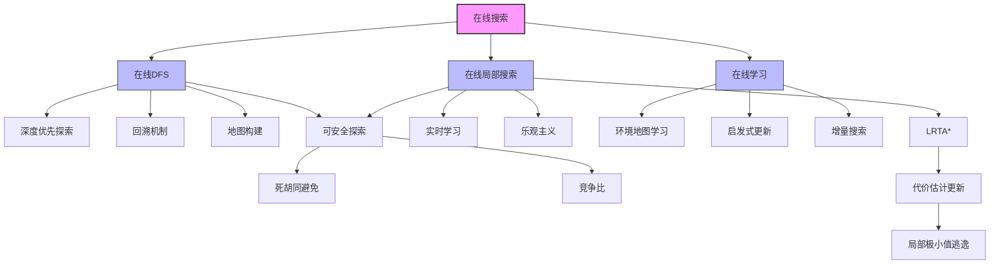

# 4.5 在线搜索智能体和未知环境

## 1. 背景与动机

### 1.1 历史背景

探索未知状态空间的算法几个世纪以来一直备受关注。在可逆迷宫中，"把左手一直放在墙上"可以实现深度优先搜索；在每个交叉点做标记可以避免环路。更一般的探索欧拉图（Eulerian graph）问题是由Hierholzer（1873）提出的算法解决的。

Deng和Papadimitriou（1990）第一次对任意图的探索问题进行了全面的算法研究，他们提出了一种完全通用的算法，但指出对一般图的探索不存在有界竞争比。Papadimitriou和Yannakakis（1991）研究了在几何路径规划环境中寻找目标路径的问题。

在线搜索算法LRTA*由Korf（1990）在对实时搜索环境进行调研时开发，该环境中智能体在搜索一定时间后必须采取动作（这在双人游戏中很常见）。

### 1.2 研究动机

到目前为止，我们主要关注使用离线搜索（offline search）算法的智能体。它们在执行第一个动作之前就已经计算出一个完整的解。然而，在许多实际场景中：
- 智能体对环境的状态和动作一无所知
- 需要一边前进一边学习
- 停止不动或计算时间太长都要付出代价

在线搜索（online search）智能体交替进行计算和动作：
1. 首先执行一个动作
2. 然后观测环境
3. 计算下一个动作

这种范式适用于：
- 动态或半动态环境
- 非确定性领域（将计算集中在实际发生的事件上）
- 完全未知的环境

### 1.3 应用场景

| 应用领域 | 特点 | 在线策略 |
|---------|------|---------|
| 地图构建 | 未知建筑探索 | 深度优先探索 |
| 迷宫逃脱 | 古代英雄问题 | 墙跟随、标记 |
| 机器人探索 | 未知行星表面 | 在线DFS、LRTA* |
| 新生儿学习 | 不知道动作后果 | 随机游走、试错 |
| 网络爬虫 | 未知链接结构 | 在线搜索、学习 |

### 1.4 先决条件

学习本节内容需要掌握：
- 第3章：基础搜索算法（尤其是深度优先搜索）
- 第4.1节：局部搜索（爬山法）
- 基本的图论知识
- 竞争分析概念

---

## 2. 知识逻辑图谱

### 2.1 概念关系图



### 2.2 知识发展依赖链

```
离线搜索（第3章）
    ↓
在线搜索范式
    ├─→ 在线搜索问题定义
    │       ├─→ 已知信息：Actions、代价、目标测试
    │       ├─→ 未知信息：Result(s, a)
    │       └─→ 竞争比概念
    │
    ├─→ 可安全探索性
    │       ├─→ 死胡同问题
    │       ├─→ 对手论证
    │       └─→ 可逆性
    │
    ├─→ 在线DFS智能体
    │       ├─→ 深度优先探索
    │       ├─→ 回溯机制
    │       ├─→ 地图存储
    │       └─→ 竞争比分析
    │
    ├─→ 在线局部搜索
    │       ├─→ 随机游走
    │       ├─→ LRTA*算法
    │       ├─→ 代价估计更新
    │       └─→ 乐观主义策略
    │
    └─→ 在线学习
            ├─→ 环境地图学习
            ├─→ 启发式更新
            └─→ 增量搜索技术
```

---

## 3. 核心概念与数学分析

### 3.1 术语定义

| 术语（中文） | 术语（英文） | 定义 |
|------------|-------------|------|
| 在线搜索 | Online Search | 交替进行计算和动作的搜索范式 |
| 离线搜索 | Offline Search | 在执行第一个动作前计算完整解的搜索 |
| 竞争比 | Competitive Ratio | 在线算法路径代价与最优路径代价的比值 |
| 可安全探索 | Safely Explorable | 从每个可达状态都存在可以到达的目标的状态空间 |
| 死胡同 | Dead End | 无法到达任何目标状态的状态 |
| 对手论证 | Adversary Argument | 证明算法性能下界的技术 |
| 不可逆 | Irreversible | 某些动作无法回到之前状态的情况 |
| 回溯 | Backtracking | 返回到之前状态的行为 |
| LRTA* | Learning Real-Time A* | 实时学习A*算法 |
| 乐观主义 | Optimism | 假设未探索动作以最少代价到达目标的策略 |
| 增量搜索 | Incremental Search | 利用之前搜索结果加速新搜索的技术 |

### 3.2 符号参考表

| 符号 | 含义 | 上下文 |
|-----|------|--------|
|$c(s, a, s')$ | 在$s$执行$a$到达$s'$的代价 | 在线问题 |
|$h(s)$ | 启发式函数 | 代价估计 |
|$H(s)$ | 学习到的代价估计 | LRTA* |
|$\text{result}[s, a]$ | 动作结果表 | 地图构建 |
|$\text{untried}[s]$ | 未探索动作列表 | 在线DFS |
|$\text{unbacktracked}[s]$ | 未回溯状态队列 | 在线DFS |
|$\alpha$ | 竞争比 | 性能分析 |

### 3.3 关键公式

#### 3.3.1 竞争比

$$\text{竞争比} = \frac{\text{在线算法路径代价}}{\text{已知环境中的最优路径代价}}$$

目标：使竞争比尽可能小。

#### 3.3.2 LRTA*代价估计

更新规则：
$$H[s] \leftarrow \min_{b \in \text{ACTIONS}(s)} \text{LRTA*-COST}(\text{problem}, s, b, \text{result}[s, b], H)$$

其中：
$$\text{LRTA*-COST}(problem, s, a, s', H) = \begin{cases} h(s) & \text{if } s' \text{未定义} \\ c(s, a, s') + H[s'] & \text{otherwise} \end{cases}$$

#### 3.3.3 在线DFS竞争比

对于探索：最优（每个连接恰好遍历两次）

对于寻找目标：可能无限差（如果目标就在初始状态旁边）

#### 3.3.4 在线迭代加深

对于均衡树环境：竞争比是一个很小的常数。

---

## 4. 算法详解

### 4.1 在线搜索问题

#### 4.1.1 问题定义

求解在线搜索问题需要交替进行计算、感知和动作。

**假设**：环境是确定性的和完全可观测的。

**智能体已知**：
- $\text{Actions}(s)$：状态$s$下的合法动作
- $c(s, a, s')$：在$s$下执行$a$到达$s'$的代价（前提是知道$s'$是结果）
- $\text{Is-Goal}(s)$：目标测试

**智能体未知**：
- $\text{Result}(s, a)$：除非实际执行了$a$

#### 4.1.2 可安全探索性

**死胡同问题**：
- 在线探索器容易陷入死胡同
- 如果智能体不知道每个动作的后果，可能"跳进陷阱"
- 没有算法能在所有状态空间中都避免进入死胡同

**对手论证**：
- 想象对手在智能体探索时构建状态空间
- 将目标和死胡同放在智能体选择的地方
- 证明某些情况下竞争比无界

**可安全探索定义**：
从每个可达状态出发都存在可以到达的目标状态。

**可安全探索的状态空间**：
- 所有动作都可逆的状态空间（如迷宫、8数码）
- 如果有解，显然是可安全探索的

### 4.2 在线DFS智能体

#### 4.2.1 算法思想

- 使用深度优先探索
- 维护环境地图（result表）
- 需要物理回溯（而非队列操作）

#### 4.2.2 数据结构

**result表**：
- 将$(s, a)$映射到$s'$
- 记录在$s$下执行$a$所产生的状态

**untried表**：
- 将$s$映射到未探索动作列表
- 记录每个状态还有哪些动作未尝试

**unbacktracked表**：
- 将$s$映射到未回溯状态队列
- 记录需要回溯到的前驱状态

#### 4.2.3 算法伪代码

```
function ONLINE-DFS-AGENT(problem, s') returns 一个动作
    persistent: 
        s, a: 之前的状态和动作，初始为空
        result: 将(s, a)映射到s'的表，初始为空
        untried: 将s映射到未探索动作列表的表
        unbacktracked: 将s映射到未回溯状态队列的表
    
    if problem.IS-GOAL(s') then return stop
    
    if s'是一个（不在untried中的）新状态 then
        untried[s'] ← problem.ACTIONS(s')
    
    if s不空 then
        result[s, a] ← s'
        将s添加到unbacktracked[s']的队尾
    
    if untried[s']为空 then
        if unbacktracked[s']为空 then return stop
        else
            s', a ← null, 使得result[s', b] = POP(unbacktracked[s'])的动作b
    else
        a ← POP(untried[s'])
    
    s ← s'
    return a
```

#### 4.2.4 性能分析

**探索**：
- 最坏情况下，恰好遍历状态空间中的每个连接两次
- 对于探索来说是最优的

**寻找目标**：
- 如果目标就在初始状态旁边，竞争比可能无限差
- 在线迭代加深可以解决这个问题

**限制**：
- 只在动作可逆的状态空间中有效
- 一般状态空间需要更复杂的算法

### 4.3 在线局部搜索

#### 4.3.1 随机游走

**策略**：从当前状态中随机选择一个可用动作，优先考虑尚未尝试的动作。

**完备性**：
- 当空间有限且可安全探索时，随机游走最终会找到目标或完成探索
- 但可能非常慢

**陷阱示例**：
- 某些状态空间拓扑会导致指数级步骤
- 后退的可能性大于前进

#### 4.3.2 LRTA*算法

**核心思想**：存储从已访问的每个状态出发到达目标所需代价的"当前最佳估计"$H(s)$。

**算法特点**：
- $H(s)$开始时是启发式估计
- 根据经验不断更新
- 选择"显然最佳"移动

**乐观主义策略**：
- 尚未尝试的动作被假定为以$h(s)$直接到达目标
- 鼓励智能体探索新的、可能更有希望的路径

**算法伪代码**：

```
function LRTA*-AGENT(problem, s', h) returns 一个动作
    persistent:
        s, a: 之前的状态和动作，初始为空
        result: 将(s, a)映射到s'的表，初始为空
        H: 将s映射到代价估计值的表，初始为空
    
    if IS-GOAL(s') then return stop
    
    if s'是一个（不在H中的）新状态 then
        H[s'] ← h(s')
    
    if s不空 then
        result[s, a] ← s'
        H[s] ← min_{b∈ACTIONS(s)} LRTA*-COST(problem, s, b, result[s, b], H)
    
    a ← arg min_{b∈ACTIONS(s')} LRTA*-COST(problem, s', b, result[s', b], H)
    s ← s'
    return a

function LRTA*-COST(problem, s, a, s', H) returns 一个代价估计值
    if s'未定义 then return h(s)
    else return problem.ACTION-COST(s, a, s') + H[s']
```

#### 4.3.3 LRTA*性能

**完备性**：
- 在任何有限的、可安全探索的环境中都能找到目标
- 不同于A*，在无限状态空间中是不完备的

**复杂度**：
- 最坏情况下，探索状态数为$n$的环境可能需要$O(n^2)$步
- 通常比这种情况好得多

### 4.4 在线搜索中的学习

#### 4.4.1 学习内容

**环境地图**：
- 记录每种状态下每个动作的结果
- 存储在result表中

**代价估计**：
- 局部搜索智能体利用局部更新规则获得更准确的估计值
- 一旦知道准确值，纯粹的爬山法就是最优策略

#### 4.4.2 增量搜索

**动机**：如果预计将来会被要求求解多个类似问题，投入时间使未来搜索更容易是有意义的。

**技术**：
1. **保留搜索树**：复用在新问题中未发生改变的部分
2. **保留启发式值**：在获得新信息时更新
3. **保留$g$值**：拼凑新解，并在世界改变时更新

**应用**：
- 终身规划A*（Lifelong Planning A*）
- D* Lite

---

## 5. 具体示例

### 5.1 迷宫探索

**问题**：图4-19所示迷宫，智能体从S出发到达G，但对环境一无所知。

**在线DFS执行**：

| 步骤 | 当前状态 | 动作 | 结果 | 备注 |
|-----|---------|------|------|------|
| 1 | S | Up | (1,2) | 探索新状态 |
| 2 | (1,2) | Right | (2,2) | 探索新状态 |
| 3 | (2,2) | Up | (2,3) | 探索新状态 |
| 4 | (2,3) | Up | 墙 | 记录不可行 |
| 5 | (2,3) | Right | (3,3) | 探索新状态 |
| ... | ... | ... | ... | ... |
| n | G | - | - | 到达目标 |

**回溯示例**：
- 当到达死胡同时，需要回溯到上一个有未探索动作的状态
- 使用unbacktracked表确定回溯路径

### 5.2 LRTA*执行示例

**一维状态空间**：状态1-5，目标在状态5，每个连接代价为1

**初始**：
- $H(1) = H(2) = H(3) = H(4) = H(5) = h(s)$（启发式估计）
- 假设$h(s) = |5-s|$

**第1次迭代**：在状态3（红色）
- 选择：向左到2（代价$1+H(2)=1+2=3$）或向右到4（代价$1+H(4)=1+1=2$）
- 选择向右到4

**第2次迭代**：在状态4
- 更新$H(3) = \min(1+H(2), 1+H(4)) = \min(3, 2) = 2$
- 选择向右到5

**第3次迭代**：在状态5（目标）
- 更新$H(4) = 1+H(5) = 1+0 = 1$

**后续**：智能体学习到更准确的代价估计，可以做出最优决策。

### 5.3 竞争比分析

**场景1**：线性状态空间，目标在最右端

| 算法 | 路径代价 | 最优代价 | 竞争比 |
|-----|---------|---------|--------|
| 在线DFS | $2(n-1)$ | $n-1$ | 2 |
| LRTA* | $n-1$ | $n-1$ | 1 |

**场景2**：目标就在初始状态旁边，但在线DFS先探索其他分支

| 算法 | 路径代价 | 最优代价 | 竞争比 |
|-----|---------|---------|--------|
| 在线DFS | $2(n-1)$ | 1 | $2(n-1)$ |
| 随机游走 | $O(n^2)$ | 1 | $O(n^2)$ |

**场景3**：均衡树环境

| 算法 | 竞争比 |
|-----|--------|
| 在线迭代加深 | 小常数 |
| 在线DFS | 可能很大 |

---

## 6. 一句话本质

**在线搜索的本质是：在未知环境中通过交替执行动作和学习来探索世界，利用深度优先探索或实时学习算法构建环境地图，并通过竞争比来衡量算法性能与最优离线解的差距。**

---

## 7. 总结与反思

### 7.1 关键要点

1. **在线vs离线**：
   - 在线：交替计算和动作，适用于未知环境
   - 离线：先计算完整解，适用于已知环境
   - 竞争比衡量在线算法的性能

2. **可安全探索性**：
   - 不是所有状态空间都可安全探索
   - 死胡同是在线搜索的真正难点
   - 动作可逆性保证可安全探索

3. **在线DFS**：
   - 深度优先探索
   - 需要物理回溯
   - 探索最优，但寻找目标可能很差

4. **LRTA***：
   - 实时学习代价估计
   - 乐观主义鼓励探索
   - 有限环境中完备

5. **学习**：
   - 学习环境地图
   - 更新启发式估计
   - 增量搜索复用之前结果

### 7.2 常见误解对照表

| 误解 | 正确理解 |
|-----|---------|
| 在线搜索总是比离线搜索差 | 在线搜索适用于未知环境，离线搜索甚至无法执行 |
| 在线DFS的物理回溯与离线DFS的队列回溯相同 | 物理回溯需要实际移动，代价更高 |
| LRTA*与A*相同 | LRTA*实时学习，A*需要完整搜索空间 |
| 随机游走总是很慢 | 虽然可能很慢，但在某些情况下是有效的探索策略 |
| 竞争比有界意味着算法总是很好 | 竞争比是相对于最优解的比值，最优解本身可能很大 |

### 7.3 反思问题

1. 为什么在线DFS在探索时是最优的，但在寻找目标时可能很差？如何改进？

2. 设计一个状态空间，使得：
   - 在线DFS表现很差
   - LRTA*表现很好
   - 随机游走需要指数级步骤

3. LRTA*的"乐观主义"策略有什么优缺点？在什么情况下可能失效？

4. 比较增量搜索和从头开始搜索：在什么情况下增量搜索更有优势？

5. 如果环境是动态变化的（世界状态自发改变），在线搜索算法需要如何修改？

### 7.4 公式速查表

| 公式/概念 | 含义 |
|----------|------|
|$\text{竞争比} = \frac{\text{在线代价}}{\text{最优代价}}$ | 性能度量 |
|$H[s] \leftarrow \min \text{LRTA*-COST}$ | 代价估计更新 |
|$\text{LRTA*-COST} = h(s)$（未探索） | 乐观主义策略 |
|$\text{LRTA*-COST} = c + H[s']$（已探索） | 实际代价估计 |

---

## 8. 扩展阅读

### 8.1 进阶主题

1. **终身规划A*（LPA*）**：处理环境动态变化的增量搜索
2. **D* Lite**：用于动态路径规划的增量搜索算法
3. **实时搜索的其他变体**：不同动作选择和更新规则
4. **探索-利用权衡**：多臂老虎机、强化学习

### 8.2 相关章节

- 第4.1节：局部搜索
- 第17章：复杂决策制定
- 第22章：强化学习
- 第3.6节：启发式函数

### 8.3 参考文献

1. Deng, X. & Papadimitriou, C.H. (1990). Exploring an unknown graph.
2. Papadimitriou, C.H. & Yannakakis, M. (1991). Shortest paths without a map.
3. Korf, R.E. (1990). Real-time heuristic search.
4. Koenig, S. & Likhachev, M. (2002). D* Lite.
5. Koenig, S., et al. (2004). Lifelong Planning A*.
