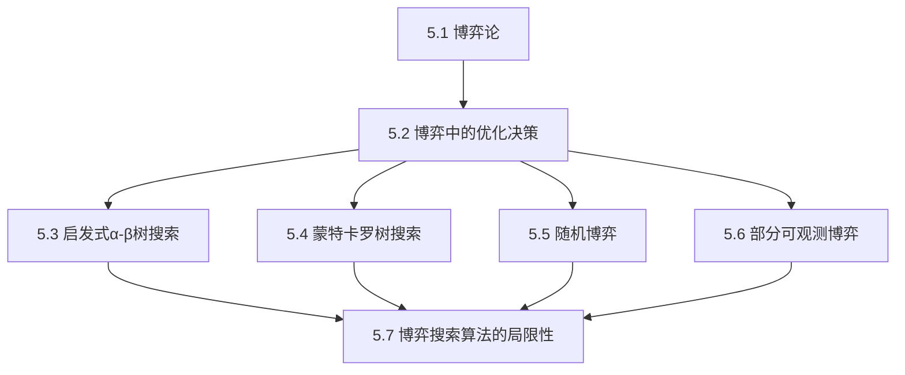
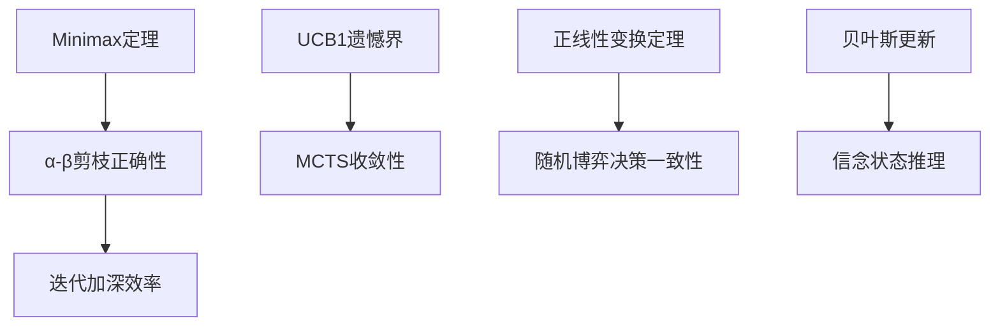

# 第5章 对抗搜索和博弈 - 概览与总结

## 学习目标

完成本章学习后，你应该能够：

1. **理解博弈的形式化定义**：掌握如何用六元组形式化描述博弈，理解双人零和博弈的特性。

2. **掌握极小化极大算法**：能够手动计算简单博弈树的Minimax值，理解最优策略的递归定义。

3. **应用α-β剪枝**：理解剪枝的原理和条件，能够计算剪枝后的搜索复杂度。

4. **设计启发式评价函数**：理解评价函数的性质要求，能够设计简单的加权线性评价函数。

5. **理解蒙特卡罗树搜索**：掌握MCTS的四个步骤（选择、扩展、模拟、反向传播），理解UCB公式的作用。

6. **分析随机博弈**：理解期望极小化极大算法，掌握机会节点的期望计算方法。

7. **处理部分可观测性**：理解信念状态的概念，了解部分可观测博弈中的信息收集和随机策略。

8. **认识算法局限性**：理解启发式误差、元推理、层次规划和学习能力的重要性。

## 本章速览

### 5.1 博弈论
- 博弈的六元组形式化定义
- 双人零和博弈的特性
- 博弈树规模分析
- 从井字棋到国际象棋的复杂度对比

### 5.2 博弈中的优化决策
- 极小化极大值的递归定义
- 极小化极大算法及其复杂度
- α-β剪枝原理与证明
- 多人博弈的效用向量

### 5.3 启发式α-β树搜索
- 启发式评价函数设计
- 加权线性函数与非线性组合
- 截断搜索与静态搜索
- 视野效应与单步延伸

### 5.4 蒙特卡罗树搜索
- 纯蒙特卡罗搜索
- UCB1公式与探索-利用平衡
- MCTS的四个步骤
- AlphaGo的应用

### 5.5 随机博弈
- 机会节点与期望极小化极大
- 西洋双陆棋的概率分布
- 评价函数的正线性变换要求
- 复杂度分析

### 5.6 部分可观测博弈
- 信念状态建模
- 四国军棋与扑克
- 观测力平均的局限
- 抽象技术

### 5.7 博弈搜索算法的局限性
- 启发式误差传播
- 元推理框架
- 层次规划的必要性
- 学习能力的不足

## 难度预警

| 小节 | 难度 | 关键挑战 |
|-----|------|---------|
| 5.1 博弈论 | ⭐⭐ | 形式化定义的抽象思维 |
| 5.2 博弈中的优化决策 | ⭐⭐⭐ | α-β剪枝的逻辑理解 |
| 5.3 启发式α-β树搜索 | ⭐⭐⭐ | 评价函数设计与视野效应 |
| 5.4 蒙特卡罗树搜索 | ⭐⭐⭐⭐ | UCB公式的统计原理 |
| 5.5 随机博弈 | ⭐⭐⭐ | 期望值计算与正线性变换 |
| 5.6 部分可观测博弈 | ⭐⭐⭐⭐ | 信念状态更新与抽象 |
| 5.7 博弈搜索算法的局限性 | ⭐⭐⭐ | 元推理概念的理解 |

## 前置知识

- **第3章 通过搜索进行问题求解**：搜索算法基础、A*算法、启发式函数
- **第4章 约束满足问题**：与或搜索、回溯算法
- **概率论基础**：期望值、条件概率、贝叶斯规则
- **算法分析**：时间复杂度、空间复杂度、递归

## 节依赖图



## 定理清单

| 定理 | 内容 | 所在小节 |
|-----|------|---------|
| 极小化极大定理 | 双人零和博弈中存在最优策略 | 5.2 |
| α-β剪枝正确性 | 剪枝不改变最优决策 | 5.2 |
| UCB1遗憾界 | 遗憾增长为O(ln T) | 5.4 |
| 正线性变换一致性 | 正线性变换保持决策一致性 | 5.5 |
| 信念状态更新 | 贝叶斯规则在信念状态空间的应用 | 5.6 |

## 核心逻辑线索

本章的核心逻辑是**从理论到实践、从简单到复杂**的演进：

1. **形式化基础**（5.1）：建立博弈的数学模型
2. **最优决策**（5.2）：在完美信息假设下寻找最优策略
3. **计算可行性**（5.3-5.4）：在资源限制下寻找近似最优策略
4. **扩展复杂性**（5.5-5.6）：处理随机性和不完全信息
5. **反思与展望**（5.7）：认识局限性，指向未来方向

## 核心要点速查

### 关键公式

**Minimax值**：
$$\text{Minimax}(s) = \begin{cases} \text{Utility}(s) & \text{终止状态} \\ \max_a \text{Minimax}(\text{Result}(s,a)) & \text{MAX节点} \\ \min_a \text{Minimax}(\text{Result}(s,a)) & \text{MIN节点} \end{cases}$$

**α-β剪枝复杂度**：最优情况$O(b^{m/2})$，随机情况$O(b^{3m/4})$，最坏情况$O(b^m)$

**UCB1公式**：
$$\text{UCB1}(n) = \frac{U(n)}{N(n)} + C \sqrt{\frac{\ln N(\text{Parent}(n))}{N(n)}}$$

**期望极小化极大**：
$$\text{Expectiminimax}(s) = \sum_r P(r) \cdot \text{Expectiminimax}(\text{Result}(s,r)) \quad \text{（机会节点）}$$

### 关键概念对比

| 概念 | 确定性博弈 | 随机博弈 | 部分可观测博弈 |
|-----|-----------|---------|--------------|
| 博弈树节点 | MAX/MIN | MAX/MIN/CHANCE | 信息集 |
| 最优值 | Minimax | Expectiminimax | 均衡策略 |
| 评价函数 | 序关系 | 正线性变换 | 信念状态评估 |
| 复杂度 | $O(b^m)$ | $O(b^m n^m)$ | 指数级更大 |

## 概念对比表

### Minimax vs MCTS

| 特性 | Minimax+α-β | MCTS |
|-----|------------|------|
| 评估方式 | 启发式评价函数 | 模拟到终止 |
| 适用博弈 | 评价函数好的博弈 | 高分支因子、难评估 |
| 搜索深度 | 有限深度 | 完整对局 |
| 并行性 | 较难 | 容易 |
| 理论保证 | 最优（给定评价函数） | 渐近收敛 |
| 代表程序 | Stockfish | AlphaGo |

### 完美信息 vs 部分可观测

| 特性 | 完美信息 | 部分可观测 |
|-----|---------|-----------|
| 状态知识 | 完全已知 | 信念状态 |
| 策略类型 | 纯策略 | 混合策略 |
| 求解方法 | Minimax | 均衡求解 |
| 计算复杂度 | 高 | 极高 |
| 代表博弈 | 国际象棋、围棋 | 扑克、四国军棋 |

## 定理依赖图



## 常见误解澄清

| 误解 | 澄清 |
|-----|------|
| α-β剪枝改变最优决策 | 剪枝只剪掉不影响结果的分支，决策与完整Minimax相同 |
| MCTS就是随机搜索 | MCTS是有指导的搜索，UCB智能分配计算资源 |
| 搜索越深效果越好 | 过深搜索可能遇到视野效应，且计算成本指数增长 |
| 评价函数只需保持序关系 | 在随机博弈中，必须是期望效用的正线性变换 |
| 部分可观测博弈纯策略足够 | 许多情况下需要随机策略来达到均衡 |
| 观测力平均是合理近似 | 忽略信念状态和信息价值，可能导致严重错误 |

## 本章测验

### 选择题

1. 在极小化极大算法中，MIN节点的值是其子节点的：
   - A. 最大值
   - B. 最小值
   - C. 平均值
   - D. 中位数
   
   **答案：B**

2. α-β剪枝在最优移动排序下的时间复杂度是：
   - A. $O(b^m)$
   - B. $O(b^{m/2})$
   - C. $O(b^{3m/4})$
   - D. $O(m^b)$
   
   **答案：B**

3. UCB1公式中的第二项（带平方根的项）主要作用是：
   - A. 利用已知好的选择
   - B. 探索不确定性高的选择
   - C. 计算平均效用
   - D. 更新信念状态
   
   **答案：B**

### 计算题

4. 考虑以下博弈树：
   ```
           MAX
          / | \
        3   5   2
   ```
   计算根节点的Minimax值和最优动作。
   
   **答案**：Minimax值为5，最优动作是中间分支。

5. 在随机博弈中，某机会节点有两个子节点，效用值分别为10和20，概率各为0.5。计算该机会节点的期望效用。
   
   **答案**：$0.5 \times 10 + 0.5 \times 20 = 15$

## 快速复习卡

### 核心概念
- **Minimax**：假设对手最优，选择最坏情况下最好的动作
- **α-β剪枝**：利用值边界剪掉不可能影响决策的分支
- **MCTS**：通过随机模拟评估状态，UCB平衡探索与利用
- **信念状态**：给定观测下所有可能实际状态的集合
- **均衡策略**：在部分可观测博弈中，随机策略通常是必要的

### 关键算法
- **Minimax算法**：递归计算博弈树值，时间复杂度$O(b^m)$
- **α-β搜索**：带剪枝的Minimax，最优情况$O(b^{m/2})$
- **MCTS**：选择-扩展-模拟-反向传播四步循环
- **Expectiminimax**：处理机会节点的扩展Minimax

### 复杂度对比
- 井字棋：$9! = 362,880$
- 国际象棋：$10^{123}$（香农数）
- 围棋：$10^{385}$

## 扩展阅读

### 经典论文
1. Shannon, C. E. (1950). Programming a Computer for Playing Chess. *Philosophical Magazine*.
2. Knuth, D. E., & Moore, R. W. (1975). An Analysis of Alpha-Beta Pruning. *Artificial Intelligence*.
3. Kocsis, L., & Szepesvári, C. (2006). Bandit Based Monte-Carlo Planning. *ECML*.
4. Silver, D., et al. (2016). Mastering the Game of Go with Deep Neural Networks and Tree Search. *Nature*.
5. Silver, D., et al. (2018). A General Reinforcement Learning Algorithm that Masters Chess, Shogi, and Go through Self-Play. *Science*.

### 相关章节
- 第3章：通过搜索进行问题求解
- 第4章：约束满足问题
- 第16章：做简单决策（效用理论）
- 第17章：做复杂决策（博弈论）
- 第18章：多智能体决策
- 第22章：强化学习

### 在线资源
- [Chess Programming Wiki](https://www.chessprogramming.org/)
- [MuZero论文](https://arxiv.org/abs/1911.08265)
- [AlphaGo纪录片](https://www.youtube.com/watch?v=WXuK6gekU1Y)

---

*本章概览提供了第5章的整体框架和核心要点。建议在学习各小节后返回本概览，检查是否达成了学习目标。*
