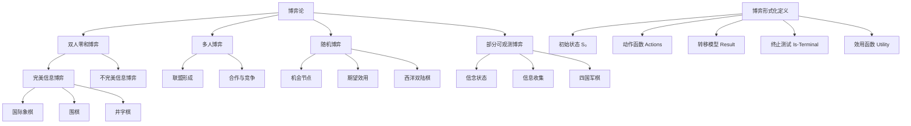

# 5.1 博弈论

## 1. 背景与动机

### 1.1 历史背景

博弈论（Game Theory）作为数学的一个分支，其历史可以追溯到20世纪初。1912年，现代集合论的创始人厄恩斯特·策梅洛（Ernst Zermelo）发表了关于博弈的数学分析论文，首次提出了极小化极大算法的理论基础。这篇开创性的工作为后来的博弈论发展奠定了严格的数学基础。

1944年，约翰·冯·诺依曼（John von Neumann）和奥斯卡·摩根斯特恩（Oskar Morgenstern）合著的《博弈论与经济行为》（Theory of Games and Economic Behavior）标志着现代博弈论的正式诞生。他们将博弈论从简单的零和游戏扩展到更一般的合作与非合作博弈，并引入了期望效用理论。

1950年，克劳德·香农（Claude Shannon）发表了具有里程碑意义的论文"Programming a Computer for Playing Chess"，系统阐述了计算机下棋的核心思想：棋盘表示、评价函数、搜索算法等。同年，约翰·纳什（John Nash）提出了著名的纳什均衡概念，为非合作博弈提供了核心解概念。

### 1.2 研究动机

人工智能研究博弈问题具有多重动机：

**理论动机**：博弈提供了一个结构化的环境来研究智能体之间的交互。与真实世界的混乱冲突相比，博弈具有明确的规则、有限的状态空间和清晰的目标，是研究智能行为的理想实验室。

**实践动机**：从国际象棋、围棋到扑克，博弈一直是检验人工智能算法能力的试金石。1997年深蓝击败卡斯帕罗夫、2016年AlphaGo击败李世石，这些里程碑事件标志着AI技术的重大突破。

**方法论动机**：博弈论为分析多智能体系统提供了严格的数学框架。通过研究博弈，我们可以开发出能够进行策略推理、对手建模和决策优化的智能体。

### 1.3 应用场景

博弈论和对抗搜索技术在多个领域有广泛应用：

| 应用领域 | 具体场景 | 核心技术 |
|---------|---------|---------|
| 棋类游戏 | 国际象棋、围棋、跳棋 | α-β剪枝、MCTS、深度学习 |
| 纸牌游戏 | 扑克、桥牌、德州扑克 | 不完全信息博弈、博弈论均衡 |
| 经济分析 | 拍卖设计、市场竞争 | 机制设计、纳什均衡 |
| 安全领域 | 网络安全、军事策略 | 博弈论模型、随机策略 |
| 多智能体系统 | 机器人足球、自动驾驶 | 分布式决策、对手建模 |

### 1.4 先决条件

学习本节内容需要具备以下基础知识：
- **搜索算法**：深度优先搜索、广度优先搜索、A*算法
- **数据结构**：树、图、递归
- **数学基础**：集合论、概率论、函数与映射
- **算法分析**：时间复杂度、空间复杂度

## 2. 知识逻辑图谱

### 2.1 概念关系图



### 2.2 知识发展依赖链

```
博弈形式化定义
    ↓
双人零和博弈
    ↓
完美信息博弈 ← 极小化极大算法
    ↓
α-β剪枝优化
    ↓
启发式搜索 ← 评价函数
    ↓
蒙特卡罗树搜索
    ↓
随机博弈 ← 期望极小化极大
    ↓
部分可观测博弈 ← 信念状态
```

## 3. 核心概念与数学分析

### 3.1 术语定义（中英文对照）

| 中文术语 | 英文术语 | 定义 |
|---------|---------|------|
| 博弈 | Game | 多个智能体在特定规则下进行交互的正式模型 |
| 零和博弈 | Zero-sum Game | 一方所得即另一方所失，总效用恒为零的博弈 |
| 完美信息 | Perfect Information | 所有玩家都能看到完整的博弈状态 |
| 状态空间 | State Space | 博弈中所有可能状态的集合 |
| 博弈树 | Game Tree | 表示博弈所有可能发展路径的树形结构 |
| 效用函数 | Utility Function | 将终止状态映射为数值收益的函数 |
| 策略 | Strategy | 从状态到动作的映射，规定在每个状态下应采取的行动 |
| 最优策略 | Optimal Strategy | 无论对手如何选择，都能获得最佳期望收益的策略 |

### 3.2 符号参考表

| 符号 | 含义 | 类型 |
|-----|------|------|
| $S_0$ | 初始状态 | 状态 |
| $s$ | 博弈状态 | 状态 |
| $a$ | 动作/移动 | 动作 |
| To-Move($s$) | 在状态$s$下轮到移动的参与者 | 函数 |
| Actions($s$) | 状态$s$下的合法动作集合 | 集合 |
| Result($s$, $a$) | 在状态$s$执行动作$a$后的结果状态 | 函数 |
| Is-Terminal($s$) | 终止测试函数 | 布尔函数 |
| Utility($s$, $p$) | 参与者$p$在终止状态$s$的效用值 | 实值函数 |
| $b$ | 分支因子 | 整数 |
| $m$ | 博弈树最大深度 | 整数 |

### 3.3 博弈的形式化定义

一个博弈可以形式化定义为以下六元组：

$$\text{Game} = \langle S_0, \text{To-Move}, \text{Actions}, \text{Result}, \text{Is-Terminal}, \text{Utility} \rangle$$

**各组成部分详解：**

**初始状态 $S_0$**：指定博弈开始时的设置。例如，在国际象棋中，$S_0$ 表示棋盘上的初始布局。

**To-Move($s$)**：在状态 $s$ 下，轮到哪个参与者移动。对于双人博弈，返回值为 MAX 或 MIN。

**Actions($s$)**：在状态 $s$ 下，全体合法移动的集合。例如，在国际象棋开局时，Actions($S_0$) 包含白方所有合法的20种开局走法。

**Result($s$, $a$)**：转移模型，定义状态 $s$ 下执行动作 $a$ 所产生的结果状态。这是一个确定性函数：$S \times A \rightarrow S$。

**Is-Terminal($s$)**：终止测试，当博弈结束时返回真。终止状态包括：一方获胜、平局、或达到规定的最大步数。

**Utility($s$, $p$)**：效用函数（也称为收益函数或目标函数），定义博弈结束时终止状态 $s$ 下参与者 $p$ 得到的最终数值收益。

对于双人零和博弈，效用函数满足：
$$\text{Utility}(s, \text{MAX}) + \text{Utility}(s, \text{MIN}) = 0$$

### 3.4 双人零和博弈的特性

**确定性（Deterministic）**：博弈状态的变化完全由玩家的选择决定，没有随机因素。

**轮流（Turn-taking）**：玩家交替进行移动，不存在同时移动的情况。

**完美信息（Perfect Information）**：所有玩家都能看到完整的博弈状态，没有隐藏信息。

**零和（Zero-sum）**：一方的收益等于另一方的损失，不存在双赢或双输的情况。

### 3.5 博弈树规模分析

博弈树的规模由分支因子 $b$ 和深度 $m$ 决定：

**最大节点数**：$1 + b + b^2 + \cdots + b^m = \frac{b^{m+1} - 1}{b - 1} = O(b^m)$

**终止状态数**：最多 $b^m$ 个

**不同状态数**：由于不同路径可能到达相同状态（通过换位），实际不同状态数可能远小于 $b^m$。

**典型博弈的规模对比**：

| 博弈 | 分支因子 $b$ | 平均深度 $m$ | 博弈树节点数 | 不同状态数 |
|-----|------------|------------|------------|----------|
| 井字棋 | 9 | 9 | $9! \approx 3.6 \times 10^5$ | 5,478 |
| 国际象棋 | 35 | 80 | $35^{80} \approx 10^{123}$ | $10^{43}$ |
| 围棋 | 361 | 150 | $361^{150} \approx 10^{385}$ | $10^{170}$ |

## 4. 具体示例

### 4.1 井字棋（Tic-Tac-Toe）分析

井字棋是理解博弈论概念的理想入门示例。

**初始状态**：3×3的空棋盘。

**状态空间规模**：
- 每个格子可以是空、X或O
- 总配置数：$3^9 = 19,683$
- 考虑游戏规则的合法状态：约5,478个
- 终止状态数：255,168种可能的博弈序列

**博弈树分析**：
- 第一层（MAX）：9种可能的移动
- 第二层（MIN）：每种状态有8种响应
- ...
- 最大深度：9层（棋盘填满）
- 最大叶节点数：$9! = 362,880$

**最优策略**：井字棋已被完全求解，最优策略必然导致平局。

### 4.2 国际象棋的博弈树

**分支因子**：平均约35种合法移动

**深度**：典型对局约80步（每方40步）

**博弈树规模**：
$$35^{80} \approx 10^{123}$$

这个数量级被称为"香农数"（Shannon number）。作为对比，宇宙中的原子数量约为 $10^{80}$。

**实际可搜索空间**：
- 由于α-β剪枝，实际搜索节点数约为 $b^{m/2}$
- 对于国际象棋，有效分支因子可降低到约6
- 现代程序可以搜索超过30层深度

## 5. 一句话本质

**博弈论为对抗性多智能体决策提供了形式化框架，通过状态空间、动作集合和效用函数的严格定义，将策略优化问题转化为在指数级博弈树中的搜索问题。**

## 6. 总结与反思

### 6.1 关键要点

1. **形式化定义的重要性**：博弈的六元组形式化定义（$S_0$、To-Move、Actions、Result、Is-Terminal、Utility）为分析任何博弈提供了统一的语言和框架。

2. **双人零和博弈的特殊性**：这类博弈具有对称性，MAX的最大化问题等价于MIN的最小化问题，这为算法设计提供了便利。

3. **博弈树的指数复杂度**：即使对于简单的博弈，完全搜索也是不可行的。这促使我们发展剪枝技术、启发式搜索和近似算法。

4. **完美信息的假设**：完美信息博弈虽然理想化，但为理解更复杂的不完全信息博弈提供了基础。

### 6.2 常见误解对照表

| 误解 | 正确理解 |
|-----|---------|
| 博弈论只研究棋类游戏 | 博弈论是研究理性决策者之间交互的通用数学框架，应用远超棋类 |
| 零和博弈意味着一方必须输 | 零和博弈可以有平局，且"零和"指的是效用之和为零，不一定是输赢 |
| 完美信息等同于完全信息 | 完美信息指能看到所有状态，完全信息指知道博弈的结构和收益函数 |
| 博弈树搜索就是穷举所有可能 | 实际算法使用剪枝和启发式来避免完全穷举 |
| 博弈论假设对手总是理性的 | 博弈论分析最优策略，但也可以分析对手非理性时的应对 |

### 6.3 反思问题

1. **为什么博弈论选择使用效用函数而非简单的输赢二元结果？**
   - 思考：效用函数允许我们表达不同程度的胜利（如国际象棋中赢1分、平局0.5分、输0分），以及处理非零和博弈中的复杂收益结构。

2. **在实际应用中，如何确定一个博弈的形式化定义？**
   - 思考：需要明确状态表示、动作规则、终止条件和收益结构。对于复杂现实世界问题，这可能需要抽象和简化。

3. **博弈树的指数增长对AI算法设计有什么启示？**
   - 思考：这解释了为什么需要剪枝技术、启发式评价函数和选择性搜索策略。完全搜索在计算上不可行，必须发展近似方法。

### 6.4 公式速查表

| 公式 | 含义 |
|-----|------|
| $\text{Game} = \langle S_0, \text{To-Move}, \text{Actions}, \text{Result}, \text{Is-Terminal}, \text{Utility} \rangle$ | 博弈的六元组形式化定义 |
| $\text{Utility}(s, \text{MAX}) + \text{Utility}(s, \text{MIN}) = 0$ | 零和博弈性质 |
| $O(b^m)$ | 博弈树节点数上界 |
| $b^{m/2}$ | α-β剪枝后的有效搜索节点数（最优排序） |

---

*本节内容约3200字，涵盖博弈论的基础概念、形式化定义和核心思想，为后续学习极小化极大算法、α-β剪枝等高级技术奠定基础。*
