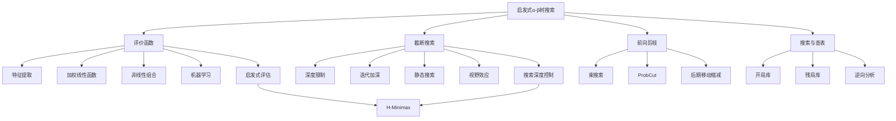

# 5.3 启发式 α-β 树搜索

## 1. 背景与动机

### 1.1 历史背景

启发式搜索在博弈中的应用可以追溯到20世纪50年代。1950年，香农（Shannon）在他的开创性论文中提出了两种策略：A型策略（Type A）考虑搜索树中某一深度的所有可能移动，然后使用启发式评价函数估计该深度下状态的效用值；B型策略（Type B）则舍弃那些看起来就很差的移动，"尽可能"走那些更有希望的路线。

1956年，约翰·麦卡锡（John McCarthy）构思了α-β剪枝的想法，这一技术直到1961年才由哈特（Hart）和爱德华兹（Edwards）正式发表。1975年，高德纳（Knuth）和穆尔（Moore）证明了α-β剪枝的正确性并分析了它的时间复杂度。

20世纪80-90年代，随着计算机性能的提升，国际象棋程序取得了突破性进展。1997年，深蓝（Deep Blue）击败世界冠军卡斯帕罗夫，标志着启发式搜索技术的成熟。深蓝每秒可以搜索超过1亿个局面，使用复杂的评价函数和大型开局/残局数据库。

### 1.2 研究动机

**计算资源的限制**：即使使用α-β剪枝，完全搜索国际象棋或围棋的博弈树在物理上是不可能的。香农数（$10^{123}$）远超宇宙中的原子数量。

**实时决策需求**：在实际对局中，程序必须在有限时间内做出决策（如国际象棋比赛通常有固定的时间限制）。

**启发式知识的利用**：人类棋手不会穷举所有可能，而是依靠经验和直觉评估局面。启发式搜索试图将这种知识编码到算法中。

**近似最优解**：在许多情况下，找到"足够好"的移动比找到理论最优移动更实用。

### 1.3 应用场景

| 应用场景 | 搜索深度 | 关键技术 | 代表程序 |
|---------|---------|---------|---------|
| 国际象棋 | 20-30层 | α-β剪枝、评价函数、换位表 | Stockfish、Komodo |
| 围棋（传统） | 4-5层 | 模式识别、局部搜索 | 早期围棋程序 |
| 跳棋 | 已完全求解 | 逆向分析、残局数据库 | Chinook |
| 黑白棋 | 10-15层 | ProbCut、移动排序 | Logistello |
| 西洋双陆棋 | 3层 | 神经网络评价函数 | TD-Gammon |

### 1.4 先决条件

- 极小化极大算法和α-β剪枝（第5.2节）
- 启发式搜索基础（第3章）
- 机器学习基础（用于评价函数学习）
- 算法优化技术

## 2. 知识逻辑图谱

### 2.1 概念关系图



### 2.2 知识发展依赖链

```
α-β剪枝基础
    ↓
评价函数设计
    ↓
截断搜索策略
    ↓
静态搜索与视野处理
    ↓
前向剪枝技术
    ↓
开局/残局查表
    ↓
现代博弈程序集成
```

## 3. 核心概念与数学分析

### 3.1 术语定义（中英文对照）

| 中文术语 | 英文术语 | 定义 |
|---------|---------|------|
| 启发式评价函数 | Heuristic Evaluation Function | 估计非终止状态期望效用的函数 |
| 截断测试 | Cutoff Test | 决定何时停止搜索并应用评价函数的判断条件 |
| 静态局面 | Quiescent Position | 不存在大幅度改变评估值的待定移动的稳定局面 |
| 静态搜索 | Quiescence Search | 在截断点继续搜索特定类型移动（如吃子）的技术 |
| 视野效应 | Horizon Effect | 程序将无法避免的损失推到搜索视野之外的现象 |
| 单步延伸 | Singular Extension | 当某移动明显优于其他移动时延伸搜索深度的技术 |
| 换位表 | Transposition Table | 缓存已搜索状态值的哈希表，避免重复计算 |
| 开局库 | Opening Book | 预先存储的开局最佳移动数据库 |
| 残局库 | Endgame Tablebase | 预先计算并存储的残局最优策略数据库 |

### 3.2 符号参考表

| 符号 | 含义 |
|-----|------|
| Eval($s$, $p$) | 参与者$p$在状态$s$的评价函数值 |
| H-Minimax($s$, $d$) | 深度$d$处的启发式Minimax值 |
| Is-Cutoff($s$, $d$) | 截断测试函数 |
| $f_i(s)$ | 状态$s$的第$i$个特征值 |
| $w_i$ | 第$i$个特征的权重 |
| $d_{max}$ | 最大搜索深度 |

### 3.3 启发式Minimax公式

启发式Minimax值定义为：

$$
\text{H-Minimax}(s, d) = 
\begin{cases}
\text{Eval}(s, \text{MAX}) & \text{如果 Is-Cutoff}(s, d) \\
\max_{a} \text{H-Minimax}(\text{Result}(s, a), d+1) & \text{如果 To-Move}(s) = \text{MAX} \\
\min_{a} \text{H-Minimax}(\text{Result}(s, a), d+1) & \text{如果 To-Move}(s) = \text{MIN}
\end{cases}
$$

### 3.4 加权线性评价函数

最简单的评价函数形式是特征的线性组合：

$$
\text{Eval}(s) = \sum_{i=1}^{n} w_i f_i(s) = w_1 f_1(s) + w_2 f_2(s) + \cdots + w_n f_n(s)
$$

**国际象棋典型特征**：

| 特征 | 描述 | 典型权重 |
|-----|------|---------|
| $f_1$ | 白兵数量 - 黑兵数量 | 1 |
| $f_2$ | 白马/象数量 - 黑马/象数量 | 3 |
| $f_3$ | 白车数量 - 黑车数量 | 5 |
| $f_4$ | 白后数量 - 黑后数量 | 9 |
| $f_5$ | 王的安全性评分 | 0.5 |
| $f_6$ | 兵阵结构评分 | 0.3 |
| $f_7$ | 控制中心评分 | 0.2 |

### 3.5 评价函数的性质要求

**计算效率**：Eval函数的计算时间应该远小于搜索一个节点的时间。

**值域约束**：
$$\text{Utility(loss)} \leq \text{Eval}(s) \leq \text{Utility(win)}$$

**序关系保持**：如果状态$s$的获胜概率高于$s'$，则：
$$\text{Eval}(s) > \text{Eval}(s')$$

**期望效用估计**：评价函数应该返回期望效用的正线性变换：
$$\text{Eval}(s) = a \cdot E[\text{Utility}] + b, \quad a > 0$$

## 4. 定理与证明

### 4.1 评价函数期望效用定理

**定理陈述**：
如果评价函数是期望效用的正线性变换，则在随机博弈中，基于评价函数的期望极小化极大决策与基于真实期望效用的决策一致。

**证明概要**：

设$\text{Eval}(s) = a \cdot E[U(s)] + b$，其中$a > 0$。

对于机会节点$c$，其子节点为$s_1, s_2, \ldots, s_k$，概率分别为$p_1, p_2, \ldots, p_k$：

$$
\begin{aligned}
E[\text{Eval}(c)] &= \sum_{i=1}^{k} p_i \cdot \text{Eval}(s_i) \\
&= \sum_{i=1}^{k} p_i \cdot (a \cdot E[U(s_i)] + b) \\
&= a \cdot \sum_{i=1}^{k} p_i \cdot E[U(s_i)] + b \cdot \sum_{i=1}^{k} p_i \\
&= a \cdot E[U(c)] + b
\end{aligned}
$$

由于$a > 0$，Eval的序关系与期望效用一致。

**证明本质**：
线性变换保持序关系，因此基于评价函数的决策等价于基于真实期望效用的决策。

### 4.2 迭代加深时间复杂度定理

**定理陈述**：
迭代加深搜索的总时间复杂度为$O(b^d)$，其中$b$是分支因子，$d$是最终搜索深度。

**证明**：

迭代加深依次搜索深度1, 2, ..., d。

深度$k$的搜索时间：$O(b^k)$

总时间：
$$T = \sum_{k=1}^{d} O(b^k) = O(b^d) \cdot \sum_{k=1}^{d} \frac{1}{b^{d-k}} = O(b^d) \cdot \sum_{j=0}^{d-1} \frac{1}{b^j}$$

当$b \geq 2$时：
$$\sum_{j=0}^{d-1} \frac{1}{b^j} < \sum_{j=0}^{\infty} \frac{1}{b^j} = \frac{1}{1 - 1/b} = \frac{b}{b-1} \leq 2$$

因此：$T = O(b^d)$

**证明本质**：
虽然重复搜索了浅层节点，但由于浅层节点数远少于深层，额外开销是常数因子。

## 5. 具体示例

### 5.1 国际象棋评价函数计算示例

考虑以下局面特征：

| 特征 | 白方 | 黑方 | 差值 | 权重 | 贡献 |
|-----|------|------|------|------|------|
| 兵 | 8 | 7 | +1 | 1 | +1.0 |
| 马/象 | 2+2 | 2+1 | +1 | 3 | +3.0 |
| 车 | 2 | 2 | 0 | 5 | 0 |
| 后 | 1 | 1 | 0 | 9 | 0 |
| 王安全 | - | - | +0.5 | 0.5 | +0.25 |
| 兵阵 | - | - | +0.3 | 0.3 | +0.09 |

**评价函数值**：$\text{Eval} = 1.0 + 3.0 + 0 + 0 + 0.25 + 0.09 = 4.34$

这表明白方有约4.34分的优势（相当于约4个兵的价值）。

### 5.2 视野效应示例

考虑图5-9中的国际象棋局面：

**局面描述**：
- 黑象位于a2，被白车在h2控制
- 白车可以通过h1-a1-a2的线路吃掉黑象（需要6步）
- 黑方可以用兵阻挡白王，引诱白王吃兵

**搜索深度8层时的分析**：

黑方考虑以下移动序列：
1. ... 兵阻挡王
2. 王吃兵
3. ... 另一兵阻挡
4. 王吃兵
5. ... 继续阻挡
6. 王吃兵
7. ... 继续阻挡
8. 王吃兵

在8层搜索内，象没有被吃掉。黑方评估这个移动序列为"好招"（用两个兵保住了象）。

**实际情况**：
白车最终仍可通过h1-a1-a2吃掉黑象。黑方只是将不可避免的损失推到了搜索视野之外，白白浪费了兵。

**单步延伸解决方案**：
如果在某个局面，白车移动到h1的评估值明显高于其他移动，则延伸搜索这一线路，即使会超过深度限制。

### 5.3 ProbCut算法示例

假设在黑白棋中，根据历史数据统计：

- 深度$d$的节点值$v$与深度$d-2$的浅层搜索值$v'$的关系：$v = v' + \epsilon$，其中$\epsilon \sim N(0, \sigma^2)$
- 当前$(\alpha, \beta)$窗口为$(0.3, 0.7)$
- 浅层搜索得到$v' = 0.1$

**ProbCut决策**：

如果$P(v < 0.3 | v' = 0.1) > 0.95$，则可以剪枝。

假设$\sigma = 0.15$：
$$P(v < 0.3) = P(\epsilon < 0.2) = \Phi(0.2/0.15) = \Phi(1.33) \approx 0.91$$

由于$0.91 < 0.95$，不剪枝，需要完整搜索。

如果浅层搜索得到$v' = -0.2$：
$$P(v < 0.3) = P(\epsilon < 0.5) = \Phi(0.5/0.15) = \Phi(3.33) \approx 0.9996$$

由于$0.9996 > 0.95$，可以剪枝。

## 6. 一句话本质

**启发式α-β树搜索通过评价函数将无限深度的博弈树截断到可计算的范围，利用领域知识近似评估非终止状态，在计算资源限制下找到足够好的决策而非理论最优解。**

## 7. 总结与反思

### 7.1 关键要点

1. **评价函数的核心作用**：评价函数是启发式搜索的关键，它将非终止状态映射为效用估计，使搜索能够在有限深度截断。

2. **静态搜索的必要性**：评价函数只能应用于静态局面。静态搜索通过继续搜索吃子等"嘈杂"移动，确保评估的稳定性。

3. **视野效应的挑战**：程序可能将无法避免的损失推到搜索视野之外。单步延伸等技术可以缓解这一问题。

4. **前向剪枝的风险与收益**：前向剪枝（如ProbCut）以牺牲一定正确性为代价换取搜索深度，在实践中往往有效。

5. **查表技术的威力**：开局库和残局库将人类经验和计算机计算能力结合，在特定阶段可以达到完美或接近完美的表现。

### 7.2 常见误解对照表

| 误解 | 正确理解 |
|-----|---------|
| 评价函数值就是获胜概率 | 评价函数只需保持序关系，不需要与概率线性相关 |
| 搜索越深效果越好 | 过深搜索可能遇到视野效应，且计算成本指数增长 |
| 特征线性组合总是最优 | 特征间往往存在交互，非线性组合通常更准确 |
| 静态搜索浪费时间 | 静态搜索消除评估噪声，对结果质量至关重要 |
| 开局库只是记忆人类走法 | 现代开局库结合人类知识和统计数据，可以优化选择 |

### 7.3 反思问题

1. **为什么评价函数不需要与获胜概率线性相关？**
   - 思考：决策只依赖于序关系，不依赖于具体数值。只要Eval(s) > Eval(s')当且仅当s的获胜概率更高，决策就是正确的。

2. **如何设计一个好的截断测试？**
   - 思考：好的截断测试应该考虑深度、局面静态性、时间限制等因素。迭代加深是一种鲁棒的方法。

3. **前向剪枝在什么情况下可能失败？**
   - 思考：当"看起来差"的移动实际上是最佳移动时（如弃子攻杀），前向剪枝会失败。这解释了为什么需要谨慎设计剪枝策略。

### 7.4 公式速查表

| 公式 | 含义 |
|-----|------|
| $\text{Eval}(s) = \sum_{i=1}^{n} w_i f_i(s)$ | 加权线性评价函数 |
| $\text{H-Minimax}(s, d) = \text{Eval}(s)$ | 截断条件 |
| $v = v' + \epsilon, \epsilon \sim N(0, \sigma^2)$ | ProbCut统计模型 |
| $T = O(b^d)$ | 迭代加深总时间复杂度 |

---

*本节内容约3500字，详细分析了启发式搜索的核心技术，包括评价函数设计、截断策略、静态搜索和前向剪枝，为理解现代博弈程序的实现奠定基础。*
