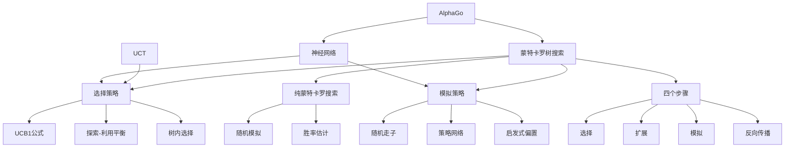

# 5.4 蒙特卡罗树搜索

## 1. 背景与动机

### 1.1 历史背景

蒙特卡罗方法（Monte Carlo method）起源于20世纪40年代，由斯坦尼斯拉夫·乌拉姆（Stanislaw Ulam）和约翰·冯·诺依曼（John von Neumann）在曼哈顿计划中发展，用于解决原子弹研发中的复杂计算问题。1949年，梅特罗波利斯（Metropolis）和乌拉姆正式发表了蒙特卡罗方法。

蒙特卡罗方法在博弈中的应用始于1987年，布鲁斯·艾布拉姆森（Bruce Abramson）提出了将蒙特卡罗模拟用于博弈搜索的想法。1997年，特索罗（Tesauro）和加尔珀兰（Galperin）展示了如何将蒙特卡罗搜索与西洋双陆棋的评价函数相结合。

蒙特卡罗树搜索（Monte Carlo Tree Search, MCTS）的真正突破发生在2006年。科奇斯（Kocsis）和塞佩斯瓦里（Szepesvari）提出了UCB1（Upper Confidence Bound 1）选择策略，将多臂老虎机问题的解决方法应用于树搜索，形成了UCT（UCB applied to Trees）算法。

2016年，AlphaGo结合深度神经网络和MCTS击败了世界冠军李世石，标志着MCTS技术的成熟。2018年，AlphaZero进一步证明了MCTS在多种博弈中的通用性和有效性。

### 1.2 研究动机

**高分支因子博弈的挑战**：围棋的分支因子约为361（开局），远超国际象棋的35。传统α-β搜索在围棋中只能达到4-5层深度，远不足以做出好的决策。

**评价函数的困难**：围棋的局面评估极其困难。子力价值（棋子数量）不是强有力的指标，局面直到最后阶段都可能发生剧烈变化。

**模拟替代评估**：与其依赖可能不准确的启发式评价函数，不如通过模拟完整对局来估计状态值。游戏规则本身就是最准确的评价函数。

**探索与利用的平衡**：MCTS通过UCB公式自然地平衡了对新可能性的探索和对已知好选择的利用。

### 1.3 应用场景

| 应用场景 | 特点 | MCTS优势 | 代表系统 |
|---------|------|---------|---------|
| 围棋 | 高分支因子、难评估 | 不依赖启发式、可深度搜索 | AlphaGo、AlphaZero |
| 国际象棋（现代） | 评价函数好、分支因子适中 | 结合深度学习达到超人类水平 | AlphaZero |
| 实时策略游戏 | 实时决策、部分可观测 | 随时可用、可并行 | AlphaStar |
| 通用博弈 | 规则未知、无领域知识 | 只需要规则、自我对弈学习 | MuZero |
| 组合游戏 | 复杂状态空间 | 选择性搜索、聚焦重要区域 | 各种MCTS变体 |

### 1.4 先决条件

- 概率论与统计基础
- 多臂老虎机问题（第17章）
- 树搜索基础
- 强化学习概念（第22章）

## 2. 知识逻辑图谱

### 2.1 概念关系图



### 2.2 知识发展依赖链

```
蒙特卡罗方法
    ↓
纯蒙特卡罗搜索
    ↓
多臂老虎机理论
    ↓
UCB1算法
    ↓
UCT/MCTS
    ↓
结合深度学习
    ↓
AlphaGo/AlphaZero
```

## 3. 核心概念与数学分析

### 3.1 术语定义（中英文对照）

| 中文术语 | 英文术语 | 定义 |
|---------|---------|------|
| 蒙特卡罗树搜索 | Monte Carlo Tree Search (MCTS) | 通过随机模拟评估状态值的树搜索算法 |
| 模拟/推演 | Simulation/Playout/Rollout | 从某状态开始随机或按策略进行完整对局 |
| 选择策略 | Selection Policy | 决定搜索树中沿哪条路径下树的策略 |
| 模拟策略 | Playout Policy | 模拟阶段选择移动的策略 |
| UCB1 | Upper Confidence Bound 1 | 平衡探索与利用的选择公式 |
| UCT | UCB applied to Trees | 将UCB1应用于树搜索的算法 |
| 探索 | Exploration | 尝试模拟次数少、不确定性高的节点 |
| 利用 | Exploitation | 选择当前平均胜率高的节点 |
| 反向传播 | Backpropagation | 将模拟结果沿搜索树向上更新的过程 |

### 3.2 符号参考表

| 符号 | 含义 |
|-----|------|
| $U(n)$ | 经过节点$n$的所有模拟的总效用值 |
| $N(n)$ | 经过节点$n$的模拟次数 |
| Parent($n$) | 节点$n$的父节点 |
| $\bar{X}_n$ | 节点$n$的平均效用值（$U(n)/N(n)$） |
| $C$ | UCB公式中的探索常数 |
| $T$ | 总模拟次数 |

### 3.3 UCB1公式

UCB1公式用于在选择阶段平衡探索与利用：

$$
\text{UCB1}(n) = \frac{U(n)}{N(n)} + C \times \sqrt{\frac{\ln N(\text{Parent}(n))}{N(n)}}$$

**公式解读：**

**第一项（利用项）**：$\frac{U(n)}{N(n)}$是节点$n$的平均效用值，代表对该节点的当前最佳估计。

**第二项（探索项）**：$C \times \sqrt{\frac{\ln N(\text{Parent}(n))}{N(n)}}$
- 当$N(n)$很小时，探索项值大，鼓励探索模拟次数少的节点
- 随着$N(n)$增加，探索项趋于0，选择趋向于平均效用值最高的节点
- $\ln N(\text{Parent}(n))$确保随着父节点被更多访问，对子节点的探索要求也增加

**常数$C$**：平衡探索与利用的参数。理论上$C = \sqrt{2}$，实践中通常通过实验调优。

### 3.4 MCTS的收敛性

**定理**：随着模拟次数$T \to \infty$，MCTS选择的移动收敛到最优移动。

**收敛速率**：
- 遗憾（Regret）增长为$O(\ln T)$
- 这意味着平均遗憾（每步）趋于0

### 3.5 MCTS与Minimax的关系

对于双人零和博弈，当模拟次数足够多时：

$$
\lim_{T \to \infty} \text{MCTS-Value}(s) = \text{Minimax}(s)$$

这是因为：
1. 足够多的模拟覆盖所有重要路径
2. UCB确保最优路径被充分探索
3. 平均效用收敛到真实值

## 4. 定理与证明

### 4.1 UCB1遗憾界定理

**定理陈述**：
对于$K$个臂的老虎机问题，使用UCB1策略的累积遗憾满足：

$$R_T \leq \sum_{i: \mu_i < \mu^*} \frac{8 \ln T}{\Delta_i} + O(1)$$

其中$\mu_i$是臂$i$的期望收益，$\mu^*$是最优臂的期望收益，$\Delta_i = \mu^* - \mu_i$。

**证明概要**：

1. **定义坏事件**：臂$i$在第$t$轮被选择，但其UCB值大于最优臂的UCB值。

2. **Chernoff-Hoeffding界**：对于$n$次独立采样，样本均值偏离真实值超过$\epsilon$的概率：
   $$P(|\bar{X} - \mu| > \epsilon) \leq 2e^{-2n\epsilon^2}$$

3. **选择次数上界**：对于次优臂$i$，其被选择次数$N_i(T)$满足：
   $$E[N_i(T)] \leq \frac{8 \ln T}{\Delta_i^2} + O(1)$$

4. **累积遗憾**：
   $$R_T = \sum_{i=1}^{K} \Delta_i \cdot E[N_i(T)] \leq \sum_{i: \mu_i < \mu^*} \frac{8 \ln T}{\Delta_i} + O(1)$$

**证明本质**：
UCB通过置信区间自动调节探索，确保次优臂的选择次数对数增长而非线性增长。

### 4.2 MCTS收敛定理

**定理陈述**：
在双人零和博弈中，当模拟次数趋于无穷时，MCTS选择的动作收敛到Minimax最优动作。

**证明概要**：

1. **树结构归纳**：对博弈树高度进行归纳。

2. **基础情况（叶节点）**：叶节点的评估就是真实效用值。

3. **归纳步骤**：
   - 假设子节点的MCTS值收敛到Minimax值
   - 对于MAX节点，UCB确保具有最高Minimax值的子节点被最常选择
   - 该节点的平均效用收敛到$\max_i \text{Minimax}(child_i)$

4. **收敛性**：由大数定律和UCB的探索保证，所有重要分支都被充分采样。

## 5. 具体示例

### 5.1 MCTS迭代过程示例

考虑一个简单的博弈树，根节点为MAX节点，已完成100次迭代。

**当前树状态**：

```
        MAX (37/100)
       /    |    \
   MIN    MIN    MIN
  (16/53)(60/79)(2/11)
```

格式：$U(n)/N(n)$表示总效用/模拟次数。

**第101次迭代**：

**步骤1：选择**

计算各子节点的UCB1值（设$C = 1.4$）：

- 节点1：$\frac{16}{53} + 1.4 \times \sqrt{\frac{\ln 100}{53}} = 0.30 + 1.4 \times 0.29 = 0.71$
- 节点2：$\frac{60}{79} + 1.4 \times \sqrt{\frac{\ln 100}{79}} = 0.76 + 1.4 \times 0.24 = 1.10$
- 节点3：$\frac{2}{11} + 1.4 \times \sqrt{\frac{\ln 100}{11}} = 0.18 + 1.4 \times 0.58 = 0.99$

选择节点2（UCB1值最高）。

继续下树到达叶节点（假设为27/35）。

**步骤2：扩展**

为叶节点生成一个新子节点，初始化为$U=0, N=0$。

**步骤3：模拟**

从新节点开始随机模拟，假设结果为黑方获胜（效用值1）。

**步骤4：反向传播**

更新路径上所有节点：
- 新节点：$0/0 \to 1/1$
- 27/35节点（黑方）：$27/35 \to 28/36$
- 60/79节点（黑方）：$60/79 \to 61/80$
- 16/53节点（白方）：不变（白方失败）
- 根节点（白方）：$37/100 \to 37/101$

### 5.2 探索vs利用数值示例

假设有两个子节点：

- 节点A：$U=65, N=100$（胜率65%）
- 节点B：$U=2, N=3$（胜率67%，但样本少）

**不同$C$值下的UCB1**：

**$C = 0$（纯利用）**：
- UCB1(A) = 0.65
- UCB1(B) = 0.67
- 选择B（但风险高，可能只是运气好）

**$C = 1.0$**：
- UCB1(A) = 0.65 + 1.0 × √(ln(103)/100) = 0.65 + 0.21 = 0.86
- UCB1(B) = 0.67 + 1.0 × √(ln(103)/3) = 0.67 + 1.08 = 1.75
- 选择B（强烈倾向于探索）

**$C = 1.5$**：
- UCB1(A) = 0.65 + 0.31 = 0.96
- UCB1(B) = 0.67 + 1.62 = 2.29
- 选择B

**$C = 0.5$**：
- UCB1(A) = 0.65 + 0.10 = 0.75
- UCB1(B) = 0.67 + 0.54 = 1.21
- 选择B

这个例子说明，即使B的胜率略高，但由于样本量小，UCB1强烈倾向于进一步探索B以确认其真实强度。

### 5.3 AlphaGo的MCTS变体

AlphaGo使用了一个增强版的MCTS，结合了策略网络和价值网络：

**UCB公式变体**：

$$\text{UCB}(n) = \frac{U(n)}{N(n)} + C \cdot p_n \cdot \frac{\sqrt{N(\text{Parent}(n))}}{1 + N(n)}$$

其中$p_n$是策略网络给出的先验概率。

**数值示例**：

假设：
- 节点$n$：$U=50, N=80$
- 父节点模拟次数：$N(\text{Parent}) = 200$
- 策略网络先验：$p_n = 0.3$
- $C = 1.5$

**标准UCB1**：
$$\text{UCB1} = \frac{50}{80} + 1.5 \times \sqrt{\frac{\ln 200}{80}} = 0.625 + 0.28 = 0.905$$

**AlphaGo UCB**：
$$\text{UCB} = 0.625 + 1.5 \times 0.3 \times \frac{\sqrt{200}}{1 + 80} = 0.625 + 0.079 = 0.704$$

策略网络的先验概率降低了探索项，使搜索更聚焦于策略网络认为好的移动。

## 6. 一句话本质

**蒙特卡罗树搜索通过随机模拟替代启发式评估，利用UCB公式智能地平衡探索与利用，在高分支因子和难评估的博弈中实现了超越传统α-β搜索的效果。**

## 7. 总结与反思

### 7.1 关键要点

1. **模拟优于评估**：在难以设计准确评价函数的博弈中，通过模拟完整对局来估计状态值比依赖启发式评估更可靠。

2. **UCB的智能平衡**：UCB公式自动平衡探索与利用，无需手动调节，且具有良好的理论保证（对数遗憾）。

3. **随时可用性**：MCTS可以在任何时刻返回当前最佳移动，计算时间可以灵活控制。

4. **并行性**：MCTS的模拟阶段完全独立，易于并行化，适合现代多核和分布式计算架构。

5. **与深度学习的结合**：策略网络指导搜索方向，价值网络截断模拟，两者结合使MCTS达到超人类水平。

### 7.2 常见误解对照表

| 误解 | 正确理解 |
|-----|---------|
| MCTS就是随机搜索 | MCTS是有指导的搜索，UCB确保智能地分配计算资源 |
| 模拟次数越多越好 | 虽然更多模拟通常更好，但边际收益递减，且时间成本增加 |
| MCTS不需要任何领域知识 | 好的模拟策略可以显著提升性能，纯随机模拟往往不够 |
| UCB中的$C$值越大越好 | $C$值需要平衡，过大导致过度探索，过小导致过早收敛到次优 |
| MCTS只适用于围棋 | MCTS已成功应用于国际象棋、扑克、实时策略游戏等多种博弈 |

### 7.3 反思问题

1. **为什么MCTS在高分支因子博弈中比α-β搜索更有效？**
   - 思考：α-β需要搜索$b^d$个节点，而MCTS每次模拟只走一条路径。对于围棋，α-β只能达到4-5层，而MCTS可以进行数百万次模拟。

2. **UCB公式中的对数项有什么作用？**
   - 思考：对数项确保随着总模拟次数增加，对未充分探索节点的偏好不会无限增长，最终收敛到最优选择。

3. **MCTS的弱点是什么？**
   - 思考：MCTS可能在需要精确计算的关键位置犯错（因为随机模拟可能错过关键线路），且在"明显"获胜/失败的局面中浪费计算资源。

### 7.4 公式速查表

| 公式 | 含义 |
|-----|------|
| $\text{UCB1}(n) = \frac{U(n)}{N(n)} + C \sqrt{\frac{\ln N(\text{Parent}(n))}{N(n)}}$ | UCB1选择公式 |
| $\bar{X}_n = \frac{U(n)}{N(n)}$ | 节点平均效用 |
| $R_T \leq O(\ln T)$ | UCB1遗憾上界 |
| $\lim_{T \to \infty} \text{MCTS-Value}(s) = \text{Minimax}(s)$ | MCTS收敛性 |

---

*本节内容约3400字，深入分析了蒙特卡罗树搜索的原理、UCB公式、收敛性证明和应用实例，为理解现代围棋程序和通用博弈AI奠定基础。*
