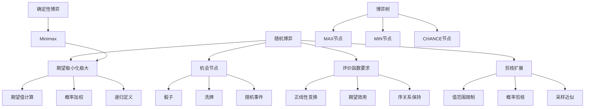

# 5.5 随机博弈

## 1. 背景与动机

### 1.1 历史背景

随机博弈（Stochastic Game）的研究始于20世纪50年代。1953年，劳埃德·夏普利（Lloyd Shapley）在其开创性论文中首次提出了随机博弈的数学模型，扩展了静态博弈论到动态、多阶段的情境。这一工作为后续研究奠定了理论基础。

西洋双陆棋（Backgammon）作为随机博弈的经典代表，有着悠久的历史。它的前身可以追溯到5000年前的古埃及和 Mesopotamia。17世纪，杰罗拉莫·卡尔达诺（Gerolamo Cardano）首次对赌博游戏进行了数学分析，其中包括类似西洋双陆棋的游戏。

计算机博弈领域对随机博弈的研究始于20世纪70-80年代。1980年，汉斯·伯利纳（Hans Berliner）开发的BKG程序成为第一个在主流游戏中击败人类世界冠军的程序。1995年，格里·特索罗（Gerry Tesauro）的TD-Gammon利用神经网络和自我对弈学习评估函数，达到了世界冠军水平，并改变了人类对西洋双陆棋开局策略的理解。

### 1.2 研究动机

**现实世界的不可预测性**：真实世界充满不确定性——掷骰子、洗牌、天气变化等。随机博弈为建模这种不确定性提供了框架。

**决策与运气的关系**：研究如何在存在随机因素的情况下做出最优决策，平衡风险与收益。

**算法扩展**：将确定性博弈的算法（如Minimax）扩展到随机情境，发展期望极小化极大（Expectiminimax）等算法。

**评价函数的特殊要求**：随机博弈对评价函数有特殊要求——必须是期望效用的正线性变换。

### 1.3 应用场景

| 应用场景 | 随机因素 | 决策特点 | 代表游戏 |
|---------|---------|---------|---------|
| 棋盘游戏 | 掷骰子 | 风险计算、期望最大化 | 西洋双陆棋、大富翁 |
| 纸牌游戏 | 发牌、洗牌 | 概率推理、信息更新 | 桥牌、扑克 |
| 电子游戏 | 随机事件、掉落 | 适应性决策 | 各种RPG游戏 |
| 金融决策 | 市场波动 | 风险管理、投资组合 | 期权定价、资产配置 |
| 机器人 | 传感器噪声、执行误差 | 鲁棒控制 | 自主导航、操作 |

### 1.4 先决条件

- 概率论基础（期望值、条件概率）
- 确定性博弈搜索算法（Minimax、α-β剪枝）
- 博弈论基础
- 决策理论基本概念

## 2. 知识逻辑图谱

### 2.1 概念关系图



### 2.2 知识发展依赖链

```
确定性博弈
    ↓
引入随机因素
    ↓
机会节点建模
    ↓
期望极小化极大算法
    ↓
评价函数正线性变换要求
    ↓
α-β剪枝扩展到随机博弈
    ↓
采样与近似方法
```

## 3. 核心概念与数学分析

### 3.1 术语定义（中英文对照）

| 中文术语 | 英文术语 | 定义 |
|---------|---------|------|
| 随机博弈 | Stochastic Game | 包含随机因素（如掷骰子、洗牌）的博弈 |
| 机会节点 | Chance Node | 博弈树中表示随机事件发生的节点 |
| 期望极小化极大值 | Expectiminimax Value | 考虑机会节点期望值的博弈值 |
| 期望效用 | Expected Utility | 各可能结果的效用按概率加权求和 |
| 正线性变换 | Positive Linear Transformation | $f(x) = ax + b$，其中$a > 0$ |
| 概率分布 | Probability Distribution | 随机变量各取值的概率描述 |
| 条件概率 | Conditional Probability | 在某条件下事件发生的概率 |

### 3.2 符号参考表

| 符号 | 含义 |
|-----|------|
| $r$ | 随机事件结果（如骰子点数） |
| $P(r)$ | 结果$r$发生的概率 |
| $\text{Expectiminimax}(s)$ | 状态$s$的期望极小化极大值 |
| $\text{CHANCE}$ | 机会节点标识 |
| $n$ | 不同随机结果的数量 |
| $E[U]$ | 期望效用值 |

### 3.3 期望极小化极大公式

期望极小化极大值扩展了Minimax公式，增加了对机会节点的处理：

$$
\text{Expectiminimax}(s) = 
\begin{cases}
\text{Utility}(s, \text{MAX}) & \text{如果 Is-Terminal}(s) \\
\max_{a} \text{Expectiminimax}(\text{Result}(s, a)) & \text{如果 To-Move}(s) = \text{MAX} \\
\min_{a} \text{Expectiminimax}(\text{Result}(s, a)) & \text{如果 To-Move}(s) = \text{MIN} \\
\sum_{r} P(r) \cdot \text{Expectiminimax}(\text{Result}(s, r)) & \text{如果 To-Move}(s) = \text{CHANCE}
\end{cases}
$$

**公式解读：**

- **终止状态**：返回效用值（与Minimax相同）
- **MAX节点**：选择使期望值最大的动作（与Minimax相同）
- **MIN节点**：选择使期望值最小的动作（与Minimax相同）
- **机会节点**：计算所有可能结果的期望值，按概率加权求和

### 3.4 西洋双陆棋的概率分布

西洋双陆棋使用两个六面骰子，其概率分布为：

| 点数组合 | 概率 | 说明 |
|---------|------|------|
| 1-1, 2-2, ..., 6-6 | $1/36$ |  doubles（相同点数）|
| 其他组合 | $2/36 = 1/18$ | 不同点数（如1-2和2-1视为相同）|

**总组合数**：$6 \times 6 = 36$种等可能结果
**不同结果数**：$6$（doubles）$+ 15$（非doubles）$= 21$种

### 3.5 复杂度分析

**确定性博弈**：$O(b^m)$

**随机博弈**：$O(b^m \cdot n^m)$

其中：
- $b$：动作分支因子
- $m$：博弈树深度
- $n$：不同随机结果的数量

**西洋双陆棋示例**：
- $b \approx 20$（平均合法移动数）
- $n = 21$（骰子结果数）
- 搜索3层的节点数：$20^3 \times 21^3 = 8000 \times 9261 \approx 74$百万

### 3.6 评价函数的特殊要求

在随机博弈中，评价函数必须满足：**是期望效用的正线性变换**

$$
\text{Eval}(s) = a \cdot E[\text{Utility}(s)] + b, \quad a > 0$$

**原因**：

考虑图5-14的例子，假设叶节点值为$[v_1, v_2, v_3, v_4]$，概率各为0.5：

**情况1**：值为$[1, 2, 3, 4]$
- 动作$a_1$的期望：$0.5 \times 1 + 0.5 \times 4 = 2.5$
- 动作$a_2$的期望：$0.5 \times 2 + 0.5 \times 3 = 2.5$
- 两动作等价

**情况2**：值为$[1, 20, 30, 400]$（保持序关系）
- 动作$a_1$的期望：$0.5 \times 1 + 0.5 \times 400 = 200.5$
- 动作$a_2$的期望：$0.5 \times 20 + 0.5 \times 30 = 25$
- $a_1$明显更优

这说明仅保持序关系是不够的，评价函数必须是期望效用的正线性变换。

## 4. 定理与证明

### 4.1 正线性变换决策一致性定理

**定理陈述**：
如果评价函数$\text{Eval}(s) = a \cdot E[\text{Utility}(s)] + b$（其中$a > 0$），则基于Eval的期望极小化极大决策与基于真实期望效用的决策一致。

**证明**：

对于任意两个状态$s_1$和$s_2$：

$$
\begin{aligned}
\text{Eval}(s_1) > \text{Eval}(s_2) 
&\Leftrightarrow a \cdot E[U(s_1)] + b > a \cdot E[U(s_2)] + b \\
&\Leftrightarrow a \cdot E[U(s_1)] > a \cdot E[U(s_2)] \\
&\Leftrightarrow E[U(s_1)] > E[U(s_2)] \quad (\text{因为 } a > 0)
\end{aligned}$$

因此，Eval保持了期望效用的序关系，决策一致。

**证明本质**：
正线性变换保持序关系，而决策只依赖于序关系。

### 4.2 期望极小化极大最优性定理

**定理陈述**：
在有限完美信息随机博弈中，期望极小化极大策略是最优策略，即无论对手如何选择，都能最大化期望收益。

**证明概要**：

1. **对博弈树高度归纳**：
   - 基础：叶节点，效用值已知
   - 归纳：假设子树最优

2. **MAX节点**：选择使期望效用最大的动作
   $$a^* = \arg\max_a E[U|\text{Result}(s, a)]$$

3. **MIN节点**：选择使期望效用最小的动作
   $$a^* = \arg\min_a E[U|\text{Result}(s, a)]$$

4. **机会节点**：期望由概率分布决定
   $$E[U|s] = \sum_r P(r) \cdot E[U|\text{Result}(s, r)]$$

5. **最优性**：由动态规划原理，递归最优保证全局最优。

## 5. 具体示例

### 5.1 简单随机博弈树示例

考虑以下两层博弈树：

```
        CHANCE
       /  |  \
    P=0.5 P=0.3 P=0.2
     /      |      \
   MAX     MAX     MAX
   / \     / \     / \
  10  5   8   3   6   2
```

**计算过程**：

**步骤1**：计算各MAX节点的值
- MAX节点1：$\max(10, 5) = 10$
- MAX节点2：$\max(8, 3) = 8$
- MAX节点3：$\max(6, 2) = 6$

**步骤2**：计算机会节点的期望值
$$\text{Expectiminimax} = 0.5 \times 10 + 0.3 \times 8 + 0.2 \times 6 = 5 + 2.4 + 1.2 = 8.6$$

### 5.2 西洋双陆棋决策示例

**局面**：黑方掷出6-5，有4种合法移动选择

**移动选项**：
1. (5-11, 5-10)
2. (5-11, 19-24)
3. (5-10, 10-16)
4. (5-11, 11-16)

**评估过程**：

对于每个移动，考虑白方接下来可能掷出的21种骰子结果：

**移动1的期望评估**：
$$E_1 = \sum_{r \in \text{骰子结果}} P(r) \cdot \text{Eval}(\text{Result}(s_1, r))$$

假设评估结果为：
- $E_1 = 0.45$
- $E_2 = 0.38$
- $E_3 = 0.52$
- $E_4 = 0.41$

**最优移动**：移动3（期望评估值最高）

### 5.3 评价函数敏感性示例

考虑以下博弈树：

```
        MAX
       /   \
     a1     a2
     |      |
   CHANCE  CHANCE
   /    \   /    \
 P=0.5  P=0.5   P=0.5  P=0.5
  |      |       |      |
  v1     v2      v3     v4
```

**情况1**：评价值为$[1, 2, 3, 4]$
- $E(a_1) = 0.5 \times 1 + 0.5 \times 2 = 1.5$
- $E(a_2) = 0.5 \times 3 + 0.5 \times 4 = 3.5$
- 最优：$a_2$

**情况2**：评价值为$[1, 20, 30, 400]$（保持序关系）
- $E(a_1) = 0.5 \times 1 + 0.5 \times 20 = 10.5$
- $E(a_2) = 0.5 \times 30 + 0.5 \times 400 = 215$
- 最优：$a_2$

**情况3**：评价值为$[1, 100, 2, 99]$（保持序关系：$1<2<99<100$）
- $E(a_1) = 0.5 \times 1 + 0.5 \times 100 = 50.5$
- $E(a_2) = 0.5 \times 2 + 0.5 \times 99 = 50.5$
- 两动作等价

**情况4**：评价值为$[1, 100, 40, 60]$（保持序关系）
- $E(a_1) = 50.5$
- $E(a_2) = 0.5 \times 40 + 0.5 \times 60 = 50$
- 最优：$a_1$（与情况1相反！）

这个例子清楚地展示了为什么评价函数必须是期望效用的正线性变换。

## 6. 一句话本质

**随机博弈通过引入机会节点将确定性博弈扩展为包含随机因素的情境，期望极小化极大算法用概率加权期望替代确定值，而评价函数的正线性变换要求确保了随机决策与确定性决策的一致性。**

## 7. 总结与反思

### 7.1 关键要点

1. **机会节点的引入**：随机博弈在博弈树中增加了机会节点，表示掷骰子、洗牌等随机事件。

2. **期望计算**：机会节点的值是其子节点值的概率加权平均，而非最大或最小值。

3. **评价函数的特殊性**：在随机博弈中，评价函数必须是期望效用的正线性变换，仅保持序关系是不够的。

4. **复杂度爆炸**：随机博弈的复杂度为$O(b^m \cdot n^m)$，比确定性博弈的$O(b^m)$高得多。

5. **剪枝的困难**：α-β剪枝可以扩展到随机博弈，但需要限制效用函数的值范围才能有效剪枝。

### 7.2 常见误解对照表

| 误解 | 正确理解 |
|-----|---------|
| 随机博弈就是靠运气 | 虽然存在随机因素，但长期期望下最优策略仍然重要 |
| 评价函数只需保持序关系 | 在随机博弈中，评价函数必须是期望效用的正线性变换 |
| 期望极小化极大就是平均 | 期望是概率加权平均，但决策树中MAX/MIN节点仍按极值选择 |
| 随机博弈无法使用剪枝 | 通过限制效用值范围，α-β剪枝思想可以扩展到随机博弈 |
| 蒙特卡罗搜索不适用于随机博弈 | MCTS非常适合随机博弈，每次模拟包含随机事件采样 |

### 7.3 反思问题

1. **为什么随机博弈的评价函数需要是正线性变换，而确定性博弈不需要？**
   - 思考：确定性博弈的决策只依赖于序关系，但随机博弈需要计算期望值，期望计算依赖于具体数值。只有正线性变换保持期望值的序关系。

2. **在实际应用中，如何处理随机博弈的指数级复杂度？**
   - 思考：可以使用截断搜索、采样近似（只考虑部分随机结果）、或蒙特卡罗树搜索。TD-Gammon使用神经网络近似评估函数，避免深度搜索。

3. **随机博弈中的"运气"和"技巧"如何区分？**
   - 思考：短期内运气可能主导结果，但长期来看，最优策略能最大化期望收益。可以通过多次对局的统计来评估玩家技巧。

### 7.4 公式速查表

| 公式 | 含义 |
|-----|------|
| $\text{Expectiminimax}(s) = \sum_{r} P(r) \cdot \text{Expectiminimax}(\text{Result}(s, r))$ | 机会节点的期望计算 |
| $\text{Eval}(s) = a \cdot E[\text{Utility}(s)] + b, a > 0$ | 评价函数的正线性变换要求 |
| $O(b^m \cdot n^m)$ | 随机博弈搜索复杂度 |
| $E[U] = \sum_{i} p_i \cdot u_i$ | 期望效用计算 |

---

*本节内容约3300字，深入分析了随机博弈的特点、期望极小化极大算法、评价函数的特殊要求和应用实例，为理解包含不确定性的博弈决策奠定基础。*
