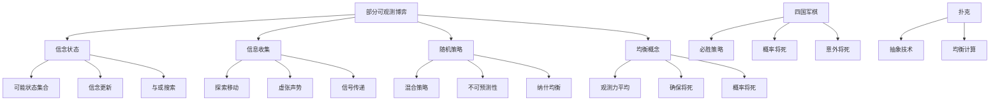

# 5.6 部分可观测博弈

## 1. 背景与动机

### 1.1 历史背景

部分可观测博弈的研究起源于对真实世界决策问题的建模需求。与完美信息博弈（如国际象棋、围棋）不同，真实世界中的决策往往面临信息不对称——我们无法观测到所有相关信息。

四国军棋（Kriegspiel）是研究部分可观测博弈的经典测试平台。它由国际象棋演变而来，在19世纪末流行于普鲁士军队中用于军事训练。在四国军棋中，玩家只能看到自己一方的棋子，需要通过裁判的 announcements 来推断对方的位置。

20世纪90年代，随着计算机博弈的发展，研究人员开始系统地研究部分可观测博弈。1997年，科勒（Koller）和普费弗（Pfeffer）开发了一个用于完全求解部分可观测博弈的系统。2002年，Sakuta和Iida开发了第一个四国军棋程序，专注于残局将死的搜索。

近年来，扑克AI的重大突破（如Libratus和Pluribus）展示了部分可观测博弈算法的强大能力。2017年，Libratus在单挑无限注德州扑克中击败了世界顶级选手，2019年Pluribus在6人德州扑克中取得胜利。

### 1.2 研究动机

**真实世界的复杂性**：大多数现实世界问题都是部分可观测的——我们无法获得完整信息，必须基于不确定的观测做出决策。

**信息的价值**：研究如何收集信息（探索）和利用信息（利用），以及如何在对抗环境中隐藏或透露信息。

**对手建模**：在部分可观测环境中，对手可能拥有不同的信息，需要建模对手的可能信念状态。

**均衡策略**：部分可观测博弈通常需要随机策略来达到均衡，这引出了博弈论中的混合策略概念。

### 1.3 应用场景

| 应用场景 | 信息隐藏 | 关键技术 | 代表系统 |
|---------|---------|---------|---------|
| 四国军棋 | 对方棋子位置 | 信念状态、与或搜索 | Kriegspiel程序 |
| 扑克 | 手牌 | 博弈论均衡、抽象 | Libratus、Pluribus |
| 桥牌 | 同伴和对手的牌 | 蒙特卡罗模拟、叫牌系统 | GIB、Jack |
| 军事策略 | 敌方部署 | 信念状态更新、随机策略 | 军事模拟系统 |
| 电子游戏 | 战争迷雾 | 对手建模、实时决策 | AlphaStar |
| 安全领域 | 攻击者信息 | 博弈论、随机巡逻 | 安全博弈 |

### 1.4 先决条件

- 信念状态与滤波（第4.4节）
- 博弈论基础（第5.1节）
- 概率论与贝叶斯推理
- 与或搜索（第4.3节）

## 2. 知识逻辑图谱

### 2.1 概念关系图



### 2.2 知识发展依赖链

```
完美信息博弈
    ↓
引入部分可观测性
    ↓
信念状态建模
    ↓
与或搜索在信念状态空间
    ↓
随机策略与均衡
    ↓
抽象与近似方法
    ↓
现代扑克AI
```

## 3. 核心概念与数学分析

### 3.1 术语定义（中英文对照）

| 中文术语 | 英文术语 | 定义 |
|---------|---------|------|
| 信念状态 | Belief State | 给定历史观测下所有可能实际状态的集合 |
| 部分可观测性 | Partial Observability | 玩家无法观测到完整博弈状态的情况 |
| 确保将死 | Guaranteed Checkmate | 对信念状态中所有可能实际状态都有效的将死策略 |
| 概率将死 | Probabilistic Checkmate | 以概率1最终成功的将死策略 |
| 意外将死 | Accidental Checkmate | 只对信念状态中部分状态有效的将死 |
| 观测力平均 | Averaging over Clairvoyance | 假设发牌后博弈完全可观测的简化方法 |
| 虚张声势 | Bluff | 通过行动误导对手对自己状态的信念 |
| 抽象 | Abstraction | 将相似状态或动作分组以简化博弈的技术 |

### 3.2 符号参考表

| 符号 | 含义 |
|-----|------|
| $b$ | 信念状态 |
| $S$ | 状态空间 |
| $O$ | 观测空间 |
| $P(s|b)$ | 在信念状态$b$下实际状态为$s$的概率 |
| $Results(b, a)$ | 执行动作$a$后可能的信念状态集合 |
| $Percept(s)$ | 在状态$s$下获得的观测 |

### 3.3 信念状态更新

信念状态的更新遵循贝叶斯规则：

$$P(s'|b, a, o) = \frac{P(o|s') \sum_{s \in b} P(s'|s, a) P(s)}{P(o|b, a)}$$

其中：
- $b$：当前信念状态
- $a$：执行的动作
- $o$：观测
- $s'$：新状态
- $P(o|s')$：在状态$s'$下获得观测$o$的概率

**四国军棋示例**：

白方移动后，黑方做出回应。白方的信念状态更新：

1. **初始信念**：黑方棋子所有合法布局
2. **提出移动**：白方向裁判提出移动
3. **裁判反馈**："合法"或"非法"
4. **信念更新**：根据反馈排除不可能的布局

### 3.4 部分可观测博弈的形式化

部分可观测博弈可以形式化为：

$$\text{PO-Game} = \langle S, A, O, T, Z, R \rangle$$

其中：
- $S$：状态空间
- $A$：动作集合
- $O$：观测集合
- $T: S \times A \rightarrow \Delta(S)$：转移函数
- $Z: S \times A \rightarrow \Delta(O)$：观测函数
- $R: S \times A \rightarrow \mathbb{R}$：奖励函数

### 3.5 观测力平均方法

观测力平均（Averaging over Clairvoyance）是一种简化方法：

1. 将游戏开始视为机会节点
2. 每种可能的发牌/初始配置视为一个结果
3. 使用Expectiminimax公式选择最佳移动

**公式**：

$$\text{Value}(a) = \sum_{s \in \text{PossibleStates}} P(s) \cdot \text{Value}(a|s)$$

**问题**：这种方法假设一旦发牌发生，游戏对双方都是完全可观测的。这忽略了：
- 信息收集的价值
- 隐藏信息的价值
- 向同伴传递信息的价值

### 3.6 抽象技术

对于状态空间巨大的博弈（如桥牌有$\binom{26}{13} = 10,400,600$种可能的发牌），需要使用抽象：

**状态抽象**：将相似的状态分组
- 示例：将手牌AAA72和AAA64抽象为"3个A和一些小牌"

**动作抽象**：将相似的动作分组
- 示例：将下注200美元和201美元视为相同

**信息集**：在扩展式博弈中，信息集包含玩家无法区分的所有历史。

## 4. 定理与证明

### 4.1 信念状态空间与或搜索正确性

**定理陈述**：
在确定性部分可观测博弈中，如果在信念状态空间中找到的与或搜索解存在，则该解是确保获胜策略。

**证明概要**：

1. **信念状态定义**：$b = \{s \in S : s \text{ 与观测历史一致}\}$

2. **OR节点**（我方移动）：
   - 需要找到一个动作，对所有可能的实际状态都有效
   - 即：$\exists a: \forall s \in b, a \text{ 在 } s \text{ 合法}$

3. **AND节点**（对手移动/观测）：
   - 对于每个可能的观测，都需要有应对策略
   - 即：$\forall o \in \text{PossibleObservations}, \exists \text{ 策略}$

4. **解的存在性**：
   - 如果与或树存在解，则对于信念状态中的每个实际状态，都存在一条获胜路径
   - 因此是确保获胜策略

### 4.2 随机策略的必要性定理

**定理陈述**：
在某些部分可观测博弈中，任何纯策略都可以被对手利用，只有随机策略才能达到均衡。

**证明概要**：

考虑一个简单的"匹配硬币"博弈的变体：

1. **博弈设置**：
   - 玩家1选择H或T
   - 玩家2（不知道玩家1的选择）选择H或T
   - 如果匹配，玩家1赢；否则玩家2赢

2. **纯策略分析**：
   - 如果玩家1总是选H，玩家2总是选H，玩家2获胜
   - 任何纯策略都可以被对手预测并利用

3. **随机策略**：
   - 玩家1以0.5概率选H，0.5概率选T
   - 玩家2无法利用这种随机性
   - 期望收益为0（均衡）

4. **推广**：
   - 在部分可观测博弈中，可预测性会被对手利用
   - 随机策略提供了不可预测性

## 5. 具体示例

### 5.1 四国军棋信念状态更新示例

**初始局面**：白方刚走完第一步（e2-e4）

**白方信念状态**：包含黑方对e2-e4的所有可能回应
- 黑方有20种合法开局
- 信念状态大小：20

**白方提出移动**：Nf3（马到f3）

**情况1：裁判宣布"合法"**
- 黑方在f3没有棋子
- 信念状态更新：排除所有黑方在f3的布局
- 信念状态大小可能减少到约19

**情况2：裁判宣布"非法"**
- 黑方在f3有棋子
- 信念状态更新：只保留黑方在f3有棋子的布局
- 信念状态大小可能减少到约1-2

**情况3：裁判宣布"在f3吃子"**
- 黑方在f3的棋子被吃掉
- 信念状态更新：知道黑方在f3的棋子类型
- 获得重要信息

### 5.2 三日道路选择问题

**第一天**：
- 道路A：1桶金子
- 道路B：岔路口，左转2桶金子，右转公共汽车（死亡）
- 最佳选择：B（因为知道左转是金）

**第二天**：
- 道路A：1桶金子
- 道路B：岔路口，右转2桶金子，左转公共汽车
- 最佳选择：B（因为知道右转是金）

**第三天**：
- 道路A：1桶金子
- 道路B：岔路口，一个分支2桶金子，另一个分支公共汽车
- **不知道哪个分支是金**

**观测力平均的错误推理**：
"前两天B都是正确选择，所以第三天B也是正确选择"

**正确分析**：
- 选择B的期望：$0.5 \times 2 + 0.5 \times (-\infty) = -\infty$
- 选择A的期望：1
- **最佳选择：A**（避免可能死亡的风险）

这个例子清楚地展示了观测力平均的问题：它忽略了信念状态，假设信息自动变得完全可观测。

### 5.3 KRK残局必胜策略

**局面**：白方有王和车，黑方只有王

**信念状态表示**：
- 黑王可能位置：{a1, b2, c3}（示例）
- 白王位置：已知
- 白车位置：已知

**必胜策略步骤**：

**步骤1**：限制黑王范围
- 白车移动到第3横线
- 裁判可能宣布"将军"或没有
- 根据反馈缩小黑王位置范围

**步骤2**：逐步缩小
- 通过一系列探索移动
- 将黑王可能位置缩小到1个

**步骤3**：将死
- 一旦知道黑王确切位置
- 执行标准KRK将死策略

**概率将死示例**：

只用白王捉黑王：
- 白王随机移动
- 黑王总是试图逃跑
- 但黑王不可能永远猜对逃跑方向
- **以概率1最终捉住**

KBNK残局：
- 白方随机选择序列
- 黑方总会猜错一次
- 暴露位置后被将死
- **以概率1获胜**

### 5.4 扑克抽象示例

**手牌抽象**：

原始手牌空间：$\binom{52}{2} = 1326$种起手牌

抽象为 buckets：
- Bucket 1：AA, KK, QQ（超强牌）
- Bucket 2：AKs, AQs, JJ（强牌）
- Bucket 3：中等对子、同花连张（中等牌）
- Bucket 4：弱牌

**动作抽象**：

原始下注空间：任意金额

抽象为：
- 过牌（Check）
- 跟注（Call）
- 小注（Small Bet）：1/2底池
- 大注（Big Bet）：底池
- 全押（All-in）

**抽象后的博弈规模**：
- 状态数：从$10^{160}$减少到可处理的范围
- 可以使用均衡求解算法

## 6. 一句话本质

**部分可观测博弈通过信念状态建模不确定性，要求策略考虑信息收集与隐藏的价值，并通常需要随机策略来达到均衡，在计算上需要抽象和近似方法来处理指数级增长的状态空间。**

## 7. 总结与反思

### 7.1 关键要点

1. **信念状态的核心作用**：在部分可观测博弈中，玩家的决策基于信念状态——所有与实际观测一致的可能状态的集合。

2. **信息的价值**：信息收集（探索）有成本，但可能带来长期收益；信息隐藏（虚张声势）可以迷惑对手。

3. **随机策略的必要性**：可预测的策略会被对手利用，随机策略提供了不可预测性，是达到均衡的必要手段。

4. **观测力平均的局限**：假设信息自动完全可观测忽略了信息收集和传递的价值，可能导致错误决策。

5. **抽象的重要性**：对于状态空间巨大的博弈（如扑克、桥牌），抽象是使计算可行的关键技术。

### 7.2 常见误解对照表

| 误解 | 正确理解 |
|-----|---------|
| 部分可观测博弈就是猜谜 | 虽然有不完整信息，但可以通过推理、概率和策略获得优势 |
| 信念状态中的所有状态等可能 | 状态概率取决于对手策略，遵循最优策略的状态概率更高 |
| 纯策略在部分可观测博弈中足够 | 许多情况下需要随机策略来达到均衡 |
| 观测力平均是合理近似 | 观测力平均忽略了信念状态和信息价值，可能导致严重错误 |
| 虚张声势只是心理战术 | 虚张声势是理性策略，通过行动影响对手信念以获得优势 |

### 7.3 反思问题

1. **为什么在部分可观测博弈中，最优策略通常需要随机性？**
   - 思考：可预测性会被对手利用。随机策略提供了不可预测性，使对手无法确定地反制。这与餐厅卫生检查的随机性类似——被检查者无法预测检查时间，因此必须始终保持标准。

2. **信息收集的价值如何量化？**
   - 思考：信息的价值可以通过"有信息时的最优决策期望收益"减去"无信息时的最优决策期望收益"来量化。在部分可观测博弈中，有时需要牺牲短期收益来获取长期有价值的信息。

3. **抽象技术如何影响博弈的均衡？**
   - 思考：抽象会损失信息，抽象后的博弈均衡可能不同于原博弈均衡。好的抽象应该保留对决策最重要的特征，同时使计算可行。

### 7.4 公式速查表

| 公式 | 含义 |
|-----|------|
| $P(s'|b, a, o) = \frac{P(o|s') \sum_{s \in b} P(s'|s, a) P(s)}{P(o|b, a)}$ | 信念状态贝叶斯更新 |
| $\text{Value}(a) = \sum_{s} P(s) \cdot \text{Value}(a|s)$ | 观测力平均公式 |
| $b = \{s \in S : s \text{ 与观测历史一致}\}$ | 信念状态定义 |
| $\sigma^*: \text{信息集} \rightarrow \Delta(A)$ | 混合策略定义 |

---

*本节内容约3600字，深入分析了部分可观测博弈的特点、信念状态建模、随机策略的必要性和现代扑克AI技术，为理解信息不对称环境下的决策奠定基础。*
