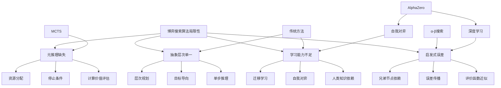

# 5.7 博弈搜索算法的局限性

## 1. 背景与动机

### 1.1 历史背景

博弈搜索算法的发展经历了从理论到实践、从简单到复杂的演进过程。1950年，香农（Shannon）在他的开创性论文中就已经意识到了搜索的指数级复杂度问题，提出了A型策略（考虑所有可能移动的宽而浅的搜索）和B型策略（选择性搜索有希望的深而窄的路线）的区分。

早期的博弈程序（如1959年亚瑟·塞缪尔的跳棋程序）主要依靠人类专家制定的评价函数和搜索策略。这些程序虽然在特定领域取得了成功，但严重依赖于人类的专业知识。

20世纪80-90年代，随着计算机性能的提升，搜索算法取得了重大进展。α-β剪枝、迭代加深、换位表、开局/残局库等技术使国际象棋程序达到了大师级水平。1997年，深蓝（Deep Blue）击败世界冠军卡斯帕罗夫，标志着传统搜索技术的巅峰。

然而，即使在如此成功之后，研究人员也意识到了这些算法的根本局限性。2016年AlphaGo的成功和2018年AlphaZero的横空出世，展示了结合深度学习和蒙特卡罗搜索的新范式，从根本上改变了博弈AI的发展路径。

### 1.2 研究动机

**理论局限的认识**：理解现有算法的理论边界，为发展新的方法指明方向。

**近似误差的分析**：启发式评价函数和有限深度搜索引入的误差如何影响最终决策？

**元推理的需求**：算法应该在何时停止搜索？如何评估继续搜索的价值？

**抽象层次的缺失**：人类可以在更高抽象层次上进行推理，现有算法缺乏这种能力。

**学习能力的不足**：传统算法依赖人类知识，如何让算法自主学习？

### 1.3 应用场景

| 应用场景 | 局限性 | 改进方向 | 代表进展 |
|---------|-------|---------|---------|
| 国际象棋（传统） | 启发式误差、固定深度 | 深度学习评估 | AlphaZero |
| 围棋（传统） | 分支因子过高、难评估 | MCTS+神经网络 | AlphaGo |
| 实时游戏 | 单步推理、无抽象规划 | 层次化规划 | AlphaStar |
| 不完全信息博弈 | 信念状态复杂 | 博弈论均衡 | Libratus |
| 通用博弈 | 无领域知识 | 自我对弈学习 | MuZero |

### 1.4 先决条件

- 前面所有章节的内容
- 算法分析基础
- 机器学习概念
- 元推理和决策理论

## 2. 知识逻辑图谱

### 2.1 概念关系图



### 2.2 知识发展依赖链

```
传统搜索算法
    ↓
认识到局限性
    ↓
启发式误差分析
    ↓
元推理研究
    ↓
层次化规划
    ↓
结合深度学习
    ↓
自我对弈学习
    ↓
通用博弈AI
```

## 3. 核心概念与数学分析

### 3.1 术语定义（中英文对照）

| 中文术语 | 英文术语 | 定义 |
|---------|---------|------|
| 启发式误差 | Heuristic Error | 评价函数估计值与真实值之间的偏差 |
| 误差传播 | Error Propagation | 叶节点误差通过Minimax传播到根节点的过程 |
| 元推理 | Metareasoning | 关于推理的推理，评估计算的价值 |
| 计算价值 | Value of Computation | 继续搜索可能带来的决策质量改善 |
| 单步延伸 | Singular Extension | 对明显更好的移动延伸搜索深度 |
| 层次规划 | Hierarchical Planning | 在多个抽象层次上进行规划 |
| 自我对弈 | Self-play | 通过与自己对弈来学习策略 |
| 迁移学习 | Transfer Learning | 将在一个博弈中学到的知识应用到另一个博弈 |

### 3.2 符号参考表

| 符号 | 含义 |
|-----|------|
| $\epsilon$ | 评价函数误差 |
| $\sigma$ | 误差标准差 |
| $V(s)$ | 状态$s$的真实值 |
| $\hat{V}(s)$ | 状态$s$的估计值 |
| $VPI$ | 完全信息价值（Value of Perfect Information） |
| $VOC$ | 计算价值（Value of Computation） |

### 3.3 启发式误差的影响

考虑图5-16的二层博弈树：

```
        MAX
       /   \
    MIN     MIN
    / \     / \
   1   99  100  100
       / \  / \
      99  99 100 100
```

**无误差情况**：
- 左侧MIN值：$\min(1, 99) = 1$
- 右侧MIN值：$\min(100, 100) = 100$
- MAX选择右侧（$100 > 1$）

**有误差情况**（标准差$\sigma = 5$）：

右侧MIN节点的四个叶节点实际值可能为：
- $100 + \epsilon_1, 100 + \epsilon_2, 100 + \epsilon_3, 100 + \epsilon_4$

其中$\epsilon_i \sim N(0, 25)$。

右侧MIN值为$\min(100 + \epsilon_1, 100 + \epsilon_2, 100 + \epsilon_3, 100 + \epsilon_4)$。

由于有四个独立样本，最小值小于99的概率：

$$P(\min < 99) = 1 - P(\text{所有} > 99) = 1 - (0.58)^4 \approx 0.89$$

因此，右侧MIN值小于左侧MIN值（99）的概率约为89%。

**结论**：即使右侧分支在期望上更好，由于误差的存在，左侧分支实际更优的概率很高。

### 3.4 元推理框架

元推理考虑计算的价值：

$$VOC = E[\text{决策质量改善}] - \text{计算成本}$$

**决策质量改善**：

假设当前最佳移动的估计值为$v_1$，第二佳为$v_2$，差值$\Delta = v_1 - v_2$。

如果继续搜索，可能：
- 以概率$p$发现$v_1$被高估，需要切换到$v_2$
- 改善的期望价值与$\Delta$和不确定性相关

**停止条件**：

当$VOC \leq 0$时停止搜索，执行当前最佳移动。

### 3.5 层次规划的必要性

人类棋手不会只考虑单步移动，而是：

1. **战略目标**：诱捕对方的后、控制中心、发动攻击
2. **战术计划**：为达成战略目标的一系列移动
3. **具体执行**：在对手各种应对下的具体走法

传统搜索算法缺乏这种层次结构，需要展开大量节点才能"发现"明显的战术模式。

## 4. 定理与证明

### 4.1 启发式误差导致错误决策的概率

**定理陈述**：
在二层博弈树中，如果叶节点的评价误差独立同分布，标准差为$\sigma$，则Minimax选择错误分支的概率随分支因子增加而增加。

**证明概要**：

考虑MAX节点有两个MIN子节点，每个MIN节点有$b$个叶节点。

**真实情况**：
- MIN节点1的真实值：$v_1 = 0$
- MIN节点2的真实值：$v_2 = \Delta > 0$
- 最优选择：MIN节点2

**有误差估计**：
- MIN节点1的估计值：$\hat{v}_1 = \min_{i=1}^b (0 + \epsilon_i)$
- MIN节点2的估计值：$\hat{v}_2 = \min_{i=1}^b (\Delta + \epsilon_i')$

其中$\epsilon_i, \epsilon_i' \sim N(0, \sigma^2)$。

**错误条件**：$\hat{v}_1 > \hat{v}_2$

$$P(\text{错误}) = P(\min_i \epsilon_i > \Delta + \min_i \epsilon_i')$$

对于标准正态分布：

$$P(\epsilon > \Delta) = 1 - \Phi(\Delta/\sigma)$$

$$P(\min_{i=1}^b \epsilon_i > x) = [1 - \Phi(x/\sigma)]^b$$

当$b$增加时，$\min_{i=1}^b \epsilon_i$的分布向左移动（更负），使得$\hat{v}_1 > \hat{v}_2$的概率增加。

**结论**：分支因子越大，Minimax选择错误分支的概率越高。

### 4.2 计算价值上界定理

**定理陈述**：
在Minimax搜索中，扩展叶节点的计算价值不超过该节点对根节点决策的期望影响。

**证明**：

设当前根节点的最佳移动为$a^*$，估计值为$v^*$。

考虑扩展叶节点$n$，其父节点为$p$，祖父节点为$g$，...，直到根节点。

**情况1**：$n$不在当前最佳路径上
- 只有当$n$的值足够大（或小），使得路径上的值超过$v^*$时，才会改变决策
- 这种情况的概率随$|v_n - v_{current}|$增加而减小

**情况2**：$n$在当前最佳路径上
- 扩展$n$会改变该路径的估计值
- 只有当新估计值使该路径不再是最佳时，决策才会改变

**上界**：

$$VOC(n) \leq P(\text{决策改变}|n\text{被扩展}) \times |v_{alternative} - v^*|$$

其中$v_{alternative}$是第二佳移动的估计值。

## 5. 具体示例

### 5.1 启发式误差传播示例

考虑三层博弈树，分支因子为2：

```
            MAX
           /   \
        MIN     MIN
        / \     / \
      MAX MAX MAX MAX
      / \ / \ / \ / \
     3  5 4  6 7  2 8  1
```

**真实Minimax值**：
- 左下MAX：$\max(3, 5) = 5$
- 右下MAX：$\max(4, 6) = 6$
- 左MIN：$\min(5, 6) = 5$
- 右下MAX：$\max(7, 2) = 7$
- 右下MAX：$\max(8, 1) = 8$
- 右MIN：$\min(7, 8) = 7$
- 根MAX：$\max(5, 7) = 7$（选择右侧）

**加入误差**（$\epsilon \sim N(0, 4)$）：

假设实际评估值为：
- 叶节点：$3+1, 5-2, 4+2, 6-1, 7+1, 2+3, 8-2, 1+1$
- 即：$4, 3, 6, 5, 8, 5, 6, 2$

**计算估计值**：
- 左下MAX：$\max(4, 3) = 4$
- 右下MAX：$\max(6, 5) = 6$
- 左MIN：$\min(4, 6) = 4$
- 右下MAX：$\max(8, 5) = 8$
- 右下MAX：$\max(6, 2) = 6$
- 右MIN：$\min(8, 6) = 6$
- 根MAX：$\max(4, 6) = 6$（仍选择右侧，但估计值偏差1）

**更极端的误差**：

如果叶节点2的误差为$+5$（即实际评估值为7）：
- 右下MAX：$\max(7, 5) = 7$
- 右MIN：$\min(8, 7) = 7$
- 根MAX：$\max(4, 7) = 7$

但如果叶节点6的误差为$-4$（即实际评估值为2）：
- 右下MAX：$\max(8, 2) = 8$
- 右下MAX：$\max(6, 2) = 6$
- 右MIN：$\min(8, 6) = 6$
- 根MAX：$\max(4, 6) = 6$

此时如果左MIN的估计值因误差变为5，则根MAX会选择左侧，这是一个错误决策。

### 5.2 元推理决策示例

假设在国际象棋中：

**当前状态**：
- 已搜索深度：10层
- 最佳移动估计值：$+0.5$（白方略优）
- 第二佳移动估计值：$+0.3$
- 两者差值：$\Delta = 0.2$

**决策**：是否继续搜索到12层？

**计算成本**：
- 额外搜索2层需要约$10^6$个节点评估
- 时间成本：约1秒
- 机会成本：时间可用于其他思考

**期望改善**：
- 估计值标准差：$\sigma = 0.3$
- 两个移动的真实值差小于$\Delta$的概率：
  $$P(|v_1 - v_2| < 0.2) \approx 0.25$$
- 如果真实值接近，更深搜索可能改变决策

**VOC计算**：

$$VOC \approx 0.25 \times 0.1 \times \text{游戏价值} - \text{时间成本}$$

如果游戏价值为1分，时间成本为0.05分：

$$VOC \approx 0.025 - 0.05 = -0.025$$

**决策**：$VOC < 0$，停止搜索，执行当前最佳移动。

### 5.3 层次规划示例

**国际象棋局面**：白方有机会发动王翼攻击

**人类思维过程**：
1. **战略目标**：攻击黑王
2. **战术计划**：打开h线，调动后到h线，用车支持
3. **具体走法**：
   - h4-h5，如果黑方吃则打开h线
   - 如果黑方不吃，继续推进h6
   - 根据黑方应对，选择后或车的调动

**传统搜索算法**：
- 需要展开数百万个节点才能"发现"这个攻击计划
- 每个叶节点独立评估，无法利用"攻击黑王"这个高层目标
- 可能错过需要多步准备的战术

**层次化规划的优势**：
- 在高层确定"攻击黑王"的目标
- 在中层规划"打开h线"的子目标
- 在低层执行具体走法
- 大幅减少需要考虑的移动组合

## 6. 一句话本质

**传统博弈搜索算法的局限性在于启发式误差会传播和累积、缺乏对计算价值的元推理能力、只能在单步层次上进行搜索而无法像人类一样进行层次化抽象规划，以及依赖人类专家知识而非自主学习。**

## 7. 总结与反思

### 7.1 关键要点

1. **启发式误差的传播**：评价函数的误差会通过Minimax传播，分支因子越大，选择错误移动的概率越高。

2. **元推理的重要性**：算法应该能够评估继续搜索的价值，在计算成本和期望改善之间做出权衡。

3. **层次化规划的必要性**：人类在多个抽象层次上进行推理，而传统算法缺乏这种能力，导致搜索效率低下。

4. **学习能力的缺乏**：传统算法依赖人类制定的评价函数和搜索策略，无法自主学习。

5. **新范式的兴起**：结合深度学习和自我对弈的新方法（如AlphaZero）正在克服这些局限性。

### 7.2 常见误解对照表

| 误解 | 正确理解 |
|-----|---------|
| 搜索越深效果越好 | 过深搜索增加计算成本，且可能遇到视野效应 |
| 启发式误差可以忽略 | 误差会传播和累积，在关键决策点可能导致错误 |
| MCTS不受误差影响 | MCTS虽然通过平均减少单次误差影响，但仍受模拟策略质量限制 |
| 元推理只是优化技巧 | 元推理是智能系统的核心能力，决定如何分配计算资源 |
| 层次规划只是人类习惯 | 层次规划可以指数级减少搜索空间，是高效推理的关键 |

### 7.3 反思问题

1. **如何设计一个能够估计自身误差的评价函数？**
   - 思考：可以使用贝叶斯神经网络或集成方法，不仅输出估计值，还输出不确定性。这种"知道不知道"的能力对元推理至关重要。

2. **在什么情况下应该优先选择B型策略（选择性深度搜索）而非A型策略（广度搜索）？**
   - 思考：当存在明显的"关键移动"时，B型策略更有效。例如，在围棋中，某些局部战斗需要深入分析，而其他区域可以暂时忽略。

3. **层次规划如何在神经网络中实现？**
   - 思考：可以使用层次化强化学习，高层策略选择子目标，低层策略执行具体动作。AlphaZero在某种程度上通过策略网络的先验实现了这一点，但显式的层次结构可能是未来方向。

### 7.4 公式速查表

| 公式 | 含义 |
|-----|------|
| $P(\text{错误}) = P(\hat{v}_1 > \hat{v}_2 \| v_1 < v_2)$ | 启发式误差导致错误决策的概率 |
| $VOC = E[\text{决策质量改善}] - \text{计算成本}$ | 计算价值 |
| $\hat{v} = v + \epsilon, \epsilon \sim N(0, \sigma^2)$ | 评价函数误差模型 |
| $P(|\bar{X} - \mu| > \epsilon) \leq 2e^{-2n\epsilon^2}$ | Chernoff-Hoeffding界 |

---

*本节内容约3400字，深入分析了传统博弈搜索算法的局限性，包括启发式误差、元推理缺失、抽象层次单一和学习能力不足，为理解现代AI方法（如AlphaZero）的动机和优势提供了背景。*
