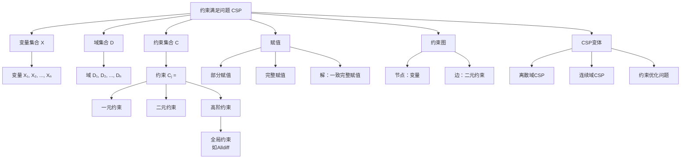

# 6.1 定义约束满足问题

## 1. 背景与动机

### 1.1 历史背景

约束满足问题（Constraint Satisfaction Problem, CSP）的研究可以追溯到20世纪70年代，但其思想根源更为深远。古希腊数学家丢番图（Diophantus，约200-284年）研究了整数域上的代数方程，这些现在被称为丢番图方程的问题可以视为早期的约束满足问题。印度数学家布拉马古普塔（Brahmagupta，约650年）给出了线性方程 $ax + by = c$ 在整数域上的一般解。高斯（Gauss, 1829）研究了通过变量消元法求解线性方程的系统方法。

现代CSP理论的正式建立要归功于乌戈·蒙塔纳里（Ugo Montanari, 1974），他将CSP确定为一般问题类别。随后，艾伦·麦克沃思（Alan Mackworth, 1977）提出了AC-3等经典算法，奠定了约束传播的理论基础。华尔兹（Waltz, 1975）在计算机视觉多面体线标记问题上的成功应用，使约束传播方法得到了广泛关注和推广。

### 1.2 研究动机

在传统的状态空间搜索中（如第3章和第4章讨论的内容），每个状态被视为一个不可分割的原子——一个没有内部结构的黑盒。搜索算法只能通过领域特定的启发式函数来估计从给定状态到达目标的代价，而无法利用状态内部的结构信息。

CSP范式通过**因子化表示（factored representation）**打破了这种黑盒限制：
- 状态被表示为一组变量，每个变量有自己的取值域
- 约束明确规定了变量之间允许的值组合
- 解是满足所有约束的完整赋值

这种方法的优势在于：
1. **通用性**：CSP求解器使用通用的而非领域特定的启发式算法
2. **剪枝效率**：通过识别违反约束的变量/值组合，可以一次性消除大部分搜索空间
3. **问题描述简洁**：可以从问题描述中自动推导出行动和转移模型

### 1.3 应用场景

CSP在人工智能和运筹学中有广泛应用：

| 应用领域 | 典型问题 | 关键约束类型 |
|---------|---------|-------------|
| 地图着色 | 为地图区域分配颜色 | 不等约束（相邻区域颜色不同） |
| 调度问题 | 车间作业调度、课程表编排 | 优先约束、资源约束 |
| 配置设计 | 产品配置、系统架构设计 | 兼容性约束 |
| 密码算术 | 字母代表数字的算术谜题 | Alldiff约束、算术约束 |
| 数独游戏 | 填充数字网格 | Alldiff约束 |
| 硬件设计 | VLSI布局、电路设计 | 几何约束、时序约束 |

### 1.4 先决条件

学习本节内容需要掌握：
- 基本的集合论和逻辑知识
- 图论基础（节点、边、连通性）
- 算法复杂度分析基础
- 第3章的状态空间搜索概念

## 2. 知识逻辑图谱

### 2.1 概念关系图



### 2.2 知识发展依赖链

```
状态空间搜索（第3章）
    ↓
因子化表示思想
    ↓
CSP三元组定义 (X, D, C)
    ↓
    ├── 变量与域的概念
    │       ↓
    ├── 约束类型分类
    │       ├── 一元约束 → 节点一致性
    │       ├── 二元约束 → 弧一致性
    │       └── 高阶约束 → 全局约束
    │
    ├── CSP形式化变体
    │       ├── 离散有限域CSP
    │       ├── 离散无限域CSP
    │       ├── 连续域CSP
    │       └── 约束优化问题(COP)
    │
    └── 问题结构分析
            ├── 约束图表示
            ├── 问题分解
            └── 树宽概念
```

## 3. 核心概念与数学分析

### 3.1 术语定义（中英文对照）

| 中文术语 | 英文术语 | 定义 |
|---------|---------|------|
| 约束满足问题 | Constraint Satisfaction Problem (CSP) | 由变量集合、域集合和约束集合组成的问题，目标是找到满足所有约束的变量赋值 |
| 变量 | Variable | 需要赋值的实体，通常记为 $X_i$ |
| 域 | Domain | 变量可以取值的集合，记为 $D_i$ |
| 约束 | Constraint | 规定变量允许值组合的关系，记为 $C_j$ |
| 赋值 | Assignment | 将值分配给变量的映射 |
| 一致赋值 | Consistent Assignment | 不违反任何约束的赋值 |
| 完整赋值 | Complete Assignment | 所有变量都被赋值的赋值 |
| 部分赋值 | Partial Assignment | 部分变量未被赋值的赋值 |
| 解 | Solution | 一致完整赋值 |
| 约束图 | Constraint Graph | 以变量为节点、约束为边的图表示 |
| 一元约束 | Unary Constraint | 只涉及单个变量的约束 |
| 二元约束 | Binary Constraint | 涉及两个变量的约束 |
| 全局约束 | Global Constraint | 涉及任意数量变量的约束（如Alldiff） |
| 约束超图 | Constraint Hypergraph | 表示高阶约束的超图结构 |

### 3.2 符号参考表

| 符号 | 含义 |
|-----|------|
| $\mathcal{X} = \{X_1, X_2, \ldots, X_n\}$ | 变量集合，包含 $n$ 个变量 |
| $\mathcal{D} = \{D_1, D_2, \ldots, D_n\}$ | 域集合，$D_i$ 是 $X_i$ 的域 |
| $\mathcal{C} = \{C_1, C_2, \ldots, C_m\}$ | 约束集合，包含 $m$ 个约束 |
| $C_j = \langle \text{scope}, \text{rel} \rangle$ | 约束的标准形式表示 |
| $\nu$ | 变量取值 |
| $d$ | 域的大小（最大域中元素个数） |
| $n$ | 变量个数 |
| $c$ | 约束个数 |

### 3.3 CSP的形式化定义

**定义 6.1（约束满足问题）**：一个约束满足问题是一个三元组 $(\mathcal{X}, \mathcal{D}, \mathcal{C})$，其中：

1. **变量集合** $\mathcal{X} = \{X_1, X_2, \ldots, X_n\}$：包含 $n$ 个变量的有限集合

2. **域集合** $\mathcal{D} = \{D_1, D_2, \ldots, D_n\}$：每个变量 $X_i$ 有一个对应的域 $D_i = \{\nu_1, \nu_2, \ldots, \nu_k\}$，表示 $X_i$ 可以取的值

3. **约束集合** $\mathcal{C} = \{C_1, C_2, \ldots, C_m\}$：每个约束 $C_j$ 是一个对 $\langle \text{scope}_j, \text{rel}_j \rangle$，其中：
   - $\text{scope}_j$ 是约束中涉及的变量元组
   - $\text{rel}_j$ 是定义这些变量应满足的关系

**定义 6.2（解）**：CSP的一个**解**是一个完整赋值 $A = \{X_1 = \nu_1, X_2 = \nu_2, \ldots, X_n = \nu_n\}$，满足：
- 对每个 $i$，$\nu_i \in D_i$（值在域中）
- 对每个约束 $C_j = \langle (X_{j_1}, \ldots, X_{j_k}), \text{rel}_j \rangle$，有 $(\nu_{j_1}, \ldots, \nu_{j_k}) \in \text{rel}_j$（满足所有约束）

### 3.4 约束的表示方式

约束可以用两种方式表示：

**显式表示**：列出所有满足约束的元组
$$\langle (X_1, X_2), \{(3,1), (3,2), (2,1)\} \rangle$$

**隐式表示**：用关系表达式定义
$$\langle (X_1, X_2), X_1 > X_2 \rangle$$

### 3.5 CSP的计算复杂性

**定理**：CSP求解是NP完全问题。

**证明概要**：
1. **NP成员性**：给定一个赋值，可以在多项式时间内验证是否满足所有约束
2. **NP困难性**：可以将3-SAT（已知的NP完全问题）多项式归约到CSP：
   - 每个布尔变量对应CSP变量，域为 $\{\text{true}, \text{false}\}$
   - 每个子句对应一个约束，要求至少一个文字为真

尽管一般CSP是NP完全的，但许多重要的CSP子类可以在多项式时间内求解，例如：
- 树状结构的CSP（线性时间）
- 具有有界树宽的CSP
- 某些特定类型的约束（如Horn约束）

## 4. 具体示例

### 4.1 地图着色问题

**问题描述**：为澳大利亚地图的各州着色，要求相邻州颜色不同。可用颜色为 {red, green, blue}。

**CSP形式化**：

变量集合：
$$\mathcal{X} = \{WA, NT, Q, NSW, V, SA, T\}$$

其中：WA=西澳大利亚，NT=北领地，Q=昆士兰，NSW=新南威尔士，V=维多利亚，SA=南澳大利亚，T=塔斯马尼亚

域集合（所有变量相同）：
$$D_i = \{\text{red}, \text{green}, \text{blue}\}, \quad \forall i$$

约束集合（相邻区域颜色不同）：
$$\mathcal{C} = \{SA \neq WA, SA \neq NT, SA \neq Q, SA \neq NSW, SA \neq V, WA \neq NT, NT \neq Q, Q \neq NSW, NSW \neq V\}$$

**一个可行解**：
$$\{WA = \text{red}, NT = \text{green}, Q = \text{red}, NSW = \text{green}, V = \text{red}, SA = \text{blue}, T = \text{red}\}$$

**约束图**：节点表示变量，边表示二元约束。SA节点度数为5（连接最多），T节点度数为0（孤立）。

**搜索空间分析**：
- 无约束时：$3^7 = 2187$ 种可能赋值
- 使用约束后：当 $SA = \text{blue}$ 时，其5个邻居都不能取blue
- 邻居变量的选择从 $3^5 = 243$ 减少到 $2^5 = 32$，减少了87%

### 4.2 车间作业调度问题

**问题描述**：汽车装配调度，包含15个任务，需要满足优先约束和资源约束。

**变量集合**：
$$\mathcal{X} = \{Axle_F, Axle_B, Wheel_{RF}, Wheel_{LF}, Wheel_{RB}, Wheel_{LB}, Nuts_{RF}, Nuts_{LF}, Nuts_{RB}, Nuts_{LB}, Cap_{RF}, Cap_{LF}, Cap_{RB}, Cap_{LB}, Inspect\}$$

**域集合**：
$$D_i = \{0, 1, 2, \ldots, 30\}$$

**约束类型**：

1. **优先约束**（任务 $T_1$ 必须在 $T_2$ 之前完成）：
   $$T_1 + d_1 \leq T_2$$
   
   例如（轮轴安装需要10分钟）：
   $$Axle_F + 10 \leq Wheel_{RF}$$
   $$Axle_F + 10 \leq Wheel_{LF}$$

2. **析取约束**（资源冲突）：
   $$(Axle_F + 10 \leq Axle_B) \lor (Axle_B + 10 \leq Axle_F)$$

3. **截止时间约束**：
   $$X + d_X \leq Inspect, \quad \forall X \neq Inspect$$

### 4.3 密码算术问题

**问题描述**：求解字母代表不同数字的算术谜题，如：
```
  T W O
+ T W O
-------
F O U R
```

**变量**：$\{F, T, U, W, R, O, C_1, C_2, C_3\}$，其中 $C_1, C_2, C_3$ 是进位变量

**域**：字母 $\{0, 1, \ldots, 9\}$，进位变量 $\{0, 1\}$

**约束**：
1. **Alldiff约束**：所有字母必须代表不同数字
   $$\text{Alldiff}(F, T, U, W, R, O)$$

2. **列约束**（从右到左）：
   $$O + O = R + 10 \cdot C_1$$
   $$C_1 + W + W = U + 10 \cdot C_2$$
   $$C_2 + T + T = O + 10 \cdot C_3$$
   $$C_3 = F$$

3. **前导零约束**：$F \neq 0$，$T \neq 0$

## 5. 一句话本质

**约束满足问题的本质是通过因子化表示将复杂问题分解为变量、域和约束三个组成部分，利用约束之间的逻辑关系进行有效推理和搜索，从而在指数级搜索空间中找到满足所有条件的解。**

## 6. 总结与反思

### 6.1 关键要点

1. **CSP三元组**：任何CSP都由变量集合 $\mathcal{X}$、域集合 $\mathcal{D}$ 和约束集合 $\mathcal{C}$ 组成

2. **因子化表示的优势**：相比原子状态表示，CSP可以：
   - 利用约束进行大规模剪枝
   - 从问题描述自动推导转移模型
   - 使用通用启发式算法

3. **约束分类**：
   - 按元数：一元、二元、高阶（全局）
   - 按域类型：离散有限、离散无限、连续
   - 按性质：绝对约束、偏好约束

4. **问题表示**：
   - 二元CSP可用约束图表示
   - 高阶CSP可用约束超图表示
   - 任何有限域CSP都可转化为二元CSP

### 6.2 常见误解对照表

| 误解 | 正确理解 |
|-----|---------|
| CSP只能处理离散有限域问题 | CSP可以处理离散无限域和连续域问题，只是算法复杂度不同 |
| 所有CSP都是NP完全的 | 一般CSP是NP完全的，但许多子类（如树状结构）可在多项式时间求解 |
| 二元CSP比高阶CSP表达能力弱 | 通过引入辅助变量，任何有限域CSP都可转化为等价的二元CSP |
| 约束越多问题越难 | 适当的约束可以通过剪枝减少搜索空间，使问题更容易求解 |
| CSP和状态空间搜索是完全不同的 | CSP搜索是状态空间搜索的特例，利用了状态的可分解结构 |

### 6.3 反思问题

1. **理论层面**：
   - 为什么CSP求解是NP完全的？这与3-SAT问题有什么联系？
   - 将高阶CSP转化为二元CSP会引入哪些计算开销？
   - 连续域CSP与离散域CSP在算法设计上有何本质区别？

2. **实践层面**：
   - 在实际应用中，如何选择显式约束表示还是隐式约束表示？
   - 对于大规模CSP，问题分解的策略有哪些？
   - 如何将偏好约束整合到CSP框架中？

3. **扩展思考**：
   - CSP与SAT问题之间的关系是什么？
   - 动态CSP（约束随时间变化）如何处理？
   - 分布式CSP中多个智能体如何协作求解？

### 6.4 公式速查表

| 概念 | 公式/定义 |
|-----|----------|
| CSP三元组 | $(\mathcal{X}, \mathcal{D}, \mathcal{C})$ |
| 约束表示 | $C_j = \langle \text{scope}, \text{rel} \rangle$ |
| 解的定义 | 一致完整赋值 |
| 优先约束 | $T_1 + d_1 \leq T_2$ |
| 搜索空间大小 | $O(d^n)$（$d$=域大小，$n$=变量数） |
| 无约束叶节点数 | $n! \cdot d^n$ |
| 可交换性剪枝后 | $d^n$ |

### 6.5 延伸阅读

- Montanari, U. (1974). Networks of constraints: Fundamental properties and applications to picture processing.
- Mackworth, A. K. (1977). Consistency in networks of relations.
- Dechter, R. (2003). Constraint Processing.
- Rossi, F., van Beek, P., & Walsh, T. (2006). Handbook of Constraint Programming.
