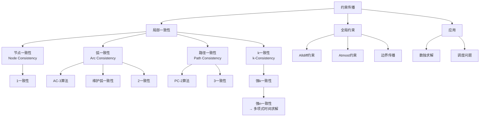

# 6.2 约束传播：CSP中的推断

## 1. 背景与动机

### 1.1 历史背景

约束传播技术的发展与CSP理论的发展紧密相连。1974年，乌戈·蒙塔纳里（Ugo Montanari）引入了约束图和路径一致性传播的概念，为约束传播奠定了理论基础。1975年，华尔兹（Waltz）在计算机视觉多面体线标记问题上的成功应用证明了约束传播能够完全消除对回溯的需求，这一成果极大地推动了约束传播方法的研究。

1977年，艾伦·麦克沃思（Alan Mackworth）提出了AC-3算法，这是最著名的弧一致性算法之一。麦克沃思还提出了将回溯与一致性增强相结合的一般思想。此后，研究人员开发了多种一致性算法：AC-4（Mohr and Henderson, 1986）、PC-2（Mackworth, 1977）等。萨宾和弗罗伊德（Sabin and Freuder, 1994）提出的MAC算法证明了在困难CSP上进行完整弧一致性检验的价值。

### 1.2 研究动机

在传统的状态空间搜索中，算法只能通过扩展节点来访问后继节点。CSP算法提供了另一种选择：**约束传播（constraint propagation）**——利用约束减少变量的合法值数量，这种减少又可以进一步传播到其他变量。

约束传播的核心价值在于：
1. **搜索空间剪枝**：在搜索开始前或搜索过程中消除不可能的值
2. **早期失败检测**：在深入搜索之前发现矛盾
3. **与搜索的结合**：可以作为预处理步骤，也可以与搜索交替进行

约束传播的基本思想是**局部一致性（local consistency）**：通过增强图中每一部分的局部一致性，导致整个图中不一致的值被删除。

### 1.3 应用场景

约束传播在以下场景中特别有效：

| 应用场景 | 传播策略 | 效果 |
|---------|---------|------|
| 数独求解 | 弧一致性（AC-3） | 可求解简单数独问题 |
| 困难数独 | 路径一致性（PC-2） | 可求解中等难度问题 |
| 地图着色 | 节点一致性+弧一致性 | 显著减少搜索空间 |
| 调度问题 | 边界传播 | 有效处理资源约束 |
| 密码算术 | 全局约束传播 | 利用Alldiff约束高效剪枝 |

### 1.4 先决条件

学习本节需要掌握：
- CSP的基本定义（第6.1节）
- 图论基础
- 队列数据结构
- 算法复杂度分析

## 2. 知识逻辑图谱

### 2.1 概念关系图



### 2.2 一致性层级关系

```
强n一致性
    ↓ 蕴含
强(n-1)一致性
    ↓ 蕴含
...
    ↓ 蕴含
强3一致性 = 路径一致性 + 弧一致性 + 节点一致性
    ↓ 蕴含
弧一致性 (2一致性)
    ↓ 蕴含
节点一致性 (1一致性)
```

### 2.3 知识发展依赖链

```
约束传播思想
    ↓
局部一致性概念
    ↓
    ├── 节点一致性（最简单）
    │       ↓
    ├── 弧一致性（最常用）
    │       ├── AC-3算法
    │       ├── AC-4算法
    │       └── MAC算法
    │
    ├── 路径一致性（更强）
    │       └── PC-2算法
    │
    └── k一致性（一般化）
            └── 强k一致性
    
全局约束传播
    ↓
    ├── Alldiff约束专用算法
    ├── Atmost约束处理
    └── 边界传播
```

## 3. 核心概念与数学分析

### 3.1 术语定义（中英文对照）

| 中文术语 | 英文术语 | 定义 |
|---------|---------|------|
| 约束传播 | Constraint Propagation | 利用约束减少变量合法值数量的过程 |
| 局部一致性 | Local Consistency | 约束图中局部区域满足的一致性条件 |
| 节点一致性 | Node Consistency | 变量的域中所有值都满足其一元约束 |
| 弧一致性 | Arc Consistency | 变量域中每个值在相邻变量域中都有相容值 |
| 路径一致性 | Path Consistency | 变量对相对于第三变量的路径满足一致性 |
| k一致性 | k-Consistency | 任意(k-1)个变量的一致赋值可扩展到k个变量 |
| 强k一致性 | Strong k-Consistency | 同时满足1, 2, ..., k一致性 |
| 前向检验 | Forward Checking | 变量赋值后使其与未赋值变量弧一致 |
| 维护弧一致性 | Maintaining Arc Consistency (MAC) | 搜索过程中持续维护弧一致性 |
| 边界传播 | Bound Propagation | 通过上下界传播减少连续变量域 |

### 3.2 符号参考表

| 符号 | 含义 |
|-----|------|
| $D_i$ | 变量$X_i$的当前域 |
| $(X_i, X_j)$ | 从$X_i$到$X_j$的弧 |
| Revise($csp, X_i, X_j$) | 使$X_i$相对于$X_j$弧一致的函数 |
| queue | AC-3算法中的弧队列 |
| conf($X_i$) | 变量$X_i$的冲突集 |

### 3.3 节点一致性（Node Consistency）

**定义 6.3（节点一致性）**：如果变量$X_i$的域$D_i$中的所有值都满足$X_i$的一元约束，则称$X_i$是节点一致的。

**实现方法**：
对于每个具有一元约束的变量，从域中删除不满足约束的值。

**示例**：
在澳大利亚地图着色问题中，如果南澳大利亚州不喜欢绿色（一元约束$SA \neq \text{green}$），则将$SA$的域从\{red, green, blue\}缩减为\{red, blue\}。

**复杂度**：$O(n \cdot d)$，其中$n$是变量数，$d$是最大域大小。

### 3.4 弧一致性（Arc Consistency）

**定义 6.4（弧一致性）**：对于变量$X_i$相对于$X_j$，如果对于$D_i$中的每个值$x$，在$D_j$中都存在值$y$使得$(x, y)$满足$X_i$和$X_j$之间的约束，则称$X_i$相对于$X_j$是弧一致的。

如果每个变量相对于所有其他变量都是弧一致的，则称该CSP是弧一致的。

**示例**：
考虑约束$Y = X^2$，其中$X, Y \in \{0, 1, 2, \ldots, 9\}$。
- 为使$X$相对于$Y$弧一致：$D_X = \{0, 1, 2, 3\}$（因为$4^2 = 16 > 9$）
- 为使$Y$相对于$X$弧一致：$D_Y = \{0, 1, 4, 9\}$

**注意**：弧一致性对澳大利亚地图着色问题没有帮助，因为无论为SA（或WA）选择哪个值，另一变量都存在有效值。

### 3.5 AC-3算法

AC-3算法是增强弧一致性的经典算法。

**算法描述**：

```
function AC-3(csp) returns false（发现不一致）或true
    queue ← 一个包含csp中所有弧的队列
    while queue不空 do
        (Xi, Xj) ← Pop(queue)
        if Revise(csp, Xi, Xj) then
            if Di的大小 = 0 then return false
            for each Xk in Xi.Neighbors - {Xj} do
                将(Xk, Xi)添加到queue
    return true

function Revise(csp, Xi, Xj) returns true当且仅当修改了Xi的域
    revised ← false
    for each x in Di do
        if Dj中不存在使(x, y)满足(Xi, Xj)约束的y then
            从Di中删除x
            revised ← true
    return revised
```

**算法分析**：
- 时间复杂度：$O(c \cdot d^3)$，其中$c$是约束数，$d$是最大域大小
- 每个弧最多入队$d$次（因为$X_i$最多有$d$个值被删除）
- 每次弧一致性检查需要$O(d^2)$时间

### 3.6 路径一致性（Path Consistency）

**定义 6.5（路径一致性）**：考虑两个变量的集合$\{X_i, X_j\}$和第三个变量$X_m$，如果对于每个满足$\{X_i, X_j\}$上约束的赋值$\{X_i = a, X_j = b\}$，都存在$X_m$的一个赋值满足$\{X_i, X_m\}$和$\{X_m, X_j\}$上的约束，则称$\{X_i, X_j\}$相对于$X_m$是路径一致的。

**示例**：
用两种颜色（红、蓝）为澳大利亚地图着色：
- 变量：WA, NT, SA（彼此相邻）
- 弧一致性无法检测矛盾
- 路径一致性分析：$\{WA, SA\}$相对于NT
  - 一致赋值：$\{WA=\text{red}, SA=\text{blue}\}$和$\{WA=\text{blue}, SA=\text{red}\}$
  - 对于两种赋值，NT都不能是红色或蓝色（与WA或SA冲突）
  - 因此没有有效赋值，问题无解

### 3.7 k一致性

**定义 6.6（k一致性）**：如果对于CSP的任意$(k-1)$个变量的集合以及这些变量的任意一致赋值，任意第$k$个变量都存在一个一致赋值，则称该CSP是$k$一致的。

**层级关系**：
- 1一致性 = 节点一致性
- 2一致性 = 弧一致性
- 3一致性 = 路径一致性（对于二元约束图）

**定义 6.7（强k一致性）**：如果一个CSP是$k$一致的，也是$(k-1)$一致的，...，一直到1一致的，则称它是强$k$一致的。

**重要定理**：
如果CSP具有$n$个节点且是强$n$一致的，则可以在$O(n^2 \cdot d)$时间内求解：
1. 为$X_1$选择一个一致值
2. 由于2一致性，保证能为$X_2$选出一致值
3. 由于3一致性，能为$X_3$选出一致值
4. ...依此类推

**代价**：建立$n$一致性的时间复杂度是$n$的指数级。

### 3.8 全局约束

全局约束涉及任意数量的变量，可以通过专用算法高效处理。

#### 3.8.1 Alldiff约束

**定义**：Alldiff$(X_1, X_2, \ldots, X_m)$要求所有变量取不同的值。

**不一致性检测**：
如果$m$个变量一共只有$n$个可能的不同值，且$m > n$，则约束不可能满足。

**简单传播算法**：
1. 删除约束中的单值变量
2. 从其他变量的域中删除该值
3. 重复直到没有单值变量或检测到不一致

#### 3.8.2 Atmost约束（资源约束）

**定义**：Atmost$(k, X_1, X_2, \ldots, X_m)$要求变量值之和不超过$k$。

**不一致性检测**：
如果当前域的最小值之和超过$k$，则检测到不一致。

**边界传播**：
如果某变量的最大值加上其他变量的最小值之和超过$k$，则删除该最大值。

#### 3.8.3 边界传播示例

航班调度问题：
- $F_1$容量165，$F_2$容量385
- 初始域：$D_1 = [0, 165]$，$D_2 = [0, 385]$
- 约束：$F_1 + F_2 = 420$

传播后：
- $F_1 \geq 420 - 385 = 35$
- $F_2 \geq 420 - 165 = 255$
- 结果：$D_1 = [35, 165]$，$D_2 = [255, 385]$

## 4. 定理与证明

### 4.1 AC-3算法正确性

**定理**：AC-3算法返回false当且仅当CSP无解；返回true时，得到的CSP与原CSP等价（解集相同）且是弧一致的。

**证明**：

**（必要性）** 如果AC-3返回false，则某变量域变为空集。
- 域的缩减只删除违反约束的值
- 如果所有值都被删除，则该变量无合法取值
- 因此CSP无解

**（充分性）** 如果AC-3返回true：
- 算法终止时队列为空，所有弧都已检查
- 对任意弧$(X_i, X_j)$，$D_i$中每个值在$D_j$中都有相容值
- 因此CSP是弧一致的
- 只删除了违反约束的值，解集保持不变

### 4.2 强n一致性与求解复杂度

**定理**：如果具有$n$个变量的CSP是强$n$一致的，则可以在$O(n^2 \cdot d)$时间内找到解（如果存在）。

**证明**：

按变量顺序$X_1, X_2, \ldots, X_n$依次赋值：

**归纳基础**：
- 为$X_1$选择任意值（1一致性保证存在）

**归纳步骤**：
- 假设已为$X_1, \ldots, X_{k-1}$赋值
- 由于$k$一致性，对任意$(k-1)$个变量的一致赋值，第$k$个变量存在一致赋值
- $X_1, \ldots, X_{k-1}$是一致赋值，因此$X_k$存在合法值
- 在最多$d$个值中搜索，找到合法值

**复杂度**：
- 每个变量最多尝试$d$个值
- 共$n$个变量
- 每次一致性检查$O(n)$
- 总复杂度$O(n^2 \cdot d)$

## 5. 具体示例

### 5.1 数独求解

**数独作为CSP**：
- 81个变量（每个格子一个）
- 域：预填格子为单值，空格为$\{1, 2, \ldots, 9\}$
- 27个Alldiff约束（9行+9列+9个$3\times3$方框）

**弧一致性求解过程**：

考虑图6-4a中的变量$E6$（正中间方框）：
1. 按方框约束：删除1, 2, 7, 8
2. 按列约束：删除5, 6, 2, 8, 9, 3
3. $E6$的域变为$\{4\}$
4. 确定$E6 = 4$

接着考虑$I6$：
1. 列约束删除5, 6, 2, 4（已知$E6=4$）, 8, 9, 3
2. 与$I5$的弧一致性删除1
3. $I6$的域变为$\{7\}$
4. 确定$I6 = 7$

继续传播，最终AC-3可以求解整个简单数独问题。

**复杂度对比**：
- AC-3：适用于最简单数独
- PC-2：需要考虑255,960个路径约束，可求解中等难度问题
- 困难数独：需要更复杂的推理策略（如"三链数删减法"）

### 5.2 澳大利亚地图着色中的传播

**部分赋值**：$\{WA = \text{red}, NSW = \text{red}\}$

**应用AC-3后**：
- SA, NT, Q的域都缩减为\{green, blue\}
- 这三个变量通过Alldiff约束有效连接（每对必须不同）
- 3个变量，2种颜色 → 违反Alldiff约束
- 检测到不一致

这比应用二元约束的弧一致性更高效，说明了全局约束专用算法的价值。

### 5.3 车间调度中的边界传播

**问题设置**：
- 两趟航班$F_1, F_2$
- 容量：$F_1 = 165$，$F_2 = 385$
- 总乘客数约束：$F_1 + F_2 = 420$

**初始域**：
$$D_1 = [0, 165], \quad D_2 = [0, 385]$$

**边界传播**：
- $F_1$的最小值：$420 - 385 = 35$
- $F_1$的最大值：165（容量限制）
- $F_2$的最小值：$420 - 165 = 255$
- $F_2$的最大值：385（容量限制）

**传播后域**：
$$D_1 = [35, 165], \quad D_2 = [255, 385]$$

这种边界传播在实际约束问题中广泛应用。

## 6. 一句话本质

**约束传播的本质是通过局部一致性检查在搜索前或搜索中系统性地消除变量域中不可能的值，利用约束的传递性实现搜索空间的大幅剪枝，从而在多项式时间内完成原本需要指数时间的部分推理工作。**

## 7. 总结与反思

### 7.1 关键要点

1. **局部一致性的层级**：
   - 节点一致性（1一致性）：处理一元约束
   - 弧一致性（2一致性）：最常用的一致性形式
   - 路径一致性（3一致性）：处理三元关系
   - k一致性：一般化定义

2. **AC-3算法**：
   - 时间复杂度：$O(c \cdot d^3)$
   - 使用队列维护需要检查的弧
   - 域变化时重新检查相关弧

3. **一致性与求解**：
   - 强n一致性保证多项式时间求解
   - 但建立强n一致性的代价是指数级的
   - 实践中通常计算2一致性，有时3一致性

4. **全局约束**：
   - Alldiff：专用算法比二元约束更高效
   - Atmost：边界传播处理资源约束
   - 边界传播：处理大规模整数问题

### 7.2 常见误解对照表

| 误解 | 正确理解 |
|-----|---------|
| 弧一致性可以求解所有CSP | 弧一致性只能缩减域，不能保证找到解 |
| 更强的一致性总是更好 | 更强一致性的计算代价可能超过收益 |
| 前向检验和MAC是相同的 | MAC比前向检验更强，会递归传播约束 |
| 全局约束只是语法糖 | 全局约束有专用高效算法，比等价二元约束更高效 |
| 约束传播可以完全替代搜索 | 约束传播通常与搜索结合使用 |

### 7.3 反思问题

1. **理论层面**：
   - 为什么AC-3的时间复杂度是$O(c \cdot d^3)$而不是$O(c \cdot d^2)$？
   - 在什么情况下路径一致性比弧一致性更有价值？
   - 如何权衡一致性检查的强度与计算代价？

2. **实践层面**：
   - 在实际CSP求解器中，如何选择使用哪种一致性算法？
   - 对于大规模问题，边界传播相比完整域表示有什么优势？
   - 如何将约束传播与搜索最佳结合？

3. **扩展思考**：
   - 约束传播与SAT求解中的单元传播有什么关系？
   - 在动态CSP中，如何高效地更新一致性？
   - 分布式环境下如何进行约束传播？

### 7.4 公式速查表

| 概念 | 公式/定义 |
|-----|----------|
| 弧一致性 | $\forall x \in D_i, \exists y \in D_j: (x,y) \in \text{rel}_{ij}$ |
| AC-3复杂度 | $O(c \cdot d^3)$ |
| k一致性 | 任意(k-1)变量一致赋值可扩展到k变量 |
| Alldiff检测 | $m > n$（变量数>值数）→ 不一致 |
| Atmost检测 | $\sum \min(D_i) > k$ → 不一致 |
| 边界传播 | $D_i = [\max(\text{low}_i, k - \text{high}_j), \min(\text{high}_i, k - \text{low}_j)]$ |

### 7.5 算法对比

| 算法 | 一致性级别 | 时间复杂度 | 适用场景 |
|-----|-----------|-----------|---------|
| 节点一致性 | 1一致性 | $O(n \cdot d)$ | 预处理一元约束 |
| AC-3 | 2一致性 | $O(c \cdot d^3)$ | 一般CSP预处理 |
| AC-4 | 2一致性 | $O(c \cdot d^2)$ | 稠密约束图 |
| PC-2 | 3一致性 | $O(n^3 \cdot d^3)$ | 困难问题 |
| MAC | 2一致性 | 较高 | 与搜索结合 |

### 7.6 延伸阅读

- Mackworth, A. K. (1977). Consistency in networks of relations.
- Mohr, R., & Henderson, T. C. (1986). Arc and path consistency revisited.
- Sabin, D., & Freuder, E. C. (1994). Contradicting conventional wisdom in constraint satisfaction.
- Dechter, R. (2003). Constraint Processing.
- van Hoeve, W. J., & Katriel, I. (2006). Global constraints.
