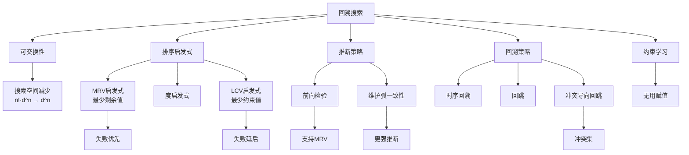

# 6.3 CSP的回溯搜索

## 1. 背景与动机

### 1.1 历史背景

回溯搜索是人工智能中最古老且最基础的搜索算法之一。1850年，高斯描述了一种递归回溯算法用于求解8皇后问题（该问题于1848年首次发表在德国国际象棋杂志上）。高斯将他的方法称作"Tatonniren"，来源于法语单词"tâtonner"——在黑暗中摸索。

根据高德纳（Donald Knuth）的说法，沃克（R. J. Walker）在20世纪50年代引入了"回溯（backtrack）"一词。沃克（1960）描述了基本的回溯算法，并用它找到了13皇后问题的所有解。戈洛姆和鲍默特（Golomb and Baumert, 1965）举例说明了可以应用回溯法的一般类型的组合问题，并引入了MRV（最少剩余值）启发式算法。

20世纪70-80年代，回溯算法得到了显著改进：比特纳和莱因戈尔德（Bitner and Reingold, 1975）提供了有影响力的回溯技术综述；布雷拉兹（Brelaz, 1979）在应用MRV启发式算法后使用度启发式算法打破僵局；哈拉利克和埃利奥特（Haralick and Elliott, 1980）提出了最少约束值启发式算法。

### 1.2 研究动机

约束传播虽然强大，但通常不足以单独求解复杂的CSP问题。当约束传播完成后仍存在具有多个可能值的变量时，我们需要通过搜索来求解。

标准深度受限搜索在CSP中面临一个严重问题：
- 对于具有$n$个变量、域大小为$d$的CSP
- 第一层的分支因子为$nd$（任意变量取任意值）
- 第二层的分支因子为$(n-1)d$
- 树总共有$n! \cdot d^n$个叶节点
- 但可能的完整赋值只有$d^n$种！

**关键洞察——可交换性**：在CSP中，赋值的顺序不影响最终结果。$NSW = \text{red}$然后$SA = \text{blue}$，与交换顺序，结果相同。

利用可交换性，我们只需在每个节点考虑单个变量，叶节点数量减少到$d^n$，这正是我们期望的。

### 1.3 应用场景

回溯搜索适用于：

| 应用场景 | 特点 | 常用启发式 |
|---------|------|-----------|
| 困难数独 | 约束传播不足 | MRV + 最少约束值 |
| 大规模地图着色 | 结构复杂 | 度启发式 + 前向检验 |
| 组合优化 | 需要最优解 | 约束学习 + 智能回溯 |
| 配置问题 | 约束密集 | MAC + 冲突导向回跳 |
| 调度问题 | 时间约束 | 前向检验 + 边界传播 |

### 1.4 先决条件

学习本节需要掌握：
- 深度优先搜索（第3章）
- CSP基本定义（第6.1节）
- 约束传播技术（第6.2节）
- 递归算法设计

## 2. 知识逻辑图谱

### 2.1 概念关系图



### 2.2 回溯搜索算法结构

```
回溯搜索
├── 变量选择（Select-Unassigned-Variable）
│   ├── 静态排序
│   ├── 随机选择
│   ├── MRV启发式（最少剩余值）
│   └── 度启发式（打破僵局）
│
├── 值排序（Order-Domain-Values）
│   ├── 原始顺序
│   ├── 随机顺序
│   └── LCV启发式（最少约束值）
│
├── 推断（Inference）
│   ├── 无推断
│   ├── 前向检验
│   └── 维护弧一致性（MAC）
│
└── 回溯策略
    ├── 时序回溯
    ├── 回跳（Backjumping）
    └── 冲突导向回跳（CBJ）
```

### 2.3 知识发展依赖链

```
深度优先搜索
    ↓
CSP可交换性发现
    ↓
基础回溯搜索
    ↓
    ├── 变量排序策略
    │       ├── MRV启发式（1979）
    │       └── 度启发式（1979）
    │
    ├── 值排序策略
    │       └── LCV启发式（1980）
    │
    ├── 推断与搜索结合
    │       ├── 前向检验
    │       └── MAC（1994）
    │
    └── 智能回溯
            ├── 回跳（1977）
            ├── 冲突导向回跳（1993）
            └── 约束学习
```

## 3. 核心概念与数学分析

### 3.1 术语定义（中英文对照）

| 中文术语 | 英文术语 | 定义 |
|---------|---------|------|
| 回溯搜索 | Backtracking Search | 通过递归尝试变量赋值并在失败时回溯的搜索方法 |
| 可交换性 | Commutativity | 动作应用顺序不影响结果的性质 |
| 最少剩余值 | Minimum Remaining Values (MRV) | 选择合法值最少的变量 |
| 度启发式 | Degree Heuristic | 选择与其他未赋值变量约束最多的变量 |
| 最少约束值 | Least Constraining Value (LCV) | 选择为相邻变量留下最多选择的值 |
| 前向检验 | Forward Checking | 变量赋值后与相邻变量建立弧一致性 |
| 维护弧一致性 | Maintaining Arc Consistency (MAC) | 搜索过程中持续维护弧一致性 |
| 时序回溯 | Chronological Backtracking | 回溯到时间上最近的决策点 |
| 回跳 | Backjumping | 回溯到冲突集中最近的变量 |
| 冲突集 | Conflict Set | 导致变量某个值被删除的赋值集合 |
| 冲突导向回跳 | Conflict-Directed Backjumping | 基于深层冲突集的智能回溯 |
| 无用赋值 | No-Good | 导致矛盾的最小变量赋值集合 |
| 约束学习 | Constraint Learning | 记录无用赋值以避免重复 |

### 3.2 符号参考表

| 符号 | 含义 |
|-----|------|
| assignment | 当前部分赋值 |
| var | 选择的未赋值变量 |
| value | 尝试的变量值 |
| inferences | 推断得到的额外赋值或域缩减 |
| conf($X_i$) | $X_i$的冲突集 |

### 3.3 回溯搜索算法

**基础回溯算法**：

```
function BACKTRACKING-SEARCH(csp) returns 解或failure
    return BACKTRACK(csp, {})

function BACKTRACK(csp, assignment) returns 解或failure
    if assignment是完整的 then return assignment
    var ← SELECT-UNASSIGNED-VARIABLE(csp, assignment)
    for each value in ORDER-DOMAIN-VALUES(csp, var, assignment) do
        if value与assignment一致 then
            将{var = value}添加到assignment
            inferences ← INFERENCE(csp, var, assignment)
            if inferences ≠ failure then
                将inferences添加到csp
                result ← BACKTRACK(csp, assignment)
                if result ≠ failure then return result
                从csp中删除inferences
            从assignment中删除{var = value}
    return failure
```

**关键特性**：
- 只维护状态的单个表示，原地修改而非创建新状态
- 失败时撤销赋值和推断
- 递归实现深度优先搜索

### 3.4 变量排序启发式

#### 3.4.1 最少剩余值（MRV）启发式

**策略**：选择"合法"值最少的变量（"最受约束变量"或"失败优先"）。

**原理**：
- 选择最可能马上导致失败的变量
- 尽早剪枝，避免遍历其他变量的无意义搜索
- 如果某变量没有剩余合法值，优先选择它并立即检测到失败

**示例**：
在澳大利亚地图着色中，赋值$WA = \text{red}$和$NT = \text{green}$后：
- SA只有一个可能值（blue）
- Q、NSW、V各有2-3个可能值
- MRV选择SA，赋值后Q、NSW、V的取值确定

#### 3.4.2 度启发式

**策略**：选择与其他未赋值变量约束最多的变量。

**用途**：
- 在初始阶段打破僵局（如澳大利亚地图开始时所有变量都有3个合法值）
- 降低未来选择的分支因子

**示例**：
在澳大利亚地图中，SA的度为5（连接最多），T的度为0。先赋值SA可以按顺序访问其邻居。

#### 3.4.3 启发式组合

通常组合使用：
1. 首先使用MRV
2. 如果存在多个MRV相同的变量，使用度启发式打破僵局

### 3.5 值排序启发式

#### 3.5.1 最少约束值（LCV）启发式

**策略**：优先选择为相邻变量留下最多选择的值。

**原理**：
- 为后续变量赋值保留最大的灵活性
- 失败延后，先尝试最可能成功的值

**示例**：
赋值$WA = \text{red}$和$NT = \text{green}$后，为Q选择值：
- blue：消除SA的最后一个合法值（bad）
- red：为SA留下选择（good）
- LCV选择red

#### 3.5.2 为什么"失败优先"与"失败延后"

**变量选择（失败优先）**：
- 每个变量最终都必须赋值
- 选择可能最先失败的变量，减少需要回溯才能找到的成功赋值

**值选择（失败延后）**：
- 只需要找到一个解
- 先尝试最有可能的值
- 如果目标是枚举所有解，值排序就无关紧要

### 3.6 推断策略

#### 3.6.1 前向检验（Forward Checking）

**原理**：当变量$X$被赋值时，为每个通过约束与$X$连接的未赋值变量$Y$，从$Y$的域中删除与$X$取值不一致的值。

**特点**：
- 比MAC弱，但开销更小
- 可以检测许多不一致
- 但"向前看得不够远"

**示例**：
赋值$WA = \text{red}$后：
- 从NT和SA的域中删除red
- 赋值$Q = \text{green}$后：
- 从NT、SA、NSW的域中删除green
- 赋值$V = \text{blue}$后：
- 从NSW和SA的域中删除blue
- SA的域变为空集 → 检测到不一致，立即回溯

**局限性**：
赋值$Q = \text{green}$后，NT和SA的唯一可能值都是blue，这违反了它们之间的约束。但前向检验无法检测这种不一致，因为它只检查与已赋值变量的约束。

#### 3.6.2 维护弧一致性（MAC）

**原理**：当变量$X_i$被赋值后，调用AC-3，但初始队列只包含与$X_i$相邻的未赋值变量的弧$(X_j, X_i)$。

**特点**：
- 严格比前向检验更强大
- 递归传播约束
- 如果任何变量的域变为空集，立即回溯

**与前向检验的关系**：
- 前向检验所做的与MAC对初始队列的弧所做的相同
- 但前向检验不会在变量域变化时递归传播

### 3.7 智能回溯

#### 3.7.1 时序回溯的问题

**时序回溯**：回溯到时间上最近的决策点。

**问题示例**：
按固定顺序$Q, NSW, V, T, SA, WA, NT$赋值：
- 部分赋值：$\{Q = \text{red}, NSW = \text{green}, V = \text{blue}, T = \text{red}\}$
- SA没有合法值
- 时序回溯退回到$T$，尝试新颜色
- 但重新给塔斯马尼亚州着色不能解决南澳大利亚州的问题！

#### 3.7.2 回跳（Backjumping）

**策略**：回溯到冲突集中最近的赋值。

**冲突集**：与某变量某些值冲突的赋值集合。

**示例**：
SA的冲突集为$\{Q = \text{red}, NSW = \text{green}, V = \text{blue}\}$
- 回跳越过$T$，为$V$尝试新值

**与前向检验的关系**：
- 前向检验不需要额外工作就能提供冲突集
- 当根据$X = x$从$Y$的域中删除值时，将$X = x$添加到$Y$的冲突集
- 可以证明：每个被回跳剪枝的分支也会被前向检验剪枝
- 因此，在使用前向检验或MAC时，简单回跳是多余的

#### 3.7.3 冲突导向回跳（Conflict-Directed Backjumping）

**深层冲突集概念**：前面一组变量共同导致当前变量连同任何后续变量都不存在一致解。

**示例**：
部分赋值$\{WA = \text{red}, NSW = \text{red}\}$后尝试$T = \text{red}$：
- 对NT、Q、V、SA赋值最终失败
- 回跳不可行，因为NT有与前面赋值一致的值
- 但NT、Q、V、SA放在一起会失败
- 深层冲突集是$\{WA, NSW\}$
- 算法应跳过$T$回溯到$NSW$

**冲突集更新公式**：
当从$X_j$回跳到$X_i$时：
$$\text{conf}(X_i) \leftarrow \text{conf}(X_i) \cup \text{conf}(X_j) - \{X_i\}$$

### 3.8 约束学习

**思想**：从冲突集中找出引起问题的最小变量集（无用赋值），记录以避免重复遇到同样问题。

**实现方式**：
1. 向CSP添加新约束禁止这种赋值组合
2. 维护单独的缓存

**应用场景**：
- 无用赋值$\{WA = \text{red}, NT = \text{green}, Q = \text{blue}\}$在当前搜索分支被剪掉后不会再次出现
- 但如果搜索树是更大搜索树的一部分（从$V$和$T$的赋值开始），则记录该无用赋值有意义

**重要性**：约束学习是现代CSP求解器提高复杂问题求解效率的最重要技术之一。

## 4. 具体示例

### 4.1 澳大利亚地图着色搜索树

**变量顺序**：WA, NT, Q, NSW, V, SA, T

**部分搜索过程**：

1. **第一层**：选择$WA = \text{red}$
   - 可选：$WA = \text{red}, \text{green}, \text{blue}$

2. **第二层**：选择$NT = \text{green}$
   - 前向检验：从SA的域中删除red、green
   - SA的域：\{blue\}

3. **第三层**：MRV选择$SA = \text{blue}$
   - 前向检验：从Q、NSW、V的域中删除blue

4. **第四层**：选择$Q = \text{red}$
   - 前向检验：从NSW的域中删除red

5. **继续赋值NSW、V、T**

### 4.2 前向检验vs MAC对比

**场景**：赋值$Q = \text{green}$后，NT和SA的唯一可能值都是blue

**前向检验**：
- 无法检测NT和SA之间的冲突
- 继续深入搜索直到发现矛盾

**MAC**：
- 从NT和SA的域变化递归传播
- 检测到NT和SA的弧不一致
- 立即回溯，节省搜索时间

### 4.3 冲突导向回跳示例

**变量顺序**：$Q, NSW, V, T, SA, WA, NT$

**赋值过程**：
1. $Q = \text{red}$
2. $NSW = \text{green}$
3. $V = \text{blue}$
4. $T = \text{red}$
5. SA无合法值

**冲突集分析**：
- SA的直接冲突：$\{Q = \text{red}, NSW = \text{green}, V = \text{blue}\}$
- 时序回溯：退回到$T$（无效）
- 回跳：退回到$V$（有效）

**深层冲突示例**：
- 部分赋值$\{WA = \text{red}, NSW = \text{red}\}$
- 赋值$T = \text{red}, NT = \text{blue}, Q = \text{green}, V = \text{blue}$
- SA无合法值
- 冲突集传递：$\text{conf}(SA) = \{WA, NT, Q\}$
- 回溯到$Q$，更新$\text{conf}(Q) = \{WA, NT, NSW\}$
- 回溯到$NT$，更新$\text{conf}(NT) = \{WA, NSW\}$
- 最终回跳到$NSW$

## 5. 一句话本质

**CSP回溯搜索的本质是利用问题的可交换性大幅减少搜索空间，通过变量排序（失败优先）、值排序（失败延后）、约束传播推断和智能回溯策略的有机结合，在指数级搜索空间中以领域无关的方式高效寻找满足所有约束的解。**

## 6. 总结与反思

### 6.1 关键要点

1. **可交换性**：
   - CSP中赋值顺序不影响结果
   - 搜索空间从$n! \cdot d^n$减少到$d^n$

2. **变量排序**：
   - MRV（最少剩余值）：失败优先，尽早剪枝
   - 度启发式：打破僵局，降低分支因子

3. **值排序**：
   - LCV（最少约束值）：失败延后，保留灵活性
   - 只需找到一个解时，先尝试最可能的值

4. **推断策略**：
   - 前向检验：简单高效，但向前看得不够远
   - MAC：更强推断，递归传播约束

5. **智能回溯**：
   - 回跳：基于冲突集回溯
   - 冲突导向回跳：基于深层冲突集
   - 约束学习：记录无用赋值避免重复

### 6.2 启发式组合策略

| 策略组合 | 适用场景 | 效果 |
|---------|---------|------|
| MRV + LCV + 前向检验 | 一般CSP | 平衡效率与开销 |
| MRV + 度启发式 + MAC | 困难CSP | 更强剪枝能力 |
| MRV + LCV + MAC + CBJ | 复杂问题 | 最强组合，但开销大 |
| 静态排序 + 无推断 | 简单问题 | 最小开销 |

### 6.3 常见误解对照表

| 误解 | 正确理解 |
|-----|---------|
| 回溯搜索总是比约束传播慢 | 两者通常结合使用，约束传播减少搜索空间 |
| MRV启发式总是最好的选择 | MRV在大多数情况好，但需要度启发式打破僵局 |
| 前向检验和MAC效果差不多 | MAC严格强于前向检验，但计算开销更大 |
| 智能回溯在任何情况下都有用 | 在使用前向检验或MAC时，简单回跳是多余的 |
| 值排序对找到所有解很重要 | 值排序只对找到单个解重要，枚举所有解时无关紧要 |

### 6.4 反思问题

1. **理论层面**：
   - 为什么CSP的可交换性可以将搜索空间从$n! \cdot d^n$减少到$d^n$？
   - 在什么情况下MAC的额外开销不值得？
   - 冲突导向回跳的最坏情况时间复杂度是多少？

2. **实践层面**：
   - 如何根据问题特征选择最佳的启发式组合？
   - 在实际应用中，如何平衡推断强度和计算开销？
   - 约束学习如何与智能回溯有效结合？

3. **扩展思考**：
   - 如何将并行计算应用于回溯搜索？
   - 在动态CSP中，如何重用之前的搜索结果？
   - 机器学习如何帮助选择启发式策略？

### 6.5 公式速查表

| 概念 | 公式/说明 |
|-----|----------|
| 原始搜索空间 | $n! \cdot d^n$ 叶节点 |
| 利用可交换性后 | $d^n$ 叶节点 |
| MRV选择 | $\arg\min_{X_i} |D_i|$ |
| 度启发式 | $\arg\max_{X_i} |\text{constraints}(X_i)|$ |
| LCV选择 | $\arg\max_{v} \sum_{X_j \in \text{neighbors}} |\text{legal values after assigning } v|$ |
| 冲突集更新 | $\text{conf}(X_i) \leftarrow \text{conf}(X_i) \cup \text{conf}(X_j) - \{X_i\}$ |

### 6.6 算法对比

| 算法/策略 | 时间复杂度 | 空间复杂度 | 适用场景 |
|----------|-----------|-----------|---------|
| 基础回溯 | $O(d^n)$ | $O(n)$ | 教学演示 |
| + 前向检验 | 显著降低 | $O(n \cdot d)$ | 一般问题 |
| + MAC | 更低 | $O(n \cdot d)$ | 困难问题 |
| + 冲突导向回跳 | 取决于冲突结构 | $O(n^2)$ | 深层冲突问题 |
| + 约束学习 | 摊销最优 | $O(\text{学习约束数})$ | 重复子问题 |

### 6.7 延伸阅读

- Golomb, S. W., & Baumert, L. D. (1965). Backtrack programming.
- Brelaz, D. (1979). New methods to color the vertices of a graph.
- Haralick, R. M., & Elliott, G. L. (1980). Increasing tree search efficiency for constraint satisfaction problems.
- Sabin, D., & Freuder, E. C. (1994). Contradicting conventional wisdom in constraint satisfaction.
- Prosser, P. (1993). Hybrid algorithms for the constraint satisfaction problem.
- Moskewicz, M. W., et al. (2001). Chaff: Engineering an efficient SAT solver.
