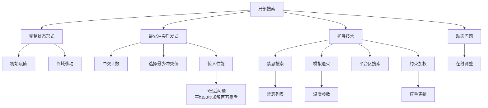

# 6.4 CSP的局部搜索

## 1. 背景与动机

### 1.1 历史背景

局部搜索方法在优化和搜索领域有着悠久的历史。柯克帕特里克等人（Kirkpatrick et al., 1983）关于模拟退火的工作推广了约束满足问题中的局部搜索方法。此后，局部搜索被广泛应用于超大规模集成电路（VLSI）布局和调度问题。

最少冲突启发式算法最早由顾钧（Gu, 1989）提出，由明顿等人（Minton et al., 1992）独立开发。索希克和顾钧（Sosic and Gu, 1994）展示了如何应用最少冲突启发式算法在1分钟之内求解300万皇后问题，这一惊人结果引发了对"简单"和"困难"问题本质的重新评估。

彼得·奇斯曼等人（Cheeseman et al., 1991）研究了随机生成CSP的难度，发现几乎所有这类问题要么非常简单，要么无解，只有在特定参数范围内才会出现"困难"问题实例。

### 1.2 研究动机

回溯搜索虽然系统性强，但面临一些挑战：
- 在最坏情况下需要指数时间
- 内存使用随搜索深度增加
- 对初始赋值敏感

**局部搜索的优势**：
1. **常数空间复杂度**：只维护当前状态
2. **快速找到解**：对于解密集分布的问题特别有效
3. **适合大规模问题**：如百万皇后问题
4. **适合动态问题**：问题变化时可以快速调整

**关键洞察**：对于某些CSP（如n皇后问题），解密集地分布在整个状态空间上，局部搜索可以高效找到解。

### 1.3 应用场景

局部搜索特别适用于：

| 应用场景 | 问题规模 | 特点 |
|---------|---------|------|
| n皇后问题 | 百万皇后 | 解密集分布 |
| 哈勃望远镜调度 | 大规模 | 需要快速求解 |
| 航空公司航班调度 | 上千航班 | 动态调整需求 |
| VLSI布局 | 大规模 | 优化目标复杂 |
| 图着色 | 大规模图 | 近似解可接受 |

### 1.4 先决条件

学习本节需要掌握：
- 局部搜索基础（第4.1节）
- CSP基本定义（第6.1节）
- 启发式搜索概念
- 随机算法基础

## 2. 知识逻辑图谱

### 2.1 概念关系图



### 2.2 局部搜索算法族

```
局部搜索
├── 基本框架
│   ├── 初始状态生成（随机或贪心）
│   ├── 邻域定义（单变量值改变）
│   └── 终止条件（找到解或达到最大步数）
│
├── 最少冲突算法
│   ├── 随机选择冲突变量
│   ├── 选择使冲突最少的值
│   └── 随机打破僵局
│
└── 增强技术
    ├── 平台区搜索（横向移动）
    ├── 禁忌搜索（避免循环）
    ├── 模拟退火（概率性接受劣解）
    └── 约束加权（聚焦困难约束）
```

### 2.3 知识发展依赖链

```
爬山算法（第4章）
    ↓
模拟退火（1983）
    ↓
CSP局部搜索
    ↓
    ├── 最少冲突启发式（1989, 1992）
    │       ↓
    │   百万皇后问题求解（1994）
    │       ↓
    │   问题难度相变研究（1991）
    │
    └── 增强技术
            ├── 禁忌搜索
            ├── 约束加权
            └── 平台区搜索策略
```

## 3. 核心概念与数学分析

### 3.1 术语定义（中英文对照）

| 中文术语 | 英文术语 | 定义 |
|---------|---------|------|
| 局部搜索 | Local Search | 从完整赋值出发，通过局部修改寻找解的方法 |
| 完整状态形式 | Complete-State Formulation | 每个状态为所有变量赋值的表示方式 |
| 最少冲突 | Min-Conflicts | 选择使冲突数最少的变量值 |
| 冲突变量 | Conflicted Variable | 违反某个约束的变量 |
| 平台区 | Plateau | 相邻状态评估值相同的区域 |
| 禁忌搜索 | Tabu Search | 维护最近访问状态列表避免循环的方法 |
| 约束加权 | Constraint Weighting | 为约束分配权重以聚焦困难约束 |
| 模拟退火 | Simulated Annealing | 以概率接受劣解以逃离局部最优 |
| 地形图 | Landscape | 状态空间与评估函数形成的地形 |

### 3.2 符号参考表

| 符号 | 含义 |
|-----|------|
| current | 当前完整赋值 |
| max_steps | 最大搜索步数 |
| var | 选择的冲突变量 |
| value | 为变量选择的新值 |
| CONFLICTS(csp, var, v, current) | 赋值var=v时的冲突数 |
| weights | 约束权重向量 |

### 3.3 最少冲突算法

**算法描述**：

```
function MIN-CONFLICTS(csp, max_steps) returns 解或failure
    inputs: csp, 约束满足问题
           max_steps, 放弃前允许的步数
    
    current ← csp的一个初始完整赋值
    for i = 1 to max_steps do
        if current是csp的一个解 then return current
        var ← 从csp.VARIABLES中随机选取的冲突变量
        value ← 使CONFLICTS(csp, var, v, current)最小的v值
        在current中设置var = value
    return failure
```

**关键特性**：
- 初始状态可以随机选择或通过贪心法生成
- 每次选择一个发生冲突的变量
- 将该变量赋值为使冲突数最少的新值
- 随机打破僵局（如果有多个最少冲突值）

### 3.4 初始状态生成

**随机生成**：
- 为每个变量随机选择一个值
- 简单快速，但可能远离解

**贪心生成**：
- 依次为每个变量选择最少冲突值
- 考虑已赋值变量的影响
- 通常产生更好的初始状态

### 3.5 冲突计数函数

**定义**：CONFLICTS(csp, var, v, current)统计在给定当前赋值其余部分的情况下，将var赋值为v所违反的约束数量。

**计算方式**：
$$\text{CONFLICTS}(csp, var, v, current) = \sum_{C \in \text{constraints}(var)} \mathbb{1}[C \text{ is violated when } var = v]$$

其中$\mathbb{1}[\cdot]$是指示函数。

### 3.6 n皇后问题的惊人现象

**实验观察**：
- 在n皇后问题上，最少冲突法的运行时间基本上与问题规模无关
- 可以在平均50步内求解百万皇后问题（初始赋值后）

**理论解释**：
- n皇后问题的解密集地分布在整个状态空间
- 局部搜索可以高效地在解空间中导航
- 这与许多其他CSP形成对比，后者解稀疏分布

**问题难度相变**：
奇斯曼等人（1991）发现随机生成CSP的难度分布：
- 大多数问题要么非常简单，要么无解
- 只有在特定参数范围内（约束密度和约束紧度的特定组合）才会出现困难问题
- 这解释了为什么n皇后问题"容易"

### 3.7 平台区搜索

**问题**：CSP地形图通常存在大量平台区——数百万个赋值只存在一个冲突。

**平台区搜索策略**：
- 允许横向移动到另一个得分相同的状态
- 帮助局部搜索走出平台区

**禁忌搜索（Tabu Search）**：
- 维护一个最近访问过的状态列表
- 禁止算法返回这些状态
- 防止在平台区循环

**模拟退火**：
- 以概率接受劣解（增加冲突的赋值）
- 概率随"温度"参数降低而减小
- 帮助逃离局部最优和平台区

### 3.8 约束加权

**动机**：集中搜索力量在重要约束上。

**算法**：
1. 每个约束初始权重为1
2. 每步找出使违反约束总权重最低的变量
3. 修改该变量的值
4. 增加当前赋值所违反的每个约束的权重

**优势**：
1. **地形塑造**：为平台区增加地形因素，确保从当前状态可以改进
2. **学习策略**：难以求解的约束随时间获得更高权重

**数学表达**：
选择变量$var$最小化：
$$\sum_{C \in \text{violated}(var=v)} w_C$$

更新权重：
$$w_C \leftarrow w_C + 1, \quad \forall C \in \text{violated}(current)$$

## 4. 具体示例

### 4.1 8皇后问题的最少冲突求解

**问题设置**：
- 8个变量$Q_1, \ldots, Q_8$（每列一个皇后）
- 域：$\{1, 2, \ldots, 8\}$（行位置）
- 约束：任意两个皇后不在同一行或同一对角线

**初始状态**（随机或贪心生成）：
```
列: 1 2 3 4 5 6 7 8
行: 4 5 6 3 4 5 6 7
```

**迭代过程**：

**第1步**：
- 选择冲突变量：$Q_8$（第8列，第7行）
- 计算各行的冲突数：
  - 行1: 与$Q_1$对角冲突，与$Q_4$对角冲突 → 2个冲突
  - 行2: 与$Q_2$对角冲突 → 1个冲突
  - 行3: 与$Q_3$同行冲突 → 1个冲突
  - ...
  - 行8: 0个冲突（最优）
- 选择$Q_8 = 8$

**第2步**：
- 选择冲突变量：$Q_6$（检查各皇后冲突）
- 找到使冲突最少的行
- 更新赋值

**收敛**：
- 通常在几步到几十步内收敛到解
- 对于8皇后，平均约4-5步（初始赋值后）

### 4.2 哈勃望远镜调度

**问题规模**：
- 一周的观测调度
- 涉及多种天文、优先级和电力约束

**传统方法**：
- 使用约束满足或整数规划
- 求解时间：约3周

**最少冲突法**：
- 初始调度（可能违反约束）
- 迭代修复冲突
- 求解时间：约10分钟

**关键成功因素**：
- 解空间相对密集
- 约束类型适合局部搜索
- 可以容忍近似解作为起点

### 4.3 航空公司航班调度调整

**场景**：
- 每周航班调度涉及上千趟航班
- 上万名人员分配
- 机场恶劣天气打乱调度

**需求**：
- 以最少的改动修正日程表
- 快速响应（在线设定）

**局部搜索方法**：
1. 从当前调度开始
2. 识别违反新约束的赋值
3. 应用最少冲突法修复
4. 最小化对原调度的改动

**优势对比**：
- 回溯搜索：需要更多时间，可能对当前调度进行大量改动
- 局部搜索：快速，保持原调度的大部分结构

## 5. 一句话本质

**CSP局部搜索的本质是采用完整状态表示从任意初始赋值出发，通过迭代选择冲突变量并赋以最少冲突值的方式在解空间中导航，利用解的密集分布特性在常数空间复杂度内高效求解大规模约束满足问题。**

## 6. 总结与反思

### 6.1 关键要点

1. **完整状态表示**：
   - 每个状态为所有变量赋值
   - 每次改变一个变量的值
   - 常数空间复杂度

2. **最少冲突启发式**：
   - 随机选择冲突变量
   - 赋值为使冲突数最少的值
   - 随机打破僵局

3. **性能特征**：
   - n皇后问题：运行时间与规模无关
   - 百万皇后问题：平均50步求解
   - 适用于解密集分布的问题

4. **增强技术**：
   - 平台区搜索：允许横向移动
   - 禁忌搜索：避免循环
   - 模拟退火：概率性逃离局部最优
   - 约束加权：聚焦困难约束

5. **适用场景**：
   - 大规模问题
   - 动态问题（在线调整）
   - 需要快速近似解
   - 解密集分布的问题

### 6.2 局部搜索vs回溯搜索

| 特性 | 局部搜索 | 回溯搜索 |
|-----|---------|---------|
| 空间复杂度 | $O(n)$ | $O(n \cdot d)$到$O(n^2)$ |
| 完备性 | 不完备 | 完备 |
| 最优性 | 不保证 | 可以找到最优解 |
| 适用规模 | 大规模 | 中小规模 |
| 动态问题 | 适合 | 不太适合 |
| 解的质量 | 可能次优 | 最优（如果找到） |
| 对初始状态敏感 | 是 | 否 |

### 6.3 常见误解对照表

| 误解 | 正确理解 |
|-----|---------|
| 局部搜索总是比回溯搜索快 | 取决于问题结构，局部搜索在解密集时快 |
| 最少冲突法适用于所有CSP | 对解稀疏的问题效果可能很差 |
| 局部搜索总能找到解（如果存在） | 局部搜索可能陷入局部最优或循环 |
| n皇后问题容易意味着所有CSP都容易 | n皇后问题是特例，大多数CSP更难 |
| 禁忌搜索和模拟退火效果差不多 | 各有优势，取决于问题地形结构 |

### 6.4 反思问题

1. **理论层面**：
   - 为什么n皇后问题的解如此密集地分布？
   - 如何刻画一个CSP是否适合局部搜索？
   - 约束加权如何改变问题地形图的结构？

2. **实践层面**：
   - 如何设计有效的初始状态生成策略？
   - 在平台区搜索中，如何平衡探索和利用？
   - 如何确定禁忌列表的最佳长度？

3. **扩展思考**：
   - 如何将局部搜索与约束传播结合？
   - 在分布式环境下如何进行局部搜索？
   - 机器学习如何指导局部搜索的启发式选择？

### 6.5 公式速查表

| 概念 | 公式/说明 |
|-----|----------|
| 冲突计数 | $\text{CONFLICTS} = \sum \mathbb{1}[C \text{ violated}]$ |
| 变量选择 | 随机选择冲突变量 |
| 值选择 | $\arg\min_v \text{CONFLICTS}(var=v)$ |
| 约束加权目标 | $\min \sum_{C \in \text{violated}} w_C$ |
| 权重更新 | $w_C \leftarrow w_C + 1$ |
| 模拟退火接受概率 | $P = e^{-\Delta E / T}$ |

### 6.6 算法参数调优

| 参数 | 作用 | 调优建议 |
|-----|------|---------|
| max_steps | 防止无限循环 | 根据问题规模设置 |
| 禁忌列表长度 | 避免循环 | 通常10-100 |
| 初始温度 | 模拟退火 | 与问题规模相关 |
| 冷却率 | 模拟退火 | 通常0.95-0.99 |
| 权重增长速率 | 约束加权 | 线性或指数增长 |

### 6.7 延伸阅读

- Minton, S., et al. (1992). Minimizing conflicts: A heuristic repair method for constraint satisfaction and scheduling problems.
- Sosic, R., & Gu, J. (1994). Efficient local search with conflict minimization: A case study of the n-queens problem.
- Cheeseman, P., et al. (1991). Where the really hard problems are.
- Kirkpatrick, S., et al. (1983). Optimization by simulated annealing.
- Hoos, H. H., & Tsang, E. (2006). Local search methods.
- Hoos, H. H., & Stützle, T. (2004). Stochastic Local Search: Foundations and Applications.
