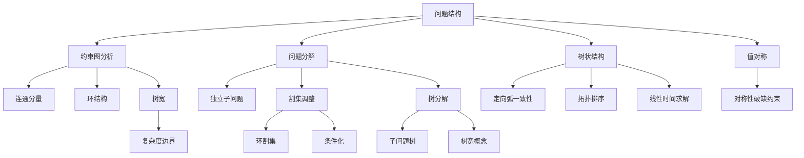

# 6.5 问题的结构

## 1. 背景与动机

### 1.1 历史背景

将CSP求解的复杂性与其约束图结构相关联的工作起源于弗罗伊德（Freuder, 1985）以及麦克沃思和弗罗伊德（Mackworth and Freuder, 1985），他们证明了在弧一致树上的搜索不需要回溯。数据库社区将其扩展到无环超图，得到了类似结果（Beeri et al., 1983）。

1986年，图论家罗伯逊和西摩（Robertson and Seymour）提出了树宽（treewidth）的概念。德克特和珀尔（Dechter and Pearl, 1987, 1989）将相关概念（他们称之为诱导宽度，但与树宽相同）应用于约束满足问题，并开发了树分解方法。

戈特洛布等人（Gottlob et al., 1999a, 1999b）提出了超树宽（hypertree width）的概念，证明了超树宽包含所有先前定义的"宽度"度量。

### 1.2 研究动机

处理复杂的真实世界问题的唯一可能方法是将其分解。约束图的结构包含了问题复杂性的重要信息：

**关键观察**：
- 完全独立的子问题可以分别求解
- 树状结构问题可以在线性时间内求解
- "几乎"是树的问题可以通过割集调整或树分解高效求解

**结构利用的价值**：
- 100个变量的布尔CSP，分解为4个子问题
- 最坏情况时间：从宇宙生命周期缩短到不到1秒

### 1.3 应用场景

结构分析方法适用于：

| 应用场景 | 结构特征 | 适用方法 |
|---------|---------|---------|
| 分布式问题 | 独立子问题 | 连通分量分解 |
| 树状约束图 | 无环 | 定向弧一致性 |
| "几乎"是树的问题 | 少量环 | 割集调整 |
| 一般问题 | 有界树宽 | 树分解 |
| 大规模配置 | 可分解结构 | 超树分解 |

### 1.4 先决条件

学习本节需要掌握：
- 图论基础（连通分量、树、拓扑排序）
- CSP基本定义（第6.1节）
- 弧一致性（第6.2节）
- 算法复杂度分析

## 2. 知识逻辑图谱

### 2.1 概念关系图



### 2.2 结构方法层级

```
问题结构分析
├── 简单结构（多项式时间可解）
│   ├── 独立子问题（连通分量）
│   │       └── 复杂度：O(d^c · n/c)
│   └── 树状结构
│           ├── 定向弧一致性
│           └── 复杂度：O(n · d^2)
│
├── 近似树结构
│   ├── 割集调整
│   │       ├── 环割集
│   │       └── 复杂度：O(d^c · (n-c) · d^2)
│   └── 树分解
│           ├── 树宽概念
│           └── 复杂度：O(n · d^(w+1))
│
└── 一般结构
    ├── 超树分解
    └── 对称性破缺
```

### 2.3 知识发展依赖链

```
约束图概念
    ↓
树状CSP研究（1985）
    ↓
    ├── 定向弧一致性
    │       └── 线性时间算法
    │
    ├── 割集方法（1990）
    │       └── 环割集调整
    │
    └── 树分解（1987, 1989）
            ├── 树宽概念
            └── 多项式时间可解类

超树宽理论（1999）
    ↓
最一般的宽度度量
```

## 3. 核心概念与数学分析

### 3.1 术语定义（中英文对照）

| 中文术语 | 英文术语 | 定义 |
|---------|---------|------|
| 连通分量 | Connected Component | 图中相互连通的最大子图 |
| 独立子问题 | Independent Subproblem | 变量和约束不相交的子问题 |
| 树状结构 | Tree-Structured | 约束图是树的CSP |
| 定向弧一致性 | Directional Arc Consistency (DAC) | 相对于变量顺序的弧一致性 |
| 拓扑排序 | Topological Sort | 子节点在父节点之后的排序 |
| 环割集 | Cycle Cutset | 删除后使图变为森林的变量集 |
| 割集调整 | Cutset Conditioning | 对割集变量赋值后求解树问题 |
| 树分解 | Tree Decomposition | 将图转换为树的分解方式 |
| 树宽 | Treewidth | 树分解中最大节点大小减1 |
| 值对称 | Value Symmetry | 解在值排列下保持的性质 |
| 对称性破缺 | Symmetry Breaking | 消除对称解的技术 |

### 3.2 符号参考表

| 符号 | 含义 |
|-----|------|
| $c$ | 子问题/割集大小 |
| $n$ | 变量总数 |
| $d$ | 最大域大小 |
| $w$ | 树宽 |
| $S$ | 割集变量集合 |
| $G$ | 约束图 |
| $T$ | 树分解 |

### 3.3 独立子问题

**定义**：如果约束图的连通分量将变量划分为不相交的集合，则每个连通分量对应一个独立子问题。

**求解方法**：
1. 识别连通分量
2. 分别求解每个子问题
3. 合并解

**复杂度分析**：
- 假设每个子问题有$c$个变量
- 共有$n/c$个子问题
- 求解每个子问题最多需要$d^c$工作量
- 总工作量：$O(d^c \cdot n/c)$，关于$n$线性

**对比**：
- 不分解：$O(d^n)$，指数级
- 分解后：$O(d^c \cdot n/c)$，线性

**示例**：
澳大利亚地图中，塔斯马尼亚州（T）与大陆不相连：
- 子问题1：大陆6个州
- 子问题2：塔斯马尼亚州（孤立节点）
- 分别求解后合并

### 3.4 树状结构CSP

**定义**：当任意两个变量只由一条路径连接时，约束图是一棵树。

**关键定理**：任何树状结构的CSP可以在变量个数的线性时间内求解。

**定向弧一致性（DAC）**：
变量顺序为$X_1, X_2, \ldots, X_n$的CSP称为定向弧一致的，当且仅当$j > i$时，每个$X_i$相对于每个$X_j$都是弧一致的。

**树求解算法**：

```
function TREE-CSP-SOLVER(csp) returns 解或failure
    inputs: csp, 具有X, D, C的CSP
    
    n ← X中变量个数
    assignment ← 空赋值
    root ← X中任一变量
    X ← TOPOLOGICALSORT(X, root)
    
    for j = n down to 2 do
        MAKE-ARC-CONSISTENT(PARENT(X_j), X_j)
        if 不能取得一致 then return failure
    
    for i = 1 to n do
        assignment[X_i] ← D_i中任一一致值
        if 没有一致值 then return failure
    
    return assignment
```

**算法分析**：
1. 选择根节点，拓扑排序
2. 自底向上建立定向弧一致性
3. 自顶向下赋值（无需回溯）

**复杂度**：$O(n \cdot d^2)$
- $n-1$条边
- 每步比较最多$d^2$个值对

### 3.5 割集调整

**思想**：为部分变量赋值，使剩余变量形成树。

**环割集（Cycle Cutset）**：变量子集$S$，删除$S$后约束图成为树。

**算法**：
1. 选择环割集$S$
2. 对$S$中变量的每种可能赋值（满足$S$上的约束）：
   a. 从剩余变量的域中删除不一致的值
   b. 用树算法求解剩余CSP
   c. 如果成功，返回解

**复杂度**：$O(d^c \cdot (n-c) \cdot d^2)$
- 尝试$d^c$种割集赋值
- 每种赋值求解大小为$(n-c)$的树问题

**示例**：
澳大利亚地图中，删除SA后图变为两棵树组成的森林。

**寻找最小环割集**：
- 问题是NP困难的
- 但有高效的近似算法

### 3.6 树分解

**思想**：将约束图转换为树，树中每个节点包含一组变量。

**树分解的3个要求**：
1. 原始问题中的每个变量至少出现在一个树节点中
2. 如果两个变量在原始问题中由约束连接，它们必须同时出现在至少一个树节点中
3. 如果一个变量出现在两个树节点中，它必须出现在连接这两个节点的路径上的所有节点中（连通性）

**第三个条件的意义**：
保证原始问题的任何变量无论在哪出现都具有相同的值。

**求解复杂度**：$O(n \cdot d^{w+1})$
- $n$：树节点个数
- $w$：树宽（最大节点大小减1）
- $d$：最大域大小

**树宽定义**：
- 图的树宽是其所有树分解的最小宽度
- 宽度 = 最大节点大小 - 1
- 树的树宽为1

**示例**：
澳大利亚地图的树分解：
- 节点1：{WA, NT, SA}
- 节点2：{SA, NT, Q}
- 节点3：{SA, Q, NSW}
- 节点4：{SA, NSW, V}
- 节点5：{T}

### 3.7 值对称

**定义**：对于每个一致解，通过排列颜色名可以形成$d!$个解。

**示例**：
澳大利亚地图中，WA、NT、SA必须有不同颜色，但将3种颜色分配给3个区域有$3! = 6$种方法。

**对称性破缺**：
引入对称性破缺约束，如$NT < SA < WA$（按字母顺序排列值）。

**效果**：
- 将搜索空间缩小$d!$倍
- 对于地图着色，可以施加任意排序约束

**一般情况**：
- 消除所有对称性是NP困难的
- 但打破值对称在许多问题上被证明是重要和有效的

## 4. 定理与证明

### 4.1 树状CSP线性时间可解性

**定理**：任何树状结构的CSP可以在$O(n \cdot d^2)$时间内求解。

**证明**：

**算法正确性**：
1. 拓扑排序确保每个变量在其父节点之后处理
2. MAKE-ARC-CONSISTENT确保从父节点到子节点的每条边都是弧一致的
3. 因此，对于父节点选择的任何值，子节点都存在有效值
4. 自顶向下赋值时无需回溯

**复杂度分析**：
- 拓扑排序：$O(n)$
- 弧一致性步骤：$n-1$条边，每步$O(d^2)$
- 赋值步骤：$n$个变量，每步$O(d)$
- 总复杂度：$O(n \cdot d^2)$

**完备性**：
- 如果算法返回failure，则某步无法取得弧一致
- 这意味着对应子问题无解
- 因此整个CSP无解

### 4.2 树分解正确性

**定理**：给定树宽为$w$的CSP的树分解，可以在$O(n \cdot d^{w+1})$时间内求解该CSP。

**证明概要**：

1. **子问题构建**：
   - 每个树节点对应一个子问题
   - 子问题的变量是节点中的变量
   - 子问题的约束是这些变量之间的原始约束

2. **树求解**：
   - 使用Tree-CSP-Solver处理分解后的树
   - 每个"变量"（树节点）的域是值元组的集合
   - 最大元组数为$d^{w+1}$

3. **复杂度**：
   - $n$个树节点
   - 每个节点最多$d^{w+1}$个值
   - 树求解：$O(n \cdot (d^{w+1})^2) = O(n \cdot d^{2(w+1)})$
   - 优化后：$O(n \cdot d^{w+1})$

### 4.3 割集调整正确性

**定理**：对于二元CSP，割集调整可以找到解（如果存在）。

**证明**：

**完备性**：
- 枚举割集的所有可能赋值
- 如果原CSP有解，则割集上的赋值与该解一致
- 对于该赋值，剩余问题有解（因为原解限制在剩余变量上就是解）

**正确性**：
- 只返回满足所有约束的解
- 树算法保证剩余部分的解与割集赋值一致

## 5. 具体示例

### 5.1 澳大利亚地图的连通分量

**约束图分析**：
- 节点：WA, NT, Q, NSW, V, SA, T
- 边：相邻关系
- T是孤立节点（度为0）

**分解**：
- 连通分量1：{WA, NT, Q, NSW, V, SA}
- 连通分量2：{T}

**独立求解**：
1. 求解大陆6个州的着色问题
2. T可以取任意颜色（3种选择）
3. 合并：任何大陆解与任意T的颜色组合都是有效解

**复杂度对比**：
- 不分解：$3^7 = 2187$种可能
- 分解后：$3^6 \times 3 = 729 \times 3 = 2187$（相同，但搜索空间结构不同）

### 5.2 树状CSP示例

**问题**：简化澳大利亚地图，只考虑：
- 变量：WA, NT, Q, NSW
- 约束：WA≠NT, NT≠Q, Q≠NSW
- 形成链状结构：WA—NT—Q—NSW

**求解过程**：

1. **选择根节点**：WA
2. **拓扑排序**：WA, NT, Q, NSW
3. **自底向上建立DAC**：
   - 处理NSW：使Q相对于NSW弧一致
   - 处理Q：使NT相对于Q弧一致
   - 处理NT：使WA相对于NT弧一致
4. **自顶向下赋值**：
   - WA = red
   - NT = green（与WA不同）
   - Q = red（与NT不同）
   - NSW = green（与Q不同）

**无需回溯**！

### 5.3 割集调整示例

**原始图**：澳大利亚完整地图（含SA）

**环割集**：{SA}

**删除SA后的森林**：
- 树1：{WA, NT}（边：WA—NT）
- 树2：{Q, NSW, V}（边：Q—NSW, NSW—V）
- 孤立节点：{T}

**求解过程**：

对于SA的每种颜色：

**SA = red**：
- 从邻居域中删除red
- WA, NT, Q, NSW, V的域：{green, blue}
- 求解树1：WA=green, NT=blue（或反之）
- 求解树2：Q=green, NSW=blue, V=green（或类似）
- T任意

**SA = green**：
- 类似处理

**SA = blue**：
- 类似处理

总尝试次数：$3 \times$（树求解）

### 5.4 树分解示例

**澳大利亚地图的树分解**：

```
    {WA,NT,SA} — {SA,NT,Q} — {SA,Q,NSW} — {SA,NSW,V}
                                    |
                                  {T}
```

**节点内容**：
- 节点1：{WA, NT, SA}，约束：WA≠NT, SA≠NT, WA≠SA
- 节点2：{SA, NT, Q}，约束：SA≠NT, SA≠Q, NT≠Q
- 节点3：{SA, Q, NSW}，约束：SA≠Q, SA≠NSW, Q≠NSW
- 节点4：{SA, NSW, V}，约束：SA≠NSW, SA≠V, NSW≠V
- 节点5：{T}，无约束

**树宽**：3 - 1 = 2

**求解**：
1. 求解每个子问题（考虑内部约束）
2. 在树边上确保共享变量值一致
3. 使用Tree-CSP-Solver

### 5.5 值对称破缺

**澳大利亚地图着色**：

**原始问题**：
- 3种颜色：{red, green, blue}
- 解的数量：多个

**对称性**：
- 对于任何解，可以交换颜色名得到新解
- 例如：将所有red换成green，所有green换成red

**对称性破缺约束**：
- 施加$NT < SA < WA$（按颜色字母顺序）
- 只有1个解满足：$\{NT=\text{blue}, SA=\text{green}, WA=\text{red}\}$

**搜索空间减少**：
- 原始：考虑所有颜色排列
- 破缺后：只考虑一种排列
- 减少因子：$3! = 6$

## 6. 一句话本质

**问题结构分析的本质是通过识别约束图中的连通分量、树状结构和环割集等拓扑特征，将指数级复杂度的CSP求解问题分解为可在多项式甚至线性时间内求解的子问题，从而利用问题的内在结构实现计算复杂度的根本性降低。**

## 7. 总结与反思

### 7.1 关键要点

1. **独立子问题**：
   - 通过连通分量识别
   - 分别求解后合并
   - 复杂度从$O(d^n)$降至$O(d^c \cdot n/c)$

2. **树状结构**：
   - 定向弧一致性（DAC）
   - 拓扑排序
   - 线性时间$O(n \cdot d^2)$求解

3. **割集调整**：
   - 环割集概念
   - 对割集变量枚举
   - 复杂度：$O(d^c \cdot (n-c) \cdot d^2)$

4. **树分解**：
   - 树宽概念
   - 复杂度：$O(n \cdot d^{w+1})$
   - 需要指数级内存（关于$w$）

5. **值对称**：
   - 通过对称性破缺约束消除
   - 减少搜索空间$d!$倍

### 7.2 方法对比

| 方法 | 适用条件 | 时间复杂度 | 空间复杂度 | 关键限制 |
|-----|---------|-----------|-----------|---------|
| 连通分量 | 图不连通 | $O(d^c \cdot n/c)$ | 线性 | 需要不连通 |
| 树算法 | 约束图是树 | $O(n \cdot d^2)$ | 线性 | 必须是树 |
| 割集调整 | 小割集存在 | $O(d^c \cdot (n-c) \cdot d^2)$ | 线性 | 割集大小 |
| 树分解 | 有界树宽 | $O(n \cdot d^{w+1})$ | 指数($w$) | 树宽大小 |

### 7.3 常见误解对照表

| 误解 | 正确理解 |
|-----|---------|
| 树分解总是比割集调整好 | 树分解时间可能更好，但需要指数级内存 |
| 任何CSP都可以找到小树宽分解 | 找出最小树宽分解是NP困难的 |
| 值对称破缺总是有益的 | 寻找对称性破缺约束本身可能是困难的 |
| 树状CSP不需要任何搜索 | 树算法使用定向弧一致性，但不需要回溯 |
| 割集和树分解是互斥的 | 两者可以结合以获得更好的权衡 |

### 7.4 反思问题

1. **理论层面**：
   - 为什么树宽是衡量CSP复杂性的重要指标？
   - 割集调整和树分解在什么条件下等价？
   - 超树宽与树宽的关系是什么？

2. **实践层面**：
   - 如何高效地找到好的（不必最优）树分解？
   - 在实际问题中，如何识别和利用隐藏的结构？
   - 如何将对称性破缺与结构分解结合？

3. **扩展思考**：
   - 动态CSP中如何维护结构信息？
   - 近似算法在结构方法中的作用？
   - 机器学习如何帮助识别问题结构？

### 7.5 公式速查表

| 概念 | 公式/说明 |
|-----|----------|
| 独立子问题复杂度 | $O(d^c \cdot n/c)$ |
| 树算法复杂度 | $O(n \cdot d^2)$ |
| 割集调整复杂度 | $O(d^c \cdot (n-c) \cdot d^2)$ |
| 树分解复杂度 | $O(n \cdot d^{w+1})$ |
| 树宽定义 | 最小分解的最大节点大小-1 |
| 值对称减少因子 | $d!$ |

### 7.6 结构识别算法

| 结构 | 识别方法 | 复杂度 |
|-----|---------|-------|
| 连通分量 | DFS/BFS | $O(n + c)$ |
| 树结构 | 检查边数 = 节点数-1 | $O(1)$ |
| 环割集 | 近似算法 | 多项式 |
| 树分解 | 启发式算法 | 指数（最坏） |

### 7.7 延伸阅读

- Freuder, E. C. (1985). A sufficient condition for backtrack-free search.
- Mackworth, A. K., & Freuder, E. C. (1985). The complexity of some polynomial network consistency algorithms for constraint satisfaction problems.
- Dechter, R., & Pearl, J. (1989). Tree clustering for constraint networks.
- Robertson, N., & Seymour, P. D. (1986). Graph minors. II. Algorithmic aspects of tree-width.
- Gottlob, G., et al. (1999). A comparison of structural CSP decomposition methods.
- Dechter, R. (2003). Constraint Processing.
