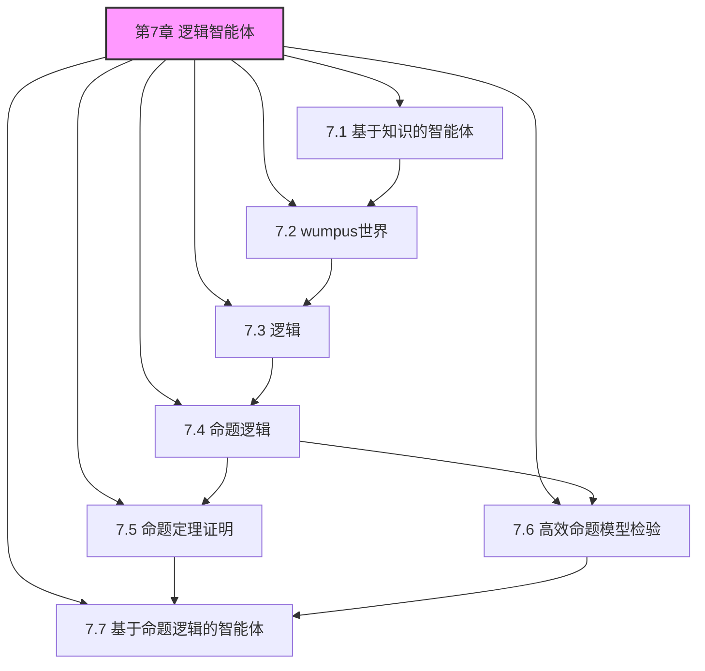
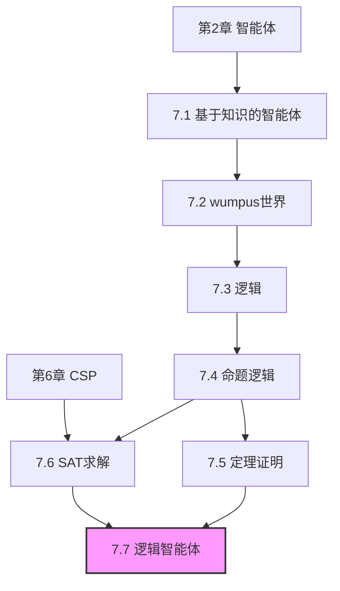

# 第7章 逻辑智能体 - 概览与总结

## 1. 学习目标

### 1.1 知识目标

完成本章学习后，你应该能够：

- [ ] 解释基于知识的智能体的架构和工作原理
- [ ] 描述wumpus世界的环境特性和推理挑战
- [ ] 理解逻辑的语法、语义和推理的基本概念
- [ ] 掌握命题逻辑的语法规则和真值表方法
- [ ] 应用假言推理、归结等推理规则进行定理证明
- [ ] 解释DPLL算法和现代SAT求解器的核心技术
- [ ] 设计基于命题逻辑的智能体，包括时序知识表示和规划

### 1.2 能力目标

- [ ] 能够构建简单的命题逻辑知识库
- [ ] 能够使用真值表检验逻辑蕴含
- [ ] 能够应用归结规则进行逻辑证明
- [ ] 能够分析SAT问题的难度和求解策略
- [ ] 能够设计后继状态公理描述动作效果

## 2. 本章速览

### 2.1 章节结构



### 2.2 核心内容摘要

| 小节 | 核心主题 | 关键概念 |
|------|---------|---------|
| 7.1 | 基于知识的智能体 | 知识库、Tell/Ask、知识层面vs实现层面 |
| 7.2 | wumpus世界 | 部分可观测、传感器、逻辑推理、风险决策 |
| 7.3 | 逻辑基础 | 语法、语义、模型、蕴含、可靠性、完备性 |
| 7.4 | 命题逻辑 | 联结词、真值表、逻辑等价、范式转换 |
| 7.5 | 定理证明 | 推理规则、归结、前向/反向链接、霍恩子句 |
| 7.6 | SAT求解 | DPLL、单元传播、CDCL、相变现象 |
| 7.7 | 逻辑智能体应用 | 时序表示、后继状态公理、SATPlan |

## 3. 难度预警

### 3.1 难度等级

| 小节 | 理论难度 | 实践难度 | 前置依赖 |
|------|---------|---------|---------|
| 7.1 | ⭐⭐ | ⭐⭐ | 第2章 |
| 7.2 | ⭐⭐ | ⭐⭐⭐ | 7.1 |
| 7.3 | ⭐⭐⭐ | ⭐⭐ | 无 |
| 7.4 | ⭐⭐⭐ | ⭐⭐⭐ | 7.3 |
| 7.5 | ⭐⭐⭐⭐ | ⭐⭐⭐⭐ | 7.4 |
| 7.6 | ⭐⭐⭐⭐ | ⭐⭐⭐⭐ | 7.4, 第6章 |
| 7.7 | ⭐⭐⭐⭐⭐ | ⭐⭐⭐⭐⭐ | 7.1-7.6 |

### 3.2 学习建议

**初学者路径**：
1. 先读7.1、7.2节，理解基于知识智能体的直观概念
2. 学习7.3节，建立逻辑基础
3. 掌握7.4节，理解命题逻辑的具体内容
4. 选择性学习7.5-7.7节，根据兴趣深入

**进阶学习路径**：
1. 完整阅读所有小节
2. 重点理解7.5节的归结完备性证明
3. 深入研究7.6节的现代SAT求解技术
4. 实践7.7节的智能体实现

## 4. 前置知识

### 4.1 必需前置知识

- **第2章**：智能体基本概念、PEAS描述
- **第3-4章**：搜索算法、状态空间
- **第6章**：约束满足问题、回溯搜索
- **基本数学**：集合论、布尔代数

### 4.2 有助于理解的知识

- **离散数学**：命题逻辑、证明技术
- **算法分析**：复杂度分析、递归
- **编程经验**：有助于理解算法实现

## 5. 节依赖图



## 6. 定理清单

| 定理 | 内容 | 小节 | 重要性 |
|------|------|------|--------|
| 演绎定理 | $\alpha \models \beta$ iff $(\alpha \Rightarrow \beta)$有效 | 7.3 | ⭐⭐⭐⭐ |
| 归结完备性 | 归结是完备的推理规则 | 7.5 | ⭐⭐⭐⭐⭐ |
| 前向链接完备性 | 对霍恩子句完备 | 7.5 | ⭐⭐⭐⭐ |
| DPLL可靠性 | DPLL是可靠的 | 7.6 | ⭐⭐⭐ |
| SAT的NP完全性 | SAT是NP完全的 | 7.6 | ⭐⭐⭐⭐ |
| 后继状态公理充分性 | SSA足以描述转移 | 7.7 | ⭐⭐⭐⭐ |

## 7. 核心逻辑线索

### 7.1 知识表示与推理的主线

```
基于知识的智能体
    ↓
知识库（语句集合）
    ↓
知识表示语言（语法+语义）
    ↓
逻辑推理（蕴含+推导）
    ↓
命题逻辑（具体实现）
    ↓
推理算法（模型检验/定理证明）
    ↓
实际应用（wumpus世界/SATPlan）
```

### 7.2 推理方法的发展

```
模型检验（TT-Entails）
    ↓
归结（Resolution）
    ↓
前向/反向链接（Horn子句）
    ↓
DPLL算法
    ↓
CDCL现代求解器
```

## 8. 核心要点速查

### 8.1 关键概念对比

| 概念A | 概念B | 区别 |
|-------|-------|------|
| 知识层面 | 实现层面 | 前者描述知道什么，后者描述如何实现 |
| 蕴含($\models$) | 推导($\vdash$) | 前者是语义概念，后者是语法过程 |
| 可靠性 | 完备性 | 前者只推导真结论，后者能推导所有真结论 |
| 前向链接 | 反向链接 | 前者数据驱动，后者目标驱动 |
| 完备算法 | 不完备算法 | 前者能证明不可满足性，后者不能 |

### 8.2 重要公式

**逻辑等价**：
- $(\alpha \Rightarrow \beta) \equiv (\neg\alpha \lor \beta)$
- $\neg(\alpha \land \beta) \equiv (\neg\alpha \lor \neg\beta)$ （德摩根律）

**推理规则**：
- 假言推理：$\frac{\alpha \quad \alpha \Rightarrow \beta}{\beta}$
- 归结：$\frac{\alpha \lor \beta \quad \neg\beta \lor \gamma}{\alpha \lor \gamma}$

**后继状态公理**：
- $F^{t+1} \Leftrightarrow ActionCausesF^t \lor (F^t \land \neg ActionCausesNotF^t)$

## 9. 概念对比表

### 9.1 逻辑系统对比

| 特性 | 命题逻辑 | 一阶逻辑（第8章） |
|------|---------|------------------|
| 表达能力 | 有限 | 强大 |
| 可判定性 | 可判定 | 半可判定 |
| 复杂度 | NP完全 | 不可判定 |
| 量词 | 无 | 有（∀, ∃） |
| 适用场景 | 简单问题 | 复杂领域 |

### 9.2 推理方法对比

| 方法 | 时间复杂度 | 完备性 | 适用场景 |
|------|-----------|--------|---------|
| 真值表 | $O(2^n)$ | 完备 | 教学、小规模问题 |
| 归结 | 指数级 | 完备 | 一般推理 |
| 前向链接 | $O(|KB|)$ | 对霍恩子句完备 | 规则系统、监控 |
| DPLL | 指数级 | 完备 | SAT求解 |
| WalkSAT | 无保证 | 不完备 | 可满足实例 |

## 10. 常见误解澄清

| 误解 | 澄清 |
|------|------|
| 逻辑AI已经过时 | 逻辑方法在验证、规划等领域仍然活跃，与机器学习方法互补 |
| 命题逻辑可以表达所有知识 | 命题逻辑表达能力有限，无法表达"所有"、"存在"等量词 |
| SAT问题总是很难 | 虽然NP完全，但许多实际问题具有结构，可以被高效求解 |
| 框架问题已经完全解决 | 表示框架问题已解决，但推断框架问题和资格问题仍然存在 |
| 混合智能体只使用逻辑 | 混合智能体结合逻辑推理和搜索算法，充分利用两者优势 |

## 11. 本章测验

### 11.1 选择题

**1. 基于知识的智能体的核心部件是什么？**
- A. 传感器
- B. 知识库
- C. 执行器
- D. 学习模块

**2. 在wumpus世界中，微风表示什么？**
- A. 当前方格有无底洞
- B. 相邻方格有无底洞
- C. wumpus在相邻方格
- D. 金块在相邻方格

**3. 以下哪个推理规则是完备的？**
- A. 假言推理
- B. 与消解
- C. 归结
- D. 双重否定消除

**4. DPLL算法的哪项改进处理强制赋值的级联？**
- A. 提前终止
- B. 纯符号启发式
- C. 单元传播
- D. 随机重启

### 11.2 简答题

**1. 解释知识层面和实现层面的区别，并举例说明。**

**2. 什么是框架问题？后继状态公理如何解决它？**

**3. 为什么随机SAT问题在子句/变量比约4.3处最难求解？**

### 11.3 计算题

**1. 使用真值表检验：$(P \Rightarrow Q) \land (Q \Rightarrow R) \models (P \Rightarrow R)$**

**2. 将以下语句转换为CNF：$(A \land B) \Rightarrow (C \lor D)$**

**3. 给定知识库：$P \Rightarrow Q$，$Q \Rightarrow R$，$P$。使用归结证明$R$。**

<details>
<summary>点击查看答案</summary>

**选择题答案**：1-B, 2-B, 3-C, 4-C

**简答题要点**：
1. 知识层面描述智能体知道什么，实现层面描述如何实现。例如出租车知道路线（知识层面），使用地图数据结构（实现层面）。
2. 框架问题是如何表示动作未改变的状态。后继状态公理通过描述流的变化条件来解决。
3. 阈值处可满足概率约0.5，解的空间结构最复杂。

**计算题答案**：
1. 构造真值表验证在所有前提为真的模型中结论也为真。
2. CNF：$\neg A \lor \neg B \lor C \lor D$
3. 归结步骤：(1) $P \Rightarrow Q$转换为$\neg P \lor Q$，(2) $Q \Rightarrow R$转换为$\neg Q \lor R$，(3) 与$P$归结得$Q$，(4) $Q$与$\neg Q \lor R$归结得$R$。

</details>

## 12. 快速复习卡

### 卡片1：基于知识的智能体
- **核心**：知识库(KB) + 推理机制
- **操作**：Tell（添加知识）、Ask（查询知识）
- **层面**：知识层面（知道什么）vs 实现层面（如何实现）

### 卡片2：逻辑基础
- **语法**：规定合法语句
- **语义**：定义真值条件
- **蕴含**：$\alpha \models \beta$ 当且仅当 $M(\alpha) \subseteq M(\beta)$
- **可靠性**：只推导真结论
- **完备性**：推导所有真结论

### 卡片3：命题逻辑
- **联结词**：¬（非）、∧（与）、∨（或）、⇒（蕴涵）、⇔（双向）
- **范式**：CNF（子句的合取）
- **等价**：德摩根律、蕴涵消除、逆否命题

### 卡片4：推理方法
- **归结**：完备，从$\alpha \lor \beta$和$\neg\beta \lor \gamma$得$\alpha \lor \gamma$
- **前向链接**：数据驱动，对霍恩子句线性时间
- **反向链接**：目标驱动

### 卡片5：SAT求解
- **DPLL**：回溯搜索 + 单元传播 + 纯符号
- **CDCL**：冲突分析 + 子句学习
- **相变**：阈值约4.3（3-CNF）处最难

### 卡片6：逻辑智能体
- **时序表示**：流用上标标记时间
- **后继状态公理**：$F^{t+1} \Leftrightarrow$ 动作导致 $\lor$ (已有 $\land$ 动作未消除)
- **SATPlan**：规划编码为SAT问题

## 13. 扩展阅读

### 13.1 后续章节

- **第8章**：一阶逻辑——扩展表达能力，引入量词
- **第9章**：一阶逻辑中的推理——归结的扩展
- **第11章**：自动规划——更高级的规划方法
- **第12章**：不确定性下的推理——概率与逻辑的结合

### 13.2 经典论文

1. **Davis, M., Putnam, H. (1960)**. A computing procedure for quantification theory. *Journal of the ACM*.
   - DPLL算法的原始论文

2. **Kautz, H., Selman, B. (1992)**. Planning as satisfiability. *ECAI*.
   - SATPlan的开创性工作

3. **Marques-Silva, J., Sakallah, K. (1999)**. GRASP: A search algorithm for propositional satisfiability. *IEEE Transactions on Computers*.
   - 现代CDCL求解器的基础

4. **Moskewicz, M., et al. (2001)**. Chaff: Engineering an efficient SAT solver. *DAC*.
   - 高效SAT求解的工程实践

### 13.3 相关书籍

- **《Handbook of Satisfiability》** (Biere et al., 2009)
  - SAT求解的权威参考书

- **《Logic in Computer Science》** (Huth and Ryan)
  - 计算机科学中的逻辑应用

- **《Knowledge Representation and Reasoning》** (Brachman and Levesque)
  - 知识表示与推理的深入介绍

## 14. 学习检查清单

完成本章学习后，检查你是否能够：

### 基础理解
- [ ] 解释基于知识智能体的架构
- [ ] 描述wumpus世界的特性和挑战
- [ ] 定义逻辑的语法、语义和推理
- [ ] 构建命题逻辑的真值表

### 核心技能
- [ ] 将语句转换为CNF
- [ ] 应用归结规则进行证明
- [ ] 执行DPLL算法
- [ ] 设计后继状态公理

### 高级应用
- [ ] 分析SAT问题的难度
- [ ] 解释现代SAT求解器的技术
- [ ] 实现混合智能体
- [ ] 使用SATPlan进行规划

---

**本章学习完成！** 继续学习第8章"一阶逻辑"，探索更强大的知识表示语言。
