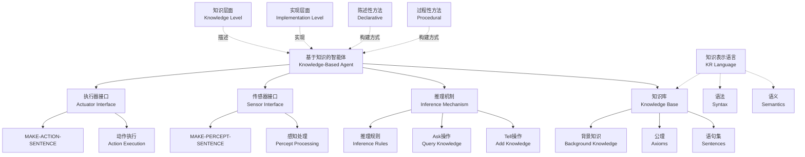
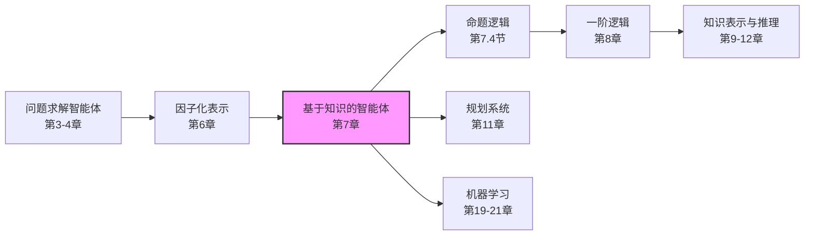

# 7.1 基于知识的智能体 (Knowledge-Based Agent)

## 1. 背景与动机

### 1.1 历史背景

基于知识的智能体（Knowledge-Based Agent）是人工智能发展史上的一个重要里程碑。在20世纪70年代和80年代，人工智能领域经历了"知识革命"，研究者们意识到，要让机器表现出智能行为，关键在于赋予机器领域知识，而不仅仅是设计精巧的算法。

早期的AI系统，如第3章和第4章介绍的问题求解智能体，虽然能够解决特定问题，但其知识非常有限且僵化。它们知道可以采取哪些动作，以及某个状态下采取某个动作会产生什么结果，但缺乏关于世界的一般性知识。例如，寻路智能体不知道"路的长度不可能是负数"这样的常识，8数码智能体也不了解"两块瓷砖不能占据同一空间"的基本物理约束。

基于知识的智能体方法源于对更灵活、更通用智能系统的追求。这种方法强调将知识与控制分离，使得智能体能够通过获取和更新知识来适应不同的任务和环境，而无需重新编程。

### 1.2 研究动机

开发基于知识的智能体有以下几个核心动机：

**（1）知识重用与模块化**

知识库与推理机制的分离使得同一推理引擎可以应用于不同的领域。只需更换知识库，智能体就能从医疗诊断专家转变为金融顾问。这种模块化设计大大提高了系统的可维护性和可扩展性。

**（2）显式知识表示**

与神经网络等隐式表示方法不同，基于知识的智能体使用显式的、人类可理解的符号来表示知识。这使得：
- 知识可以被人类专家验证和修改
- 智能体的推理过程可以被解释和审计
- 知识可以通过自然语言接口进行交互式更新

**（3）组合性与灵活性**

基于知识的智能体能够组合和重组信息以适应各种目的。它可以回答与当前任务无关的问题，就像数学家证明定理或天文学家计算地球寿命一样。这种能力源于知识的陈述性表示——知识独立于其使用方式。

**（4）快速能力获取**

智能体可以通过主动学习或被明确告知来获取新知识，快速获得完成任务的能力。这与需要大量训练数据的机器学习方法形成对比。

### 1.3 应用场景

基于知识的智能体在以下领域有广泛应用：

| 应用领域 | 典型应用 | 知识库内容 |
|---------|---------|-----------|
| 医疗诊断 | MYCIN、DXplain | 疾病症状、诊断规则、治疗方案 |
| 金融分析 | 信用评估系统 | 经济指标、风险评估规则、市场规律 |
| 客户服务 | 智能客服系统 | FAQ知识库、产品信息、服务流程 |
| 游戏AI | 象棋、围棋程序 | 开局库、残局知识、战术模式 |
| 自动驾驶 | 路径规划与决策 | 交通规则、地图信息、驾驶经验 |
| 教育辅导 | 智能导师系统 | 学科知识、教学策略、学生模型 |

### 1.4 先决条件

理解基于知识的智能体需要以下先备知识：

- **智能体基本概念**（第2章）：感知、动作、环境、理性
- **搜索算法**（第3-4章）：状态空间、启发式搜索
- **约束满足问题**（第6章）：变量、约束、回溯搜索
- **基本逻辑概念**：命题、真值、推理

## 2. 知识逻辑图谱

### 2.1 概念关系图



### 2.2 知识发展依赖链



## 3. 核心概念与数学分析

### 3.1 术语定义

| 术语（中文） | 术语（英文） | 定义 |
|------------|-------------|------|
| 知识库 | Knowledge Base (KB) | 存储语句的集合，代表关于世界的断言 |
| 语句 | Sentence | 用知识表示语言表达的结构，代表某种断言 |
| 知识表示语言 | Knowledge Representation Language | 用于表达知识的正式语言，定义语法和语义 |
| 公理 | Axiom | 直接给出的语句，而非从其他语句推导而来 |
| Tell | Tell | 向知识库添加新语句的操作 |
| Ask | Ask | 从知识库查询语句的操作 |
| 推理 | Inference | 从原有语句推导出新语句的过程 |
| 背景知识 | Background Knowledge | 知识库初始包含的领域知识 |
| 知识层面 | Knowledge Level | 描述智能体所具有的知识和目标的抽象层次 |
| 实现层面 | Implementation Level | 描述智能体内部数据结构和工作机制的层次 |
| 陈述性方法 | Declarative Approach | 通过告知智能体必需的知识来构建系统的方法 |
| 过程性方法 | Procedural Approach | 将行为直接编码为程序代码的方法 |

### 3.2 符号参考表

| 符号 | 含义 | 说明 |
|------|------|------|
| $KB$ | 知识库 | 智能体的核心数据结构 |
| $\text{TELL}(KB, \alpha)$ | 告知操作 | 将语句$\alpha$添加到知识库$KB$中 |
| $\text{ASK}(KB, \alpha)$ | 询问操作 | 查询$\alpha$是否被$KB$蕴含 |
| $t$ | 时间计数器 | 表示当前时间步 |
| $\text{percept}$ | 感知 | 智能体从环境接收的输入 |
| $\text{action}$ | 动作 | 智能体执行的操作 |

### 3.3 核心算法：基于知识的智能体

基于知识的智能体程序可以用以下伪代码描述：

```
function KB-AGENT(percept) returns an action
    persistent: 
        KB, a knowledge base
        t, a counter, initially 0, indicating time
    
    TELL(KB, MAKE-PERCEPT-SENTENCE(percept, t))
    action ← ASK(KB, MAKE-ACTION-QUERY(t))
    TELL(KB, MAKE-ACTION-SENTENCE(action, t))
    t ← t + 1
    return action
```

**算法分析：**

每次调用智能体程序时，执行以下三个步骤：

1. **感知告知（TELL感知）**：使用`MAKE-PERCEPT-SENTENCE`构建一个语句，断言智能体在给定时间接收到给定的感知，并将该语句告知知识库。

2. **动作查询（ASK动作）**：使用`MAKE-ACTION-QUERY`构建一个语句，询问当前时刻应当采取何种动作。回答此查询可能涉及大量推理，包括对世界当前状态、可能动作序列的执行结果等的推理。

3. **动作告知（TELL动作）**：使用`MAKE-ACTION-SENTENCE`构建一个语句，断言选定的动作已经执行，并将该语句告知知识库。

### 3.4 知识层面与实现层面的关系

基于知识的智能体可以通过两个不同层面来理解和描述：

**知识层面（Knowledge Level）**：
- 描述智能体"知道什么"和"想要什么"
- 只需要明确智能体的知识和目标，就可以决定其行为
- 与实现细节无关

**示例**：一辆自动驾驶出租车知道金门大桥是旧金山到马林县的唯一通路，目标是送乘客到马林县，因此它会驶过金门大桥。

**实现层面（Implementation Level）**：
- 描述智能体内部如何表示和处理知识
- 涉及具体的数据结构和算法
- 可能使用链表、点阵图、符号串或神经网络等

**关键洞察**：同一知识层面的行为可以通过多种不同的实现层面方案来实现。这种分离使得我们可以先设计智能体的知识和行为，再考虑具体的实现技术。

### 3.5 陈述性方法与过程性方法的对比

| 特性 | 陈述性方法 (Declarative) | 过程性方法 (Procedural) |
|------|-------------------------|------------------------|
| 知识表示 | 显式的语句集合 | 嵌入在程序代码中 |
| 修改方式 | 添加/删除语句 | 修改程序代码 |
| 灵活性 | 高，易于更新知识 | 低，需要重新编程 |
| 执行效率 | 可能较低（需推理） | 通常较高 |
| 可解释性 | 高，推理过程可追溯 | 低，行为隐含在代码中 |
| 典型应用 | 专家系统、知识图谱 | 嵌入式系统、实时控制 |

**实际应用**：成功的智能体设计通常需要结合两种方法的元素。陈述性知识可以被编译成更有效的过程性代码，以获得两者的优势。

## 4. 具体示例

### 4.1 简单医疗诊断智能体

**场景**：构建一个基于知识的医疗诊断智能体。

**知识库初始化**（背景知识）：
```
R1: 发烧 ∧ 咳嗽 ⇒ 可能是流感
R2: 发烧 ∧ 头痛 ∧ 颈部僵硬 ⇒ 可能是脑膜炎
R3: 流感 ⇒ 需要休息和补水
R4: 脑膜炎 ⇒ 需要立即就医
```

**运行过程**：

**时间步 t=0**：
- 感知：[体温=38.5°C, 咳嗽=true, 头痛=false, 颈部僵硬=false]
- TELL(KB, "体温38.5°C ∧ 咳嗽 ∧ ¬头痛 ∧ ¬颈部僵硬")
- ASK(KB, "应该采取什么动作？")
  - 推理过程：体温38.5°C ⇒ 发烧；发烧 ∧ 咳嗽 ⇒ 可能是流感
  - 结论：建议休息和补水
- TELL(KB, "建议休息和补水")
- 执行动作：向患者建议休息和补水

**时间步 t=1**：
- 感知：[体温=39.5°C, 咳嗽=true, 头痛=true, 颈部僵硬=true]
- TELL(KB, "体温39.5°C ∧ 咳嗽 ∧ 头痛 ∧ 颈部僵硬")
- ASK(KB, "应该采取什么动作？")
  - 推理过程：发烧 ∧ 头痛 ∧ 颈部僵硬 ⇒ 可能是脑膜炎
  - 结论：需要立即就医
- TELL(KB, "建议立即就医")
- 执行动作：紧急转诊

### 4.2 智能体构建示例

**问题**：构建一个能够回答关于家庭成员关系的智能体。

**步骤1：初始化知识库**
```
TELL(KB, "John是Mary的父亲")
TELL(KB, "Mary是Tom的母亲")
TELL(KB, "∀x∀y: x是y的父亲 ⇒ x是y的父系亲属")
TELL(KB, "∀x∀y: x是y的母亲 ⇒ x是y的母系亲属")
TELL(KB, "∀x∀y: x是y的父系亲属 ∨ x是y的母系亲属 ⇒ x是y的亲属")
TELL(KB, "∀x∀y∀z: x是y的父亲 ∧ y是z的母亲 ⇒ x是z的外祖父")
```

**步骤2：查询知识库**
```
ASK(KB, "John是Tom的亲属吗？")
→ 推理：John是Mary的父亲 ⇒ John是Mary的父系亲属 ⇒ John是Mary的亲属
        Mary是Tom的母亲 ⇒ Mary是Tom的母系亲属 ⇒ Mary是Tom的亲属
        John是Mary的亲属 ∧ Mary是Tom的亲属 ⇒ John是Tom的亲属
→ 答案：是

ASK(KB, "John是Tom的什么亲属？")
→ 推理：John是Mary的父亲 ∧ Mary是Tom的母亲 ⇒ John是Tom的外祖父
→ 答案：外祖父
```

## 5. 一句话本质

**基于知识的智能体通过维护一个显式的知识库，使用通用的推理机制从感知中推导新知识并决定动作，实现了知识表示与推理过程的分离，使智能体能够灵活地获取、更新和应用领域知识来解决复杂问题。**

## 6. 总结与反思

### 6.1 关键要点

1. **核心架构**：基于知识的智能体由知识库（KB）和推理机制组成，通过TELL和ASK操作与知识库交互。

2. **双重层面**：可以从知识层面（知道什么）和实现层面（如何实现）两个角度理解智能体。

3. **陈述性优势**：通过告知而非编程来构建智能体，使系统更灵活、更可维护。

4. **通用框架**：相同的推理机制可以应用于不同领域，只需更换知识库。

5. **学习潜力**：基于知识的智能体可以整合学习机制，从经验中自动获取新知识。

### 6.2 常见误解对照表

| 常见误解 | 正确理解 |
|---------|---------|
| 基于知识的智能体只是数据库查询系统 | 它不仅能存储和检索，还能通过推理从已知事实推导出新知识 |
| 知识库越大越好 | 知识质量比数量更重要，不一致的知识会导致错误推理 |
| 陈述性方法总是优于过程性方法 | 两种方法各有优势，实际系统通常结合使用 |
| 知识层面描述足以实现智能体 | 知识层面描述行为，但实现层面决定了实际性能和可行性 |
| 推理总是需要大量计算 | 许多推理任务可以通过缓存和增量更新来优化 |

### 6.3 反思问题

1. **设计选择**：在什么情况下应该选择基于知识的智能体而不是其他类型的智能体（如反射型智能体或基于模型的反射型智能体）？

2. **知识获取瓶颈**：如何有效地获取和验证领域知识？专家知识提取面临哪些挑战？

3. **知识一致性**：当知识库变得很大时，如何确保知识之间的一致性？如何处理矛盾的知识？

4. **效率与表达能力的权衡**：更丰富的知识表示语言（如一阶逻辑）提供了更强的表达能力，但也带来了更高的推理复杂度。如何在实际应用中平衡这一权衡？

5. **落地问题**：智能体的知识库如何与真实世界建立联系？感知语句的真值如何保证？

### 6.4 公式速查表

| 概念 | 公式/表示 | 说明 |
|------|----------|------|
| 知识库 | $KB = \{\alpha_1, \alpha_2, ..., \alpha_n\}$ | 语句的集合 |
| 告知操作 | $KB_{t+1} = KB_t \cup \{\alpha\}$ | 将语句添加到知识库 |
| 询问操作 | $\text{ASK}(KB, \alpha) = \begin{cases} \text{true} & \text{if } KB \models \alpha \\ \text{false} & \text{otherwise} \end{cases}$ | 查询语句是否被蕴含 |
| 智能体函数 | $f: \text{Percept}^* \rightarrow \text{Action}$ | 从感知历史到动作的映射 |

### 6.5 延伸阅读

- **第7.2节**：wumpus世界——基于知识智能体的具体应用示例
- **第7.3-7.4节**：逻辑基础——理解推理的理论基础
- **第8章**：一阶逻辑——更强大的知识表示语言
- **第19章**：机器学习中的知识获取——如何让智能体自动学习知识
- **第2章**：智能体类型对比——理解不同智能体架构的优劣
