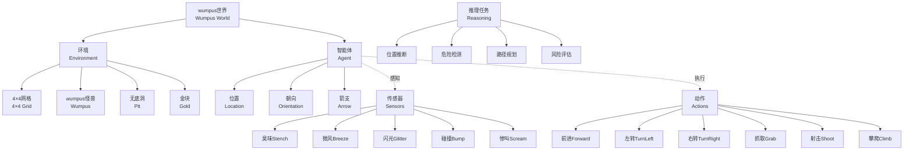

# 7.2 wumpus 世界 (The Wumpus World)

## 1. 背景与动机

### 1.1 历史背景

wumpus世界是由计算机科学家格雷戈里·叶布（Gregory Yob）于1973年设计的一个经典计算机游戏，最初出现在《科学美国人》杂志上。这个游戏很快成为人工智能研究的经典测试平台，因为它巧妙地结合了多个重要的AI挑战：不确定性推理、部分可观测性、风险决策和逻辑推断。

wumpus世界之所以成为教学和研究的重要工具，是因为它在保持简单性的同时，展示了智能体需要面对的许多真实世界问题。虽然以现代电子游戏的标准来看，wumpus世界相当简单，但它却能够清晰地展示智能体的核心能力需求。

### 1.2 研究动机

wumpus世界作为AI测试平台具有以下价值：

**（1）部分可观测性**：智能体无法直接看到整个环境，必须通过有限的传感器信息推断世界状态。

**（2）不确定性推理**：传感器信息是不完整的，智能体需要结合多个感知和背景知识进行逻辑推理。

**（3）风险决策**：在某些情况下，智能体必须在安全但收益低的选择和危险但潜在收益高的选择之间做出权衡。

**（4）知识表示与推理**：wumpus世界提供了一个具体的场景来展示如何使用逻辑来表示知识并进行推理。

**（5）可解释性**：智能体的推理过程可以被清晰地追踪和验证，便于教学和分析。

### 1.3 应用场景

虽然wumpus世界本身是一个游戏，但它所代表的问题类型在许多实际应用中出现：

| 应用领域 | 与wumpus世界的对应 |
|---------|-------------------|
| 机器人探索 | 未知环境中的导航和地图构建 |
| 矿井探测 | 检测危险区域（如瓦斯泄漏） |
| 搜救任务 | 在危险环境中寻找目标 |
| 军事侦察 | 在敌方领土中收集情报 |
| 医疗诊断 | 根据症状推断疾病 |
| 故障诊断 | 根据观测推断系统故障 |

### 1.4 先决条件

理解wumpus世界需要以下先备知识：

- **PEAS描述法**（第2.3节）：性能度量、环境、执行器、传感器
- **环境属性**（第2.3节）：确定性/随机性、可观测性、离散性等
- **基于知识的智能体**（第7.1节）：知识库、推理
- **基本逻辑推理**：蕴含、模型检验

## 2. 知识逻辑图谱

### 2.1 概念关系图



### 2.2 wumpus世界推理流程

```mermaid
graph LR
    A[初始状态<br/>[1,1]无感知] --> B[推断相邻安全]
    B --> C[移动到[2,1]]
    C --> D[感知微风]
    D --> E[推断P?在[2,2]或[3,1]]
    E --> F[返回[1,1]]
    F --> G[移动到[1,2]]
    G --> H[感知臭味]
    H --> I[推断W在[1,3]]
    I --> J[推断P在[3,1]]
    J --> K[移动到[2,2]]
    K --> L[安全到达]
    
    style H fill:#f9f,stroke:#333
    style I fill:#bbf,stroke:#333
    style J fill:#bbf,stroke:#333
```

## 3. 核心概念与数学分析

### 3.1 术语定义

| 术语（中文） | 术语（英文） | 定义 |
|------------|-------------|------|
| wumpus | Wumpus | 潜伏在洞穴中的怪兽，会吃掉进入其房间的人 |
| 无底洞 | Pit | 能困住进入者的陷阱（wumpus因体型大不会落入） |
| 金块 | Gold | 游戏中的奖励物品，找到可获得高分 |
| 臭味 | Stench | 传感器信号，在与wumpus直接相邻的方格中感知到 |
| 微风 | Breeze | 传感器信号，在与无底洞直接相邻的方格中感知到 |
| 闪光 | Glitter | 传感器信号，在金块所在的方格中感知到 |
| 碰撞 | Bump | 传感器信号，智能体试图走向墙壁时感知到 |
| 惨叫 | Scream | 传感器信号，wumpus被杀死时在整个洞穴中可感知到 |
| 安全方格 | OK Square | 没有无底洞也没有活着的wumpus的方格 |
| 部分可观测 | Partially Observable | 智能体无法直接观测世界全部状态 |

### 3.2 PEAS描述

**性能度量（Performance Measure）**：
- 带着金块从洞穴爬出：$+1000$
- 跌入无底洞或被wumpus吞食：$-1000$
- 每采取一个动作：$-1$
- 用尽箭支：$-10$

**环境（Environment）**：
- $4 \times 4$的房间网格，四周环绕围墙
- 智能体从$[1, 1]$开始，面向东方
- 金块和wumpus位置：从除起始方格外的所有方格均匀随机选择
- 无底洞：除起始方格外，每个方格有0.2的概率有无底洞

**执行器（Actuators）**：
- Forward（前进）：向前移动一格
- TurnLeft（左转）：逆时针旋转$90°$
- TurnRight（右转）：顺时针旋转$90°$
- Grab（抓取）：捡起金块
- Shoot（射击）：向面对方向发射箭支
- Climb（攀爬）：从$[1, 1]$爬出洞穴

**传感器（Sensors）**：
- 5个传感器，每个给出一个单一信息
- 感知以5个符号的列表形式传递：[Stench, Breeze, Glitter, Bump, Scream]

### 3.3 环境属性分析

| 属性 | 值 | 说明 |
|------|-----|------|
| 确定性 | 是 | 动作结果确定（除初始配置外） |
| 离散性 | 是 | 有限的位置、动作和感知 |
| 静态性 | 是 | wumpus不移动（死亡后也不复活） |
| 单智能体 | 是 | 只有智能体一个参与者 |
| 序贯性 | 是 | 需要多个动作才能获得奖励 |
| 部分可观测 | 是 | 无法直接感知wumpus和无底洞位置 |

### 3.4 传感器与环境的逻辑关系

**臭味（Stench）的生成规则**：
$$S_{x,y} \Leftrightarrow (W_{x-1,y} \lor W_{x+1,y} \lor W_{x,y-1} \lor W_{x,y+1})$$

其中：
- $S_{x,y}$：方格$[x,y]$有臭味
- $W_{x,y}$：wumpus位于方格$[x,y]$

**微风（Breeze）的生成规则**：
$$B_{x,y} \Leftrightarrow (P_{x-1,y} \lor P_{x+1,y} \lor P_{x,y-1} \lor P_{x,y+1})$$

其中：
- $B_{x,y}$：方格$[x,y]$有微风
- $P_{x,y}$：方格$[x,y]$有无底洞

**闪光（Glitter）的生成规则**：
$$G_{x,y} \Leftrightarrow \text{Gold位于}[x,y]$$

## 4. 具体示例

### 4.1 完整探索示例

**初始配置**（图7-2所示）：
- 智能体：$[1, 1]$，面向东
- wumpus：$[1, 3]$
- 金块：$[2, 3]$
- 无底洞：$[3, 1]$和$[3, 3]$

**推理过程**：

**步骤1：初始状态（t=0）**
- 位置：$[1, 1]$
- 感知：[None, None, None, None, None]
- 知识库：$L_{1,1}^0$，$\neg B_{1,1}$，$\neg S_{1,1}$
- 推理：
  - $B_{1,1} \Leftrightarrow (P_{1,2} \lor P_{2,1})$，且$\neg B_{1,1}$，因此$\neg P_{1,2} \land \neg P_{2,1}$
  - $S_{1,1} \Leftrightarrow (W_{1,2} \lor W_{2,1})$，且$\neg S_{1,1}$，因此$\neg W_{1,2} \land \neg W_{2,1}$
- 结论：$[1, 2]$和$[2, 1]$都是安全的（OK）

**步骤2：移动到$[2, 1]$（t=1）**
- 动作：Forward
- 位置：$[2, 1]$
- 感知：[None, Breeze, None, None, None]
- 知识库：$L_{2,1}^1$，$B_{2,1}$
- 推理：
  - $B_{2,1} \Leftrightarrow (P_{1,1} \lor P_{2,2} \lor P_{3,1})$
  - 已知$\neg P_{1,1}$（起始方格安全）
  - 因此$P_{2,2} \lor P_{3,1}$（至少一个为真）
- 标记：$[2, 2]$和$[3, 1]$为可能有无底洞（P?）

**步骤3：返回$[1, 1]$（t=2）**
- 动作：TurnLeft, TurnLeft, Forward
- 位置：$[1, 1]$
- 感知：[None, None, None, None, None]

**步骤4：移动到$[1, 2]$（t=3）**
- 动作：TurnRight, Forward
- 位置：$[1, 2]$
- 感知：[Stench, None, None, None, None]
- 知识库：$L_{1,2}^3$，$S_{1,2}$，$\neg B_{1,2}$
- 推理：
  - $S_{1,2} \Leftrightarrow (W_{1,1} \lor W_{1,3} \lor W_{2,2})$
  - 已知$\neg W_{1,1}$（起始方格无wumpus）
  - 如果$W_{2,2}$，则在$[2,1]$时应感知到臭味（矛盾）
  - 因此$W_{1,3}$（wumpus在$[1,3]$）
  - 标记：$[1, 3]$有wumpus（W!）
  - $B_{1,2} \Leftrightarrow (P_{1,1} \lor P_{1,3} \lor P_{2,2})$，且$\neg B_{1,2}$
  - 已知$\neg P_{1,1}$，且$P_{1,3}$不可能（wumpus所在）
  - 因此$\neg P_{2,2}$
  - 结合之前的$P_{2,2} \lor P_{3,1}$，得出$P_{3,1}$
  - 标记：$[3, 1]$有无底洞（P!）

**步骤5：移动到$[2, 2]$（t=4,5）**
- 动作：TurnRight, Forward, TurnRight, Forward
- 位置：$[2, 2]$
- 推理：已证明$\neg P_{2,2}$且$\neg W_{2,2}$，因此安全

**步骤6：移动到$[2, 3]$（t=6）**
- 动作：Forward
- 位置：$[2, 3]$
- 感知：[Stench, Breeze, Glitter, None, None]
- 发现金块！

**步骤7：抓取金块并返回（t=7+）**
- 动作：Grab，然后规划返回路径

### 4.2 概率分析

**环境配置的概率**：

对于$4 \times 4$的wumpus世界：
- 可用方格数：16 - 1（起始）= 15
- wumpus位置：15种可能
- 金块位置：15种可能
- 无底洞：每个剩余方格独立，$P(\text{pit}) = 0.2$

**特定配置的概率**：
$$P(\text{特定配置}) = \frac{1}{15} \times \frac{1}{15} \times (0.2)^k \times (0.8)^{14-k}$$

其中$k$是无底洞数量。

**不可解环境的比例**：
- 约$21\%$的环境是"不公平"的
- 不公平情况：
  - 金块位于无底洞中
  - 金块被无底洞包围

**风险评估示例**：

假设智能体在$[2,1]$感知到微风，且已知$[1,1]$无无底洞：
- 可能的无底洞位置：$[2,2]$或$[3,1]$或两者都有
- 模型数量：3个（$[2,2]$有洞、$[3,1]$有洞、两者都有洞）
- 如果移动到$[2,2]$：
  - 死亡概率：$1/3$（仅当$[2,2]$有洞时）
  - 生存概率：$2/3$

## 5. 一句话本质

**wumpus世界是一个经典的部分可观测、确定性、静态的网格环境，智能体必须通过有限的传感器信息（臭味、微风、闪光等）进行逻辑推理，推断wumpus和无底洞的位置，在风险与收益之间做出决策，最终安全地找到金块并返回。**

## 6. 总结与反思

### 6.1 关键要点

1. **部分可观测性**：wumpus世界展示了智能体如何在无法直接观测全部环境状态的情况下，通过传感器信息和逻辑推理来推断世界状态。

2. **传感器与环境的关联**：传感器信号（臭味、微风）与环境特征（wumpus、无底洞）之间存在确定的逻辑关系，这是推理的基础。

3. **组合推理**：智能体需要组合在不同时间、不同地点获得的信息，进行复杂的推理才能得出结论。

4. **风险决策**：在某些情况下，智能体必须在安全但收益低的选择和危险但潜在收益高的选择之间做出权衡。

5. **知识表示的价值**：通过将世界规则表示为逻辑语句，智能体可以进行形式化的推理，保证结论的正确性。

### 6.2 常见误解对照表

| 常见误解 | 正确理解 |
|---------|---------|
| wumpus世界是随机的 | wumpus世界是确定性的（除初始配置外），动作结果是确定的 |
| 传感器提供直接位置信息 | 传感器只提供间接信息（相邻关系），需要推理才能确定位置 |
| 智能体应该总是避免风险 | 有时冒险是必要的，智能体需要权衡风险与收益 |
| 微风意味着当前方格有洞 | 微风意味着相邻方格有洞，当前方格是安全的 |
| 所有环境都是可解的 | 约21%的环境是"不公平"的，可能无法安全地获得金块 |

### 6.3 反思问题

1. **传感器设计**：如果让你设计新的传感器来简化wumpus世界的探索，你会设计什么传感器？这种传感器会如何改变推理过程？

2. **风险决策**：在什么情况下智能体应该选择冒险进入一个可能有危险的方格？如何量化这种决策的风险和收益？

3. **学习效率**：智能体如何利用之前的探索经验来加速对新环境的探索？迁移学习在wumpus世界中如何应用？

4. **多智能体**：如果多个智能体同时探索wumpus世界，它们如何协作？会面临什么新的挑战？

5. **连续扩展**：如果将wumpus世界扩展到更大的网格（如$10 \times 10$或$100 \times 100$），当前的推理方法会遇到什么挑战？

### 6.4 公式速查表

| 概念 | 公式 | 说明 |
|------|------|------|
| 臭味生成 | $S_{x,y} \Leftrightarrow \bigvee_{(x',y') \in \text{Adj}(x,y)} W_{x',y'}$ | 相邻方格有wumpus |
| 微风生成 | $B_{x,y} \Leftrightarrow \bigvee_{(x',y') \in \text{Adj}(x,y)} P_{x',y'}$ | 相邻方格有无底洞 |
| 安全方格 | $OK_{x,y} \Leftrightarrow \neg P_{x,y} \land \neg (W_{x,y} \land \text{WumpusAlive})$ | 无洞且无活着的wumpus |
| 性能计算 | $Score = 1000 \cdot \text{Gold} - 1000 \cdot \text{Death} - 1 \cdot \text{Actions} - 10 \cdot \text{ArrowUsed}$ | 总分计算公式 |

### 6.5 延伸阅读

- **第7.3节**：逻辑——理解wumpus世界推理的理论基础
- **第7.4-7.5节**：命题逻辑与定理证明——形式化wumpus世界的推理过程
- **第7.7节**：基于命题逻辑的智能体——完整的wumpus世界智能体实现
- **第12章**：不确定性下的推理——处理概率性wumpus世界
- **第22章**：强化学习——让智能体通过试错学习wumpus世界策略
