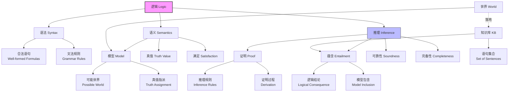

# 7.3 逻辑 (Logic)

## 1. 背景与动机

### 1.1 历史背景

逻辑学作为研究推理的学科，其历史可以追溯到古希腊时期。亚里士多德（公元前384-322年）被公认为"逻辑学之父"，他建立了三段论推理系统，这是第一个形式化的推理系统。亚里士多德的逻辑统治了西方思想近两千年。

19世纪，逻辑学经历了重大变革。布尔（George Boole, 1815-1864）创立了布尔代数，将逻辑推理转化为代数运算。弗雷格（Gottlob Frege, 1848-1925）发明了一阶逻辑，这是第一个能够表达复杂数学概念的完整逻辑系统。罗素（Bertrand Russell）和怀特海（Alfred North Whitehead）在《数学原理》（1910-1913）中尝试将所有数学还原为逻辑。

20世纪，逻辑学在计算机科学中找到了新的应用。图灵（Alan Turing）和邱奇（Alonzo Church）的工作建立了计算和逻辑之间的深刻联系。今天，逻辑是人工智能、数据库理论、程序验证和计算机科学的许多其他领域的基础。

### 1.2 研究动机

在人工智能中使用逻辑有以下核心动机：

**（1）形式化推理**：逻辑提供了一种严格的方式来表达和验证推理过程。这使得智能体的推理可以被分析和证明是正确的。

**（2）知识表示**：逻辑语言能够精确地表示关于世界的知识，包括事实、规则和约束。

**（3）可解释性**：基于逻辑的推理过程是透明的，可以解释为什么得出某个结论。

**（4）自动化**：逻辑推理可以被自动化，计算机程序可以执行复杂的逻辑推导。

**（5）通用性**：逻辑是一种通用的语言，可以应用于任何领域。

### 1.3 应用场景

逻辑在人工智能和计算机科学中有广泛应用：

| 应用领域 | 具体应用 | 逻辑的作用 |
|---------|---------|-----------|
| 知识表示 | 本体工程、语义网 | 定义概念和关系 |
| 自动推理 | 定理证明器 | 自动推导数学定理 |
| 程序验证 | 形式化验证 | 证明程序正确性 |
| 数据库 | 查询优化、完整性约束 | 确保数据一致性 |
| 自然语言处理 | 语义分析 | 表示句子意义 |
| 规划系统 | 自动规划 | 推导动作序列 |
| 法律推理 | 法律专家系统 | 应用法律规则 |

### 1.4 先决条件

理解逻辑的基本概念需要：

- **集合论基础**：集合、子集、元素
- **基本数学概念**：函数、关系
- **命题逻辑入门**：命题、真值
- **wumpus世界**（第7.2节）：具体推理场景

## 2. 知识逻辑图谱

### 2.1 逻辑核心概念关系图



### 2.2 推理过程概念图

```mermaid
graph LR
    A[知识库 KB] --> B{推理算法}
    B --> C[结论 α]
    
    D[世界模型] --满足.-> A
    D --满足.-> C
    
    E[真实世界] --感知.-> A
    
    B -.可靠性.-> F[如果KB为真<br/>则α为真]
    B -.完备性.-> G[如果KB蕴含α<br/>则能证明α]
    
    style B fill:#f9f,stroke:#333
    style F fill:#bfb,stroke:#333
    style G fill:#bfb,stroke:#333
```

## 3. 核心概念与数学分析

### 3.1 术语定义

| 术语（中文） | 术语（英文） | 定义 |
|------------|-------------|------|
| 语法 | Syntax | 规定合法语句结构的规则 |
| 语义 | Semantics | 定义语句含义和真值的规则 |
| 模型 | Model | 对命题符号的真值赋值，是数学抽象 |
| 可能世界 | Possible World | 潜在的真实环境，智能体可能处于其中 |
| 满足 | Satisfaction | 模型$m$满足语句$\alpha$表示$\alpha$在$m$中为真 |
| 蕴含 | Entailment | 一个语句逻辑上引发另一个语句的关系 |
| 推理 | Inference | 从原有语句推导出新语句的过程 |
| 可靠性 | Soundness | 仅推导蕴含语句的推理算法的性质 |
| 完备性 | Completeness | 能推导出所有蕴含语句的推理算法的性质 |
| 落地 | Grounding | 逻辑推理过程与真实环境的联系 |

### 3.2 符号参考表

| 符号 | 含义 | 说明 |
|------|------|------|
| $M(\alpha)$ | $\alpha$的模型集合 | 使$\alpha$为真的所有模型 |
| $\alpha \models \beta$ | $\alpha$蕴含$\beta$ | 在$\alpha$为真的每个模型中$\beta$也为真 |
| $KB \vdash_i \alpha$ | 由算法$i$从$KB$推导出$\alpha$ | 语法推导关系 |
| $m \models \alpha$ | 模型$m$满足$\alpha$ | $m$是$\alpha$的一个模型 |
| $\alpha \equiv \beta$ | $\alpha$与$\beta$逻辑等价 | 在相同模型集合中为真 |

### 3.3 核心概念详解

#### 3.3.1 语法与语义

**语法（Syntax）**：规定合法语句的形式规则。

示例（算术语法）：
- "$x + y = 4$"是合法语句
- "$x4y+ = 3$"不是合法语句

**语义（Semantics）**：定义每条语句在每个可能世界中的真值。

示例（算术语义）：
- "$x + y = 4$"在$x=2, y=2$的世界中为真
- "$x + y = 4$"在$x=1, y=1$的世界中为假

#### 3.3.2 模型与可能世界

**模型（Model）**：数学抽象，对每个相关语句都有固定的真值。

**可能世界（Possible World）**：潜在的真实环境。

**关系**：可能世界可以被认为是模型的一种解释，但模型是纯粹的数学对象。

**形式化定义**：
- 如果语句$\alpha$在模型$m$中为真，我们说$m$满足$\alpha$
- 记作：$m \models \alpha$
- $M(\alpha)$表示$\alpha$的所有模型的集合

#### 3.3.3 蕴含（Entailment）

**定义**：语句$\alpha$蕴含语句$\beta$，记作$\alpha \models \beta$，当且仅当在$\alpha$为真的每个模型中$\beta$也为真。

**形式化表示**：
$$\alpha \models \beta \text{ 当且仅当 } M(\alpha) \subseteq M(\beta)$$

**重要观察**：如果$\alpha \models \beta$，则$\alpha$是比$\beta$更强的断言，它排除了更多的可能世界。

**示例**：
- 语句"$x = 0$"蕴含语句"$x \cdot y = 0$"
- 在任一$x$为0的模型中，$x \cdot y$也必然为0

### 3.4 wumpus世界的蕴含示例

考虑智能体在$[1,1]$中什么都没有探测到，在$[2,1]$中探测到微风的情形。

**知识库（KB）包含**：
- 环境规则（微风与无底洞的关系）
- 感知信息：$\neg B_{1,1}$，$B_{2,1}$

**可能的结论**：
- $\alpha_1$："$[1,2]$中没有无底洞"
- $\alpha_2$："$[2,2]$中没有无底洞"

**模型分析**：

对于方格$[1,2]$、$[2,2]$和$[3,1]$，每个方格可能有或没有无底洞，总共有$2^3 = 8$个可能的模型。

| 模型 | $P_{1,2}$ | $P_{2,2}$ | $P_{3,1}$ | KB为真？ | $\alpha_1$为真？ | $\alpha_2$为真？ |
|------|-----------|-----------|-----------|----------|-----------------|-----------------|
| 1 | F | F | F | F | T | T |
| 2 | F | F | T | T | T | T |
| 3 | F | T | F | F | T | F |
| 4 | F | T | T | T | T | F |
| 5 | T | F | F | F | F | T |
| 6 | T | F | T | F | F | T |
| 7 | T | T | F | F | F | F |
| 8 | T | T | T | F | F | F |

**分析结果**：
- KB为真的模型：模型2和模型4（共2个）
- 在这2个模型中，$\alpha_1$（$[1,2]$无洞）都为真
- 因此$KB \models \alpha_1$
- 在模型4中，$\alpha_2$为假，因此$KB \not\models \alpha_2$

## 4. 定理与证明

### 4.1 演绎定理（Deduction Theorem）

**定理陈述**：
对于任意语句$\alpha$和$\beta$，$\alpha \models \beta$当且仅当语句$(\alpha \Rightarrow \beta)$是有效的（在所有模型中为真）。

**证明**：

**（$\Rightarrow$方向）**：假设$\alpha \models \beta$，证明$(\alpha \Rightarrow \beta)$有效。

任取模型$m$，有两种情况：
1. 如果$m \models \alpha$，则由蕴含定义，$m \models \beta$，因此$m \models (\alpha \Rightarrow \beta)$
2. 如果$m \not\models \alpha$，则蕴涵式的前件为假，因此$m \models (\alpha \Rightarrow \beta)$

综上，对所有模型$m$，$m \models (\alpha \Rightarrow \beta)$，即$(\alpha \Rightarrow \beta)$有效。

**（$\Leftarrow$方向）**：假设$(\alpha \Rightarrow \beta)$有效，证明$\alpha \models \beta$。

任取模型$m$使得$m \models \alpha$，需要证明$m \models \beta$。

由于$(\alpha \Rightarrow \beta)$有效，$m \models (\alpha \Rightarrow \beta)$。

由蕴涵的真值表，当前件$\alpha$为真而后件$\beta$为假时，蕴涵为假。

由于$m \models \alpha$且$m \models (\alpha \Rightarrow \beta)$，必有$m \models \beta$。

因此$\alpha \models \beta$。

**证明本质**：演绎定理建立了语义蕴含和语法蕴涵之间的联系，说明蕴含关系可以通过检验相应蕴涵式的有效性来确定。

### 4.2 可靠性与完备性

**可靠性（Soundness）**：
一个推理算法是可靠的（或保真的），如果它仅推导蕴含语句。

形式化：如果$KB \vdash_i \alpha$，则$KB \models \alpha$。

**完备性（Completeness）**：
一个推理算法是完备的，如果它能够推导出所有蕴含的语句。

形式化：如果$KB \models \alpha$，则$KB \vdash_i \alpha$。

**重要观察**：
- 可靠性是极为重要的属性。不可靠的推理过程会"编造事实"。
- 完备性在很多情况下也很重要，但对于无限知识库，完备性可能难以实现。
- 模型检验是可靠的，因为它直接实现了蕴含的定义。

## 5. 具体示例

### 5.1 模型检验算法

**算法描述**：枚举所有模型，检验$\alpha$在$KB$为真的每个模型中是否为真。

**算法伪代码**：
```
function TT-ENTAILS?(KB, α) returns true or false
    symbols ← KB和α中的命题符号列表
    return TT-CHECK-ALL(KB, α, symbols, {})

function TT-CHECK-ALL(KB, α, symbols, model) returns true或false
    if EMPTY?(symbols) then
        if PL-TRUE?(KB, model) then return PL-TRUE?(α, model)
        else return true  // 当KB为false时，始终返回true
    else
        P ← FIRST(symbols)
        rest ← REST(symbols)
        return (TT-CHECK-ALL(KB, α, rest, model ∪ {P = true}) and
                TT-CHECK-ALL(KB, α, rest, model ∪ {P = false}))
```

**算法分析**：
- 时间复杂度：$O(2^n)$，其中$n$是符号数量
- 空间复杂度：$O(n)$，深度优先枚举
- 可靠性：是，直接实现蕴含定义
- 完备性：是，检查所有模型

### 5.2 蕴含与推导的关系示例

**类比**：将$KB$的所有推论的集合比作干草堆，将$\alpha$比作一根针。

- **蕴含**：针是否在草堆中（语义概念）
- **推理**：找到这根针的过程（语法过程）

**形式化区别**：
- $\alpha \models \beta$：语义关系，关于模型和真值
- $KB \vdash_i \alpha$：语法关系，关于推理算法

## 6. 一句话本质

**逻辑为基于知识的智能体提供了形式化的知识表示和推理框架，通过语法定义合法语句、语义定义真值条件、蕴含刻画逻辑结论关系，使得智能体能够在保证可靠性的前提下从已知知识推导出新知识，并通过落地机制与真实世界建立联系。**

## 7. 总结与反思

### 7.1 关键要点

1. **三元组结构**：逻辑由语法（规定合法形式）、语义（定义含义和真值）和推理（推导新语句）三部分组成。

2. **模型理论**：语义通过模型（真值赋值）来定义，语句的真值由模型决定。

3. **蕴含关系**：$\alpha \models \beta$当且仅当$M(\alpha) \subseteq M(\beta)$，这是逻辑推理的核心概念。

4. **可靠性与完备性**：可靠的推理算法只推导蕴含的语句；完备的推理算法能推导所有蕴含的语句。

5. **落地问题**：逻辑推理需要与真实世界建立联系，传感器创建了这一联系。

### 7.2 常见误解对照表

| 常见误解 | 正确理解 |
|---------|---------|
| 模型就是真实世界 | 模型是数学抽象，可能世界是潜在的真实环境 |
| 蕴含是语法概念 | 蕴含是语义概念，关于模型和真值 |
| 推理就是蕴含 | 推理是推导过程，蕴含是结论关系 |
| 所有推理算法都是可靠的 | 只有被证明为可靠的算法才能保证结论正确 |
| 完备性总是可实现的 | 对于某些知识库，完备性可能难以或无法实现 |
| 逻辑只能处理确定性知识 | 逻辑可以扩展以处理不确定性（如概率逻辑） |

### 7.3 反思问题

1. **模型与现实**：模型和可能世界之间的区别是什么？为什么需要这种区分？

2. **蕴含的复杂性**：如果$KB$包含$n$个命题符号，模型检验需要检查$2^n$个模型。对于大规模知识库，如何使推理更高效？

3. **可靠性与完备性的权衡**：在实际应用中，可靠性和完备性哪个更重要？能否接受不可靠但高效的推理算法？

4. **落地问题**：智能体如何确保其知识库在真实世界中为真？学习过程如何影响这种保证？

5. **逻辑与概率**：当知识不确定时，逻辑推理面临什么挑战？概率推理如何补充逻辑推理？

### 7.4 公式速查表

| 概念 | 公式 | 说明 |
|------|------|------|
| 满足关系 | $m \models \alpha$ | 模型$m$满足语句$\alpha$ |
| 模型集合 | $M(\alpha) = \{m : m \models \alpha\}$ | 使$\alpha$为真的所有模型 |
| 蕴含 | $\alpha \models \beta \Leftrightarrow M(\alpha) \subseteq M(\beta)$ | 语义蕴含的定义 |
| 推导 | $KB \vdash_i \alpha$ | 由算法$i$从$KB$推导出$\alpha$ |
| 可靠性 | $KB \vdash_i \alpha \Rightarrow KB \models \alpha$ | 仅推导蕴含语句 |
| 完备性 | $KB \models \alpha \Rightarrow KB \vdash_i \alpha$ | 推导所有蕴含语句 |
| 演绎定理 | $\alpha \models \beta \Leftrightarrow \models (\alpha \Rightarrow \beta)$ | 蕴含与有效蕴涵式的等价 |

### 7.5 延伸阅读

- **第7.4节**：命题逻辑——一种具体的逻辑形式
- **第7.5-7.6节**：推理算法——实现逻辑推理的具体方法
- **第8章**：一阶逻辑——更强大的逻辑语言
- **第12章**：不确定性下的推理——概率与逻辑的结合
- **第13章**：概率推理——处理不确定性的形式化方法
