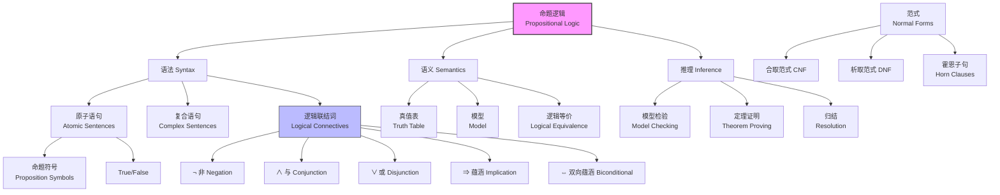
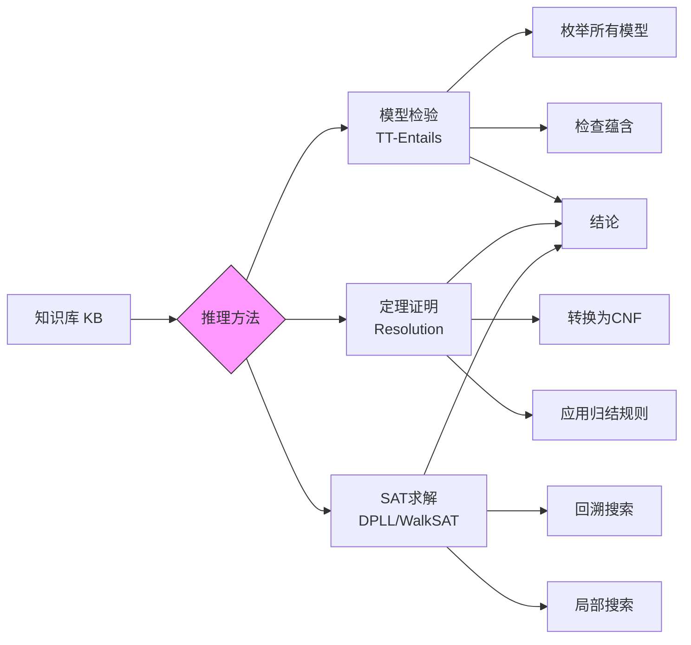

# 7.4 命题逻辑：一种非常简单的逻辑 (Propositional Logic)

## 1. 背景与动机

### 1.1 历史背景

命题逻辑（Propositional Logic），也称为命题演算（Propositional Calculus）或语句逻辑（Sentential Logic），是逻辑学中最简单但最基础的分支。其历史可以追溯到古希腊的斯多葛学派（Stoics），他们研究了由简单命题通过联结词构成的复合命题。

现代命题逻辑的形式化主要归功于19世纪的数学家：
- **布尔（George Boole, 1815-1864）**：创立了布尔代数，将逻辑运算转化为代数运算，奠定了数理逻辑的基础。
- **弗雷格（Gottlob Frege）**：在《概念文字》（1879）中建立了第一个完整的逻辑演算系统。
- **罗素和怀特海**：在《数学原理》中系统化地发展了命题逻辑和谓词逻辑。

命题逻辑虽然表达能力有限（不如一阶逻辑），但它能够阐明逻辑的所有基本概念，并且具有丰富的推断方法，是理解更复杂逻辑系统的理想起点。

### 1.2 研究动机

研究命题逻辑有以下核心动机：

**（1）概念清晰性**：命题逻辑足够简单，可以清晰地展示语法、语义和推理的基本概念，而不会被复杂性所掩盖。

**（2）计算可行性**：命题逻辑的推理问题是可判定的（虽然NP完全），存在实用的算法（如DPLL、WalkSAT）。

**（3）实际应用**：许多实际问题可以编码为命题可满足性问题（SAT），包括硬件验证、软件验证、规划等。

**（4）理论基础**：命题逻辑是理解更复杂逻辑系统（如一阶逻辑、模态逻辑）的基础。

### 1.3 应用场景

命题逻辑在计算机科学和人工智能中有广泛应用：

| 应用领域 | 具体应用 | 命题逻辑的作用 |
|---------|---------|---------------|
| 硬件验证 | 电路设计验证 | 验证电路是否满足规格说明 |
| 软件验证 | 程序正确性证明 | 验证程序是否满足前置/后置条件 |
| 自动规划 | SATPlan算法 | 将规划问题编码为可满足性问题 |
| 约束满足 | CSP求解 | 布尔约束的求解 |
| 配置问题 | 产品配置 | 确保配置满足所有约束 |
| 调度问题 | 资源调度 | 编码调度约束 |

### 1.4 先决条件

理解命题逻辑需要：

- **逻辑基础**（第7.3节）：语法、语义、模型、蕴含
- **集合论基础**：集合、子集、幂集
- **布尔代数**：与、或、非运算
- **wumpus世界**（第7.2节）：具体应用场景

## 2. 知识逻辑图谱

### 2.1 命题逻辑概念关系图



### 2.2 命题逻辑推理流程



## 3. 核心概念与数学分析

### 3.1 术语定义

| 术语（中文） | 术语（英文） | 定义 |
|------------|-------------|------|
| 命题符号 | Proposition Symbol | 代表一个为真或假的命题的符号，如$P$、$Q$、$W_{1,3}$ |
| 原子语句 | Atomic Sentence | 由单个命题符号构成的语句 |
| 复合语句 | Complex Sentence | 使用逻辑联结词由简单语句构成的语句 |
| 逻辑联结词 | Logical Connective | 用于组合语句的运算符：¬、∧、∨、⇒、⇔ |
| 文字 | Literal | 原子语句（正文字）或其否定（负文字） |
| 合取式 | Conjunction | 使用∧连接的语句，各部分称为合取子句 |
| 析取式 | Disjunction | 使用∨连接的语句，各部分称为析取子句 |
| 蕴涵式 | Implication | 使用⇒连接的语句，前件⇒后件 |
| 双向蕴涵式 | Biconditional | 使用⇔连接的语句，前后件等价 |
| 真值表 | Truth Table | 列出所有可能真值赋值下语句真值的表格 |

### 3.2 语法（Syntax）

**BNF文法**：
```
Sentence → AtomicSentence | ComplexSentence
AtomicSentence → True | False | P | Q | R | ...
ComplexSentence → (Sentence)
                | ¬Sentence
                | Sentence ∧ Sentence
                | Sentence ∨ Sentence
                | Sentence ⇒ Sentence
                | Sentence ⇔ Sentence
```

**运算符优先级**（从高到低）：
1. ¬（非）
2. ∧（与）
3. ∨（或）
4. ⇒（蕴涵）
5. ⇔（双向蕴涵）

**示例**：
- $¬A ∧ B$ 等价于 $(¬A) ∧ B$，而非 $¬(A ∧ B)$
- $A ∧ B ⇒ C ∨ D$ 等价于 $(A ∧ B) ⇒ (C ∨ D)$

### 3.3 语义（Semantics）

**模型**：命题逻辑中的模型是对每个命题符号的真值赋值（真或假）。

**真值计算规则**：

对于任意模型$m$中的任意子句$P$和$Q$：

| 语句 | 为真条件 |
|------|---------|
| $¬P$ | 当且仅当$P$在$m$中为假 |
| $P ∧ Q$ | 当且仅当$P$和$Q$在$m$中都为真 |
| $P ∨ Q$ | 当且仅当$P$或$Q$在$m$中至少一个为真 |
| $P ⇒ Q$ | 当且仅当$P$在$m$中为假或$Q$在$m$中为真 |
| $P ⇔ Q$ | 当且仅当$P$和$Q$在$m$中真值相同 |

**真值表**：

| $P$ | $Q$ | $¬P$ | $P ∧ Q$ | $P ∨ Q$ | $P ⇒ Q$ | $P ⇔ Q$ |
|-----|-----|------|---------|---------|---------|---------|
| F | F | T | F | F | T | T |
| F | T | T | F | T | T | F |
| T | F | F | F | T | F | F |
| T | T | F | T | T | T | T |

**关于蕴涵的重要观察**：
- $P ⇒ Q$为假**仅当**$P$为真而$Q$为假
- 当前件$P$为假时，蕴涵式自动为真（这被称为"实质蕴涵"）
- 命题逻辑不要求$P$和$Q$之间有因果关系

### 3.4 逻辑等价

两个语句$\alpha$和$\beta$逻辑等价，记作$\alpha \equiv \beta$，当且仅当它们在相同的模型集合中都为真。

**常用逻辑等价式**：

| 等价式 | 名称 |
|--------|------|
| $(\alpha ∧ \beta) \equiv (\beta ∧ \alpha)$ | 交换律 |
| $(\alpha ∨ \beta) \equiv (\beta ∨ \alpha)$ | 交换律 |
| $((\alpha ∧ \beta) ∧ \gamma) \equiv (\alpha ∧ (\beta ∧ \gamma))$ | 结合律 |
| $((\alpha ∨ \beta) ∨ \gamma) \equiv (\alpha ∨ (\beta ∨ \gamma))$ | 结合律 |
| $¬(¬\alpha) \equiv \alpha$ | 双重否定 |
| $(\alpha ⇒ \beta) \equiv (¬\beta ⇒ ¬\alpha)$ | 逆否命题 |
| $(\alpha ⇒ \beta) \equiv (¬\alpha ∨ \beta)$ | 蕴涵消除 |
| $(\alpha ⇔ \beta) \equiv ((\alpha ⇒ \beta) ∧ (\beta ⇒ \alpha))$ | 双向蕴涵消除 |
| $¬(\alpha ∧ \beta) \equiv (¬\alpha ∨ ¬\beta)$ | 德摩根律 |
| $¬(\alpha ∨ \beta) \equiv (¬\alpha ∧ ¬\beta)$ | 德摩根律 |
| $(\alpha ∧ (\beta ∨ \gamma)) \equiv ((\alpha ∧ \beta) ∨ (\alpha ∧ \gamma))$ | 分配律 |
| $(\alpha ∨ (\beta ∧ \gamma)) \equiv ((\alpha ∨ \beta) ∧ (\alpha ∨ \gamma))$ | 分配律 |

### 3.5 wumpus世界知识库示例

**命题符号定义**：
- $P_{x,y}$：$[x,y]$有无底洞
- $W_{x,y}$：wumpus在$[x,y]$
- $B_{x,y}$：$[x,y]$有微风
- $S_{x,y}$：$[x,y]$有臭味
- $L_{x,y}$：智能体位于$[x,y]$

**知识库语句**：

$R_1$：[1,1]中没有无底洞
$$¬P_{1,1}$$

$R_2$：[1,1]有微风当且仅当其相邻方格有无底洞
$$B_{1,1} ⇔ (P_{1,2} ∨ P_{2,1})$$

$R_3$：[2,1]有微风当且仅当其相邻方格有无底洞
$$B_{2,1} ⇔ (P_{1,1} ∨ P_{2,2} ∨ P_{3,1})$$

$R_4$：在[1,1]没有感知到微风
$$¬B_{1,1}$$

$R_5$：在[2,1]感知到微风
$$B_{2,1}$$

**蕴含查询**：

查询：$KB \models ¬P_{1,2}$？

**模型检验**：

涉及的符号：$B_{1,1}$、$B_{2,1}$、$P_{1,1}$、$P_{1,2}$、$P_{2,1}$、$P_{2,2}$、$P_{3,1}$

总共有$2^7 = 128$个可能的模型。

$KB$为真的模型只有3个（满足所有5条规则）。

在这3个模型中，$¬P_{1,2}$都为真。

因此，$KB \models ¬P_{1,2}$。

## 4. 定理与证明

### 4.1 模型检验算法的正确性

**定理**：TT-Entails?算法是可靠且完备的。

**证明**：

**可靠性**：
- 如果TT-Entails?$(KB, \alpha)$返回true，则$KB \models \alpha$。
- 算法枚举所有模型，检查$\alpha$在$KB$为真的每个模型中是否为真。
- 这直接实现了蕴含的定义，因此是可靠的。

**完备性**：
- 如果$KB \models \alpha$，则TT-Entails?$(KB, \alpha)$返回true。
- 算法检查所有可能的模型（有限个）。
- 如果$KB \models \alpha$，则在所有$KB$为真的模型中$\alpha$都为真，算法将返回true。

**复杂度分析**：
- 时间复杂度：$O(2^n)$，其中$n$是命题符号数量
- 空间复杂度：$O(n)$，深度优先枚举

### 4.2 命题逻辑的可判定性

**定理**：命题逻辑是可判定的。

**证明**：
- 对于任意语句$\alpha$和$\beta$，可以构造真值表来检验$\alpha \models \beta$。
- 真值表有有限行数（$2^n$行，$n$为符号数）。
- 因此，蕴含关系可以在有限时间内确定。

**注意**：虽然可判定，但命题蕴含是co-NP完全的，这意味着所有已知算法的最坏情况时间复杂度都是输入规模的指数量级。

## 5. 具体示例

### 5.1 真值表构建示例

**问题**：构建$¬P_{1,2} ∧ (P_{2,2} ∨ P_{3,1})$的真值表。

**解答**：

| $P_{1,2}$ | $P_{2,2}$ | $P_{3,1}$ | $¬P_{1,2}$ | $P_{2,2} ∨ P_{3,1}$ | $¬P_{1,2} ∧ (P_{2,2} ∨ P_{3,1})$ |
|-----------|-----------|-----------|------------|---------------------|----------------------------------|
| F | F | F | T | F | F |
| F | F | T | T | T | T |
| F | T | F | T | T | T |
| F | T | T | T | T | T |
| T | F | F | F | F | F |
| T | F | T | F | T | F |
| T | T | F | F | T | F |
| T | T | T | F | T | F |

**分析**：该语句在3个模型中为真。

### 5.2 逻辑等价证明示例

**问题**：证明$(P ⇒ Q) \equiv (¬Q ⇒ ¬P)$（逆否命题）。

**证明**：

构建真值表：

| $P$ | $Q$ | $¬P$ | $¬Q$ | $P ⇒ Q$ | $¬Q ⇒ ¬P$ |
|-----|-----|------|------|---------|-----------|
| F | F | T | T | T | T |
| F | T | T | F | T | T |
| T | F | F | T | F | F |
| T | T | F | F | T | T |

$P ⇒ Q$和$¬Q ⇒ ¬P$在所有模型中真值相同，因此逻辑等价。

### 5.3 wumpus世界推理示例

**场景**：智能体在[1,1]没有感知，在[2,1]感知到微风。

**已知**：
- $R_1: ¬P_{1,1}$
- $R_2: B_{1,1} ⇔ (P_{1,2} ∨ P_{2,1})$
- $R_3: B_{2,1} ⇔ (P_{1,1} ∨ P_{2,2} ∨ P_{3,1})$
- $R_4: ¬B_{1,1}$
- $R_5: B_{2,1}$

**推理过程**：

**步骤1**：从$R_4$和$R_2$
- $¬B_{1,1}$且$B_{1,1} ⇔ (P_{1,2} ∨ P_{2,1})$
- 因此$¬(P_{1,2} ∨ P_{2,1})$
- 由德摩根律：$¬P_{1,2} ∧ ¬P_{2,1}$

**步骤2**：从$R_5$和$R_3$
- $B_{2,1}$且$B_{2,1} ⇔ (P_{1,1} ∨ P_{2,2} ∨ P_{3,1})$
- 因此$P_{1,1} ∨ P_{2,2} ∨ P_{3,1}$

**步骤3**：结合$R_1$
- $¬P_{1,1}$
- 因此$P_{2,2} ∨ P_{3,1}$

**结论**：
- $[1,2]$中没有无底洞（$¬P_{1,2}$）
- $[2,1]$中没有无底洞（$¬P_{2,1}$）
- $[2,2]$或$[3,1]$中至少有一个有无底洞（$P_{2,2} ∨ P_{3,1}$）

## 6. 一句话本质

**命题逻辑通过定义命题符号的语法规则、基于真值表的语义解释，以及五种逻辑联结词（¬、∧、∨、⇒、⇔）的组合运算，为知识表示和推理提供了一个形式化框架，使得智能体能够通过模型检验或定理证明从已知知识推导出新结论，虽然表达能力有限但计算可行性强。**

## 7. 总结与反思

### 7.1 关键要点

1. **语法与语义分离**：命题逻辑明确定义了合法语句的形式（语法）和语句的真值条件（语义）。

2. **五种联结词**：¬（非）、∧（与）、∨（或）、⇒（蕴涵）、⇔（双向蕴涵）构成了完整的逻辑运算集。

3. **真值表方法**：真值表提供了一种系统性的方法来计算语句在所有可能模型中的真值。

4. **逻辑等价**：许多逻辑等价式（如德摩根律、分配律）可以用来简化和转换语句。

5. **可判定性**：命题逻辑是可判定的，但蕴含问题是co-NP完全的。

### 7.2 常见误解对照表

| 常见误解 | 正确理解 |
|---------|---------|
| 蕴涵要求因果关系 | 命题逻辑的蕴涵是实质蕴涵，不要求因果关系 |
| 假⇒假为假 | 假⇒假为真，只有真⇒假为假 |
| ∨是异或 | ∨是包含或，两个子句都为真时结果也为真 |
| 所有逻辑等价都是显然的 | 许多等价式（如德摩根律）需要证明 |
| 命题逻辑可以表达所有知识 | 命题逻辑表达能力有限，无法表达"所有"、"存在"等量词 |

### 7.3 反思问题

1. **蕴涵的直观理解**：实质蕴涵（$P ⇒ Q$在$P$为假时为真）与日常语言中的"如果...那么..."有什么不同？这种差异在哪些情况下会造成问题？

2. **表达能力限制**：命题逻辑无法表达哪些类型的知识？这些限制如何影响其在实际应用中的使用？

3. **计算复杂性**：命题逻辑的可判定性与其计算复杂性之间有什么关系？NP完全性对实际应用意味着什么？

4. **范式转换**：为什么需要将语句转换为合取范式（CNF）或析取范式（DNF）？这些转换对推理有什么帮助？

5. **双向蕴涵的使用**：在什么情况下应该使用双向蕴涵（⇔）而不是单向蕴涵（⇒）？

### 7.4 公式速查表

| 概念 | 公式 | 说明 |
|------|------|------|
| 蕴涵消除 | $(\alpha ⇒ \beta) \equiv (¬\alpha ∨ \beta)$ | 将蕴涵转换为析取 |
| 双向蕴涵消除 | $(\alpha ⇔ \beta) \equiv ((\alpha ⇒ \beta) ∧ (\beta ⇒ \alpha))$ | 分解为两个蕴涵 |
| 德摩根律 | $¬(\alpha ∧ \beta) \equiv (¬\alpha ∨ ¬\beta)$ | 否定的分配 |
| 德摩根律 | $¬(\alpha ∨ \beta) \equiv (¬\alpha ∧ ¬\beta)$ | 否定的分配 |
| 逆否命题 | $(\alpha ⇒ \beta) \equiv (¬\beta ⇒ ¬\alpha)$ | 逻辑等价 |
| 分配律 | $(\alpha ∧ (\beta ∨ \gamma)) \equiv ((\alpha ∧ \beta) ∨ (\alpha ∧ \gamma))$ | ∧对∨的分配 |
| 分配律 | $(\alpha ∨ (\beta ∧ \gamma)) \equiv ((\alpha ∨ \beta) ∧ (\alpha ∨ \gamma))$ | ∨对∧的分配 |
| 模型数量 | $2^n$ | $n$个符号的模型数 |

### 7.5 延伸阅读

- **第7.5节**：命题定理证明——基于推理规则的证明方法
- **第7.6节**：高效命题模型检验——SAT求解算法
- **第7.7节**：基于命题逻辑的智能体——完整应用示例
- **第8章**：一阶逻辑——更强大的逻辑语言
- **第9章**：一阶逻辑中的推理——处理更复杂的知识表示
