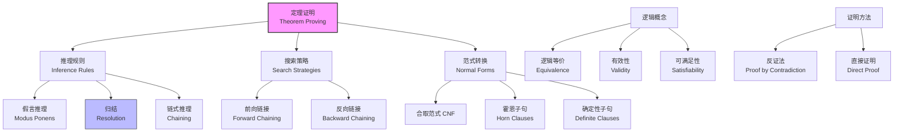
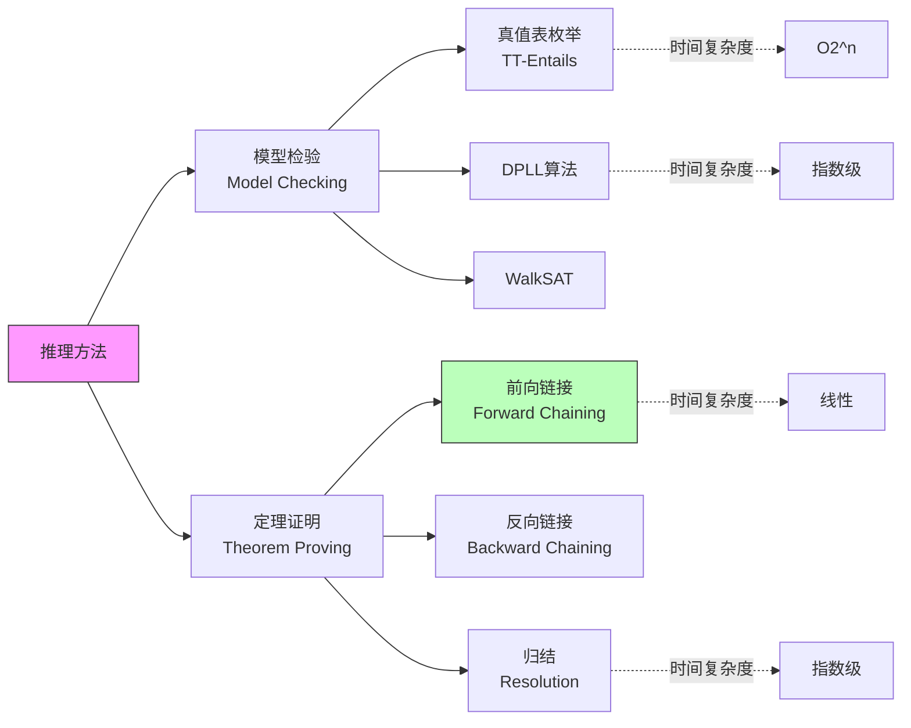

# 7.5 命题定理证明 (Propositional Theorem Proving)

## 1. 背景与动机

### 1.1 历史背景

定理证明（Theorem Proving）是人工智能和自动推理领域的核心研究方向，其历史可以追溯到20世纪50年代AI的诞生时期。

**早期发展**：
- **1950年代**：Newell和Simon开发了Logic Theorist（1956），这是第一个自动定理证明程序，能够证明《数学原理》中的若干定理。
- **1960年代**：Robinson提出了归结原理（Resolution Principle, 1965），这是一种完备且高效的推理方法，彻底改变了自动定理证明领域。
- **1970年代**：开发了第一个实用的定理证明器，如斯坦福的STP和Argonne国家实验室的OTTER。

**现代发展**：
- **1990年代**：SAT求解器的发展（如GRASP、Chaff）使得大规模命题可满足性问题得以解决。
- **2000年代至今**：现代SAT求解器（如MiniSat、Glucose）能够处理数百万变量的问题，应用于硬件验证、软件验证等领域。

### 1.2 研究动机

定理证明相对于模型检验有以下优势：

**（1）效率优势**：当模型数量很多但证明很短时，定理证明比模型检验更高效。模型检验需要枚举$2^n$个模型，而定理证明可能只需要几步推导。

**（2）可解释性**：定理证明产生显式的证明序列，可以解释为什么结论成立。

**（3）增量推理**：可以逐步构建证明，利用先前的结果。

**（4）理论洞察**：定理证明方法揭示了逻辑推理的结构和性质。

### 1.3 应用场景

定理证明技术在以下领域有重要应用：

| 应用领域 | 具体应用 | 技术特点 |
|---------|---------|---------|
| 硬件验证 | 微处理器设计验证 | 验证电路是否满足规格 |
| 软件验证 | 程序正确性证明 | 验证安全关键系统 |
| 数学研究 | 辅助证明复杂定理 | 四色定理、开普勒猜想 |
| 安全协议 | 密码协议分析 | 验证协议安全性 |
| 规划系统 | 自动规划 | SATPlan等算法 |
| 约束求解 | 组合优化问题 | 编码为可满足性问题 |

### 1.4 先决条件

理解命题定理证明需要：

- **命题逻辑**（第7.4节）：语法、语义、逻辑联结词
- **逻辑基础**（第7.3节）：蕴含、模型、可靠性、完备性
- **搜索算法**（第3-4章）：搜索策略、启发式
- **wumpus世界**（第7.2节）：应用场景

## 2. 知识逻辑图谱

### 2.1 定理证明概念关系图



### 2.2 推理方法比较图



## 3. 核心概念与数学分析

### 3.1 术语定义

| 术语（中文） | 术语（英文） | 定义 |
|------------|-------------|------|
| 逻辑等价 | Logical Equivalence | 两个语句在相同模型集合中为真，记作$\alpha \equiv \beta$ |
| 有效性 | Validity | 在所有模型中都为真的语句，也称为重言式 |
| 可满足性 | Satisfiability | 存在至少一个模型使其为真的语句 |
| 假言推理 | Modus Ponens | 从$\alpha$和$\alpha \Rightarrow \beta$推出$\beta$ |
| 归结 | Resolution | 从$\alpha \lor \beta$和$\neg\beta \lor \gamma$推出$\alpha \lor \gamma$ |
| 合取范式 | Conjunctive Normal Form (CNF) | 子句的合取，每个子句是文字的析取 |
| 霍恩子句 | Horn Clause | 最多一个正文字的子句 |
| 确定性子句 | Definite Clause | 恰好一个正文字的霍恩子句 |
| 前向链接 | Forward Chaining | 从已知事实出发，应用规则推导新事实 |
| 反向链接 | Backward Chaining | 从目标出发，反向寻找支持证据 |

### 3.2 符号参考表

| 符号 | 含义 | 说明 |
|------|------|------|
| $\alpha \equiv \beta$ | 逻辑等价 | $\alpha$和$\beta$在相同模型中为真 |
| $\top$ | 永真 | 在所有模型中为真 |
| $\bot$ | 永假 | 在所有模型中为假 |
| $\frac{\alpha \quad \alpha \Rightarrow \beta}{\beta}$ | 假言推理 | 推理规则表示 |
| $\frac{\alpha \lor \beta \quad \neg\beta \lor \gamma}{\alpha \lor \gamma}$ | 归结 | 归结规则 |
| $\vdash$ | 语法推导 | 通过推理规则得到 |
| $\models$ | 语义蕴含 | 在所有模型中成立 |

### 3.3 推理规则

#### 3.3.1 假言推理（Modus Ponens）

**规则形式**：
$$\frac{\alpha \quad \alpha \Rightarrow \beta}{\beta}$$

**含义**：如果$\alpha$为真，且$\alpha$蕴涵$\beta$，则$\beta$为真。

**示例**：
- 已知：$P_{1,1}$（智能体在[1,1]）
- 已知：$P_{1,1} \Rightarrow B_{1,1}$（如果在[1,1]则有微风）
- 推导：$B_{1,1}$（有微风）

#### 3.3.2 与消解（And-Elimination）

**规则形式**：
$$\frac{\alpha_1 \land \alpha_2 \land \cdots \land \alpha_n}{\alpha_i}$$

**含义**：从合取式可以推出任意一个合取子句。

#### 3.3.3 与引入（And-Introduction）

**规则形式**：
$$\frac{\alpha_1 \quad \alpha_2 \quad \cdots \quad \alpha_n}{\alpha_1 \land \alpha_2 \land \cdots \land \alpha_n}$$

**含义**：从多个语句可以推出它们的合取。

#### 3.3.4 双重否定消除

**规则形式**：
$$\frac{\neg\neg\alpha}{\alpha}$$

#### 3.3.5 归结（Resolution）

**规则形式**：
$$\frac{\alpha \lor \beta \quad \neg\beta \lor \gamma}{\alpha \lor \gamma}$$

**含义**：如果$\beta$和$\neg\beta$矛盾，则必须接受$\alpha$或$\gamma$。

**完备性**：归结是命题逻辑中的完备推理规则。任何可证明的语句都可以用归结证明。

**单元归结**：如果$\beta$是单个文字（单元子句），则：
$$\frac{\alpha \lor \beta \quad \neg\beta}{\alpha}$$

### 3.4 范式转换

#### 3.4.1 合取范式（CNF）

**定义**：CNF是子句的合取，每个子句是文字的析取。

**形式**：
$$(l_{1,1} \lor \cdots \lor l_{1,k_1}) \land \cdots \land (l_{n,1} \lor \cdots \lor l_{n,k_n})$$

**转换步骤**：
1. 消除$\Leftrightarrow$：$\alpha \Leftrightarrow \beta$替换为$(\alpha \Rightarrow \beta) \land (\beta \Rightarrow \alpha)$
2. 消除$\Rightarrow$：$\alpha \Rightarrow \beta$替换为$\neg\alpha \lor \beta$
3. 将$\neg$内移：应用德摩根律和双重否定
4. 应用分配律：$\alpha \lor (\beta \land \gamma)$转换为$(\alpha \lor \beta) \land (\alpha \lor \gamma)$

#### 3.4.2 霍恩子句（Horn Clauses）

**定义**：最多包含一个正文字的子句。

**形式**：
- 事实：$P$（单个正文字）
- 规则：$(P_1 \land P_2 \land \cdots \land P_n) \Rightarrow Q$ 或等价地 $(\neg P_1 \lor \neg P_2 \lor \cdots \lor \neg P_n \lor Q)$
- 目标子句：$(\neg P_1 \lor \neg P_2 \lor \cdots \lor \neg P_n)$（没有正文字）

**重要性**：
- 可以用前向链接和反向链接高效推理
- 推理时间与知识库大小呈线性关系
- 是逻辑编程（如Prolog）的基础

### 3.5 前向链接与反向链接

#### 3.5.1 前向链接（Forward Chaining）

**算法思想**：从知识库中的已知事实出发，反复应用规则推导新事实，直到推出查询或无法继续推导。

**算法伪代码**：
```
function PL-FC-ENTAILS?(KB, q) returns true or false
    count ← 表，count[c]为子句c的前提符号数量
    inferred ← 表，inferred[s]初始对所有符号为false
    queue ← 队列，初始为KB中已知为true的符号
    
    while queue不空 do
        p ← POP(queue)
        if p = q then return true
        if inferred[p] = false then
            inferred[p] ← true
            for each p在c.PREMISE中的子句c do
                count[c]减1
                if count[c] = 0 then
                    将c.CONCLUSION添加到queue
    return false
```

**复杂度**：
- 时间复杂度：$O(|KB|)$，线性于知识库大小
- 空间复杂度：$O(|KB|)$

**特点**：
- 数据驱动（data-driven）
- 推导所有可能的事实
- 适合监控和诊断应用

#### 3.5.2 反向链接（Backward Chaining）

**算法思想**：从查询（目标）出发，反向寻找支持该目标的证据。如果目标需要前提，则将前提作为子目标继续查询。

**工作方式**：
1. 要证明$q$
2. 查找结论为$q$的规则$P_1 \land \cdots \land P_n \Rightarrow q$
3. 递归证明$P_1, \ldots, P_n$
4. 如果所有子目标都能证明，则$q$得证

**特点**：
- 目标驱动（goal-driven）
- 只推导与目标相关的事实
- 适合问题求解和查询应用

## 4. 定理与证明

### 4.1 归结的完备性

**定理**：归结是命题逻辑中的完备推理规则。

**陈述**：对于任意知识库$KB$和语句$\alpha$，如果$KB \models \alpha$，则$KB \vdash_{resolution} \alpha$。

**证明概要**：

**关键引理**：$KB \models \alpha$当且仅当$KB \land \neg\alpha$不可满足。

**证明步骤**：
1. 将$KB$和$\neg\alpha$转换为CNF
2. 应用归结规则反复推导新子句
3. 如果推导出空子句（$\square$），则$KB \land \neg\alpha$不可满足
4. 因此$KB \models \alpha$

**空子句的推导**：
- 如果推导出$P$和$\neg P$，归结得到空子句
- 空子句表示矛盾，即不可满足

### 4.2 前向链接的可靠性

**定理**：前向链接算法是可靠的。

**陈述**：如果PL-FC-ENTAILS?$(KB, q)$返回true，则$KB \models q$。

**证明**：

**归纳基础**：队列中的初始符号都在$KB$中，因此$KB$蕴含它们。

**归纳步骤**：假设队列中所有当前符号都被$KB$蕴含。当处理符号$p$时，对于每个前提包含$p$的子句$c$，将$count[c]$减1。如果$count[c]$变为0，则将$c$的结论加入队列。

由于$c$的所有前提都被$KB$蕴含（归纳假设），且$c$是确定性子句（$P_1 \land \cdots \land P_n \Rightarrow Q$），因此$Q$也被$KB$蕴含。

**结论**：通过归纳，所有加入队列的符号都被$KB$蕴含。如果$q$被加入队列，则$KB \models q$。

### 4.3 前向链接对于霍恩子句的完备性

**定理**：对于霍恩子句知识库，前向链接是完备的。

**陈述**：如果$KB$是霍恩子句集合，且$KB \models q$（$q$是单个正文字），则PL-FC-ENTAILS?$(KB, q)$返回true。

**证明概要**：

设$q$被$KB$蕴含但前向链接没有推导出$q$。考虑前向链接停止时的状态：

1. 所有能从$KB$推导出的正文字都已标记为inferred
2. $q$没有被标记，因此$q$不能从$KB$推导出
3. 构造模型$m$：所有inferred的符号赋值为true，其余为false
4. 在$m$中，$KB$的所有子句都为真（因为霍恩子句的性质）
5. 但$q$在$m$中为假
6. 这与$KB \models q$矛盾

因此，前向链接必然能推导出$q$。

## 5. 具体示例

### 5.1 归结证明示例

**问题**：证明$KB \models \neg P_{1,2}$

**知识库**：
- $R_1: ¬P_{1,1}$
- $R_2: B_{1,1} ⇔ (P_{1,2} ∨ P_{2,1})$，即$(¬B_{1,1} ∨ P_{1,2} ∨ P_{2,1}) ∧ (B_{1,1} ∨ ¬P_{1,2}) ∧ (B_{1,1} ∨ ¬P_{2,1})$
- $R_3: ¬B_{1,1}$

**转换为CNF**：
- $C_1: ¬P_{1,1}$
- $C_2: ¬B_{1,1} ∨ P_{1,2} ∨ P_{2,1}$
- $C_3: B_{1,1} ∨ ¬P_{1,2}$
- $C_4: B_{1,1} ∨ ¬P_{2,1}$
- $C_5: ¬B_{1,1}$

**归结过程**：

1. 从$C_3$和$C_5$归结：
   $$\frac{B_{1,1} \lor ¬P_{1,2} \quad ¬B_{1,1}}{¬P_{1,2}}$$

2. 得到$¬P_{1,2}$，即要证明的结论。

### 5.2 前向链接示例

**知识库**（霍恩子句）：
- $P \Rightarrow Q$
- $L \land M \Rightarrow P$
- $B \land L \Rightarrow M$
- $A \land P \Rightarrow L$
- $A \land B \Rightarrow L$
- $A$（事实）
- $B$（事实）

**执行过程**：

| 迭代 | 队列 | 推导出的新事实 |
|------|------|---------------|
| 0 | [A, B] | - |
| 1 | [B] | A已处理 |
| 2 | [] | B已处理，触发$A \land B \Rightarrow L$ |
| 3 | [L] | L加入队列 |
| 4 | [] | L已处理，触发$B \land L \Rightarrow M$ |
| 5 | [M] | M加入队列 |
| 6 | [] | M已处理，触发$L \land M \Rightarrow P$ |
| 7 | [P] | P加入队列 |
| 8 | [] | P已处理，触发$P \Rightarrow Q$ |
| 9 | [Q] | Q加入队列 |

**查询**：$Q$是否被蕴含？
**答案**：是，$Q$被推导出来。

### 5.3 反向链接示例

**知识库**：同上

**查询**：$Q$

**执行过程**：

1. 要证明$Q$
2. 查找结论为$Q$的规则：$P \Rightarrow Q$
3. 需要证明$P$
4. 查找结论为$P$的规则：$L \land M \Rightarrow P$
5. 需要证明$L$和$M$
6. 证明$L$：
   - 查找结论为$L$的规则：$A \land P \Rightarrow L$、$A \land B \Rightarrow L$
   - 尝试$A \land B \Rightarrow L$
   - $A$是事实，$B$是事实
   - $L$得证
7. 证明$M$：
   - 查找结论为$M$的规则：$B \land L \Rightarrow M$
   - $B$是事实，$L$已证
   - $M$得证
8. $P$得证（$L$和$M$都已证）
9. $Q$得证（$P$已证）

## 6. 一句话本质

**命题定理证明通过应用推理规则（如假言推理、归结）从知识库中的语句直接推导结论，避免了枚举所有模型的指数级开销，其中归结规则具有完备性，而针对霍恩子句的前向链接和反向链接算法能够在线性时间内完成推理，使得逻辑推理在实用系统中变得可行。**

## 7. 总结与反思

### 7.1 关键要点

1. **推理规则**：假言推理、与消解、与引入、双重否定消除和归结是命题逻辑中的基本推理规则。

2. **归结完备性**：归结是完备的推理规则，任何可证明的语句都可以用归结证明。

3. **范式转换**：将语句转换为CNF是应用归结的必要步骤。

4. **霍恩子句**：霍恩子句允许使用高效的前向链接和反向链接算法，推理时间与知识库大小呈线性关系。

5. **前向vs反向**：前向链接是数据驱动的，适合监控应用；反向链接是目标驱动的，适合查询应用。

### 7.2 常见误解对照表

| 常见误解 | 正确理解 |
|---------|---------|
| 所有推理规则都是完备的 | 只有归结是完备的，其他规则（如假言推理）不是 |
| 前向链接对所有知识库都完备 | 前向链接仅对霍恩子句知识库完备 |
| 反向链接比前向链接更高效 | 效率取决于应用场景，反向链接在目标相关时更高效 |
| CNF转换保持语句等价 | CNF转换保持可满足性等价，但不一定保持逻辑等价 |
| 归结只能用于CNF | 归结规则本身适用于任意子句，但实践中通常先转CNF |

### 7.3 反思问题

1. **完备性与效率的权衡**：归结是完备的但可能效率低，前向链接高效但仅对霍恩子句完备。在实际应用中如何选择合适的推理方法？

2. **证明的可解释性**：定理证明产生的证明序列可以被人类理解，这对AI系统的可解释性有什么意义？

3. **知识库设计**：如何设计知识库以最大化推理效率？霍恩子句的限制对知识表示有什么影响？

4. **增量推理**：当知识库动态变化时，如何高效地更新推理结果？

5. **与模型检验的比较**：在什么情况下应该选择定理证明而不是模型检验？

### 7.4 公式速查表

| 概念 | 公式 | 说明 |
|------|------|------|
| 假言推理 | $\frac{\alpha \quad \alpha \Rightarrow \beta}{\beta}$ | 基本推理规则 |
| 归结 | $\frac{\alpha \lor \beta \quad \neg\beta \lor \gamma}{\alpha \lor \gamma}$ | 完备推理规则 |
| 单元归结 | $\frac{\alpha \lor \beta \quad \neg\beta}{\alpha}$ | 特殊情况 |
| 蕴涵消除 | $\alpha \Rightarrow \beta \equiv \neg\alpha \lor \beta$ | CNF转换 |
| 双向蕴涵消除 | $\alpha \Leftrightarrow \beta \equiv (\alpha \Rightarrow \beta) \land (\beta \Rightarrow \alpha)$ | CNF转换 |
| 霍恩子句 | $\neg P_1 \lor \cdots \lor \neg P_n \lor Q$ | 最多一个正文字 |
| 确定性子句 | 恰好一个正文字的霍恩子句 | 前向链接适用 |

### 7.5 延伸阅读

- **第7.6节**：高效命题模型检验——SAT求解算法
- **第7.7节**：基于命题逻辑的智能体——完整应用示例
- **第8章**：一阶逻辑——更强大的逻辑语言
- **第9章**：一阶逻辑中的推理——归结的扩展
- **第9.4节**：逻辑编程——Prolog和霍恩子句的实际应用
