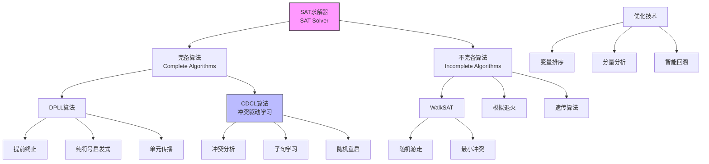

# 7.6 高效命题模型检验 (Efficient Propositional Model Checking)

## 1. 背景与动机

### 1.1 历史背景

命题可满足性问题（SAT）是计算机科学中最基础的问题之一。尽管命题逻辑是可判定的，但SAT问题是第一个被证明为NP完全的问题（Cook-Levin定理，1971年），这意味着所有已知算法的最坏情况时间复杂度都是指数量级的。

**早期发展**：
- **1960年**：Davis-Putnam算法提出，奠定了现代SAT求解的基础。
- **1962年**：Davis-Logemann-Loveland（DLL）改进算法，引入回溯搜索。
- **1990年代**：GRASP求解器引入冲突驱动的学习（CDCL），革命性地提高了SAT求解效率。
- **2000年代**：Chaff、MiniSat等求解器进一步优化，能够处理数百万变量的问题。

**现代SAT求解**：
今天的SAT求解器结合了多种技术：
- 冲突驱动的子句学习（CDCL）
- 随机重启
- 变量活动启发式（VSIDS）
- 子句删除策略

### 1.2 研究动机

高效命题模型检验的研究有以下动机：

**（1）实际应用需求**：硬件验证、软件验证、规划等领域需要求解大规模SAT问题。

**（2）理论与实践差距**：虽然SAT是NP完全的，但许多实际问题具有结构，现代求解器能够高效处理。

**（3）算法工程**：通过精心设计的启发式和优化，可以显著提高求解效率。

**（4）理论基础**：研究SAT问题的相变现象和难度分布，深化对计算复杂性的理解。

### 1.3 应用场景

高效SAT求解技术在以下领域有广泛应用：

| 应用领域 | 具体应用 | 规模 |
|---------|---------|------|
| 硬件验证 | 微处理器设计验证 | 数百万变量 |
| 软件验证 | 程序正确性证明 | 数十万变量 |
| 自动规划 | SATPlan算法 | 数万变量 |
| 密码分析 | 破解密码算法 | 数万变量 |
| 生物信息学 | 基因调控网络分析 | 数千变量 |
| 配置问题 | 产品配置优化 | 数千变量 |

### 1.4 先决条件

理解高效命题模型检验需要：

- **命题逻辑**（第7.4节）：CNF、子句、文字
- **搜索算法**（第3-4章）：回溯搜索、启发式
- **约束满足问题**（第6章）：CSP求解技术
- **复杂性理论**：NP完全性

## 2. 知识逻辑图谱

### 2.1 SAT求解技术关系图



### 2.2 SAT问题相变现象

```mermaid
graph LR
    A[子句/变量比<br/>m/n] --> B[可满足概率]
    
    B --> C[欠约束区<br/>Underconstrained]
    B --> D[阈值区<br/>Threshold]
    B --> E[过约束区<br/>Overconstrained]
    
    C -.概率≈1.-> C1[容易求解]
    D -.概率≈0.5.-> D1[最难求解]
    E -.概率≈0.-> E1[相对容易]
    
    style D fill:#f99,stroke:#333
    style D1 fill:#f99,stroke:#333
```

## 3. 核心概念与数学分析

### 3.1 术语定义

| 术语（中文） | 术语（英文） | 定义 |
|------------|-------------|------|
| SAT问题 | Satisfiability Problem | 判断命题逻辑语句是否可满足的问题 |
| CNF | Conjunctive Normal Form | 合取范式，子句的合取 |
| k-CNF | k-Conjunctive Normal Form | 每个子句最多k个文字的CNF |
| 单元子句 | Unit Clause | 只包含一个文字的子句 |
| 单元传播 | Unit Propagation | 由单元子句强制赋值的级联过程 |
| 纯符号 | Pure Symbol | 在所有子句中只以正或只以负形式出现的符号 |
| 冲突 | Conflict | 当前赋值导致某个子句为假 |
| 冲突分析 | Conflict Analysis | 分析冲突原因以学习新子句 |
| 子句学习 | Clause Learning | 从冲突中推导并添加新子句 |
| 随机重启 | Random Restart | 从搜索树顶端重新开始搜索 |

### 3.2 符号参考表

| 符号 | 含义 | 说明 |
|------|------|------|
| $CNF_k(m,n)$ | k-CNF语句 | $m$个子句，$n$个符号的k-CNF |
| $m/n$ | 子句/符号比 | 影响问题难度的关键参数 |
| $r_k$ | 可满足性阈值 | k-CNF可满足性相变点 |
| $\alpha$ | 赋值 | 变量到真值的映射 |
| $U(C)$ | 单元传播 | 对子句集$C$应用单元传播 |

### 3.3 DPLL算法

DPLL算法是Davis-Putnam-Logemann-Loveland算法的简称，是现代SAT求解器的基础。

#### 3.3.1 基本算法

```
function DPLL-SATISFIABLE?(s) returns true or false
    clauses ← s的CNF表示的子句集合
    symbols ← s中的命题符号列表
    return DPLL(clauses, symbols, {})

function DPLL(clauses, symbols, model) returns true or false
    if 在model中每个子句都为true then return true
    if 在model中某个子句为false then return false
    
    P, value ← FIND-PURE-SYMBOL(symbols, clauses, model)
    if P不空 then return DPLL(clauses, symbols - P, model ∪ {P=value})
    
    P, value ← FIND-UNIT-CLAUSE(clauses, model)
    if P不空 then return DPLL(clauses, symbols - P, model ∪ {P=value})
    
    P ← FIRST(symbols); rest ← REST(symbols)
    return DPLL(clauses, rest, model ∪ {P=true}) or
           DPLL(clauses, rest, model ∪ {P=false})
```

#### 3.3.2 三项关键改进

**（1）提前终止（Early Termination）**

算法可以用部分完成的模型来检测语句是否必然为真或为假。

- 如果任一文字为真，则子句为真（即使其他文字还没有真值）
- 如果任一子句为假（所有文字为假），则语句为假

**示例**：若$A$为真，则语句$(A \lor B) \land (A \lor C)$为真，无论$B$和$C$的值是什么。

**（2）纯符号启发式（Pure Symbol Heuristic）**

纯符号是指在所有子句中"符号位"都相同的符号。

- 如果符号只以正文字出现，赋值为true
- 如果符号只以负文字出现，赋值为false

**原理**：如果语句有模型，则存在模型对纯符号的赋值使其文字为真。

**（3）单元子句启发式（Unit Clause Heuristic）**

单元子句是只有一个文字的子句，或那些除了一个文字外其余都被赋值为false的子句。

**单元传播**：对单元子句中的符号强制赋值，这可能创建新的单元子句，产生级联效应。

**示例**：
- 模型含有$B = \text{true}$
- 子句$(\neg B \lor \neg C)$简化为$\neg C$
- 因此$C$必须赋值为false
- 这可能导致$(C \lor A)$变成单元子句，使$A$为true

### 3.4 现代SAT求解器技术

#### 3.4.1 冲突驱动的子句学习（CDCL）

**核心思想**：当发生冲突时，分析冲突的原因，学习一个新的子句来避免将来重复同样的错误。

**冲突分析过程**：
1. 识别导致冲突的决策序列
2. 构建蕴涵图（implication graph）
3. 应用消解原理推导冲突子句
4. 将冲突子句添加到知识库

**回溯策略**：
- 不是按时间顺序回溯
- 直接跳转到与冲突相关的决策点
- 这称为"非时序回溯"或"智能回溯"

#### 3.4.2 变量活动启发式（VSIDS）

**VSIDS**（Variable State Independent Decaying Sum）是一种动态变量排序启发式。

**工作原理**：
1. 每个变量有一个活动分数
2. 参与冲突子句的变量增加分数
3. 定期将所有分数衰减（乘以小于1的因子）
4. 选择活动分数最高的未赋值变量

**优点**：
- 优先选择参与近期冲突的变量
- 能够适应问题的结构
- 实现简单高效

#### 3.4.3 随机重启

**策略**：有时单次运行似乎无法取得进展，此时从搜索树的顶端重新开始。

**实现**：
- 保留学习到的子句（用于剪枝）
- 对变量和值的选择进行不同的随机选择
- 设置重启间隔（如Luby序列）

**效果**：
- 减小求解时间的方差
- 帮助逃离局部极小值
- 不保证更快找到解，但提高鲁棒性

### 3.5 局部搜索算法

#### 3.5.1 WalkSAT算法

WalkSAT是一种简单有效的局部搜索算法。

```
function WALKSAT(clauses, p, max-flips) returns 满足的模型或failure
    inputs: 
        clauses, 子句集合
        p, 选择"随机游走"动作的概率
        max-flips, 放弃前允许的翻转次数
    
    model ← 对符号随机赋值true/false
    for i = 1 to max-flips do
        if model满足clauses then return model
        clause ← 从clauses中随机选择一个在model中为false的子句
        if RANDOM(0,1) ≤ p then
            翻转clause中随机选择的符号
        else
            翻转clause中的符号以最大化已满足子句数
    return failure
```

**两种翻转策略**：
1. **随机游走**：以概率$p$随机选择要翻转的符号
2. **最小冲突**：以概率$1-p$选择使未满足子句数减少最多的符号

#### 3.5.2 完备性与不完备性

**完备算法**（如DPLL、CDCL）：
- 总能确定语句是否可满足
- 如果语句可满足，返回模型；否则返回不可满足
- 最坏情况下需要指数时间

**不完备算法**（如WalkSAT）：
- 只能找到可满足语句的模型
- 无法证明不可满足性
- 通常比完备算法更快找到解

## 4. 定理与证明

### 4.1 DPLL的可靠性与完备性

**定理**：DPLL算法是可靠且完备的。

**可靠性**：
- 如果DPLL返回true，则语句可满足
- 如果DPLL返回false，则语句不可满足
- 证明：算法直接实现了可满足性的定义

**完备性**：
- 算法枚举所有可能的赋值（通过回溯）
- 对于有限个符号，枚举是有限的
- 因此算法总会终止并给出正确答案

### 4.2 SAT问题的NP完全性

**定理**（Cook-Levin定理）：SAT问题是NP完全的。

**含义**：
- SAT在NP中（解可在多项式时间内验证）
- 所有NP问题都可以多项式归约到SAT
- 如果SAT有多项式时间算法，则P=NP

**实际影响**：
- 最坏情况下，所有已知算法都是指数时间的
- 但许多实际问题具有结构，可以被高效求解
- 现代求解器能够处理数百万变量的问题

## 5. 具体示例

### 5.1 DPLL执行示例

**问题**：求解$(A \lor B) \land (\neg A \lor C) \land (\neg B \lor \neg C)$

**执行过程**：

| 步骤 | 动作 | 模型 | 结果 |
|------|------|------|------|
| 1 | 初始 | {} | - |
| 2 | 选择A=true | {A=true} | 子句1满足，子句2满足 |
| 3 | 检查子句3 | {A=true} | 需要检查B和C |
| 4 | 选择B=true | {A=true, B=true} | 子句3要求$\neg C$ |
| 5 | 单元传播C=false | {A=true, B=true, C=false} | 所有子句满足 |
| 6 | 返回true | - | 可满足 |

**解**：$A=\text{true}, B=\text{true}, C=\text{false}$

### 5.2 单元传播示例

**子句集**：
- $C_1: A \lor B$
- $C_2: \neg A \lor C$
- $C_3: \neg B \lor D$
- $C_4: \neg C \lor \neg D$

**赋值过程**：

假设我们选择$A = \text{false}$：
1. $C_1$变成单元子句：$B$必须为true
2. $C_3$：由于$B$为true，$C_3$满足
3. 但$C_2$：由于$A$为false，$C$必须为true
4. $C_4$：由于$C$为true，$\neg D$必须为true，即$D$为false

**结果**：$A=\text{false}, B=\text{true}, C=\text{true}, D=\text{false}$

验证：所有子句都满足。

### 5.3 随机SAT问题相变

**实验设置**：
- 生成随机3-CNF语句$CNF_3(m, 50)$
- 变化子句/符号比$m/n$
- 测量可满足概率和求解时间

**结果分析**：

| $m/n$ | 可满足概率 | DPLL时间 | WalkSAT时间 |
|-------|-----------|----------|-------------|
| 3.0 | ~1.0 | 快 | 快 |
| 4.0 | ~0.5 | 慢 | 中等 |
| 4.3 | ~0.5 | 最慢 | 中等 |
| 5.0 | ~0.0 | 快 | 快 |

**观察**：
- 阈值约在$m/n = 4.3$附近
- 阈值处的问题最难求解
- 欠约束和过约束问题相对容易

## 6. 一句话本质

**高效命题模型检验通过DPLL算法的三项关键改进（提前终止、纯符号启发式、单元传播）和现代SAT求解器的先进技术（冲突驱动子句学习、变量活动启发式、随机重启），使得在理论上NP完全的SAT问题在实际应用中能够被高效求解，同时局部搜索算法如WalkSAT为可满足实例提供了快速但不完备的替代方案。**

## 7. 总结与反思

### 7.1 关键要点

1. **DPLL基础**：提前终止、纯符号启发式和单元传播是DPLL算法的三项关键改进。

2. **现代求解器**：冲突驱动的子句学习（CDCL）是现代SAT求解器的核心技术。

3. **相变现象**：随机SAT问题在子句/符号比约4.3处出现相变，此处问题最难求解。

4. **完备vs不完备**：完备算法（DPLL/CDCL）能证明不可满足性；不完备算法（WalkSAT）通常更快找到解。

5. **算法工程**：变量排序、智能回溯、随机重启等优化技术显著提高了求解效率。

### 7.2 常见误解对照表

| 常见误解 | 正确理解 |
|---------|---------|
| SAT问题总是很难 | 许多实际问题具有结构，可以被高效求解 |
| 随机SAT问题难度均匀 | 难度在阈值处最高，欠约束和过约束相对容易 |
| 局部搜索可以证明不可满足性 | WalkSAT等局部搜索算法是不完备的，只能找到解 |
| 单元传播总是适用 | 单元传播只在存在单元子句时适用 |
| 纯符号启发式总是有效 | 纯符号可能不存在，或存在但赋值后可能产生冲突 |

### 7.3 反思问题

1. **理论与实践**：SAT是NP完全问题，但现代求解器能处理数百万变量。这种理论与实践之间的差距说明了什么？

2. **相变现象**：为什么随机SAT问题在阈值处最难求解？这种相变现象在其他NP完全问题中是否也存在？

3. **学习策略**：子句学习如何帮助求解器避免重复同样的错误？学习太多子句会有什么负面影响？

4. **重启策略**：随机重启为什么有效？如何确定最佳的重启间隔？

5. **应用领域**：除了硬件和软件验证，SAT求解还可以应用于哪些领域？

### 7.4 公式速查表

| 概念 | 公式/描述 | 说明 |
|------|----------|------|
| 单元传播 | 强制赋值单元子句中的文字 | 级联推导 |
| 纯符号 | 只以正或只以负形式出现的符号 | 可安全赋值 |
| 冲突分析 | 分析蕴涵图推导冲突子句 | CDCL核心 |
| 可满足性阈值 | $r_3 \approx 4.3$ | 3-CNF相变点 |
| WalkSAT翻转 | 以概率$p$随机，以$1-p$最小冲突 | 混合策略 |

### 7.5 延伸阅读

- **第7.7节**：基于命题逻辑的智能体——SAT求解在规划中的应用
- **第6章**：约束满足问题——SAT与CSP的关系
- **附录A**：复杂性理论——NP完全性的理论基础
- **第11章**：自动规划——SATPlan算法
- **相关论文**：
  - Marques-Silva and Lynce (2014): "On the Quest for Efficient Satisfiability Solvers"
  - Biere et al. (2009): "Handbook of Satisfiability"
