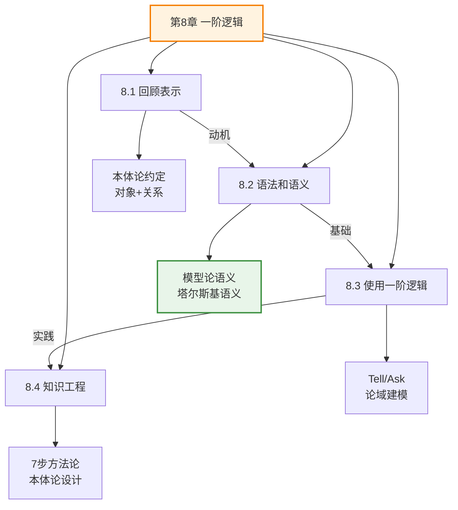
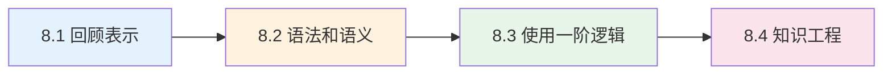
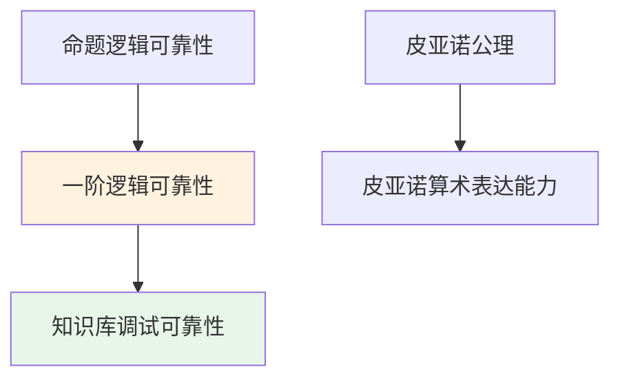

# 第8章 一阶逻辑 - 概览与总结

> 📖 本章 Deep Dive | 预计总学习时间: 210 分钟

---

## 1. 学习目标

完成本章学习后，你将能够：

- [x] 理解一阶逻辑相对于命题逻辑的表达能力优势
- [x] 掌握一阶逻辑的语法（项、原子语句、复合语句、量词）
- [x] 理解一阶逻辑的语义（模型、解释、塔尔斯基真值定义）
- [x] 正确使用量词（∀, ∃）与联结词的搭配
- [x] 在亲属关系、数论、集合、Wumpus世界等论域中应用一阶逻辑
- [x] 掌握知识工程的7步方法论
- [x] 设计领域本体论并构建可验证的知识库

---

## 2. 本章速览

### 2.1 章节结构

```
第8章 一阶逻辑
├── 8.1 回顾表示
│   ├── 8.1.1 思想的语言
│   └── 8.1.2 结合形式语言和自然语言的优点
├── 8.2 一阶逻辑的语法和语义
│   ├── 8.2.1 一阶逻辑模型
│   ├── 8.2.2 符号与解释
│   ├── 8.2.3 项
│   ├── 8.2.4 原子语句
│   ├── 8.2.5 复合语句
│   ├── 8.2.6 量词（全称、存在、嵌套、联系）
│   ├── 8.2.7 等词
│   └── 8.2.8 数据库语义
├── 8.3 使用一阶逻辑
│   ├── 8.3.1 一阶逻辑的断言与查询
│   ├── 8.3.2 亲属关系论域
│   ├── 8.3.3 数、集合与列表
│   └── 8.3.4 Wumpus世界
└── 8.4 一阶逻辑中的知识工程
    ├── 8.4.1 知识工程的过程
    └── 8.4.2 电子电路论域
```

### 2.2 核心概念图谱



---

## 3. 难度预警

### 3.1 概念难度分级

| 小节 | 难度 | 关键挑战 | 建议学习时间 |
|------|:----:|----------|:------------:|
| 8.1 回顾表示 | ⭐⭐ | 理解本体论约定 | 45分钟 |
| 8.2 语法和语义 | ⭐⭐⭐⭐ | 塔尔斯基语义、量词处理 | 60分钟 |
| 8.3 使用一阶逻辑 | ⭐⭐⭐ | 论域建模、公理设计 | 50分钟 |
| 8.4 知识工程 | ⭐⭐⭐ | 方法论应用、本体论设计 | 55分钟 |

### 3.2 常见难点

1. **量词与联结词的搭配**: ∀与⇒搭配，∃与∧搭配（容易混淆）
2. **扩展解释**: 理解量词语义需要掌握变量赋值的技术
3. **模型构造**: 验证语句需要构造或想象模型
4. **本体论设计**: 选择谓词vs函数、对象vs属性需要经验

---

## 4. 前置知识

### 4.1 必备知识

| 知识项 | 来源 | 重要性 | 关键概念 |
|--------|------|:------:|----------|
| 命题逻辑 | 第7章 | ⭐⭐⭐⭐⭐ | 模型、满足、真值表 |
| 集合论基础 | 数学基础 | ⭐⭐⭐⭐ | 集合、关系、函数 |
| 递归定义 | 数学基础 | ⭐⭐⭐ | 归纳定义 |

### 4.2 有帮助的知识

- Wumpus世界规则（第7章）
- 皮亚诺算术基础
- 软件工程方法论

---

## 5. 节依赖图



**依赖说明**:
- 8.1节提供学习动机和概念背景
- 8.2节是理论基础，必须掌握
- 8.3节是应用实践，依赖8.2节
- 8.4节是工程方法论，依赖前面所有节

---

## 6. 定理清单

| 定理 | 内容 | 重要性 | 位置 |
|------|------|:------:|:----:|
| 定理8.1.1 | 一阶逻辑表达能力的完备性 | ⭐⭐⭐⭐ | 8.1 |
| 定理8.2.1 | 一阶逻辑的可靠性 | ⭐⭐⭐⭐⭐ | 8.2 |
| 定理8.3.1 | 皮亚诺算术的表达能力 | ⭐⭐⭐⭐ | 8.3 |
| 定理8.4.1 | 知识库调试的可靠性 | ⭐⭐⭐ | 8.4 |

---

## 7. 核心逻辑线索

### 7.1 本章主线

```
动机（为什么需要一阶逻辑）
    ↓
理论（一阶逻辑是什么）
    ↓
应用（如何使用一阶逻辑）
    ↓
工程（如何系统化构建知识库）
```

### 7.2 关键问题链

1. **为什么需要一阶逻辑？**
   - 命题逻辑无法简洁表达通用规律
   - 一阶逻辑引入对象、关系、量词

2. **一阶逻辑如何工作？**
   - 语法：项、原子语句、复合语句、量词
   - 语义：模型、解释、塔尔斯基递归定义

3. **如何使用一阶逻辑？**
   - Tell/Ask接口
   - 论域建模：亲属、数、集合、Wumpus

4. **如何系统化构建知识库？**
   - 7步知识工程方法论
   - 本体论设计、知识获取、验证调试

---

## 8. 核心要点速查

### 8.1 关键公式

| 公式 | 含义 | 应用场景 |
|------|------|----------|
| $\forall x (P(x) \Rightarrow Q(x))$ | 所有P都是Q | 通用规则 |
| $\exists x (P(x) \land Q(x))$ | 存在P是Q | 存在性断言 |
| $\mathcal{M} = (D, \mathcal{I})$ | 模型定义 | 语义分析 |
| $\mathcal{I}[x/d]$ | 扩展解释 | 量词语义 |
| Tell(KB, φ) | 添加知识 | 知识库操作 |
| Ask(KB, φ) | 查询知识 | 知识库操作 |

### 8.2 关键概念

| 概念 | 定义 | 重要性 |
|------|------|:------:|
| 本体论约定 | 逻辑对存在实体的假设 | ⭐⭐⭐⭐⭐ |
| 组合性 | 整体意义是部分意义的函数 | ⭐⭐⭐⭐ |
| 陈述性 | 知识与推理分离 | ⭐⭐⭐⭐ |
| 量词 | ∀（全称）、∃（存在） | ⭐⭐⭐⭐⭐ |
| 等词 | 同一性谓词 = | ⭐⭐⭐⭐ |
| 知识库 | 语句集合 | ⭐⭐⭐⭐⭐ |
| 本体论 | 概念化的形式化规范 | ⭐⭐⭐⭐⭐ |

---

## 9. 概念对比表

### 9.1 命题逻辑 vs 一阶逻辑

| 特性 | 命题逻辑 | 一阶逻辑 |
|------|----------|----------|
| 本体论约定 | 事实 | 事实+对象+关系 |
| 原子成分 | 命题符号 | 谓词符号+项 |
| 表达能力 | 有限 | 可表达所有可计算关系 |
| 通用规则 | 无法表达 | ∀x(P(x)⇒Q(x)) |
| 模型复杂度 | 真值赋值 | 域+解释 |
| 可判定性 | 可判定 | 半可判定 |

### 9.2 数据库语义 vs 标准语义

| 特性 | 标准语义 | 数据库语义 |
|------|----------|------------|
| 唯一名称假设 | 否 | 是 |
| 封闭世界假设 | 否 | 是 |
| 域闭包 | 否 | 是 |
| 模型数量 | 无限 | 有限 |
| 推理复杂度 | 高 | 低 |
| 适用场景 | 开放领域 | 封闭、确定领域 |

### 9.3 谓词 vs 函数

| 特性 | 谓词 | 函数 |
|------|------|------|
| 返回值 | 真/假 | 域元素 |
| 示例 | Brother(x,y) | Father(x) |
| 灵活性 | 高（可多对多） | 低（必须单值） |
| 适用场景 | 关系、属性 | 确定性映射 |

---

## 10. 定理依赖图



---

## 11. 常见误解澄清

| 误解 | 澄清 |
|------|------|
| 一阶逻辑比命题逻辑"更正确" | 两者都是严格的逻辑系统，只是表达能力不同 |
| ∀x(P(x)∧Q(x)) 表示"所有P都是Q" | 正确形式是 ∀x(P(x)⇒Q(x)) |
| ∃x(P(x)⇒Q(x)) 表示"存在P是Q" | 正确形式是 ∃x(P(x)∧Q(x)) |
| 复合项是函数调用 | 复合项是复杂的名字，不是计算过程 |
| 知识库必须包含所有事实 | 知识库只需要足够的公理进行推理 |
| 知识工程是一次性任务 | 知识工程是迭代过程 |

---

## 12. 本章测验

### 12.1 选择题

**Q1**: "所有国王都是人"的正确一阶逻辑表示是？
- A. ∀x(King(x) ∧ Person(x))
- B. ∀x(King(x) ⇒ Person(x))
- C. ∃x(King(x) ∧ Person(x))
- D. ∃x(King(x) ⇒ Person(x))

**答案**: B

**Q2**: 一阶逻辑模型包含哪些组成部分？
- A. 只有域
- B. 域和解释
- C. 只有谓词
- D. 语法和语义

**答案**: B

### 12.2 填空题

**Q3**: 全称量词∀应该与联结词_____搭配使用，存在量词∃应该与联结词_____搭配使用。

**答案**: ⇒（蕴含）、∧（合取）

**Q4**: 知识工程的7步方法论是：确定问题、收集相关知识、_____、对论域的通用知识编码、对问题实例的描述编码、向推断过程提出查询并获得答案、_____。

**答案**: 确定谓词、函数和常量的词汇表、调试并评估知识库

### 12.3 简答题

**Q5**: 解释为什么一阶逻辑比命题逻辑更适合表达Wumpus世界的"相邻方格有微风"规则。

**参考答案**: 
- 命题逻辑需要为每个方格单独写一条规则（共16条）
- 一阶逻辑可以用一条通用规则表达：∀s(Breezy(s)⇔∃r(Adjacent(r,s)∧Pit(r)))
- 一阶逻辑的优势在于量词和变量，可以表达关于对象集合的通用规律

---

## 13. 快速复习卡

### 13.1 核心记忆点

- **本体论约定**: 对象+关系
- **量词搭配**: ∀⇒，∃∧
- **模型结构**: 域+解释
- **知识工程7步**: 问收词编码查调

### 13.2 公式速记

```
∀x(P(x)⇒Q(x)) : 所有P都是Q
∃x(P(x)∧Q(x)) : 存在P是Q
M = (D, I)    : 模型=域+解释
I[x/d]        : 扩展解释
```

---

## 14. 扩展阅读

### 14.1 理论深化

- "Introduction to Logic" (Enderton): 一阶逻辑的经典教材
- "Model Theory" (Chang & Keisler): 模型论的权威参考书
- "Knowledge Representation and Reasoning" (Brachman & Levesque)

### 14.2 应用拓展

- Prolog编程语言实践
- OWL本体设计指南
- 知识图谱构建方法

### 14.3 相关章节

- 第7章：命题逻辑基础
- 第9章：一阶逻辑推理
- 第10章：知识表示进阶

---

## 15. 总结与反思

### 15.1 本章核心收获

1. **理论层面**: 理解了一阶逻辑的语法和语义，掌握了塔尔斯基真值定义
2. **方法层面**: 学会了在不同论域中应用一阶逻辑进行知识表示
3. **工程层面**: 掌握了系统化的知识工程方法论

### 15.2 后续学习建议

- 完成本章所有习题
- 尝试为一个新领域（如你熟悉的学科）设计本体论
- 阅读第9章，了解一阶逻辑的推理算法

---

> 📚 **本章小节**:
> - [8.1 回顾表示](8.1_回顾表示.md)
> - [8.2 一阶逻辑的语法和语义](8.2_一阶逻辑的语法和语义.md)
> - [8.3 使用一阶逻辑](8.3_使用一阶逻辑.md)
> - [8.4 一阶逻辑中的知识工程](8.4_一阶逻辑中的知识工程.md)
