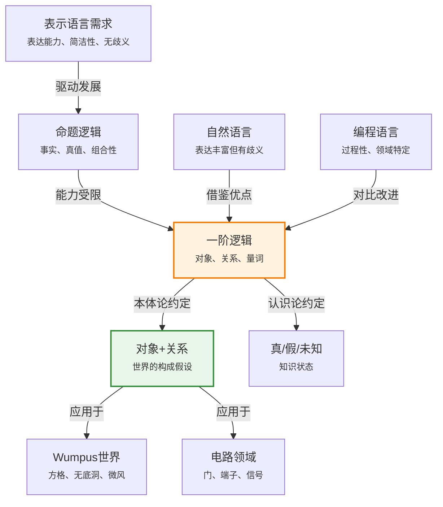
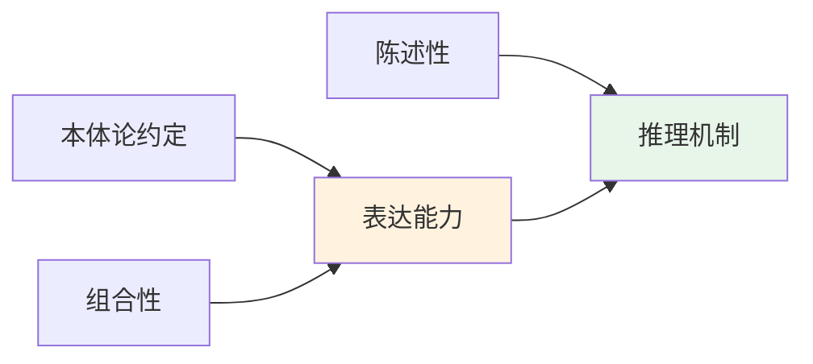

# 8.1 回顾表示

> 📖 本节 Deep Dive | 预计学习时间: 45 分钟

---

## 1. 背景与动机

### 1.1 历史背景

**学科演进脉络**

知识表示是人工智能的核心支柱之一。从20世纪50年代AI诞生之初，研究者就面临一个根本问题：如何让计算机理解和推理关于世界的知识？早期的尝试包括语义网络（Semantic Networks，1960年代由Quillian提出）和框架系统（Frames，Minsky, 1975），但这些表示方法缺乏严格的语义基础。

命题逻辑（Propositional Logic）作为最早被应用于AI的形式化工具，提供了严格的语义和完备的推理机制。然而，研究者很快发现命题逻辑的表达能力存在根本性局限——它无法简洁地表达关于对象及其关系的通用规律。

一阶逻辑（First-Order Logic，FOL）的发展可以追溯到19世纪末：
- **1879年**：戈特洛布·弗雷格（Gottlob Frege）发表《概念文字》（Begriffsschrift），奠定了一阶逻辑的基础
- **1889年**：朱塞佩·皮亚诺（Giuseppe Peano）建立了现代一阶逻辑的符号体系
- **1958年**：约翰·麦卡锡（John McCarthy）将一阶逻辑引入AI领域，用于构建通用问题求解系统

**里程碑事件**:

| 年份 | 人物/事件 | 贡献 | 影响 |
|------|-----------|------|------|
| 1956 | 达特茅斯会议 | AI作为独立学科诞生 | 确立了符号主义AI的研究方向 |
| 1958 | McCarthy | 提出Advice Taker，使用一阶逻辑表示知识 | 开创逻辑主义AI学派 |
| 1965 | Robinson | 提出归结原理（Resolution） | 实现了一阶逻辑的自动定理证明 |
| 1972 | Kowalski & Colmerauer | 开发Prolog语言 | 逻辑编程范式的诞生 |

**演进动机**:
- 早期方法：命题逻辑能够表达事实和进行推理，但每个具体事实都需要独立的命题符号
- 局限性：无法表达"所有国王都是人"这样的通用规则，必须为每个国王写一条规则
- 突破：一阶逻辑引入量词（∀, ∃）、变量和谓词，能够简洁表达关于对象集合的通用规律

### 1.2 研究动机

**为什么研究者关注表示语言的设计？**

1. **理论意义**: 表示语言决定了知识库能够表达什么、能够推理什么。一阶逻辑提供了可计算性和表达能力之间的最佳平衡点——它是半可判定的（semi-decidable），即存在算法能够证明所有有效公式（尽管可能在无效公式上不停机）。

2. **方法创新**: 陈述性（declarative）vs 过程性（procedural）知识表示的分离。一阶逻辑实现了知识与推理的解耦：知识库只包含"是什么"，推理引擎处理"怎么做"。

3. **问题解决**: 能够处理部分信息（使用析取和否定）、支持通用规则（使用量词）、表达对象间关系（使用谓词）。

**与其他领域的关系**:
- **语言学**: 自然语言语义学使用一阶逻辑作为意义表示的形式工具（Montague语法）
- **数据库**: 关系数据库理论基于一阶逻辑，SQL本质上是一种受限的一阶逻辑
- **知识图谱**: 现代知识表示（如RDF、OWL）是一阶逻辑的受限形式或扩展

### 1.3 实际应用场景

| 应用领域 | 具体问题 | 本节理论的作用 | 预期效果 |
|----------|----------|----------------|----------|
| 专家系统 | 医学诊断规则表示 | 用谓词表示症状和疾病关系 | 可维护的规则库，支持自动推理 |
| 语义Web | 网页内容机器理解 | RDF/OWL基于一阶逻辑 | 实现跨域知识整合 |
| 自然语言理解 | 句子的语义表示 | 将自然语言映射到逻辑形式 | 支持问答和推理 |
| 形式化验证 | 软硬件系统正确性证明 | 用逻辑公式描述系统规范 | 自动发现设计缺陷 |
| 智能规划 | 动作效果推理 | 用逻辑描述世界状态和动作 | 生成有效行动计划 |

**典型案例预览**:
> 学完本节，你将理解为什么"与无底洞相邻的方格有微风"在一阶逻辑中可以简洁表达为 ∀s∀r(Adjacent(r,s)∧Pit(r))⇒Breezy(s)，而在命题逻辑中需要为每个方格单独写一条规则。

### 1.4 先决条件

**学习本节需要的前置知识**:

| 知识项 | 来源 | 掌握程度要求 | 关键概念 |
|--------|------|:------------:|----------|
| 命题逻辑 | 第7章 | 必须熟练掌握 | 真值表、蕴含、等价、CNF |
| 集合论基础 | 数学基础 | 理解即可 | 集合、关系、函数 |
| 形式语言概念 | 本节之前 | 了解 | 语法、语义、模型 |

**前置检查清单**:
- [ ] 能够构造任意命题公式的真值表
- [ ] 理解逻辑蕴含（⇒）的真值表定义
- [ ] 知道合取范式（CNF）的概念
- [ ] 理解模型（model）在逻辑中的含义

---

## 2. 知识逻辑图谱

### 2.1 概念关系图



### 2.2 知识发展依赖链

```
【基础层】           【发展层】              【高潮层】             【应用层】
    ↓                   ↓                     ↓                   ↓
┌─────────┐      ┌─────────────┐       ┌───────────┐      ┌──────────┐
│ 命题逻辑 │ ──→  │ 对象与关系   │  ──→  │ 一阶逻辑  │ ──→  │ 知识工程  │
│         │      │             │       │ 表示语言  │      │          │
│ 事实、  │      │ 常量、谓词、 │       │ 量词、    │      │ 领域建模、│
│ 真值    │      │ 函数        │       │ 变量      │      │ 本体设计  │
└─────────┘      └─────────────┘       └───────────┘      └──────────┘
     │                   │                   │                │
     └───────────────────┴───────────────────┴────────────────┘
                         知识演进脉络
```

**依赖链详解**:
1. **基础**: 命题逻辑提供了陈述性语义和组合性原理的基础
2. **发展**: 引入对象（常量）、关系（谓词）和函数，扩展表达能力
3. **高潮**: 量词（∀, ∃）和变量使得表达通用规律成为可能
4. **应用**: 知识工程方法论指导如何在实际领域应用一阶逻辑

### 2.3 本节在章节中的位置

```
第 8 章: 一阶逻辑
├── 8.1 回顾表示 ← ⭐ 当前位置
│   ├── [核心概念: 表示语言特性、本体论约定]
│   ├── [核心思想: 对象+关系的结构化表示]
│   └── [对比: 命题逻辑 vs 一阶逻辑]
│
├── 8.2 一阶逻辑的语法和语义 ← 后续发展
│   └── [将本节概念形式化：模型、解释、量词语义]
│
├── 8.3 使用一阶逻辑 ← 实践应用
│   └── [将理论应用于具体领域]
│
└── 8.4 知识工程 ← 工程方法论
    └── [系统化的知识库构建方法]
```

**衔接说明**:
- **本节输出**: 理解为什么需要一阶逻辑、它与命题逻辑的区别、表示语言的核心特性
- **为后一节铺垫**: 8.2节将严格定义一阶逻辑的语法和语义，形式化本节介绍的概念

---

## 3. 核心概念与数学分析

### 3.1 核心术语定义

**定义 8.1.1** (表示语言 / Representation Language):

> **正式定义**: 表示语言是一个形式系统 $\mathcal{L} = (\mathcal{S}, \mathcal{M}, \Vdash)$，其中 $\mathcal{S}$ 是语法结构集合，$\mathcal{M}$ 是模型（可能世界）集合，$\Vdash \subseteq \mathcal{M} \times \mathcal{S}$ 是满足关系。

**定义详解**:
- **直观解释**: 表示语言是一种形式化的"语言"，用于精确描述世界的状态。它告诉我们什么句子是合法的（语法），以及这些句子在什么情况下为真（语义）。
- **数学表述**: 对于模型 $m \in \mathcal{M}$ 和语句 $\phi \in \mathcal{S}$，$m \Vdash \phi$ 表示"在模型 $m$ 中语句 $\phi$ 为真"。
- **为什么这样定义**: 这种定义将语法（句子长什么样）和语义（句子什么意思）分离，使得我们可以独立研究表示的形式和含义。

**定义中的关键要素**:
| 要素 | 符号 | 含义 | 约束条件 |
|------|------|------|----------|
| 语法 | $\mathcal{S}$ | 合法语句的集合 | 由文法规则生成 |
| 模型 | $\mathcal{M}$ | 可能世界的形式化 | 每个模型代表一种世界状态 |
| 满足关系 | $\Vdash$ | 真值赋值关系 | 连接语法和语义 |

---

**定义 8.1.2** (本体论约定 / Ontological Commitment):

> **正式定义**: 一个逻辑系统的本体论约定是指该逻辑假设存在的实体类型集合，以及这些实体如何构成世界的形式化假设。

**定义详解**:
- **直观解释**: 本体论约定回答了"我们认为世界上存在什么东西？"这个问题。不同的逻辑系统对世界"由什么构成"有不同的假设。
- **数学表述**: 一阶逻辑的本体论约定可以表示为二元组 $\mathcal{O} = (\mathcal{D}, \mathcal{R})$，其中 $\mathcal{D}$ 是对象域（domain），$\mathcal{R}$ 是关系集合。

**不同逻辑的本体论约定对比**:

| 逻辑系统 | 本体论约定 | 存在什么 | 数学结构 |
|----------|-----------|----------|----------|
| 命题逻辑 | 事实 | 真/假的事实 | 真值赋值函数 $v: \mathcal{P} \to \{T, F\}$ |
| 一阶逻辑 | 事实+对象+关系 | 具有关系的对象 | 结构 $\mathcal{M} = (D, I)$ |
| 时态逻辑 | FOL+时间 | 时序关系 | 时间索引的结构 |
| 概率论 | 事实 | 随机事件 | 概率空间 $(\Omega, \mathcal{F}, P)$ |

**示例**: 在Wumpus世界中：
- 命题逻辑：每个方格是否有无底洞、是否有微风都是独立的事实
- 一阶逻辑：存在"方格"对象，存在"相邻"关系，可以用通用规则表达"相邻方格有微风"

---

**定义 8.1.3** (组合性 / Compositionality):

> **正式定义**: 一个语义是组合式的，如果复合表达式的意义是其组成部分意义的函数。形式化地，对于由子表达式 $e_1, ..., e_n$ 构成的表达式 $e = f(e_1, ..., e_n)$，其意义 $[[e]] = F([[e_1]], ..., [[e_n]])$，其中 $F$ 是仅依赖于 $f$ 的函数。

**定义详解**:
- **直观解释**: 句子的意思可以从它的构成部分的意思"计算"出来。知道"约翰"和"国王"的意思，就能知道"约翰是国王"的意思。
- **为什么重要**: 组合性使得我们能够理解从未见过的句子（只要知道构成部分的含义），这是自然语言和形式逻辑的共同特性。

**反例**: 如果自然语言没有组合性，那么"约翰是国王"可能完全不能从"约翰"和"国王"的含义推导出来，每个句子都需要单独学习其含义。

---

**定义 8.1.4** (陈述性 / Declarative):

> **正式定义**: 知识表示是陈述性的，当且仅当知识（"是什么"）与用于推理该知识的控制策略（"怎么做"）相分离。

**定义详解**:
- **直观解释**: 你只需要告诉系统"事实是什么"，而不需要告诉它"如何从这些事实得出结论"。
- **对比**: 编程语言通常是过程性的——你必须明确写出计算步骤。

**示例对比**:
```
陈述性（一阶逻辑）:
  ∀x King(x) ⇒ Person(x)
  King(John)
  ────────────────
  自动推导出: Person(John)

过程性（Python）:
  def is_person(x):
      if is_king(x):
          return True
      # 需要显式编写推理规则
```

### 3.2 符号系统与约定

**本节符号总表**:

| 符号 | 含义 | 数学表达 | 备注 |
|:----:|------|----------|------|
| $\mathcal{L}$ | 逻辑语言 | $(\mathcal{S}, \mathcal{M}, \Vdash)$ | 三元组形式 |
| $\mathcal{M}$ | 模型集合 | - | 可能世界的形式化 |
| $\Vdash$ | 满足关系 | $m \Vdash \phi$ | "在m中φ为真" |
| $\mathcal{D}$ | 对象域 | 非空集合 | 一阶逻辑的核心 |
| $\mathcal{R}$ | 关系集合 | $\{R_i\}$ | n元关系 |
| $\forall$ | 全称量词 | $\forall x P(x)$ | "对所有x，P(x)" |
| $\exists$ | 存在量词 | $\exists x P(x)$ | "存在x使得P(x)" |

### 3.3 关键公式与性质

#### 公式 1: 表示语言的表达能力对比

**数学表述**:
$$\text{Expressiveness}(\mathcal{L}_1) \leq \text{Expressiveness}(\mathcal{L}_2) \iff \forall \phi_1 \in \mathcal{L}_1, \exists \phi_2 \in \mathcal{L}_2: \text{Models}(\phi_1) = \text{Models}(\phi_2)$$

**公式要素解析**:

| 维度 | 内容 |
|------|------|
| **直观解释** | 语言$\mathcal{L}_2$至少和$\mathcal{L}_1$一样有表达能力，如果$\mathcal{L}_1$能表达的每个概念$\mathcal{L}_2$都能表达。 |
| **几何意义** | 在模型空间中，$\mathcal{L}_2$能够刻画（区分）的模型集合包含$\mathcal{L}_1$能够刻画的集合。 |
| **领域背景** | 这是比较不同逻辑系统表达能力的形式化方法，由模型论提供。 |

**命题逻辑与一阶逻辑的关系**:
$$\text{Expressiveness(命题逻辑)} < \text{Expressiveness(一阶逻辑)}$$

这是因为一阶逻辑可以表达关于对象集合的通用规律，而命题逻辑只能表达具体事实。

---

#### 公式 2: 结构化表示的简洁性

**数学表述**:
设领域中有 $n$ 个对象，需要表达的关系涉及 $k$ 个对象。

命题逻辑需要的语句数：$O(n^k)$（每个具体实例一条语句）

一阶逻辑需要的语句数：$O(1)$（一条通用规则）

**公式要素解析**:

| 维度 | 内容 |
|------|------|
| **直观解释** | 对于涉及多个对象关系的通用规律，一阶逻辑可以用常数条语句表达，而命题逻辑需要与对象数量相关的语句数。 |
| **具体例子** | Wumpus世界中"相邻方格有微风"：命题逻辑需要16条规则（4×4方格），一阶逻辑只需1条规则。 |
| **领域背景** | 这是从因子化表示（propositional）到结构化表示（first-order）的核心优势。 |

**Wumpus世界对比**:

命题逻辑（需要为每个方格写规则）:
```
B[1,1] ⇔ (P[1,2] ∨ P[2,1])
B[1,2] ⇔ (P[1,1] ∨ P[1,3] ∨ P[2,2])
... (共16条)
```

一阶逻辑（一条通用规则）:
$$\forall s \text{ Breezy}(s) \Leftrightarrow \exists r \text{ Adjacent}(r, s) \land \text{Pit}(r)$$

---

### 3.4 重要性质与推论

**性质 8.1.1** (组合性蕴含可扩展性):

> **陈述**: 如果语言具有组合性语义，则理解新句子的能力可以从理解其组成部分推导出来。

**证明概要**: 由组合性定义，$[[e]] = F([[e_1]], ..., [[e_n]])$。如果已知所有 $[[e_i]]$，则可以直接计算 $[[e]]$。

**直观理解**: 这就是为什么我们能够理解从未听过的句子——只要知道词的意思和语法规则。

**应用提示**: 设计知识表示语言时，保持组合性可以降低学习成本。

---

**性质 8.1.2** (陈述性表示的推理独立性):

> **陈述**: 在陈述性表示中，添加新知识不会修改已有的推理规则。

**直观理解**: 知识库可以增量增长，推理引擎保持不变。这与过程性表示形成对比——在过程性表示中，添加新事实可能需要修改处理程序。

**重要性**: 这是知识库系统可维护性和可扩展性的基础。

---

## 4. 定理与证明

### 4.1 定理陈述

**定理 8.1.1** (一阶逻辑表达能力的完备性 / Expressive Completeness):

> **正式陈述**: 对于任何可计算的关系 $R \subseteq \mathbb{N}^k$，存在一阶逻辑公式 $\phi_R(x_1, ..., x_k)$ 在标准算术模型中定义 $R$，即 $(n_1, ..., n_k) \in R \iff \mathbb{N} \Vdash \phi_R(n_1, ..., n_k)$。

**定理解读**:
- **条件（前提）**:
  1. **条件 1**: 关系 $R$ 必须是可计算的（递归可枚举）
  2. **条件 2**: 考虑标准算术模型（皮亚诺算术）
  3. **条件 3**: 允许使用等词和算术运算符号

- **结论**: 一阶逻辑可以表达所有可计算关系

- **定理意义**: 这表明一阶逻辑在可计算性意义上是"完备"的——它能表达任何算法能处理的关系。

**定理的适用范围**: 在标准算术模型中成立。对于有限域，表达能力更强；对于某些非标准模型，可能不成立。

**历史背景**: 这是哥德尔（Gödel）和图灵（Turing）工作的推论，建立了逻辑与可计算性的深刻联系。

### 4.2 证明详解

**证明策略概览**:

这个定理的证明依赖于丘奇-图灵论题（Church-Turing thesis）和哥德尔编码技术。核心思路是：
1. 任何可计算关系都可以被图灵机判定
2. 图灵机的配置和转移可以用一阶逻辑公式编码
3. 因此，可计算关系可以用一阶逻辑定义

**核心思路**: 构造性证明——展示如何将图灵机编码为一阶公式。

**关键步骤预览**:
1. 图灵机配置的编码
2. 转移关系的逻辑表示
3. 接受条件的公式化

---

**正式证明**:

**步骤 1**: 图灵机配置的编码

图灵机 $M$ 的配置可以表示为三元组 $(q, i, tape)$，其中：
- $q$ 是当前状态
- $i$ 是读写头位置
- $tape$ 是磁带内容

使用哥德尔编码，可以将配置编码为单个自然数 $c$。

**步骤 2**: 转移关系的逻辑表示

定义谓词 $T(c_1, c_2)$ 表示"从配置 $c_1$ 可以一步转移到配置 $c_2$"。

这个关系可以用一阶逻辑公式表达：

$$T(c_1, c_2) := \exists q, i, s, q', s', d \left( \begin{array}{l}
\text{State}(c_1, q) \land \text{Head}(c_1, i) \land \text{Read}(c_1, i, s) \land \\
\delta(q, s) = (q', s', d) \land \\
\text{State}(c_2, q') \land \text{Write}(c_2, i, s') \land \text{Move}(c_2, i, d)
\end{array} \right)$$

其中 $\delta$ 是转移函数。

> 💡 **技术注释**: 这里的关键是使用等词和算术运算来解码哥德尔编码。每个谓词（State, Head, Read等）都可以通过算术运算定义。

> 📝 **细节说明**: 实际构造中，需要使用皮亚诺算术的公理来确保编码和解码的正确性。

---

**步骤 3**: 接受条件的公式化

关系 $R$ 被 $M$ 判定，意味着：
$$(n_1, ..., n_k) \in R \iff M \text{ 在输入 } (n_1, ..., n_k) \text{ 上接受}$$

接受条件可以表示为：

$$\phi_R(x_1, ..., x_k) := \exists c_0, c_1, ..., c_m \left( \begin{array}{l}
\text{Initial}(c_0, x_1, ..., x_k) \land \\
T(c_0, c_1) \land T(c_1, c_2) \land ... \land T(c_{m-1}, c_m) \land \\
\text{Accepting}(c_m)
\end{array} \right)$$

**步骤 4**: 处理计算长度未知的情况

上述公式假设知道计算长度 $m$。为了处理任意长度的计算，使用Kleene的T-谓词技术：

$$\phi_R(x_1, ..., x_k) := \exists c \left( \text{Initial}(c, x_1, ..., x_k) \land \text{Halting}(c) \land \text{Accepting}(c) \right)$$

其中 $\text{Halting}(c)$ 表示 $c$ 是一个停机配置的编码。

因此，定理得证。

$$\blacksquare \text{ (证毕)}$$

### 4.3 证明分析与提炼

**核心洞见**: 一阶逻辑的表达能力与图灵机等价——它能表达任何可计算关系。这建立了逻辑与计算之间的深刻联系：逻辑不仅是推理工具，也是计算模型。

**证明技巧总结**:

| 技巧 | 在本证明中的应用 | 可迁移性 | 其他应用场景 |
|------|------------------|----------|--------------|
| 哥德尔编码 | 将配置编码为数字 | ⭐⭐⭐⭐⭐ | 不可判定性证明、元数学 |
| 关系代数化 | 用逻辑公式定义计算步骤 | ⭐⭐⭐⭐ | 程序验证、形式化语义 |
| 存在量化 | 表达"存在计算路径" | ⭐⭐⭐⭐⭐ | 可达性分析、模型检测 |

**证明中的关键难点**: 处理计算长度未知的情况。解决方案是使用存在量词来"猜测"正确的计算路径，这是非确定性计算的逻辑对应。

**如果修改条件**: 如果不允许使用等词或算术，表达能力会显著下降。例如，纯一阶逻辑（无等词、无函数符号）不能表达"恰好有两个对象满足P"。

### 4.4 定理间的联系

**与本节其他概念的关系**:



**在全书中的地位**: 这一定理为第9章（一阶逻辑推理）和第10章（知识表示）奠定了理论基础——既然一阶逻辑能表达所有可计算关系，那么研究其推理机制就有普遍意义。

---

## 5. 具体示例与详解

### 5.1 典型数值示例

**示例 8.1.1**: 表示语言的表达能力对比——Wumpus世界的微风规则

**📋 问题陈述**:

考虑一个4×4的Wumpus世界（16个方格）。需要表达规则："与无底洞相邻的方格有微风"。

**已知**:
- 世界大小：4×4 = 16个方格
- 相邻关系：上下左右（边界方格邻居较少）
- 谓词：Pit(s)表示方格s有无底洞，Breezy(s)表示方格s有微风

**求解**: 比较命题逻辑和一阶逻辑表示该规则的方式。

---

**🔍 解答过程**:

**步骤 1: 命题逻辑表示**

对于每个方格 $[i,j]$，需要写出具体的规则：

$$\begin{aligned}
B_{1,1} &\Leftrightarrow (P_{1,2} \lor P_{2,1}) \\
B_{1,2} &\Leftrightarrow (P_{1,1} \lor P_{1,3} \lor P_{2,2}) \\
B_{1,3} &\Leftrightarrow (P_{1,2} \lor P_{1,4} \lor P_{2,3}) \\
&\vdots \\
B_{4,4} &\Leftrightarrow (P_{4,3} \lor P_{3,4})
\end{aligned}$$

总计：16条规则（每个方格一条）

**步骤 2: 一阶逻辑表示**

使用对象（方格）和关系（相邻）：

$$\forall s \text{ Breezy}(s) \Leftrightarrow \exists r \text{ Adjacent}(r, s) \land \text{Pit}(r)$$

同时定义相邻关系：

$$\begin{aligned}
\forall x,y,a,b \ &\text{Adjacent}([x,y], [a,b]) \Leftrightarrow \\
&((x = a) \land (y = b-1 \lor y = b+1)) \lor \\
&((y = b) \land (x = a-1 \lor x = a+1))
\end{aligned}$$

总计：2条规则（一条定义微风，一条定义相邻）

**步骤 3: 结果解释**

| 表示方式 | 规则数量 | 世界大小为n×n时的规则数 | 可维护性 |
|----------|----------|------------------------|----------|
| 命题逻辑 | 16 | $n^2$ | 差（每个方格单独修改） |
| 一阶逻辑 | 2 | 2（常数） | 好（修改通用规则即可） |

---

**✅ 验证与检验**:

**正确性检查**:
- [x] 结果满足所有给定条件
- [x] 命题逻辑规则覆盖所有方格
- [x] 一阶逻辑规则正确表达语义

**数值验证**:
```
方格[2,2]的邻居: [1,2], [2,1], [2,3], [3,2]
命题逻辑: B[2,2] ⇔ (P[1,2] ∨ P[2,1] ∨ P[2,3] ∨ P[3,2]) ✓
一阶逻辑: ∀s Breezy(s) ⇔ ∃r Adjacent(r,s) ∧ Pit(r)
         对s=[2,2]实例化后等价 ✓
```

**结果的意义**: 一阶逻辑的表达能力使得知识库可以紧凑地表示通用规律，大大提高了可维护性和可扩展性。

---

### 5.2 概念辨析示例

**示例 8.1.2**: 本体论约定的实际影响——模糊概念的处理

**场景**: 考虑概念"大城市"。维也纳是大城市吗？

**分析**:

在标准一阶逻辑中：
- 每个对象要么满足谓词，要么不满足
- BigCity(Vienna) 要么为真，要么为假
- 无法表达"维也纳比较大，但不如纽约大"

在模糊逻辑中：
- BigCity(Vienna) = 0.8（真实度0.8）
- BigCity(Paris) = 0.9
- BigCity(NewYork) = 1.0

**教训**: 
1. 选择表示语言时必须考虑领域的特性
2. 对于边界清晰的概念（如数学、Wumpus世界），一阶逻辑非常合适
3. 对于边界模糊的概念（如"大"、"好吃"），可能需要模糊逻辑或其他扩展

### 5.3 类比与可视化

**直觉类比**:

| 抽象概念 | 日常类比 | 对应关系 |
|----------|----------|----------|
| 命题逻辑 | 逐条列出的清单 | 每件事单独记录，无通用规则 |
| 一阶逻辑 | 带规则的模板 | 用变量和规则概括一类情况 |
| 本体论约定 | 世界观 | 你认为世界由什么构成 |
| 组合性 | 乐高积木 | 从基本块组合出复杂结构 |

**局限性**: 这个类比不能说明一阶逻辑的严格语义和推理机制。

---

## 6. 深入理解与拓展

### 6.1 一句话本质

> 🎯 **核心要点**: 一阶逻辑通过引入对象、关系和量词，实现了从"列举事实"到"陈述规律"的跃迁，在保持严格语义的同时获得了表达通用知识的能力。

### 6.2 深入思考问题

1. **概念层面**: 为什么组合性对表示语言如此重要？如果没有组合性，知识表示会面临什么问题？
   <!-- 思考方向: 考虑可扩展性、学习成本、理解新句子的能力 -->

2. **方法层面**: 陈述性表示 vs 过程性表示的权衡是什么？在什么情况下应该选择过程性表示？
   <!-- 思考方向: 考虑效率、灵活性、可维护性 -->

3. **应用层面**: 萨丕尔-沃尔夫假说（语言影响思维）对AI知识表示有什么启示？
   <!-- 思考方向: 考虑知识库设计对推理能力的影响 -->

4. **拓展层面**: 如果一阶逻辑已经能表达所有可计算关系，为什么我们还需要更高阶的逻辑或模态逻辑？
   <!-- 思考方向: 考虑表达简洁性、推理效率、特定领域的自然性 -->

### 6.3 与其他节的关系

**本节输出**:
- 理解表示语言设计的核心原则（组合性、陈述性、表达能力）
- 掌握本体论约定和认识论约定的概念
- 明确一阶逻辑相对于命题逻辑的优势

**后续发展预告**: 
- 8.2节将严格定义一阶逻辑的语法和语义，形式化本节的概念
- 8.3节将展示如何在具体领域（亲属关系、数、Wumpus世界）应用这些概念
- 8.4节将介绍系统化的知识工程方法论

---

## 7. 总结与反思

### 7.1 关键要点总结

本节必须掌握的 **5** 个核心要点:

1. **表示语言的核心特性**: 组合性、陈述性、上下文无关、无歧义是良好表示语言的基本特征
   
   💡 *记忆技巧*: "组陈上无"——组合、陈述、上下文无关、无歧义

2. **本体论约定**: 一阶逻辑假设世界由具有关系的对象组成，这是其与命题逻辑的根本区别
   
   💡 *记忆技巧*: "对象+关系=一阶"，"只有事实=命题"

3. **表达能力对比**: 一阶逻辑可以用常数条规则表达命题逻辑需要$O(n^k)$条规则才能表达的通用规律
   
   💡 *记忆技巧*: "变量替代枚举，量词概括全体"

4. **陈述性优势**: 知识与推理分离，使得知识库可以增量增长，推理引擎可以独立优化
   
   💡 *记忆技巧*: "说什么"和"怎么做"分开

5. **语言与思维**: 表示语言的选择影响推理效率，甚至影响能够得出的结论（对于资源有限的推理机）
   
   💡 *记忆技巧*: "形式决定内容，语言塑造思维"

### 7.2 本节知识框架

```
┌─────────────────────────────────────────────────────────────┐
│  第8.1节: 回顾表示                                          │
├─────────────────────────────────────────────────────────────┤
│  输入/前置                                                   │
│  • 命题逻辑的基础知识                                        │
│  • 知识表示的需求（表达能力、推理能力）                      │
│                                                             │
│  处理/核心                                                   │
│  • 分析表示语言的特性                                        │
│  • 对比不同逻辑的本体论约定                                  │
│  • 论证一阶逻辑的必要性                                      │
│  ↓                                                          │
│  输出/结果                                                   │
│  • 明确一阶逻辑的核心优势                                    │
│  • 理解对象+关系的表示范式                                   │
│                                                             │
│  应用/价值                                                   │
│  • 指导知识表示语言的选择                                    │
│  • 为后续语法语义学习奠定动机                                │
└─────────────────────────────────────────────────────────────┘
```

### 7.3 常见误解与纠正

| 常见误解 ❌ | 正确理解 ✅ | 为什么容易错 | 如何避免 |
|-------------|-------------|--------------|----------|
| ❌ 一阶逻辑比命题逻辑"更正确" | ✅ 两者都是严格的逻辑系统，只是表达能力不同 | 混淆"表达能力"和"正确性" | 记住：选择取决于问题需求 |
| ❌ 陈述性表示一定比过程性表示好 | ✅ 各有优劣，取决于应用场景 | 教材强调陈述性的优点 | 了解过程性表示在效率上的优势 |
| ❌ 一阶逻辑能表达一切知识 | ✅ 一阶逻辑不能表达模糊知识、时序知识等 | 夸大定理8.1.1的结论 | 理解定理的适用条件（可计算关系） |
| ❌ 组合性只适用于形式语言 | ✅ 自然语言也具有组合性（尽管有例外） | 将形式语言与自然语言对立 | 了解自然语言的组合性假设 |

### 7.4 反思问题

**连接性问题** (与本章其他节):
1. 8.1节讨论的"对象+关系"本体论约定在8.2节中是如何形式化为模型和解释的？
2. 8.3节中的亲属关系论域如何体现了一阶逻辑的优势？

**应用性问题**:
1. 在设计一个医疗诊断专家系统时，你会选择一阶逻辑还是模糊逻辑？为什么？
2. 如果Wumpus世界扩展到三维空间，一阶逻辑表示需要如何修改？

**批判性问题**:
1. 一阶逻辑的半可判定性对实际应用有什么影响？
2. 在什么情况下，使用数据库语义（8.2.8节）比标准语义更合适？

### 7.5 学习检查清单

- [ ] 能够复述组合性、陈述性的定义
- [ ] 能够对比命题逻辑和一阶逻辑的本体论约定
- [ ] 能够举例说明一阶逻辑的表达能力优势
- [ ] 能够解释为什么"所有国王都是人"应该表示为 ∀x(King(x)⇒Person(x)) 而非 ∀x(King(x)∧Person(x))
- [ ] 知道萨丕尔-沃尔夫假说的核心观点
- [ ] 了解模糊逻辑与概率论的区别

---

## 附录

### A. 公式速查表

| 公式 | 名称 | 使用条件 | 备注 |
|:----:|------|----------|------|
| $\mathcal{L} = (\mathcal{S}, \mathcal{M}, \Vdash)$ | 逻辑语言定义 | 形式化语义 | 语法+语义+满足关系 |
| $\forall x P(x) \Rightarrow Q(x)$ | 全称蕴含 | 表达通用规则 | 注意使用⇒而非∧ |
| $\exists x P(x) \land Q(x)$ | 存在合取 | 表达存在特定对象 | 注意使用∧而非⇒ |

### B. 术语索引

| 术语 | 英文 | 定义 | 位置 |
|------|------|------|:----:|
| 表示语言 | Representation Language | 用于描述世界的形式系统 | 8.1 |
| 本体论约定 | Ontological Commitment | 逻辑对存在实体的假设 | 8.1 |
| 认识论约定 | Epistemological Commitment | 逻辑允许的知识状态 | 8.1 |
| 组合性 | Compositionality | 整体意义是部分意义的函数 | 8.1 |
| 陈述性 | Declarative | 知识与推理分离 | 8.1 |

### C. 延伸阅读

**理论深化**:
- 《逻辑哲学论》（维特根斯坦）: 关于语言与世界关系的经典著作
- "The Language of Thought" (Fodor, 1975): 心理表征的语言假设

**应用拓展**:
- OWL Web本体语言规范: W3C推荐的一阶逻辑受限形式
- Description Logics Handbook: 一阶逻辑在知识表示中的实用子集

---

> 📌 **下一节**: [8.2 一阶逻辑的语法和语义](8.2_一阶逻辑的语法和语义.md)
> 
> 📚 **返回概览**: [第8章概览](00_概览.md)
