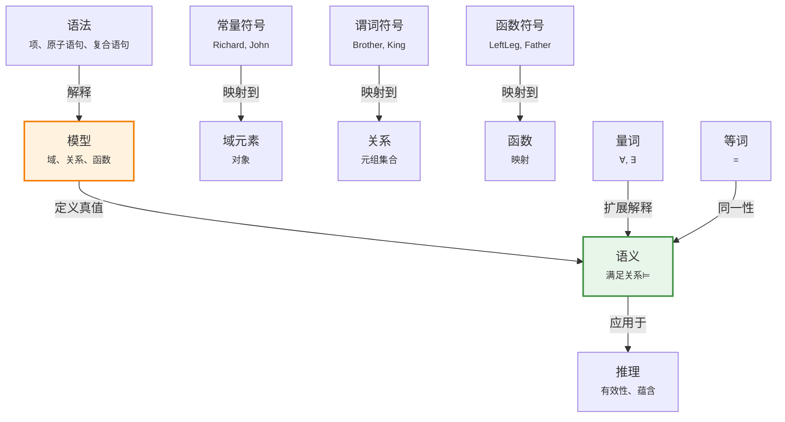
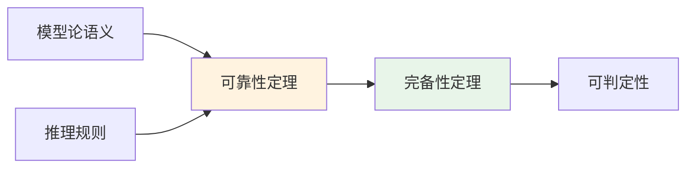

# 8.2 一阶逻辑的语法和语义

> 📖 本节 Deep Dive | 预计学习时间: 60 分钟

---

## 1. 背景与动机

### 1.1 历史背景

**学科演进脉络**

一阶逻辑的严格数学基础是在19世纪末到20世纪初建立的。这一时期被称为"数理逻辑的奠基期"，多位数学家和逻辑学家做出了开创性贡献。

- **1879年**：戈特洛布·弗雷格（Gottlob Frege）发表《概念文字》（Begriffsschrift），首次提出完整的谓词逻辑系统，包括量词、变量和嵌套函数
- **1889年**：朱塞佩·皮亚诺（Giuseppe Peano）建立了现代逻辑符号体系，包括∀（全称量词）和∃（存在量词）
- **1915年**：利奥波德·勒文海姆（Leopold Löwenheim）系统论述了一阶逻辑的模型论，包括等词符号的处理
- **1920年**：陶拉尔夫·斯科伦（Thoralf Skolem）发展了勒文海姆的结果，提出了著名的Löwenheim-Skolem定理
- **1935年**：艾尔弗雷德·塔尔斯基（Alfred Tarski）用集合论给出了一阶逻辑中真值和满足的形式化定义

**里程碑事件**:

| 年份 | 人物/事件 | 贡献 | 影响 |
|------|-----------|------|------|
| 1879 | 弗雷格 | 《概念文字》：完整的谓词逻辑 | 现代逻辑的起点 |
| 1889 | 皮亚诺 | 现代逻辑符号体系 | 符号标准化 |
| 1915 | 勒文海姆 | 一阶逻辑模型论 | 模型论的奠基 |
| 1935 | 塔尔斯基 | 真值的形式化定义 | 语义学的严格基础 |
| 1965 | Robinson | 归结原理 | 自动定理证明的突破 |

**演进动机**:
- 早期方法：自然语言推理存在歧义和不确定性
- 局限性：缺乏严格的语义基础，无法判断推理的正确性
- 突破：建立形式化的语法和语义，使得"真"和"有效"可以精确定义和机械检验

### 1.2 研究动机

**为什么研究者关注一阶逻辑的严格语义？**

1. **理论意义**: 严格的语义使得我们可以证明逻辑系统的性质（可靠性、完备性），这是元逻辑（meta-logic）研究的基础。

2. **方法创新**: 塔尔斯基的真值定义（Tarskian semantics）提供了递归定义复杂语句真值的方法，这是可计算语义的基础。

3. **问题解决**: 严格的语义使得自动推理成为可能——计算机可以根据形式规则判断语句的真假和蕴含关系。

**与其他领域的关系**:
- **语言学**: 形式语义学（Montague Grammar）使用一阶逻辑的框架分析自然语言
- **计算机科学**: 数据库理论（关系代数）、程序验证（霍尔逻辑）都基于一阶逻辑语义
- **数学**: 模型论（Model Theory）研究逻辑语句与数学结构之间的关系

### 1.3 实际应用场景

| 应用领域 | 具体问题 | 本节理论的作用 | 预期效果 |
|----------|----------|----------------|----------|
| 自动定理证明 | 验证数学定理 | 形式化语义确保推理正确性 | 机器辅助证明（如四色定理） |
| 程序验证 | 证明程序正确性 | 霍尔逻辑基于一阶语义 | 消除软件缺陷 |
| 数据库查询 | SQL查询优化 | 关系代数等价于一阶逻辑 | 查询重写和优化 |
| 知识图谱推理 | 实体关系推理 | 模型论语义定义推理 | 自动发现隐含知识 |
| 形式化规范 | 系统需求描述 | 精确无歧义的语义 | 避免需求误解 |

**典型案例预览**:
> 学完本节，你将理解为什么"∀x King(x) ⇒ Person(x)"在包含狮心理查和约翰国王的模型中为真，以及如何形式化地验证这一点。

### 1.4 先决条件

**学习本节需要的前置知识**:

| 知识项 | 来源 | 掌握程度要求 | 关键概念 |
|--------|------|:------------:|----------|
| 命题逻辑语义 | 第7章 | 必须熟练掌握 | 模型、满足、真值表 |
| 集合论基础 | 数学基础 | 理解即可 | 集合、关系、函数、元组 |
| 递归定义 | 数学基础 | 理解即可 | 归纳定义、结构递归 |
| 8.1节内容 | 本章 | 必须掌握 | 本体论约定、对象+关系 |

**前置检查清单**:
- [ ] 能够解释命题逻辑中"模型"的含义
- [ ] 理解函数、关系的集合论定义
- [ ] 知道什么是递归定义
- [ ] 理解8.1节中"对象+关系"的本体论约定

---

## 2. 知识逻辑图谱

### 2.1 概念关系图



### 2.2 知识发展依赖链

```
【基础层】           【发展层】              【高潮层】             【应用层】
    ↓                   ↓                     ↓                   ↓
┌─────────┐      ┌─────────────┐       ┌───────────┐      ┌──────────┐
│ 语法结构 │ ──→  │ 模型与解释   │  ──→  │ 塔尔斯基  │ ──→  │ 自动推理  │
│         │      │             │       │ 语义      │      │          │
│ 项、    │      │ 域、关系、  │       │ 递归真值  │      │ 定理证明、│
│ 公式    │      │ 函数        │       │ 定义      │      │ 查询回答  │
└─────────┘      └─────────────┘       └───────────┘      └──────────┘
     │                   │                   │                │
     └───────────────────┴───────────────────┴────────────────┘
                         知识演进脉络
```

**依赖链详解**:
1. **基础**: 定义合法的语法结构（项、原子语句、复合语句）
2. **发展**: 建立模型（域、关系、函数）和解释（符号到模型的映射）
3. **高潮**: 塔尔斯基语义递归定义语句的真值
4. **应用**: 基于语义定义推理（有效性、蕴含）

### 2.3 本节在章节中的位置

```
第 8 章: 一阶逻辑
├── 8.1 回顾表示 ← 前置知识
│   └── [核心概念: 本体论约定、对象+关系]
│
├── 8.2 一阶逻辑的语法和语义 ← ⭐ 当前位置
│   ├── [核心概念: 模型、解释、量词语义]
│   ├── [核心定理: 语义递归定义]
│   └── [关键技巧: 扩展解释处理量词]
│
├── 8.3 使用一阶逻辑 ← 实践应用
│   └── [将理论应用于具体论域]
│
└── 8.4 知识工程 ← 工程方法论
    └── [系统化的知识库构建]
```

**衔接说明**:
- **从前一节继承**: 8.1节讨论的"对象+关系"本体论约定在本节形式化为模型结构
- **本节输出**: 严格的语法定义和塔尔斯基语义，为推理奠定理论基础
- **为后一节铺垫**: 8.3节的应用依赖于本节的形式化定义

---

## 3. 核心概念与数学分析

### 3.1 核心术语定义

**定义 8.2.1** (一阶逻辑模型 / First-Order Model):

> **正式定义**: 一阶逻辑模型（或结构）是一个四元组 $\mathcal{M} = (D, \mathcal{I}_C, \mathcal{I}_F, \mathcal{I}_P)$，其中：
> - $D$ 是非空集合，称为域（domain）
> - $\mathcal{I}_C$ 将常量符号映射到 $D$ 的元素
> - $\mathcal{I}_F$ 将函数符号映射到 $D$ 上的函数
> - $\mathcal{I}_P$ 将谓词符号映射到 $D$ 上的关系

**定义详解**:
- **直观解释**: 模型是"可能世界"的形式化。它告诉我们世界上有哪些对象（域），以及这些对象之间有什么关系、可以做什么运算。
- **数学表述**: 
  - $\mathcal{I}_C: \text{Const} \to D$
  - $\mathcal{I}_F(f): D^n \to D$（对于n元函数符号f）
  - $\mathcal{I}_P(P) \subseteq D^n$（对于n元谓词符号P）
- **为什么这样定义**: 这种定义精确地捕捉了8.1节的"对象+关系"本体论约定。

**定义中的关键要素**:
| 要素 | 符号 | 含义 | 约束条件 |
|------|------|------|----------|
| 域 | $D$ | 对象的非空集合 | $D \neq \emptyset$ |
| 常量解释 | $\mathcal{I}_C$ | 名称→对象 | 单射或非单射均可 |
| 函数解释 | $\mathcal{I}_F$ | 函数符号→函数 | 必须是全函数 |
| 谓词解释 | $\mathcal{I}_P$ | 谓词符号→关系 | 关系是元组集合 |

**示例**: 对于"狮心理查和约翰国王"模型：
- $D = \{\text{理查}, \text{约翰}, \text{理查的左腿}, \text{约翰的左腿}, \text{王冠}\}$
- $\mathcal{I}_C(\text{Richard}) = \text{理查}$
- $\mathcal{I}_P(\text{Brother}) = \{(\text{理查}, \text{约翰}), (\text{约翰}, \text{理查})\}$
- $\mathcal{I}_F(\text{LeftLeg})(\text{理查}) = \text{理查的左腿}$

---

**定义 8.2.2** (项 / Term):

> **正式定义**: 项是指代对象的逻辑表达式，递归定义如下：
> 1. 每个常量符号是项
> 2. 每个变量是项
> 3. 如果 $f$ 是n元函数符号，$t_1, ..., t_n$ 是项，则 $f(t_1, ..., t_n)$ 是项
> 4. 只有通过以上方式构造的才是项

**定义详解**:
- **直观解释**: 项是"名字"——它们指代域中的对象。简单项（常量）是直接命名，复合项（函数应用）是通过计算得到对象。
- **数学表述**: 项的集合 $\mathcal{T}$ 是最小的满足上述条件的集合。

**示例**:
- 常量项: John, Richard
- 变量项: x, y
- 复合项: LeftLeg(John), Father(Richard), Plus(2, 3)

**注意**: 复合项只是复杂的名字，不是"子程序调用"——它不代表计算过程，而是代表计算结果的对象。

---

**定义 8.2.3** (原子语句 / Atomic Sentence):

> **正式定义**: 原子语句（或原子公式）的形式为 $P(t_1, ..., t_n)$，其中 $P$ 是n元谓词符号，$t_1, ..., t_n$ 是项。等词是特殊的二元谓词，$t_1 = t_2$ 也是原子语句。

**定义详解**:
- **直观解释**: 原子语句是"基本事实"的陈述——它们断言某些对象之间存在某种关系。
- **真值条件**: $P(t_1, ..., t_n)$ 在模型 $\mathcal{M}$ 中为真，当且仅当 $([[t_1]], ..., [[t_n]]) \in \mathcal{I}_P(P)$，其中 $[[t]]$ 表示项 $t$ 的指称。

**示例**:
- Brother(Richard, John): 理查是约翰的兄弟
- King(John): 约翰是国王
- LeftLeg(Richard) = LeftLeg(John): 理查的左腿就是约翰的左腿（假）

---

**定义 8.2.4** (扩展解释 / Extended Interpretation):

> **正式定义**: 给定模型 $\mathcal{M}$ 和解释 $\mathcal{I}$，对于变量 $x$ 和域元素 $d \in D$，扩展解释 $\mathcal{I}[x/d]$ 定义为：
> $$\mathcal{I}[x/d](y) = \begin{cases} d & \text{if } y = x \\ \mathcal{I}(y) & \text{otherwise} \end{cases}$$

**定义详解**:
- **直观解释**: 扩展解释允许我们"临时"将变量赋值为域中的特定对象，这是处理量词语义的关键技术。
- **为什么重要**: 全称量词 ∀x 要求考虑所有可能的扩展解释 $\mathcal{I}[x/d]$（对所有 $d \in D$）。

---

**定义 8.2.5** (量词语义 / Quantifier Semantics):

> **正式定义**: 设 $\phi$ 是公式，$x$ 是变量：
> - $\mathcal{M}, \mathcal{I} \Vdash \forall x \phi$ 当且仅当对所有 $d \in D$，$\mathcal{M}, \mathcal{I}[x/d] \Vdash \phi$
> - $\mathcal{M}, \mathcal{I} \Vdash \exists x \phi$ 当且仅当存在 $d \in D$，$\mathcal{M}, \mathcal{I}[x/d] \Vdash \phi$

**定义详解**:
- **直观解释**: 
  - ∀x φ: "对于所有对象x，φ都成立"
  - ∃x φ: "存在某个对象x使得φ成立"
- **数学本质**: 全称量词对应于域上的合取（广义∧），存在量词对应于域上的析取（广义∨）。

**重要提示**: 量词与联结词的搭配：
- ∀ 与 ⇒ 搭配：∀x(P(x) ⇒ Q(x)) 表示"所有P都是Q"
- ∃ 与 ∧ 搭配：∃x(P(x) ∧ Q(x)) 表示"存在某个P是Q"

### 3.2 符号系统与约定

**本节符号总表**:

| 符号 | 含义 | 数学表达 | 备注 |
|:----:|------|----------|------|
| $\mathcal{M}$ | 模型/结构 | $(D, \mathcal{I})$ | 四元组形式 |
| $D$ | 域 | 非空集合 | 对象的集合 |
| $\mathcal{I}$ | 解释/赋值 | 符号→模型元素 | 包含常量、函数、谓词解释 |
| $\mathcal{I}[x/d]$ | 扩展解释 | 变量赋值 | 处理量词的关键 |
| $\Vdash$ | 满足关系 | $\mathcal{M}, \mathcal{I} \Vdash \phi$ | "在M,I中φ为真" |
| $\forall$ | 全称量词 | $\forall x \phi$ | 对所有对象 |
| $\exists$ | 存在量词 | $\exists x \phi$ | 存在某个对象 |
| $=$ | 等词 | $t_1 = t_2$ | 同一性谓词 |

### 3.3 关键公式与性质

#### 公式 1: 塔尔斯基真值定义（递归语义）

**数学表述**:

$$\mathcal{M}, \mathcal{I} \Vdash \phi \text{ 的定义（归纳于 } \phi \text{ 的结构）：}$$

$$\begin{aligned}
\mathcal{M}, \mathcal{I} \Vdash P(t_1, ..., t_n) \iff & \langle [[t_1]], ..., [[t_n]] \rangle \in \mathcal{I}_P(P) \\
\mathcal{M}, \mathcal{I} \Vdash t_1 = t_2 \iff & [[t_1]] = [[t_2]] \\
\mathcal{M}, \mathcal{I} \Vdash \neg \phi \iff & \mathcal{M}, \mathcal{I} \not\Vdash \phi \\
\mathcal{M}, \mathcal{I} \Vdash \phi \land \psi \iff & \mathcal{M}, \mathcal{I} \Vdash \phi \text{ 且 } \mathcal{M}, \mathcal{I} \Vdash \psi \\
\mathcal{M}, \mathcal{I} \Vdash \forall x \phi \iff & \forall d \in D: \mathcal{M}, \mathcal{I}[x/d] \Vdash \phi \\
\mathcal{M}, \mathcal{I} \Vdash \exists x \phi \iff & \exists d \in D: \mathcal{M}, \mathcal{I}[x/d] \Vdash \phi
\end{aligned}$$

**公式要素解析**:

| 维度 | 内容 |
|------|------|
| **直观解释** | 这个定义递归地告诉我们，在任何模型中，如何判断任意复杂语句的真假。 |
| **几何意义** | 在模型空间中，语义定义了语句的真值区域（所有使其为真的模型集合）。 |
| **领域背景** | 这是塔尔斯基（Tarski, 1935）的开创性贡献，被称为"真理的语义概念"。 |

**递归结构**:
```
原子语句 → 复合语句（¬, ∧, ∨, ⇒） → 量化语句（∀, ∃）
    ↑___________________________________________|
    （基础情况）        （递归情况）
```

---

#### 公式 2: 量词的德摩根律

**数学表述**:

$$\begin{aligned}
\neg \forall x \phi \equiv & \exists x \neg \phi \\
\neg \exists x \phi \equiv & \forall x \neg \phi \\
\forall x \phi \equiv & \neg \exists x \neg \phi \\
\exists x \phi \equiv & \neg \forall x \neg \phi
\end{aligned}$$

**公式要素解析**:

| 维度 | 内容 |
|------|------|
| **直观解释** | 全称量词和存在量词通过否定相互定义。"不是所有x都满足φ"等价于"存在x不满足φ"。 |
| **几何意义** | 在模型空间中，∀的补集是∃的否定，反之亦然。 |
| **领域背景** | 这表明∀和∃在表达能力上是冗余的——理论上只需要其中一个加否定即可。 |

**证明**（以第一个为例）：

$$\begin{aligned}
\mathcal{M}, \mathcal{I} \Vdash \neg \forall x \phi 
&\iff \mathcal{M}, \mathcal{I} \not\Vdash \forall x \phi \\
&\iff \neg (\forall d \in D: \mathcal{M}, \mathcal{I}[x/d] \Vdash \phi) \\
&\iff \exists d \in D: \mathcal{M}, \mathcal{I}[x/d] \not\Vdash \phi \\
&\iff \exists d \in D: \mathcal{M}, \mathcal{I}[x/d] \Vdash \neg \phi \\
&\iff \mathcal{M}, \mathcal{I} \Vdash \exists x \neg \phi
\end{aligned}$$

---

### 3.4 重要性质与推论

**性质 8.2.1** (量词顺序的重要性):

> **陈述**: ∀x∃y φ(x,y) 与 ∃y∀x φ(x,y) 不等价。

**证明概要**: 
- ∀x∃y Loves(x,y): 每个人都爱某个人（不同的人可以爱不同的人）
- ∃y∀x Loves(x,y): 存在某个人被所有人爱（同一个人被所有人爱）

显然，后者蕴含前者，但前者不蕴含后者。

**直观理解**: 量词的顺序决定了"依赖关系"。在∀x∃y中，y的选择可以依赖于x；在∃y∀x中，y的选择必须独立于x。

**应用提示**: 翻译自然语言时，必须仔细考虑量词的顺序。

---

**性质 8.2.2** (等词的等价关系性质):

> **陈述**: 等词 = 满足等价关系的三个性质：
> 1. 自反性: ∀x(x = x)
> 2. 对称性: ∀x∀y(x = y ⇒ y = x)
> 3. 传递性: ∀x∀y∀z(x = y ∧ y = z ⇒ x = z)

**证明概要**: 由等词语义的定义直接可得。

**重要性**: 等词不仅仅是另一个谓词，它具有特殊的逻辑性质，使得我们能够进行置换推理（如果x=y，则在任何语境中可以用y替换x）。

---

## 4. 定理与证明

### 4.1 定理陈述

**定理 8.2.1** (一阶逻辑的可靠性 / Soundness):

> **正式陈述**: 如果公式 φ 在公理系统 Σ 中可证（记作 Σ ⊢ φ），则 φ 在所有 Σ 的模型中都为真（记作 Σ ⊨ φ）。形式化地：Σ ⊢ φ ⇒ Σ ⊨ φ。

**定理解读**:
- **条件（前提）**:
  1. **条件 1**: Σ 是一组公理（公式集合）
  2. **条件 2**: φ 可以从 Σ 通过推理规则推导出来

- **结论**: φ 在所有满足 Σ 的模型中都为真

- **定理意义**: 可靠性保证了我们不会证明错误的结论——如果推导过程正确，结论必然为真。

**定理的适用范围**: 适用于任何可靠的公理系统，包括自然演绎、希尔伯特系统、归结等。

**历史背景**: 这是哥德尔（Gödel, 1929）在其完备性定理证明中建立的基础结果。

### 4.2 证明详解

**证明策略概览**:

可靠性的证明通常通过对推导长度的归纳完成：
1. 证明所有公理在所有模型中为真（显然）
2. 证明每个推理规则保持真值（如果前提为真，则结论为真）
3. 由归纳可得，任何可证公式在所有模型中为真

**核心思路**: 结构归纳——对推导树的结构进行归纳。

**关键步骤预览**:
1. 基础情况：公理的有效性
2. 归纳步骤：推理规则的真值保持性
3. 结论：所有可证公式都有效

---

**正式证明**:

**步骤 1**: 公理的有效性

对于任何公理模式，我们需要证明它在所有模型中为真。

以命题逻辑的公理为例（一阶逻辑类似）：
- A1: φ ⇒ (ψ ⇒ φ)
- A2: (φ ⇒ (ψ ⇒ χ)) ⇒ ((φ ⇒ ψ) ⇒ (φ ⇒ χ))
- A3: (¬φ ⇒ ¬ψ) ⇒ (ψ ⇒ φ)

这些公理可以通过真值表验证为永真式。

> 💡 **技术注释**: 在一阶逻辑中，还需要验证量词公理，如 ∀x φ ⇒ φ[t/x]（全称 instantiation）。

---

**步骤 2**: 推理规则的真值保持性

主要推理规则包括：

**Modus Ponens (MP)**:
$$\frac{\phi \quad \phi \Rightarrow \psi}{\psi}$$

**真值保持性证明**:
假设在某个模型 $\mathcal{M}$ 中，$\mathcal{M} \Vdash \phi$ 且 $\mathcal{M} \Vdash \phi \Rightarrow \psi$。

由蕴含的语义：
$$\mathcal{M} \Vdash \phi \Rightarrow \psi \iff \mathcal{M} \not\Vdash \phi \text{ 或 } \mathcal{M} \Vdash \psi$$

由于 $\mathcal{M} \Vdash \phi$，必须有 $\mathcal{M} \Vdash \psi$。

因此，MP保持真值。

**全称概括 (Universal Generalization)**:
$$\frac{\phi}{\forall x \phi}$$

**真值保持性证明**:
假设 $\mathcal{M}, \mathcal{I} \Vdash \phi$ 对所有解释 $\mathcal{I}$ 成立。

则对所有 $d \in D$，$\mathcal{M}, \mathcal{I}[x/d] \Vdash \phi$。

由∀的语义，$\mathcal{M}, \mathcal{I} \Vdash \forall x \phi$。

因此，全称概括保持真值。

---

**步骤 3**: 归纳证明

对推导长度 $n$ 进行归纳：

**基础情况** ($n = 1$): 公式是公理，由步骤1知其为真。

**归纳假设**: 所有长度小于 $n$ 的推导得到的公式都为真。

**归纳步骤**: 考虑长度为 $n$ 的推导的最后一步：
- 如果是公理，由步骤1知其为真
- 如果是推理规则应用，由归纳假设知前提为真，由步骤2知结论为真

因此，所有可证公式在所有模型中为真。

$$\blacksquare \text{ (证毕)}$$

### 4.3 证明分析与提炼

**核心洞见**: 可靠性的本质是"语法推导"与"语义真理"之间的一致性。它保证了形式系统的正确性——我们不会从真的前提推出假的结论。

**证明技巧总结**:

| 技巧 | 在本证明中的应用 | 可迁移性 | 其他应用场景 |
|------|------------------|----------|--------------|
| 结构归纳 | 对推导树归纳 | ⭐⭐⭐⭐⭐ | 证明程序性质、类型安全 |
| 真值保持性 | 验证推理规则 | ⭐⭐⭐⭐ | 设计新的逻辑系统 |
| 语义分析 | 分析公式在模型中的行为 | ⭐⭐⭐⭐⭐ | 模型检测、程序验证 |

**证明中的关键难点**: 处理量词规则（如全称概括）时需要小心处理自由变量和约束变量。

**如果修改条件**: 如果允许非经典的推理规则（如直觉主义逻辑中的某些规则），可靠性证明需要相应调整。

### 4.4 定理间的联系

**与本节其他概念的关系**:



**在全书中的地位**: 可靠性是逻辑系统的基本要求。第9章将介绍的归结推理系统必须满足可靠性。

---

## 5. 具体示例与详解

### 5.1 典型数值示例

**示例 8.2.1**: 模型构造与语义验证

**📋 问题陈述**:

考虑语言 $\mathcal{L}$ 包含：
- 常量符号: Richard, John
- 谓词符号: Brother(二元), King(一元), Person(一元)

构造一个模型 $\mathcal{M}$ 使得以下语句为真：
1. Brother(Richard, John)
2. King(John)
3. ∀x(King(x) ⇒ Person(x))

**已知**:
- 语言签名（常量、谓词）
- 需要满足的语句集合

**求解**: 构造满足条件的模型，并验证每个语句。

---

**🔍 解答过程**:

**步骤 1: 构造模型**

定义模型 $\mathcal{M} = (D, \mathcal{I})$：

**域 $D$**: $D = \{\text{理查}, \text{约翰}, \text{王冠}\}$

**解释 $\mathcal{I}$**:
- 常量解释:
  - $\mathcal{I}(\text{Richard}) = \text{理查}$
  - $\mathcal{I}(\text{John}) = \text{约翰}$

- 谓词解释:
  - $\mathcal{I}(\text{Brother}) = \{(\text{理查}, \text{约翰}), (\text{约翰}, \text{理查})\}$
  - $\mathcal{I}(\text{King}) = \{\text{约翰}\}$
  - $\mathcal{I}(\text{Person}) = \{\text{理查}, \text{约翰}\}$

**步骤 2: 验证语句1**

Brother(Richard, John):

$$\begin{aligned}
\mathcal{M} \Vdash \text{Brother}(\text{Richard}, \text{John}) 
&\iff \langle \mathcal{I}(\text{Richard}), \mathcal{I}(\text{John}) \rangle \in \mathcal{I}(\text{Brother}) \\
&\iff \langle \text{理查}, \text{约翰} \rangle \in \{(\text{理查}, \text{约翰}), (\text{约翰}, \text{理查})\} \\
&\iff \text{真}
\end{aligned}$$

**步骤 3: 验证语句2**

King(John):

$$\begin{aligned}
\mathcal{M} \Vdash \text{King}(\text{John}) 
&\iff \mathcal{I}(\text{John}) \in \mathcal{I}(\text{King}) \\
&\iff \text{约翰} \in \{\text{约翰}\} \\
&\iff \text{真}
\end{aligned}$$

**步骤 4: 验证语句3**

∀x(King(x) ⇒ Person(x)):

需要验证对所有 $d \in D$，$\mathcal{M}, \mathcal{I}[x/d] \Vdash \text{King}(x) \Rightarrow \text{Person}(x)$。

对 $d = \text{理查}$:
- $\mathcal{M}, \mathcal{I}[x/\text{理查}] \Vdash \text{King}(x) \iff \text{理查} \in \{\text{约翰}\} \iff \text{假}$
- 前提为假，蕴含式为真

对 $d = \text{约翰}$:
- $\mathcal{M}, \mathcal{I}[x/\text{约翰}] \Vdash \text{King}(x) \iff \text{真}$
- $\mathcal{M}, \mathcal{I}[x/\text{约翰}] \Vdash \text{Person}(x) \iff \text{约翰} \in \{\text{理查}, \text{约翰}\} \iff \text{真}$
- 前提和结论都为真，蕴含式为真

对 $d = \text{王冠}$:
- $\mathcal{M}, \mathcal{I}[x/\text{王冠}] \Vdash \text{King}(x) \iff \text{假}$
- 前提为假，蕴含式为真

因此，全称量化语句为真。

---

**✅ 验证与检验**:

**正确性检查**:
- [x] 模型满足所有三个语句
- [x] 域非空（包含3个元素）
- [x] 所有常量、谓词都有解释

**结果的意义**: 这个模型验证了语句集合的一致性——它们可以同时为真。

---

### 5.2 概念辨析示例

**示例 8.2.2**: ∀与⇒、∃与∧的搭配

**场景**: 分析以下四个公式的区别：
1. ∀x(King(x) ∧ Person(x))
2. ∀x(King(x) ⇒ Person(x))
3. ∃x(King(x) ∧ Person(x))
4. ∃x(King(x) ⇒ Person(x))

**分析**:

在包含理查（非国王）、约翰（国王）、王冠的模型中：

| 公式 | 含义 | 真值 | 原因 |
|------|------|------|------|
| ∀x(King(x) ∧ Person(x)) | 所有对象都是国王且是人 | 假 | 理查不是国王，王冠不是人 |
| ∀x(King(x) ⇒ Person(x)) | 所有国王都是人 | 真 | 约翰是国王也是人；非国王对象使命题为真 |
| ∃x(King(x) ∧ Person(x)) | 存在某个对象是国王且是人 | 真 | 约翰满足条件 |
| ∃x(King(x) ⇒ Person(x)) | 存在某个对象，如果它是国王则是人 | 真 | 理查满足（前提假）；约翰满足（结论真） |

**教训**: 
- ∀与⇒搭配表达"所有...都..."
- ∃与∧搭配表达"存在...且..."
- ∀与∧、∃与⇒的搭配通常不是想要的含义

### 5.3 类比与可视化

**直觉类比**:

| 抽象概念 | 日常类比 | 对应关系 |
|----------|----------|----------|
| 模型 | 一个具体的世界状态 | 对象、关系、函数的实例化 |
| 解释 | 词典 | 符号到实际事物的映射 |
| 扩展解释 | 临时赋值 | 给变量一个具体值 |
| 量词 ∀ | "所有人" | 检查群体中每一个成员 |
| 量词 ∃ | "有人" | 找到群体中至少一个满足条件的成员 |
| 等词 = | "就是同一个" | 两个名字指代同一对象 |

**局限性**: 这个类比不能说明形式化语义的严格性和递归结构。

---

## 6. 深入理解与拓展

### 6.1 一句话本质

> 🎯 **核心要点**: 一阶逻辑的语义通过模型（域+解释）和塔尔斯基递归定义，将符号表达式映射到真值，使得"真"成为可以在形式系统中严格检验的概念。

### 6.2 深入思考问题

1. **概念层面**: 为什么模型必须包含非空域？空域会带来什么问题？
   <!-- 思考方向: 考虑量词语义、存在量词的合理性 -->

2. **方法层面**: 扩展解释技术如何处理嵌套量词，如 ∀x∃y∀z φ(x,y,z)？
   <!-- 思考方向: 考虑变量赋值的累积和依赖关系 -->

3. **应用层面**: 数据库语义（唯一名称假设、封闭世界假设）在什么实际场景中有用？
   <!-- 思考方向: 考虑数据库查询、专家系统 -->

4. **拓展层面**: 高阶逻辑与一阶逻辑的本质区别是什么？为什么高阶逻辑更难处理？
   <!-- 思考方向: 考虑量化的对象类型、完备性 -->

### 6.3 与其他节的关系

**本节输出**:
- 严格的语法定义（项、原子语句、复合语句）
- 形式化的塔尔斯基语义
- 量词、等词的处理方法
- 模型构造和验证的技术

**后续发展预告**: 
- 8.3节将展示如何在亲属关系、数、Wumpus世界等领域应用这些形式化定义
- 8.4节将介绍知识工程方法论，指导如何设计本体论和选择词汇表

---

## 7. 总结与反思

### 7.1 关键要点总结

本节必须掌握的 **5** 个核心要点:

1. **模型结构**: 一阶逻辑模型 = 域 + 解释（常量、函数、谓词的解释）
   
   💡 *记忆技巧*: "D+I"——Domain + Interpretation

2. **塔尔斯基语义**: 递归定义语句的真值，从原子语句到复合语句再到量化语句
   
   💡 *记忆技巧*: "从简单到复杂，逐层计算真值"

3. **量词处理**: 使用扩展解释将变量赋值为域元素，全称对应合取，存在对应析取
   
   💡 *记忆技巧*: "∀=所有都检查，∃=至少有一个"

4. **联结词搭配**: ∀与⇒搭配，∃与∧搭配
   
   💡 *记忆技巧*: "∀⇒，∃∧"（"全部蕴含，存在且"）

5. **等词性质**: 等词不仅是谓词，还具有自反、对称、传递的等价关系性质
   
   💡 *记忆技巧*: "等词三性：自反对称传递"

### 7.2 本节知识框架

```
┌─────────────────────────────────────────────────────────────┐
│  第8.2节: 一阶逻辑的语法和语义                              │
├─────────────────────────────────────────────────────────────┤
│  输入/前置                                                   │
│  • 8.1节的"对象+关系"本体论约定                             │
│  • 命题逻辑的模型论语义                                      │
│                                                             │
│  处理/核心                                                   │
│  • 定义语法（项、公式）                                      │
│  • 定义模型（域、解释）                                      │
│  • 定义语义（塔尔斯基递归）                                  │
│  ↓                                                          │
│  输出/结果                                                   │
│  • 形式化的真值定义                                          │
│  • 量词、等词的处理方法                                      │
│                                                             │
│  应用/价值                                                   │
│  • 为自动推理奠定语义基础                                    │
│  • 指导知识表示的设计                                        │
└─────────────────────────────────────────────────────────────┘
```

### 7.3 常见误解与纠正

| 常见误解 ❌ | 正确理解 ✅ | 为什么容易错 | 如何避免 |
|-------------|-------------|--------------|----------|
| ❌ 复合项是函数调用 | ✅ 复合项是复杂的名字 | 编程思维的影响 | 记住：项指代对象，不执行计算 |
| ❌ ∀x(P(x) ∧ Q(x)) 表示"所有P都是Q" | ✅ ∀x(P(x) ⇒ Q(x)) 才是"所有P都是Q" | 自然语言的影响 | 检查每个对象是否必须同时满足P和Q |
| ❌ ∃x(P(x) ⇒ Q(x)) 表示"存在P是Q" | ✅ ∃x(P(x) ∧ Q(x)) 才是"存在P是Q" | 自然语言的影响 | 检查前提为假时蕴含式是否为真 |
| ❌ 等词只是普通谓词 | ✅ 等词具有特殊逻辑性质 | 表面语法相似 | 理解等词的等价关系性质 |

### 7.4 反思问题

**连接性问题** (与本章其他节):
1. 8.2节的形式化语义如何支持8.3节中的具体应用（如亲属关系推理）？
2. 8.4节的知识工程如何利用本节的概念（如模型、解释）来设计本体论？

**应用性问题**:
1. 在设计一个大型知识库时，如何验证模型设计的正确性？
2. 数据库语义如何简化推理？它牺牲了哪些表达能力？

**批判性问题**:
1. 一阶逻辑的半可判定性对实际推理系统有什么影响？
2. 在什么情况下，使用高阶逻辑比一阶逻辑更合适？

### 7.5 学习检查清单

- [ ] 能够定义一阶逻辑模型（域、解释）
- [ ] 能够递归定义项的指称
- [ ] 能够使用塔尔斯基语义判断语句的真假
- [ ] 能够正确处理量词（使用扩展解释）
- [ ] 能够辨析 ∀⇒ 与 ∀∧、∃∧ 与 ∃⇒ 的区别
- [ ] 理解等词的特殊性质
- [ ] 了解数据库语义与标准语义的区别

---

## 附录

### A. 公式速查表

| 公式 | 名称 | 使用条件 | 备注 |
|:----:|------|----------|------|
| $\mathcal{M} = (D, \mathcal{I})$ | 模型定义 | 语义定义 | 域+解释 |
| $\mathcal{I}[x/d]$ | 扩展解释 | 量词语义 | 变量赋值 |
| $\forall x \phi$ | 全称量词 | 通用规则 | 与⇒搭配 |
| $\exists x \phi$ | 存在量词 | 存在性断言 | 与∧搭配 |
| $\neg\forall x \phi \equiv \exists x \neg\phi$ | 德摩根律 | 量词否定 | 量词转换 |

### B. 术语索引

| 术语 | 英文 | 定义 | 位置 |
|------|------|------|:----:|
| 模型 | Model/Structure | 域+解释的数学结构 | 8.2 |
| 域 | Domain | 对象的非空集合 | 8.2 |
| 解释 | Interpretation | 符号到模型元素的映射 | 8.2 |
| 项 | Term | 指代对象的表达式 | 8.2 |
| 扩展解释 | Extended Interpretation | 变量赋值的解释 | 8.2 |
| 塔尔斯基语义 | Tarskian Semantics | 递归真值定义 | 8.2 |

### C. 延伸阅读

**理论深化**:
- "Introduction to Logic" (Enderton): 一阶逻辑的经典教材
- "Model Theory" (Chang & Keisler): 模型论的权威参考书

**应用拓展**:
- "The Description Logic Handbook": 一阶逻辑在知识表示中的实用子集
- "Handbook of Automated Reasoning": 自动定理证明的技术细节

---

> 📌 **下一节**: [8.3 使用一阶逻辑](8.3_使用一阶逻辑.md)
> 
> 📚 **返回概览**: [第8章概览](00_概览.md)
