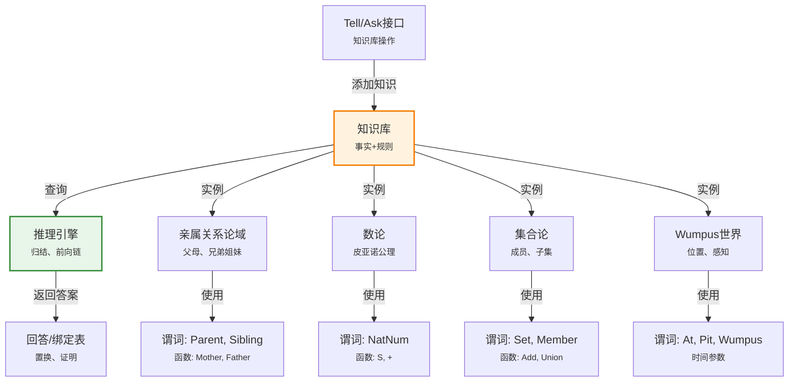

# 8.3 使用一阶逻辑

> 📖 本节 Deep Dive | 预计学习时间: 50 分钟

---

## 1. 背景与动机

### 1.1 历史背景

**学科演进脉络**

一阶逻辑从抽象的形式系统到实际应用的转化经历了数十年的发展。早期AI研究者（如McCarthy、Minsky）认识到，要让计算机表现出智能，必须能够表示和推理关于世界的知识。

- **1958年**: John McCarthy提出Advice Taker系统，设想使用一阶逻辑表示常识知识
- **1960年代**: 语义网络（Semantic Networks）和框架（Frames）作为一阶逻辑的替代表示被提出
- **1970年代**: 专家系统兴起，MYCIN、DENDRAL等系统展示了知识表示的实用价值
- **1980年代**: 描述逻辑（Description Logic）作为一阶逻辑的可判定子集被发展，成为现代知识图谱的理论基础
- **2000年代**: 语义Web（Semantic Web）运动推动了一阶逻辑在Web知识表示中的应用（RDF、OWL）

**里程碑事件**:

| 年份 | 人物/事件 | 贡献 | 影响 |
|------|-----------|------|------|
| 1958 | McCarthy | Advice Taker设想 | 逻辑主义AI的开端 |
| 1972 | Shortliffe | MYCIN医疗专家系统 | 展示了规则表示的实用性 |
| 1984 | Genesereth | 电路推理系统 | 一阶逻辑在工程领域的应用 |
| 2004 | W3C | OWL标准发布 | 语义Web的知识表示基础 |
| 2012 | Google | 知识图谱发布 | 一阶逻辑思想在工业界的应用 |

**演进动机**:
- 早期方法：通用问题求解器（GPS）缺乏领域知识
- 局限性：需要显式编码领域知识，但缺乏系统的表示方法
- 突破：一阶逻辑提供了通用的知识表示框架，可以应用于不同领域

### 1.2 研究动机

**为什么研究者关注一阶逻辑的实际应用？**

1. **理论意义**: 验证一阶逻辑的表达能力和推理机制是否足以处理现实世界的问题。

2. **方法创新**: 开发领域特定的本体论（ontology）设计方法，将抽象的逻辑工具转化为实用的知识工程工具。

3. **问题解决**: 在亲属关系、数学、游戏（Wumpus世界）等领域建立可运行的知识库和推理系统。

**与其他领域的关系**:
- **数据库**: 关系数据库是一阶逻辑的受限形式，SQL查询对应于一阶逻辑公式
- **软件工程**: 形式化规范使用一阶逻辑描述系统行为
- **自然语言处理**: 语义表示将自然语言映射到逻辑形式
- **生物信息学**: 基因本体（Gene Ontology）使用描述逻辑（一阶逻辑子集）表示生物知识

### 1.3 实际应用场景

| 应用领域 | 具体问题 | 本节理论的作用 | 预期效果 |
|----------|----------|----------------|----------|
| 专家系统 | 医疗诊断、故障排查 | 用规则和事实表示领域知识 | 可解释的智能决策 |
| 智能游戏 | 游戏状态推理、策略生成 | Wumpus世界作为测试平台 | 智能体能够推理和规划 |
| 数学推理 | 定理证明、公式推导 | 皮亚诺公理定义算术 | 自动数学推理 |
| 知识图谱 | 实体关系推理、问答系统 | 亲属关系作为典型案例 | 大规模知识推理 |
| 形式化验证 | 软硬件正确性证明 | 电路领域示例 | 消除设计缺陷 |

**典型案例预览**:
> 学完本节，你将能够设计一个亲属关系知识库，能够回答"谁是某人的祖母？"、"两个人是否是表亲？"等问题，并理解Wumpus世界智能体如何使用一阶逻辑进行状态推理。

### 1.4 先决条件

**学习本节需要的前置知识**:

| 知识项 | 来源 | 掌握程度要求 | 关键概念 |
|--------|------|:------------:|----------|
| 一阶逻辑语法语义 | 8.2节 | 必须熟练掌握 | 模型、解释、量词 |
| 皮亚诺算术 | 数学基础 | 了解 | 自然数、归纳定义 |
| 集合论 | 数学基础 | 理解即可 | 集合、关系、函数 |
| Wumpus世界 | 第7章 | 了解 | 感知、动作、环境 |

**前置检查清单**:
- [ ] 能够构造一阶逻辑模型
- [ ] 理解量词的语义（扩展解释）
- [ ] 知道如何用逻辑公式表达规则
- [ ] 了解Wumpus世界的基本规则

---

## 2. 知识逻辑图谱

### 2.1 概念关系图



### 2.2 知识发展依赖链

```
【基础层】           【发展层】              【高潮层】             【应用层】
    ↓                   ↓                     ↓                   ↓
┌─────────┐      ┌─────────────┐       ┌───────────┐      ┌──────────┐
│ 语法语义 │ ──→  │ Tell/Ask    │  ──→  │ 领域建模  │ ──→  │ 智能推理  │
│         │      │ 接口        │       │ 论域设计  │      │          │
│ 模型、  │      │ 知识库操作  │       │ 谓词、    │      │ 问答、    │
│ 量词    │      │ 抽象        │       │ 函数选择  │      │ 规划、    │
│         │      │             │       │           │      │ 诊断     │
└─────────┘      └─────────────┘       └───────────┘      └──────────┘
     │                   │                   │                │
     └───────────────────┴───────────────────┴────────────────┘
                         知识演进脉络
```

**依赖链详解**:
1. **基础**: 8.2节的语法和语义提供了形式化基础
2. **发展**: Tell/Ask接口抽象了知识库操作
3. **高潮**: 在四个典型论域（亲属、数、集合、Wumpus）中应用
4. **应用**: 实现智能推理（问答、规划、诊断）

### 2.3 本节在章节中的位置

```
第 8 章: 一阶逻辑
├── 8.1 回顾表示 ← 前置知识
│   └── [核心概念: 表示语言特性]
│
├── 8.2 一阶逻辑的语法和语义 ← 前置知识
│   └── [核心概念: 模型、解释、语义]
│
├── 8.3 使用一阶逻辑 ← ⭐ 当前位置
│   ├── [核心概念: Tell/Ask、论域建模]
│   ├── [核心技能: 谓词选择、公理设计]
│   └── [应用领域: 亲属、数、集合、Wumpus]
│
└── 8.4 知识工程 ← 后续发展
    └── [系统化方法论]
```

**衔接说明**:
- **从前一节继承**: 8.2节的形式化语义为本节的知识库操作提供了理论基础
- **本节输出**: 在四个典型论域中应用一阶逻辑的实际技能
- **为后一节铺垫**: 8.4节将系统化为知识工程方法论

---

## 3. 核心概念与数学分析

### 3.1 核心术语定义

**定义 8.3.1** (知识库 / Knowledge Base, KB):

> **正式定义**: 知识库是一组一阶逻辑语句（公理）的集合，记作 $KB = \{\phi_1, \phi_2, ..., \phi_n\}$，其中每个 $\phi_i$ 是闭公式（语句）。

**定义详解**:
- **直观解释**: 知识库是"已知事实"的集合，包括具体事实（如King(John)）和通用规则（如∀x(King(x) ⇒ Person(x))）。
- **数学表述**: $KB \subseteq \mathcal{L}$，其中 $\mathcal{L}$ 是一阶逻辑语言。
- **为什么这样定义**: 这种定义使得我们可以用集合论工具分析知识库的性质（一致性、完备性等）。

**定义中的关键要素**:
| 要素 | 符号 | 含义 | 约束条件 |
|------|------|------|----------|
| 公理 | $\phi_i$ | 知识库中的语句 | 通常是闭公式（无自由变量） |
| 一致性 | $KB \not\vdash \bot$ | 知识库不能推出矛盾 | 实际知识库必须满足 |
| 蕴含 | $KB \models \phi$ | 知识库语义蕴含φ | 推理的目标 |

---

**定义 8.3.2** (Tell操作 / Assertion):

> **正式定义**: Tell(KB, φ) 将语句φ添加到知识库KB中，返回更新后的知识库 $KB' = KB \cup \{\phi\}$。

**定义详解**:
- **直观解释**: Tell是"告诉"知识库一个新事实——"约翰是国王"。
- **数学表述**: $\text{Tell}(KB, \phi) = KB \cup \{\phi\}$
- **为什么这样定义**: 这种定义使得知识库可以增量增长，新事实不会覆盖旧事实。

**性质**:
- 幂等性: Tell(Tell(KB, φ), φ) = Tell(KB, φ)
- 单调性: 如果 $KB \subseteq KB'$，则 $KB \models \phi$ 蕴含 $KB' \models \phi$

---

**定义 8.3.3** (Ask操作 / Query):

> **正式定义**: Ask(KB, φ) 返回真值，表示知识库KB是否逻辑蕴含φ。AskVars(KB, φ(x)) 返回使φ(x)为真的所有变量绑定（置换）。

**定义详解**:
- **直观解释**: Ask是"询问"知识库——"约翰是人吗？"、"谁是国王？"
- **数学表述**: 
  - $\text{Ask}(KB, \phi) = \top$ 当且仅当 $KB \models \phi$
  - $\text{AskVars}(KB, \phi(x)) = \{\sigma \mid KB \models \phi(\sigma(x))\}$

**示例**:
- Ask(KB, Person(John)): 询问"约翰是人吗？"
- AskVars(KB, King(x)): 询问"谁是国王？"，返回{x/John}

---

**定义 8.3.4** (论域 / Domain):

> **正式定义**: 论域是我们要表示其知识的那部分世界，包括论域中的对象类型、这些对象可以具有的属性，以及它们可以参与的关系。

**定义详解**:
- **直观解释**: 论域是知识表示的"范围"——我们只表示论域内的知识。
- **示例**: 
  - 亲属关系论域: 人、父母、兄弟姐妹关系
  - 数论: 自然数、加法、乘法
  - Wumpus世界: 方格、无底洞、Wumpus、智能体

**论域建模的关键决策**:
1. 什么应该作为对象？
2. 什么应该作为谓词？
3. 什么应该作为函数？
4. 什么应该作为常量？

---

**定义 8.3.5** (置换 / Substitution):

> **正式定义**: 置换是一个有限的变量-项映射 $\sigma = \{x_1/t_1, ..., x_n/t_n\}$，表示将变量$x_i$替换为项$t_i$。应用置换记作$\phi\sigma$。

**定义详解**:
- **直观解释**: 置换是"答案"的形式——"x = 约翰"表示约翰是使查询成立的值。
- **数学表述**: $\sigma: \text{Var} \to \mathcal{T}$，其中$\mathcal{T}$是项集合。

**示例**:
- 查询: AskVars(KB, Person(x))
- 知识库: {Person(John), Person(Richard)}
- 返回: {x/John, x/Richard}（两个置换）

### 3.2 符号系统与约定

**本节符号总表**:

| 符号 | 含义 | 数学表达 | 备注 |
|:----:|------|----------|------|
| $KB$ | 知识库 | $\{\phi_1, ..., \phi_n\}$ | 语句集合 |
| Tell(KB, φ) | 添加语句 | $KB \cup \{\phi\}$ | 更新知识库 |
| Ask(KB, φ) | 查询 | $KB \models \phi$? | 返回真/假 |
| AskVars(KB, φ) | 变量查询 | $\{\sigma \mid KB \models \phi\sigma\}$ | 返回置换集合 |
| $\sigma$ | 置换 | $\{x/t\}$ | 变量绑定 |
| $\phi\sigma$ | 置换应用 | 将φ中变量按σ替换 | 实例化 |

### 3.3 关键公式与性质

#### 公式 1: 知识库查询的语义

**数学表述**:

$$\text{Ask}(KB, \phi) = \begin{cases} \text{true} & \text{if } KB \models \phi \\ \text{false} & \text{otherwise} \end{cases}$$

$$\text{AskVars}(KB, \phi(x)) = \{\sigma \mid KB \models \phi(x)\sigma\}$$

**公式要素解析**:

| 维度 | 内容 |
|------|------|
| **直观解释** | Ask检查知识库是否蕴含查询；AskVars找出所有使查询成立的变量赋值。 |
| **几何意义** | 在模型空间中，Ask检查查询在所有KB的模型中是否为真；AskVars找出使查询为真的模型参数。 |
| **领域背景** | 这是知识库系统的核心接口，对应于数据库的查询语言和推理系统的证明过程。 |

---

#### 公式 2: 亲属关系的定义公理

**数学表述**:

父母与孩子是反关系:
$$\forall p, c \quad \text{Parent}(p, c) \Leftrightarrow \text{Child}(c, p)$$

祖父母定义:
$$\forall g, c \quad \text{Grandparent}(g, c) \Leftrightarrow \exists p \, \text{Parent}(g, p) \land \text{Parent}(p, c)$$

兄弟姐妹定义:
$$\forall x, y \quad \text{Sibling}(x, y) \Leftrightarrow x \neq y \land \exists p \, \text{Parent}(p, x) \land \text{Parent}(p, y)$$

**公式要素解析**:

| 维度 | 内容 |
|------|------|
| **直观解释** | 这些公理用基本谓词（Parent）定义了导出谓词（Grandparent, Sibling）。 |
| **几何意义** | 在关系图中，这些定义对应于特定路径模式（两步路径是祖父母，共享父节点是兄弟姐妹）。 |
| **领域背景** | 这是本体论设计的典型例子——从基本关系构建复杂关系。 |

---

#### 公式 3: 皮亚诺公理

**数学表述**:

自然数的定义:
$$\text{NatNum}(0)$$
$$\forall n \, \text{NatNum}(n) \Rightarrow \text{NatNum}(S(n))$$

后继函数的性质:
$$\forall n \, 0 \neq S(n)$$
$$\forall m, n \, m \neq n \Rightarrow S(m) \neq S(n)$$

加法定义:
$$\forall m \, \text{NatNum}(m) \Rightarrow +(0, m) = m$$
$$\forall m, n \, \text{NatNum}(m) \land \text{NatNum}(n) \Rightarrow +(S(m), n) = S(+(m, n))$$

**公式要素解析**:

| 维度 | 内容 |
|------|------|
| **直观解释** | 从0和后继函数出发，递归定义自然数和加法。 |
| **几何意义** | 自然数是链式结构：0 → S(0) → S(S(0)) → ... |
| **领域背景** | 这是数学基础的经典例子，展示了如何从简单公理构建复杂理论。 |

---

### 3.4 重要性质与推论

**性质 8.3.1** (知识库的单调性):

> **陈述**: 一阶逻辑知识库是单调的——添加新语句不会撤销已有的结论。

**形式化**: 如果 $KB \models \phi$ 且 $KB \subseteq KB'$，则 $KB' \models \phi$。

**证明概要**: 由语义定义，如果φ在所有KB的模型中为真，则它在所有KB'的模型中（KB'的模型是KB模型的子集）也为真。

**直观理解**: 知识只会增长，不会减少。这是经典逻辑的特性，与非单调逻辑（如默认逻辑）形成对比。

**应用提示**: 设计知识库时可以利用单调性——可以安全地添加新事实而不必担心破坏已有推理。

---

**性质 8.3.2** (霍恩子句的可计算性):

> **陈述**: 如果知识库只包含霍恩子句（Horn clauses），则AskVars查询总能返回确定的变量绑定。

**霍恩子句定义**: 至多有一个正文字的子句，形式为 $P_1 \land ... \land P_n \Rightarrow Q$ 或 $P$（事实）。

**直观理解**: 霍恩子句对应于"if-then"规则，是Prolog语言的基础。在这种受限形式中，推理更加可控。

**重要性**: 这是逻辑编程（如Prolog）的理论基础。

---

## 4. 定理与证明

### 4.1 定理陈述

**定理 8.3.1** (皮亚诺算术的表达能力 / Expressiveness of Peano Arithmetic):

> **正式陈述**: 皮亚诺算术（Peano Arithmetic, PA）可以表达所有原始递归函数和关系，因此足以形式化所有可计算函数。

**定理解读**:
- **条件（前提）**:
  1. **条件 1**: 使用皮亚诺公理定义的自然数理论
  2. **条件 2**: 允许使用归纳原理
  3. **条件 3**: 包含加法和乘法的定义

- **结论**: PA可以表达所有原始递归函数

- **定理意义**: 这表明从简单的后继函数出发，通过递归定义，可以构建出表达任意可计算函数的算术系统。

**定理的适用范围**: 在标准模型（自然数）中成立。非标准模型可能存在额外的"无穷大"元素。

**历史背景**: 这是哥德尔不完备定理证明的基础——PA足够强大以至于可以表达关于自身的陈述。

### 4.2 证明详解

**证明策略概览**:

证明通过构造性方法展示如何用PA定义基本运算，然后证明这些运算可以组合表达任意原始递归函数。

**核心思路**: 
1. 证明PA可以定义基本运算（加法、乘法）
2. 证明PA支持原始递归定义模式
3. 由原始递归函数的完备性得出结论

**关键步骤预览**:
1. 加法的定义和性质
2. 乘法的定义（迭代加法）
3. 原始递归模式的表达
4. 结论：PA表达原始递归函数

---

**正式证明**:

**步骤 1**: 加法的定义

皮亚诺公理中加法已定义:
- 基础: $+(0, m) = m$
- 递归: $+(S(n), m) = S(+(n, m))$

**性质证明**（结合律）:
我们需要证明: $\forall a, b, c \, (a + b) + c = a + (b + c)$

对$c$进行归纳:
- 基础 ($c = 0$): $(a + b) + 0 = a + b = a + (b + 0)$ ✓
- 归纳步骤: 假设 $(a + b) + c = a + (b + c)$
  $$(a + b) + S(c) = S((a + b) + c) = S(a + (b + c)) = a + S(b + c) = a + (b + S(c))$$ ✓

> 💡 **技术注释**: 归纳原理是证明算术性质的核心工具。皮亚诺公理中的归纳公理保证了这种证明的有效性。

---

**步骤 2**: 乘法的定义

乘法定义为迭代加法:
- 基础: $\times(0, m) = 0$
- 递归: $\times(S(n), m) = +(\times(n, m), m)$

**性质**: 乘法满足交换律、结合律、分配律，可以通过归纳证明。

---

**步骤 3**: 原始递归模式的表达

原始递归函数由以下方式定义:
1. 零函数: $Z(x) = 0$
2. 后继函数: $S(x) = x + 1$
3. 投影函数: $P_i(x_1, ..., x_n) = x_i$
4. 复合: $f(x) = g(h_1(x), ..., h_m(x))$
5. 原始递归:
   - $f(0, x) = g(x)$
   - $f(n+1, x) = h(n, x, f(n, x))$

**PA中的表达**:

每个原始递归函数 $f$ 对应一个公式 $\phi_f(x_1, ..., x_n, y)$ 使得:
$$f(a_1, ..., a_n) = b \iff PA \vdash \phi_f(\bar{a_1}, ..., \bar{a_n}, \bar{b})$$

其中$\bar{a}$表示数字$a$的编码（$S(S(...S(0)...))$）。

构造通过对原始递归定义的归纳完成:
- 基本函数（零、后继、投影）直接可表达
- 复合通过存在量词表达
- 原始递归通过编码序列（使用哥德尔β函数）表达

---

**步骤 4**: 结论

由于所有原始递归函数都可以在PA中表达，且原始递归函数类包含所有实际可计算的函数（丘奇-图灵论题），因此PA具有足够的表达能力。

$$\blacksquare \text{ (证毕)}$$

### 4.3 证明分析与提炼

**核心洞见**: 从简单的后继函数出发，通过递归定义和归纳证明，可以构建出表达任意可计算函数的算术系统。这展示了公理化方法的强大能力。

**证明技巧总结**:

| 技巧 | 在本证明中的应用 | 可迁移性 | 其他应用场景 |
|------|------------------|----------|--------------|
| 数学归纳法 | 证明算术性质 | ⭐⭐⭐⭐⭐ | 证明程序正确性、数据结构性质 |
| 递归定义 | 定义运算 | ⭐⭐⭐⭐⭐ | 函数式编程、算法设计 |
| 函数编码 | 用公式表示函数 | ⭐⭐⭐⭐ | 程序验证、可计算性理论 |

**证明中的关键难点**: 原始递归的编码需要使用序列编码（哥德尔β函数），这是技术性最强的部分。

**如果修改条件**: 如果不使用归纳公理（如Robinson算术Q），则无法证明所有算术性质，但仍然可以表达所有原始递归函数。

### 4.4 定理间的联系

**与本节其他概念的关系**:


**在全书中的地位**: 这一定理为第9章的自动推理和第19章的学习理论奠定了理论基础。

---

## 5. 具体示例与详解

### 5.1 典型数值示例

**示例 8.3.1**: Wumpus世界中的一阶逻辑推理

**📋 问题陈述**:

在Wumpus世界中，智能体在方格[1,1]感知到微风(Breeze)。知识库包含以下规则：
1. 相邻方格有微风当且仅当邻居中有无底洞
2. 方格[1,1]的邻居是[1,2]和[2,1]

**已知**:
- Breezy([1,1]): 方格[1,1]有微风
- ∀s(Breezy(s) ⇔ ∃r(Adjacent(r,s) ∧ Pit(r)))
- Adjacent([1,2], [1,1]) ∧ Adjacent([2,1], [1,1])

**求解**: 推断哪些方格可能有无底洞。

---

**🔍 解答过程**:

**步骤 1: 应用微风规则**

从Breezy([1,1])和规则:
$$\text{Breezy}([1,1]) \Leftrightarrow \exists r(\text{Adjacent}(r, [1,1]) \land \text{Pit}(r))$$

得到:
$$\exists r(\text{Adjacent}(r, [1,1]) \land \text{Pit}(r))$$

**步骤 2: 实例化相邻关系**

已知[1,1]的邻居是[1,2]和[2,1]:
$$\text{Adjacent}([1,2], [1,1]) \land \text{Adjacent}([2,1], [1,1])$$

**步骤 3: 推理**

存在量词实例化告诉我们:
$$\text{Pit}([1,2]) \lor \text{Pit}([2,1])$$

即：方格[1,2]或[2,1]至少有一个有无底洞（或两者都有）。

**步骤 4: 进一步推理**

如果智能体移动到[1,2]且没有感知到微风，则可以推断:
$$\neg\text{Breezy}([1,2]) \Rightarrow \neg\exists r(\text{Adjacent}(r, [1,2]) \land \text{Pit}(r))$$

这意味着[1,1]、[1,3]、[2,2]都没有无底洞。结合之前的结论，可以推出Pit([2,1])。

---

**✅ 验证与检验**:

**正确性检查**:
- [x] 从微风正确推断出存在相邻无底洞
- [x] 考虑了所有相邻方格
- [x] 后续感知可以进一步缩小可能性

**结果的意义**: 一阶逻辑使得智能体能够进行精确的状态推理，从感知推导环境状态。

---

### 5.2 概念辨析示例

**示例 8.3.2**: 谓词 vs 函数的选择

**场景**: 在亲属关系论域中，"父亲"应该表示为谓词Father(x,y)还是函数Father(x)？

**分析**:

| 表示方式 | 优点 | 缺点 | 适用场景 |
|----------|------|------|----------|
| Father(x,y)（谓词） | 可以表示非生物学父亲、多个父亲 | 需要额外公理约束唯一性 | 需要考虑养父、继父等复杂情况 |
| Father(x)（函数） | 简洁，隐含唯一性 | 假设每个人只有一个父亲 | 生物学关系，简化模型 |

**教训**: 表示方式的选择取决于论域的复杂性和应用需求。函数表示更简洁但约束更强，谓词表示更灵活但需要更多公理。

### 5.3 类比与可视化

**直觉类比**:

| 抽象概念 | 日常类比 | 对应关系 |
|----------|----------|----------|
| 知识库 | 图书馆 | 存储和组织知识 |
| Tell | 添加新书 | 扩展知识库 |
| Ask | 查询图书 | 检索信息 |
| AskVars | 按主题检索 | 找出所有相关书籍 |
| 论域 | 学科领域 | 知识的范围 |
| 公理 | 基本定律 | 不证自明的基础 |
| 定理 | 推导结论 | 从定律推出的结果 |

**局限性**: 这个类比不能说明逻辑推理的严格性和自动性。

---

## 6. 深入理解与拓展

### 6.1 一句话本质

> 🎯 **核心要点**: 一阶逻辑通过Tell/Ask接口将形式化语义转化为实用的知识库系统，在亲属关系、数论、Wumpus世界等论域中展示了从事实和规则进行自动推理的能力。

### 6.2 深入思考问题

1. **概念层面**: 为什么一阶逻辑知识库是单调的？这在实际应用中有什么优势和劣势？
   
   <!-- 思考方向: 考虑知识增长、信念修正、非单调逻辑 -->

2. **方法层面**: 在设计论域的本体论时，如何决定什么应该作为对象、谓词、函数？
   
   <!-- 思考方向: 考虑表达能力、推理效率、自然性 -->

3. **应用层面**: Wumpus世界中的时间参数化（At(Agent, s, t)）如何影响推理复杂度？
   
   <!-- 思考方向: 考虑时序推理、状态空间爆炸 -->

4. **拓展层面**: 如果知识库包含非霍恩子句，AskVars查询会面临什么挑战？
   
   <!-- 思考方向: 考虑析取式、多个答案、计算复杂性 -->

### 6.3 与其他节的关系

**本节输出**:
- Tell/Ask接口的实用操作
- 四个典型论域的建模经验
- 谓词选择、公理设计的实践技能

**后续发展预告**: 
- 8.4节将系统化为知识工程方法论，指导如何系统地构建知识库
- 第9章将介绍一阶逻辑的推理算法（归结、前向链、后向链）
- 第10章将讨论更大规模的知识表示（本体、语义网络）

---

## 7. 总结与反思

### 7.1 关键要点总结

本节必须掌握的 **5** 个核心要点:

1. **Tell/Ask接口**: Tell添加知识，Ask查询知识，AskVars返回变量绑定
   
   💡 *记忆技巧*: "Tell说，Ask问，AskVars找答案"

2. **论域建模**: 选择对象、谓词、函数来表示领域知识
   
   💡 *记忆技巧*: "对象是什么，谓词是关系，函数是计算"

3. **公理类型**: 定义公理（⇔）、事实（原子语句）、规则（⇒）
   
   💡 *记忆技巧*: "定义双向，事实原子，规则单向"

4. **皮亚诺公理**: 从0和后继函数递归定义自然数和运算
   
   💡 *记忆技巧*: "0是起点，S是下一步，递归定义运算"

5. **Wumpus世界**: 使用时间参数和位置谓词进行状态推理
   
   💡 *记忆技巧*: "时间t，位置s，感知推状态"

### 7.2 本节知识框架

```
┌─────────────────────────────────────────────────────────────┐
│  第8.3节: 使用一阶逻辑                                      │
├─────────────────────────────────────────────────────────────┤
│  输入/前置                                                   │
│  • 8.2节的语法语义                                           │
│  • 具体应用领域的需求                                        │
│                                                             │
│  处理/核心                                                   │
│  • Tell/Ask接口设计                                          │
│  • 论域分析与建模                                            │
│  • 公理设计（定义、事实、规则）                              │
│  ↓                                                          │
│  输出/结果                                                   │
│  • 四个典型论域的知识库                                      │
│  • 推理示例和查询回答                                        │
│                                                             │
│  应用/价值                                                   │
│  • 实际知识库构建经验                                        │
│  • 为知识工程方法论奠定基础                                  │
└─────────────────────────────────────────────────────────────┘
```

### 7.3 常见误解与纠正

| 常见误解 ❌ | 正确理解 ✅ | 为什么容易错 | 如何避免 |
|-------------|-------------|--------------|----------|
| ❌ 定理和公理没有区别 | ✅ 公理是基本假设，定理是推导结果 | 都是逻辑语句 | 理解知识库设计意图 |
| ❌ 函数比谓词更好 | ✅ 各有适用场景 | 函数更简洁 | 根据论域特性选择 |
| ❌ 知识库必须包含所有事实 | ✅ 知识库只需要足够的公理进行推理 | 混淆数据库和知识库 | 理解推理能力 |
| ❌ AskVars总能返回确定答案 | ✅ 非霍恩子句可能有多个答案 | 霍恩子句的局限性 | 了解知识库限制 |

### 7.4 反思问题

**连接性问题** (与本章其他节):
1. 8.3节的论域建模如何与8.4节的知识工程方法论相联系？
2. 8.2节的语义定义如何支持8.3节的Tell/Ask操作？

**应用性问题**:
1. 如何扩展亲属关系知识库以支持更复杂的家庭结构（如再婚、收养）？
2. Wumpus世界的知识库如何扩展到多智能体场景？

**批判性问题**:
1. 一阶逻辑知识库的单调性在什么场景下会成为限制？
2. 在什么情况下，使用概率表示比逻辑表示更合适？

### 7.5 学习检查清单

- [ ] 能够使用Tell/Ask接口操作知识库
- [ ] 能够设计简单论域的本体论（选择谓词、函数）
- [ ] 能够编写定义公理、事实、规则
- [ ] 理解皮亚诺公理的结构
- [ ] 能够设计Wumpus世界的知识库
- [ ] 了解霍恩子句的限制和优势

---

## 附录

### A. 公式速查表

| 公式 | 名称 | 使用条件 | 备注 |
|:----:|------|----------|------|
| Tell(KB, φ) | 添加语句 | 知识库更新 | $KB \cup \{\phi\}$ |
| Ask(KB, φ) | 查询 | 真/假问题 | $KB \models \phi$? |
| AskVars(KB, φ) | 变量查询 | 找答案 | 返回置换集合 |
| ∀x(P(x) ⇒ Q(x)) | 规则 | 定义关系 | 所有P都是Q |
| P(c) | 事实 | 具体知识 | 常量实例 |

### B. 术语索引

| 术语 | 英文 | 定义 | 位置 |
|------|------|------|:----:|
| 知识库 | Knowledge Base | 语句集合 | 8.3 |
| Tell | Assertion | 添加语句操作 | 8.3 |
| Ask | Query | 查询操作 | 8.3 |
| 论域 | Domain | 知识表示的范围 | 8.3 |
| 置换 | Substitution | 变量绑定 | 8.3 |
| 霍恩子句 | Horn Clause | 至多一个正文字的子句 | 8.3 |

### C. 延伸阅读

**理论深化**:
- "Knowledge Representation and Reasoning" (Brachman & Levesque): 知识表示的权威教材
- "Artificial Intelligence: A Modern Approach" (Russell & Norvig): 第10章知识表示

**应用拓展**:
- Prolog编程语言实践
- OWL本体设计指南
- 知识图谱构建方法

---

> 📌 **下一节**: [8.4 一阶逻辑中的知识工程](8.4_一阶逻辑中的知识工程.md)
> 
> 📚 **返回概览**: [第8章概览](00_概览.md)
