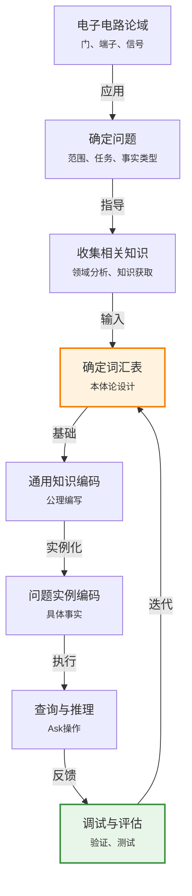
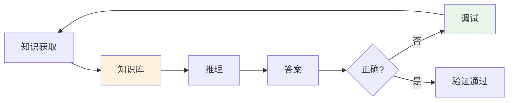

# 8.4 一阶逻辑中的知识工程

> 📖 本节 Deep Dive | 预计学习时间: 55 分钟

---

## 1. 背景与动机

### 1.1 历史背景

**学科演进脉络**

知识工程（Knowledge Engineering, KE）作为一门学科诞生于20世纪80年代，是专家系统发展的产物。早期专家系统（如MYCIN、DENDRAL）的成功表明，将领域专家的知识编码到计算机系统中可以产生实用价值，但这个过程需要系统化的方法论。

- **1960-70年代**: 早期专家系统采用特设（ad-hoc）方法构建知识库，缺乏统一方法
- **1983年**: Edward Feigenbaum提出"知识工程"术语，强调知识获取和表示的系统性
- **1980年代**: 知识获取瓶颈（Knowledge Acquisition Bottleneck）问题被识别——从专家获取知识是KE的最大挑战
- **1990年代**: 本体工程（Ontology Engineering）兴起，强调可重用的领域概念化
- **2000年代**: 语义Web推动本体论标准化（OWL），知识工程进入Web时代
- **2010年代至今**: 知识图谱（Knowledge Graph）成为知识工程的主流形式

**里程碑事件**:

| 年份 | 人物/事件 | 贡献 | 影响 |
|------|-----------|------|------|
| 1965 | DENDRAL | 第一个成功的专家系统 | 展示了知识工程的潜力 |
| 1976 | MYCIN | 医疗诊断专家系统 | 规则-based知识表示 |
| 1983 | Feigenbaum | 提出"知识工程"术语 | 确立独立学科地位 |
| 1991 | Lenat | Cyc项目发布 | 常识知识库的大规模尝试 |
| 2004 | W3C | OWL标准发布 | 本体工程标准化 |
| 2012 | Google | 知识图谱发布 | 知识工程进入工业主流 |

**演进动机**:
- 早期方法：专家系统知识库由程序员手工编码，效率低下且容易出错
- 局限性：缺乏系统化的知识获取、表示、验证方法
- 突破：建立知识工程方法论，将知识库构建过程工程化、可管理化

### 1.2 研究动机

**为什么研究者关注知识工程方法论？**

1. **理论意义**: 知识工程将知识表示从艺术转化为工程学科，建立可重复、可验证的知识库构建过程。

2. **方法创新**: 开发本体论设计原则、知识获取技术、知识验证方法，降低知识库构建成本和错误率。

3. **问题解决**: 解决"知识获取瓶颈"——如何高效、准确地将领域专家的知识转化为机器可处理的形式。

**与其他领域的关系**:
- **软件工程**: 知识工程借鉴了软件工程的生命周期模型、需求分析、测试验证等方法
- **认知科学**: 知识获取技术基于对人类专家认知过程的理解
- **图书馆学/信息科学**: 本体论设计与分类学、叙词表构建有密切联系
- **数据库设计**: 实体-关系模型与本体论设计有相似之处

### 1.3 实际应用场景

| 应用领域 | 具体问题 | 本节理论的作用 | 预期效果 |
|----------|----------|----------------|----------|
| 医疗诊断系统 | 疾病-症状知识库构建 | 系统化的知识获取和表示方法 | 可维护、可扩展的医疗专家系统 |
| 企业知识管理 | 业务流程、产品知识整理 | 本体论设计方法 | 统一的企业知识库 |
| 智能客服 | FAQ、产品知识表示 | 知识工程生命周期 | 高质量的自动问答系统 |
| 生物信息学 | 基因-蛋白质关系知识 | 领域本体构建 | 支持科学发现的知识基础设施 |
| 电子设计自动化 | 电路设计规则库 | 形式化知识表示 | 自动化设计验证 |

**典型案例预览**:
> 学完本节，你将掌握系统化的知识工程方法，能够为一个新领域（如电子电路）设计本体论、获取领域知识、构建可验证的知识库。

### 1.4 先决条件

**学习本节需要的前置知识**:

| 知识项 | 来源 | 掌握程度要求 | 关键概念 |
|--------|------|:------------:|----------|
| 一阶逻辑语法语义 | 8.2节 | 必须熟练掌握 | 谓词、函数、量词 |
| 知识库操作 | 8.3节 | 必须掌握 | Tell/Ask、论域建模 |
| 软件工程基础 | 计算机科学 | 了解 | 生命周期、需求分析 |
| Wumpus世界 | 第7-8章 | 了解 | 知识库示例 |

**前置检查清单**:
- [ ] 能够设计简单论域的本体论
- [ ] 理解Tell/Ask接口
- [ ] 了解软件开发生命周期
- [ ] 熟悉8.3节的四个论域示例

---

## 2. 知识逻辑图谱

### 2.1 概念关系图



### 2.2 知识发展依赖链

```
【基础层】           【发展层】              【高潮层】             【应用层】
    ↓                   ↓                     ↓                   ↓
┌─────────┐      ┌─────────────┐       ┌───────────┐      ┌──────────┐
│ 需求分析 │ ──→  │ 本体论设计   │  ──→  │ 知识编码  │ ──→  │ 系统验证  │
│         │      │             │       │           │      │          │
│ 问题    │      │ 概念、      │       │ 公理、    │      │ 查询、    │
│ 范围    │      │ 关系、      │       │ 事实、    │      │ 测试、    │
│ 任务    │      │ 层次        │       │ 规则      │      │ 调试     │
└─────────┘      └─────────────┘       └───────────┘      └──────────┘
     │                   │                   │                │
     └───────────────────┴───────────────────┴────────────────┘
                         知识演进脉络
```

**依赖链详解**:
1. **基础**: 明确问题范围、任务类型、可用事实
2. **发展**: 设计本体论——选择概念、关系、层次结构
3. **高潮**: 编码知识——编写公理、事实、规则
4. **应用**: 验证系统——查询测试、错误调试、性能评估

### 2.3 本节在章节中的位置

```
第 8 章: 一阶逻辑
├── 8.1 回顾表示 ← 前置知识
│   └── [核心概念: 表示语言特性]
│
├── 8.2 一阶逻辑的语法和语义 ← 前置知识
│   └── [核心概念: 形式化基础]
│
├── 8.3 使用一阶逻辑 ← 前置知识
│   └── [核心概念: 论域建模实例]
│
├── 8.4 一阶逻辑中的知识工程 ← ⭐ 当前位置
│   ├── [核心概念: 7步方法论]
│   ├── [核心技能: 本体论设计、知识获取]
│   └── [案例: 电子电路论域]
│
└── 第9章 一阶逻辑的推理 ← 后续发展
    └── [推理算法]
```

**衔接说明**:
- **从前一节继承**: 8.3节的论域建模经验在本节系统化为方法论
- **本节输出**: 完整的知识工程方法论，可应用于任何领域
- **为后一节铺垫**: 第9章的推理算法将在本节构建的知识库上运行

---

## 3. 核心概念与数学分析

### 3.1 核心术语定义

**定义 8.4.1** (知识工程 / Knowledge Engineering):

> **正式定义**: 知识工程是研究特定论域，了解该论域中哪些概念是重要的，并创建该论域中对象和关系的形式化表示的系统化过程。

**定义详解**:
- **直观解释**: 知识工程是"将专家头脑中的知识转化为计算机可处理的形式"的工程过程。
- **核心活动**: 领域分析、概念识别、关系建模、知识获取、形式化表示、验证测试
- **为什么重要**: 知识是AI系统的核心资产，知识工程决定了系统的能力和质量。

**定义中的关键要素**:
| 要素 | 含义 | 关键问题 | 输出 |
|------|------|----------|------|
| 论域分析 | 确定知识范围 | 我们要表示什么？ | 论域边界 |
| 概念识别 | 识别关键概念 | 什么对象、关系重要？ | 概念清单 |
| 形式化表示 | 用逻辑语言表达 | 如何用谓词、函数表示？ | 本体论 |
| 知识获取 | 从专家获取知识 | 专家知道什么？ | 公理、规则 |
| 验证测试 | 确保正确性 | 知识库是否正确？ | 测试报告 |

---

**定义 8.4.2** (本体论 / Ontology):

> **正式定义**: 本体论是关于特定论域的概念化的显式、形式化规范，包括概念、关系、约束的层次结构。

**定义详解**:
- **直观解释**: 本体论是"领域词汇表"——它定义了描述领域所需的概念及其关系。
- **哲学根源**: "本体论"（Ontology）源于哲学，研究"存在"的本质。在AI中，它指领域概念的显式描述。
- **形式化**: 本体论 = (概念, 关系, 函数, 公理)

**本体论的组成部分**:
| 组成部分 | 描述 | 示例（电子电路） |
|----------|------|------------------|
| 概念 | 领域中的对象类型 | 门(Gate)、端子(Terminal)、信号(Signal) |
| 关系 | 概念之间的联系 | 连接(Connected)、类型(Type) |
| 函数 | 从对象到对象的映射 | 输入端子(In)、输出端子(Out) |
| 公理 | 约束和规则 | 连通端子信号相同 |

---

**定义 8.4.3** (知识获取 / Knowledge Acquisition):

> **正式定义**: 知识获取是从领域专家、文档、数据中抽取、结构化、形式化知识的过程。

**定义详解**:
- **直观解释**: 知识获取是知识工程的瓶颈——它回答了"知识从哪里来？"的问题。
- **知识来源**:
  - 领域专家（人类专家）
  - 领域文献（书籍、论文、标准）
  - 数据挖掘（从数据中学习规则）
  - 常识知识（通用知识库如Cyc）

**知识获取技术**:
| 技术 | 描述 | 适用场景 |
|------|------|----------|
| 访谈 | 与专家对话 | 获取启发式规则 |
| 协议分析 | 分析专家解决问题的过程 | 获取隐性知识 |
| 卡片分类 | 让专家组织概念 | 构建概念层次 |
| 文本挖掘 | 从文档中提取知识 | 大规模知识获取 |

---

**定义 8.4.4** (知识验证 / Knowledge Verification):

> **正式定义**: 知识验证是检查知识库是否正确、一致、完备的过程，包括静态检查（语法、一致性）和动态检查（查询测试）。

**定义详解**:
- **直观解释**: 知识验证确保知识库"做正确的事"——它包含正确的知识，能够回答正确的问题。
- **验证类型**:
  - **静态验证**: 语法检查、一致性检查、冗余检查
  - **动态验证**: 查询测试、推理链检查、边界情况测试

**常见错误类型**:
| 错误类型 | 描述 | 示例 |
|----------|------|------|
| 不一致 | 知识库蕴含矛盾 | P(a) 和 ¬P(a) 同时可证 |
| 不完整 | 缺少必要的公理 | 无法推导出期望的结论 |
| 不正确 | 错误的领域知识 | 所有鸟都会飞（忽略企鹅） |
| 冗余 | 重复的公理 | 同一规则以不同形式出现多次 |

### 3.2 符号系统与约定

**本节符号总表**:

| 符号 | 含义 | 说明 | 备注 |
|:----:|------|------|------|
| KE | 知识工程 | Knowledge Engineering | 学科名称 |
| Ontology | 本体论 | 概念化的形式化规范 | 领域词汇表 |
| KA | 知识获取 | Knowledge Acquisition | 从专家获取知识 |
| TBox | 术语盒 | 概念层次和定义 | 本体论部分 |
| ABox | 断言盒 | 具体实例和事实 | 数据部分 |
| arity | 元数 | 谓词/函数的参数个数 | 类型信息 |

### 3.3 关键公式与性质

#### 公式 1: 知识库一致性

**数学表述**:

知识库 $KB$ 是一致的（consistent），当且仅当不存在公式 $\phi$ 使得：

$$KB \models \phi \quad \text{且} \quad KB \models \neg\phi$$

等价地，$KB$ 是一致的当且仅当 $KB \not\models \bot$（$KB$ 不蕴含矛盾）。

**公式要素解析**:

| 维度 | 内容 |
|------|------|
| **直观解释** | 一致的知识库不能同时证明某个命题及其否定。 |
| **几何意义** | 在模型空间中，一致的知识库至少有一个模型（非空模型集合）。 |
| **领域背景** | 一致性是知识库的基本要求，不一致的知识库会推出任意结论（爆炸原理）。 |

**一致性检查方法**:
1. **语法检查**: 检查明显的矛盾（如直接包含 P(a) 和 ¬P(a)）
2. **推理检查**: 尝试证明 ⊥，如果成功则不一致
3. **模型构造**: 尝试构造满足 KB 的模型，如果成功则一致

---

#### 公式 2: 知识库完备性（相对于查询类）

**数学表述**:

知识库 $KB$ 对于查询类 $Q$ 是完备的，当且仅当对于所有 $q \in Q$：

$$\text{Domain} \models q \Rightarrow KB \models q$$

即：如果 $q$ 在领域中为真，则 $KB$ 能够证明 $q$。

**公式要素解析**:

| 维度 | 内容 |
|------|------|
| **直观解释** | 完备的知识库包含足够的知识来回答其目标查询类中的所有问题。 |
| **几何意义** | 在模型空间中，$KB$ 的模型集合与领域模型的交集在查询类上不可区分。 |
| **领域背景** | 完备性是相对的——知识库通常只对特定查询类完备，而非对所有可能查询完备。 |

**完备性检查方法**:
1. **查询测试**: 对测试集中的查询检查是否能得到正确答案
2. **专家评估**: 让领域专家检查是否缺少关键知识
3. **覆盖率分析**: 检查知识库覆盖了多少领域概念和关系

---

#### 公式 3: 电路功能正确性

**数学表述**:

对于电路 $C$ 和期望功能 $F$，电路是正确的当且仅当：

$$KB \cup \text{Description}(C) \models \forall \text{input} \, (\text{Output}(C, \text{input}) = F(\text{input}))$$

其中 $KB$ 是电路理论的公理，$\text{Description}(C)$ 是电路 $C$ 的具体描述。

**公式要素解析**:

| 维度 | 内容 |
|------|------|
| **直观解释** | 电路正确意味着在所有输入下，电路的实际输出等于期望输出。 |
| **几何意义** | 在所有可能的输入-输出对中，电路行为与规范一致。 |
| **领域背景** | 这是形式化验证的基本形式，广泛应用于硬件验证。 |

---

### 3.4 重要性质与推论

**性质 8.4.1** (知识工程的迭代性):

> **陈述**: 知识工程是一个迭代过程——本体论设计、知识编码、验证测试需要反复进行，逐步完善知识库。

**迭代循环**:
```
设计 → 编码 → 测试 → 发现问题 → 重新设计 → ...
```

**直观理解**: 完美的知识库很难一次建成。通过迭代，逐步发现并修复问题，完善知识库。

**应用提示**: 不要试图一次性构建完美的知识库，采用敏捷方法，快速迭代。

---

**性质 8.4.2** (本体论的可重用性):

> **陈述**: 良好的本体论设计应该考虑可重用性——同一本体论可以在不同应用中复用。

**可重用性原则**:
1. **通用性**: 避免过于特定的概念，保持适当的抽象层次
2. **模块化**: 将本体论划分为可独立使用的模块
3. **标准化**: 使用标准术语和关系（如RDF、OWL标准）

**重要性**: 可重用的本体论可以大幅降低新应用的知识工程成本。

---

## 4. 定理与证明

### 4.1 定理陈述

**定理 8.4.1** (知识库调试的可靠性 / Debugging Soundness):

> **正式陈述**: 如果知识库 $KB$ 对于查询 $q$ 返回了错误的答案，则存在 $KB$ 中的公理或事实是不正确的或不完整的。

**定理解读**:
- **条件（前提）**:
  1. **条件 1**: 知识库 $KB$ 对查询 $q$ 返回答案 $a$
  2. **条件 2**: 正确答案应该是 $a'$（$a \neq a'$）

- **结论**: $KB$ 中存在不正确或不完整的知识

- **定理意义**: 这为知识库调试提供了理论基础——错误答案必然源于知识库中的缺陷。

**定理的适用范围**: 假设推理机制是正确的（可靠性），错误只能来源于知识库内容。

### 4.2 证明详解

**证明策略概览**:

使用反证法。假设知识库完全正确，则推理结果必然正确。既然结果错误，知识库必然存在缺陷。

**核心思路**: 可靠性定理的逆否命题。

**关键步骤预览**:
1. 假设知识库完全正确
2. 应用可靠性定理
3. 导出矛盾
4. 得出结论

---

**正式证明**:

**步骤 1**: 假设知识库完全正确

假设 $KB$ 中的所有公理和事实都是正确的，即对于所有 $\phi \in KB$，$\text{Domain} \models \phi$。

**步骤 2**: 应用可靠性定理

推理系统的可靠性保证：
$$KB \models \phi \Rightarrow \text{Domain} \models \phi$$

即：知识库能证明的命题在领域中为真。

**步骤 3**: 导出矛盾

如果 $KB$ 对查询 $q$ 返回答案 $a$，则 $KB \models a$。

由可靠性，$\text{Domain} \models a$。

但已知正确答案应该是 $a'$（$a \neq a'$），即 $\text{Domain} \models a'$ 且 $\text{Domain} \not\models a$。

这与 $\text{Domain} \models a$ 矛盾。

**步骤 4**: 得出结论

假设（知识库完全正确）导致矛盾，因此假设不成立。

即：$KB$ 中存在不正确或不完整的知识。

$$\blacksquare \text{ (证毕)}$$

### 4.3 证明分析与提炼

**核心洞见**: 错误答案必然源于知识缺陷。这为调试提供了方向——当发现错误答案时，应该检查知识库中的相关公理和事实。

**证明技巧总结**:

| 技巧 | 在本证明中的应用 | 可迁移性 | 其他应用场景 |
|------|------------------|----------|--------------|
| 反证法 | 假设知识库正确导出矛盾 | ⭐⭐⭐⭐⭐ | 证明唯一性、不可能性 |
| 可靠性定理 | 连接知识库与领域 | ⭐⭐⭐⭐ | 验证系统正确性 |
| 矛盾导出 | 从错误答案导出矛盾 | ⭐⭐⭐⭐ | 错误定位、调试 |

**证明中的关键难点**: 确保"正确"的定义清晰——这里指与领域实际一致。

**如果修改条件**: 如果推理系统不可靠（有bug），则错误可能来源于推理机制而非知识库。

### 4.4 定理间的联系

**与本节其他概念的关系**:



**在全书中的地位**: 这一定理为知识工程方法论提供了理论基础——验证-调试循环的合理性。

---

## 5. 具体示例与详解

### 5.1 典型数值示例

**示例 8.4.1**: 电子电路知识库的调试

**📋 问题陈述**:

在电子电路知识库中，发现对于异或门 $X_1$ 的输入 1 和 0，系统无法确定输出。

**已知**:
- 知识库包含异或门的公理
- 查询: $\exists o \, \text{Signal}(\text{Out}(1, X_1)) = o$ 对于输入 1 和 0
- 结果: 无法确定输出

**求解**: 找出知识库中的问题并修复。

---

**🔍 解答过程**:

**步骤 1: 分析推理链**

检查异或门的公理:
$$\text{Signal}(\text{Out}(1, g)) = 1 \Leftrightarrow \text{Signal}(\text{In}(1, g)) \neq \text{Signal}(\text{In}(2, g))$$

对于输入 1 和 0:
$$\text{Signal}(\text{Out}(1, X_1)) = 1 \Leftrightarrow 1 \neq 0$$

**步骤 2: 识别问题**

系统无法推断 $\text{Signal}(\text{Out}(1, X_1)) = 1$，因为它无法证明 $1 \neq 0$。

问题：知识库缺少 $1 \neq 0$ 的公理。

**步骤 3: 修复**

添加公理：
$$1 \neq 0$$

更一般地，添加不同信号值的区分公理：
$$\forall x, y \, (x \neq y) \Leftrightarrow \neg(x = y)$$
$$1 \neq 0$$

**步骤 4: 验证**

重新运行查询，现在系统能够正确推断：
$$\text{Signal}(\text{Out}(1, X_1)) = 1$$

---

**✅ 验证与检验**:

**正确性检查**:
- [x] 识别了缺失的公理
- [x] 添加了正确的修复
- [x] 验证修复有效

**结果的意义**: 这个例子展示了知识库调试的典型过程——通过检查推理链，定位缺失或不正确的公理。

---

### 5.2 概念辨析示例

**示例 8.4.2**: 谓词 vs 函数的选择——以电路为例

**场景**: 在电子电路论域中，门的类型应该表示为谓词 Type(g, t) 还是函数 Type(g)？

**分析**:

| 表示方式 | 优点 | 缺点 | 适用场景 |
|----------|------|------|----------|
| Type(g, t)（谓词） | 可以表示门有多个类型 | 需要额外公理约束唯一性 | 复杂分类系统 |
| Type(g) = t（函数） | 简洁，隐含唯一性 | 每个门只能有一个类型 | 门类型互斥的场景 |

在电子电路中，每个门只有一个类型（AND、OR、XOR、NOT），因此函数表示更合适：
$$\text{Type}(X_1) = \text{XOR}$$

**教训**: 表示方式的选择应该反映领域的实际约束。函数表示隐含唯一性，适合一对一关系；谓词表示更灵活，适合一对多关系。

### 5.3 类比与可视化

**直觉类比**:

| 抽象概念 | 日常类比 | 对应关系 |
|----------|----------|----------|
| 知识工程 | 建筑设计 | 从需求到实现的过程 |
| 本体论 | 建筑蓝图 | 概念的结构化描述 |
| 知识获取 | 需求调研 | 从用户获取需求 |
| 公理 | 建筑规范 | 约束和规则 |
| 验证测试 | 质量检查 | 确保正确性 |
| 调试 | 故障排查 | 定位和修复问题 |

**局限性**: 这个类比不能说明知识工程的迭代性和不确定性。

---

## 6. 深入理解与拓展

### 6.1 一句话本质

> 🎯 **核心要点**: 知识工程是将领域知识系统化地转化为机器可处理形式的工程过程，通过7步方法论（确定问题、收集知识、设计本体、编码公理、实例化、查询验证、调试评估）构建可维护、可验证的知识库。

### 6.2 深入思考问题

1. **概念层面**: 知识获取瓶颈的根本原因是什么？自动化知识获取（如从文本学习）能否完全替代专家？
   
   <!-- 思考方向: 考虑隐性知识、常识知识、专业知识的形式化难度 -->

2. **方法层面**: 在设计本体论时，如何平衡通用性和特定性？过于通用或过于特定各有什么问题？
   
   <!-- 思考方向: 考虑可重用性、推理效率、表达能力 -->

3. **应用层面**: 在电子电路示例中，如果还需要考虑时序（信号传播延迟），本体论需要如何扩展？
   
   <!-- 思考方向: 考虑时间参数、时序逻辑、状态变化 -->

4. **拓展层面**: 知识图谱（如Google Knowledge Graph）与本节介绍的知识库有什么关系？它们采用了哪些相同或不同的技术？
   
   <!-- 思考方向: 考虑规模、表示语言、推理方法、应用场景 -->

### 6.3 与其他节的关系

**本节输出**:
- 系统化的7步知识工程方法论
- 本体论设计的实践技能
- 知识获取和验证的技术
- 电子电路案例的完整经验

**后续发展预告**: 
- 第9章将介绍一阶逻辑的推理算法，这些算法将在本节构建的知识库上运行
- 第10章将讨论更大规模的知识表示，包括类别、事件、精神对象等复杂概念

---

## 7. 总结与反思

### 7.1 关键要点总结

本节必须掌握的 **5** 个核心要点:

1. **7步方法论**: 确定问题→收集知识→确定词汇表→通用知识编码→问题实例编码→查询推理→调试评估
   
   💡 *记忆技巧*: "问收词编码查调"（问收词，编码，查调）

2. **本体论设计**: 选择对象、谓词、函数来表示领域概念，考虑层次结构和约束
   
   💡 *记忆技巧*: "对象谓词函数，层次约束连"

3. **知识获取**: 从专家、文献、数据中获取知识，解决知识获取瓶颈
   
   💡 *记忆技巧*: "专家文献数据，多源获知识"

4. **验证调试**: 通过查询测试检查知识库的正确性、一致性、完备性
   
   💡 *记忆技巧*: "测试找错误，迭代来修复"

5. **电子电路案例**: 展示了从问题定义到调试验证的完整知识工程过程
   
   💡 *记忆技巧*: "电路七步走，实践出真知"

### 7.2 本节知识框架

```
┌─────────────────────────────────────────────────────────────┐
│  第8.4节: 一阶逻辑中的知识工程                              │
├─────────────────────────────────────────────────────────────┤
│  输入/前置                                                   │
│  • 8.3节的论域建模经验                                       │
│  • 软件工程方法论                                            │
│                                                             │
│  处理/核心                                                   │
│  • 7步知识工程方法论                                         │
│  • 本体论设计原则                                            │
│  • 知识获取技术                                              │
│  • 验证调试方法                                              │
│  ↓                                                          │
│  输出/结果                                                   │
│  • 完整的知识工程方法论                                      │
│  • 电子电路案例经验                                          │
│                                                             │
│  应用/价值                                                   │
│  • 指导实际知识库构建                                        │
│  • 为大型知识项目奠定基础                                    │
└─────────────────────────────────────────────────────────────┘
```

### 7.3 常见误解与纠正

| 常见误解 ❌ | 正确理解 ✅ | 为什么容易错 | 如何避免 |
|-------------|-------------|--------------|----------|
| ❌ 知识工程是一次性任务 | ✅ 知识工程是迭代过程 | 传统软件开发思维 | 采用敏捷方法，快速迭代 |
| ❌ 本体论越详细越好 | ✅ 本体论应该适度抽象 | 追求完备性 | 关注应用需求，避免过度工程 |
| ❌ 知识获取就是访谈专家 | ✅ 知识获取有多种技术 | 方法单一化 | 根据知识类型选择合适技术 |
| ❌ 验证就是运行几个查询 | ✅ 验证需要系统化的测试集 | 测试不充分 | 设计覆盖各种情况的测试用例 |

### 7.4 反思问题

**连接性问题** (与本章其他节):
1. 8.4节的知识工程方法论如何应用8.3节的四个论域示例？
2. 8.2节的语义定义如何支持8.4节的验证调试？

**应用性问题**:
1. 如果要为一个新领域（如医疗诊断）构建知识库，如何应用7步方法论？
2. 在知识获取过程中，如何处理专家之间的意见不一致？

**批判性问题**:
1. 知识工程方法论的局限性是什么？在什么情况下会失效？
2. 机器学习能否替代知识工程？它们各自的优势和局限是什么？

### 7.5 学习检查清单

- [ ] 能够描述7步知识工程方法论
- [ ] 能够设计简单领域的本体论
- [ ] 了解知识获取的主要技术
- [ ] 能够进行知识库的验证和调试
- [ ] 理解电子电路案例的完整过程
- [ ] 了解知识库一致性、完备性的概念

---

## 附录

### A. 公式速查表

| 公式 | 名称 | 使用条件 | 备注 |
|:----:|------|----------|------|
| $KB \not\models \bot$ | 一致性 | 知识库验证 | 不蕴含矛盾 |
| Domain $\models q \Rightarrow$ KB $\models q$ | 完备性 | 知识库验证 | 能证明所有真命题 |
| KB $\models \phi \Rightarrow$ Domain $\models \phi$ | 可靠性 | 推理系统 | 只证明真命题 |

### B. 术语索引

| 术语 | 英文 | 定义 | 位置 |
|------|------|------|:----:|
| 知识工程 | Knowledge Engineering | 系统化构建知识库的过程 | 8.4 |
| 本体论 | Ontology | 概念化的形式化规范 | 8.4 |
| 知识获取 | Knowledge Acquisition | 从专家获取知识的过程 | 8.4 |
| TBox | Terminological Box | 概念定义和层次 | 8.4 |
| ABox | Assertional Box | 具体实例和事实 | 8.4 |
| 一致性 | Consistency | 不蕴含矛盾 | 8.4 |
| 完备性 | Completeness | 能证明所有真命题 | 8.4 |

### C. 延伸阅读

**理论深化**:
- "Knowledge Acquisition and Conceptual Modelling" (Gaines & Boose): 知识获取的经典教材
- "Ontology Engineering" (Staab & Studer): 本体论设计的系统介绍

**应用拓展**:
- Protégé本体编辑器实践
- OWL本体设计指南
- 知识图谱构建方法

---

> 📌 **下一章**: [第9章 一阶逻辑的推理](../第9章_一阶逻辑的推理/00_概览.md)
> 
> 📚 **返回概览**: [第8章概览](00_概览.md)
